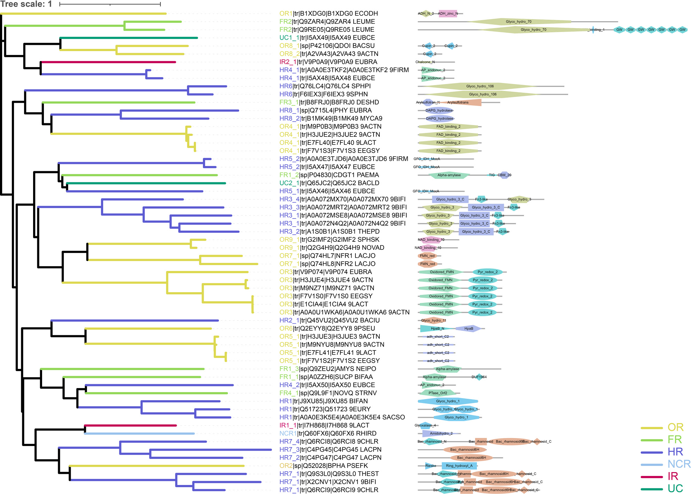

# Introduction to dbPUP

**dbPUP** is the first exploratory database of polyphenol utilized proteins that have been **experimentally validated** to catalyze or modify a polyphenol substrate. The database contains 60 proteins from **gut microbiota** that characterized by heterologous or homologous expression with one or more specific polyphenol substrates.  These data are recruited from scientific publications and search results on [BRENDA](https://www.brenda-enzymes.org/). Each of the publications has been carefully vetted before inclusion in Evidence. 

## Class

Proteins in Evidence (seeds) are classified into corresponding class based on their EC numbers and annotations, while proteins have no significant Pfam will be assigned into class Unclassified(UCs).

$\triangleright$  [**Oxidation/Reduction Reactions (ORs)**](/classes/ORs): EC 1.-.-.- in the EC number classification of enzymes.

$\triangleright$  [**Functional Group Transfer Reactions (FRs)**](/classes/FRs) : EC 2.-.-.- in the EC number classification of enzymes.

$\triangleright$ [**Hydrolysis Reactions (HRs)**](/classes/HRs) : EC 3.-.-.- in the EC number classification of enzymes.

$\triangleright$ [**Non-hydrolytic Cleaving Reactions (NCRs)**](/classes/NCRs) : EC 4.-.-.- in the EC number classification of enzymes.

$\triangleright$ [**Isomerization Reactions (IRs)**](/classes/IRs) : EC 5.-.-.- in the EC number classification of enzymes.

$\triangleright$ [**Synthesis Reactions (SRs)**](/classes/SRs) : EC 6.-.-.- in the EC number classification of enzymes.

$\triangleright$ [**Translocation Reactions (TRs)**](/classes/TRs) : EC 7.-.-.- in the EC number classification of enzymes.

$\triangleright$ [**Unclassified (UCs)**](/classes/UCs)

{: .fit}

## Family

Proteins in same class will be further classified into different families based on Pfams in their sequences. Usually, Pfams were remained and assigned as a family when exclusively present in a specific sequence. Family then were extend by search against Swiss-Prot and TrEMBL datasets using `HMMER`. An approximately-maximum-likelihood phylogenetic tree was constructed (`FastTree`2.1.11) for sequences from Swiss-Prot in each family.  Sequences collected from TrEMBL were further filtered out by `PIS-BLAST` with a unified threshold  (E-value 0.001 and iteration number 5).

{: .fit}

## Subfamily

All-*versus*-all `BLAST` was performed for each family and then filtered sequences into clusters basing on a given similarity threshold. Results were visualized with Cytoscape using the yFiles organic layout. Cluster contains ten or more nodes were considered as a subfamily. 