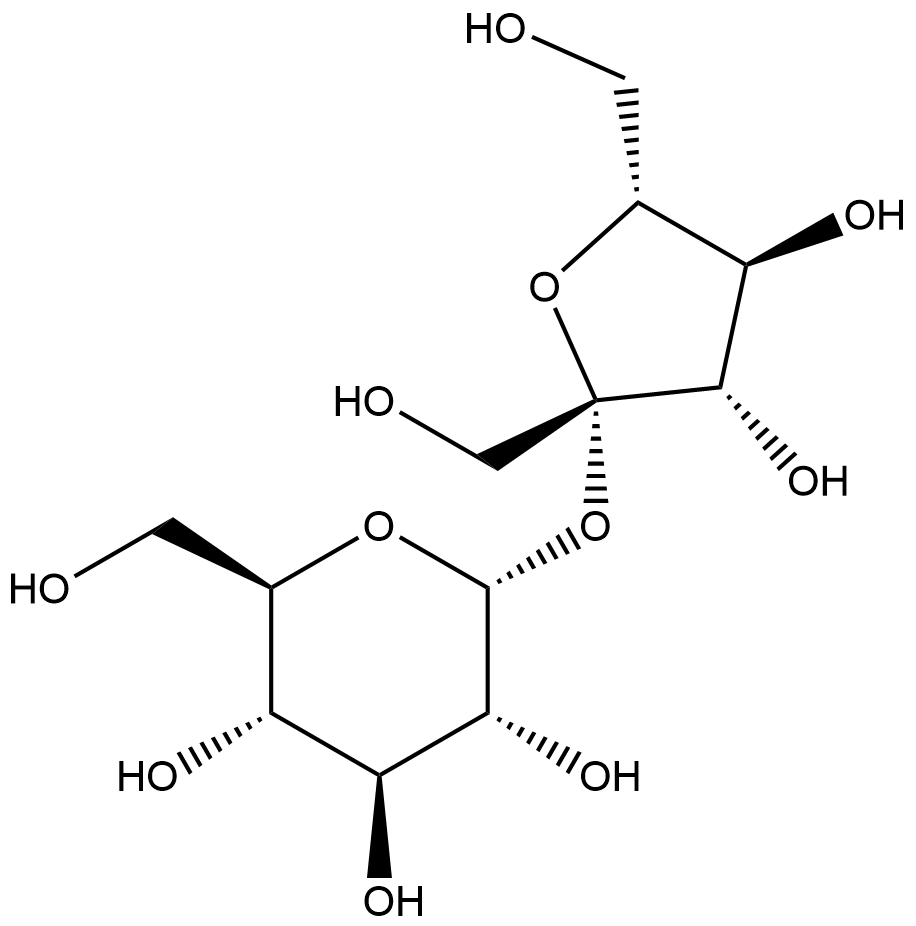

#  Functional Group Transfer Reactions (FRs) Family 1 / Subfamily 1

##  Literature Information

| Title    | Ionic liquids as cosolvents for glycosylation by sucrose phosphorylase: balancing acceptor solubility and enzyme stability |
| :------- | :----------------------------------------------------------- |
| Author   | Karel De Winter, Kristien Verlinden, Vladimír Křen, Lenka Weignerová, Wim Soetaert and Tom Desmet |
| DOI      | [10.1039/C3GC40449H](https://doi.org/10.1039/C3GC40449H)     |
| Abstract | Over the past decade, disaccharide phosphorylases have received increasing attention as promising biocatalysts for glycoside synthesis. Unfortunately, these enzymes typically have a very low affinity for non-carbohydrate acceptors, which urges the addition of cosolvents to increase the dissolved concentration of these acceptors. However, commonly applied solvents such as methanol and dimethyl sulfoxide (DMSO) are not compatible with many intended applications of carbohydrate-derived products. In this work, the solubility of a wide range of relevant acceptors was assessed in the presence of ionic liquids (ILs) as alternative and ‘green’ solvents. The IL AMMOENG 101 was found to be the most effective cosolvent for compounds as diverse as medium- and long-chain alcohols, ==flavonoids==, ==alkaloids==, ==phenolics== and ==terpenes==. Moreover, this IL was shown to be less deleterious to the stability and activity of sucrose phosphorylase than the commonly used dimethyl sulfoxide. To demonstrate the usefulness of this solvent system, a process for the resveratrol glycosylation was established in a buffer containing 20% AMMOENG 101, 1 M sucrose and saturated amounts of the acceptor. A single regioisomer 3-*O*-α-D-glucopyranosyl-(*E*)-resveratrol was obtained as proven by NMR spectroscopy. |

##  Experimental results

- **Enzyme**

Uniprot ID: [A0ZZH6](https://www.uniprot.org/uniprot/A0ZZH6)

Protein: Sucrose phosphorylase

Organism: *Bifidobacterium adolescentis (strain ATCC 15703 / DSM 20083 / NCTC 11814 / E194a)*

Length: 504 AA

Taxonomic identifier: [367928](https://www.uniprot.org/taxonomy/367928) [[NCBI](https://www.ncbi.nlm.nih.gov/Taxonomy/Browser/wwwtax.cgi?lvl=0&id=367928)]

- **Pfam**

| Source | Domain        | Start | End  | E-value (Domain) | Coverage |
| ------ | ------------- | ----- | ---- | ---------------- | -------- |
| Pfam-A | Alpha-amylase | 35    | 220  | 3.4e-10          | 0.493    |

Program: `hmmscan`

Version: 3.1b2 (February 2015)

Method: `hmmscan --domtblout hmmscan.tbl --noali -E 1e-5 pfam query.fa `

Date: Mon Jul 20 14:32:16 2020

Description:

Alpha-amylase

[**Pfam**](https://pfam.xfam.org/family/Alpha-amylase)

Alpha amylase is classified as family 13 of the glycosyl hydrolases. The structure is an 8 stranded alpha/beta barrel containing the active site, interrupted by a ~70 a.a. calcium-binding domain protruding between beta strand 3 and alpha helix 3, and a carboxyl-terminal Greek key beta-barrel domain.

[**InterPro**](http://www.ebi.ac.uk/interpro/entry/InterPro/IPR006047/)

O-Glycosyl hydrolases ([3.2.1.](http://www.ebi.ac.uk/intenz/query?cmd=SearchEC&ec=3.2.1.)) are a widespread group of enzymes that hydrolyse the glycosidic bond between two or more carbohydrates, or between a carbohydrate and a non-carbohydrate moiety. A classification system for glycosyl hydrolases, based on sequence similarity, has led to the definition of 85 different families[^1][^2]. This classification is available on the CAZy (CArbohydrate-Active EnZymes) website.

Enzymes containing this domain, such as alpha-amylase, belong to family 13 ([GH13](http://www.cazy.org/fam/GH13.html)) of the glycosyl hydrolases. The maltogenic alpha-amylase is an enzyme which catalyses hydrolysis of (1-4)-alpha-D-glucosidic linkages in polysaccharides so as to remove successive alpha-maltose residues from the non-reducing ends of the chains in the conversion of starch to maltose. Other enzymes include neopullulanase, which hydrolyses pullulan to panose, and cyclomaltodextrinase, which hydrolyses cyclodextrins.

This entry represents the catalytic domain found in several protein members of this family. It has a structure consisting of an 8 stranded alpha/beta barrel that contains the active site, interrupted by a ~70 amino acid calcium-binding domain protruding between beta strand 3 and alpha helix 3, and a carboxyl-terminal Greek key beta-barrel domain[^3].

- **Reaction**

[resveratrol](https://pubchem.ncbi.nlm.nih.gov/compound/resveratrol) + [sucrose](https://pubchem.ncbi.nlm.nih.gov/compound/sucrose) &rArr; [3-O-α-D-glucopyranosyl-(E)-resveratrol](https://pubchem.ncbi.nlm.nih.gov/compound/5281718) + [β-fructose](https://pubchem.ncbi.nlm.nih.gov/compound/2723872)

<figure>

  

    
  

  

    
  

  

    
  

  

    
  

  

    
  

  

    
  

  

    
  

</figure>

## References

[^1]:Henrissat B, Callebaut I, Fabrega S, et al. Conserved catalytic machinery and the prediction of a common fold for several families of glycosyl hydrolases[J]. Proceedings of the National Academy of Sciences, 1995, 92(15): 7090-7094.
[^2]:Davies G, Henrissat B. Structures and mechanisms of glycosyl hydrolases[J]. Structure, 1995, 3(9): 853-859.
[^3]:Abe A, Yoshida H, Tonozuka T, et al. Complexes of Thermoactinomyces vulgaris R‐47 α‐amylase 1 and pullulan model oligossacharides provide new insight into the mechanism for recognizing substrates with α‐(1, 6) glycosidic linkages[J]. The FEBS journal, 2005, 272(23): 6145-6153.

