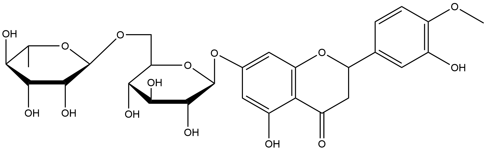

#  Functional Group Transfer Reactions (FRs) Family 1 / Subfamily 2

##  Literature Information

| Title    | Characteristics of transglycosylation reaction of cyclodextrin glucanotransferase in the heterogeneous enzyme reaction system using extrusion starch as a glucosyl donor |
| :------- | :----------------------------------------------------------- |
| Author   | Dong-ChanPark, Tae-KwonKim, Yong-HyunLee                     |
| DOI      | [10.1016/S0141-0229(97)00183-X](https://doi.org/10.1016/S0141-0229(97)00183-X) |
| Abstract | Characteristics of the intermolecular transglycosylation reactions of saccharides and glucosides by cyclodextrin glucanotransferase (CGTase) in the heterogeneous enzyme reaction system using swollen extrusion starch as a glucosyl donor were analyzed. The transglycosylation yield and rate were significantly increased compared to the conventional reaction system using liquefied starch as the glucosyl donor. Various monosaccharides composed of the same configuration of 2-, 3-, and 4-OH with the d-glucopyranoside such as d-xylose, d-glucose, l-sorbose, and *myo*-inositol were found to be good acceptors for the transglycosylation reaction. Several glucosides such as stevioside and hesperidin were also identified as the suitable glucosyl acceptors. The optimal transglycosylation reaction condition using stevioside as the glucosyl acceptor was also determined. The heterogeneous transglycosylation reaction system shows a few distinct advantages; minimized accumulation of oligosaccharides, easy removal of residual extrusion starch after reaction, and simplified purification of transglycosylated products, therefore, which will facilitate the industrial application of the various transglycosylation reactions. |

##  Experimental results

- **Enzyme**

Uniprot ID: [P04830](https://www.uniprot.org/uniprot/P04830)

Protein: Cyclomaltodextrin glucanotransferase

Organism: *Paenibacillus macerans (Bacillus macerans)*

Length: 714 AA

Taxonomic identifier: [44252](https://www.uniprot.org/taxonomy/44252) [[NCBI](https://www.ncbi.nlm.nih.gov/Taxonomy/Browser/wwwtax.cgi?lvl=0&id=44252)]

- **Pfam**

| Source | Domain        | Start | End  | E-value (Domain) | Coverage |
| ------ | ------------- | ----- | ---- | ---------------- | -------- |
| Pfam-A | Alpha-amylase | 79    | 400  | 2e-66            | 0.997    |

Program: `hmmscan`

Version: 3.1b2 (February 2015)

Method: `hmmscan --domtblout hmmscan.tbl --noali -E 1e-5 pfam query.fa `

Date: Mon Jul 20 14:32:16 2020

Description:

Alpha-amylase

[**Pfam**](https://pfam.xfam.org/family/Alpha-amylase)

Alpha amylase is classified as family 13 of the glycosyl hydrolases. The structure is an 8 stranded alpha/beta barrel containing the active site, interrupted by a ~70 a.a. calcium-binding domain protruding between beta strand 3 and alpha helix 3, and a carboxyl-terminal Greek key beta-barrel domain.

[**InterPro**](http://www.ebi.ac.uk/interpro/entry/InterPro/IPR006047/)

O-Glycosyl hydrolases ([3.2.1.](http://www.ebi.ac.uk/intenz/query?cmd=SearchEC&ec=3.2.1.)) are a widespread group of enzymes that hydrolyse the glycosidic bond between two or more carbohydrates, or between a carbohydrate and a non-carbohydrate moiety. A classification system for glycosyl hydrolases, based on sequence similarity, has led to the definition of 85 different families[^1][^2]. This classification is available on the CAZy (CArbohydrate-Active EnZymes) website.

Enzymes containing this domain, such as alpha-amylase, belong to family 13 ([GH13](http://www.cazy.org/fam/GH13.html)) of the glycosyl hydrolases. The maltogenic alpha-amylase is an enzyme which catalyses hydrolysis of (1-4)-alpha-D-glucosidic linkages in polysaccharides so as to remove successive alpha-maltose residues from the non-reducing ends of the chains in the conversion of starch to maltose. Other enzymes include neopullulanase, which hydrolyses pullulan to panose, and cyclomaltodextrinase, which hydrolyses cyclodextrins.

This entry represents the catalytic domain found in several protein members of this family. It has a structure consisting of an 8 stranded alpha/beta barrel that contains the active site, interrupted by a ~70 amino acid calcium-binding domain protruding between beta strand 3 and alpha helix 3, and a carboxyl-terminal Greek key beta-barrel domain[^3].

- **Reaction**

[hesperidin](https://pubchem.ncbi.nlm.nih.gov/compound/hesperidin) + soluble starch &rArr; [cyclodextrin](https://pubchem.ncbi.nlm.nih.gov/compound/444913)

<figure>

  

    
  

  

    
  

  

    
  

  

    
  

  

    
  

</figure>

## References

[^1]:Henrissat B, Callebaut I, Fabrega S, et al. Conserved catalytic machinery and the prediction of a common fold for several families of glycosyl hydrolases[J]. Proceedings of the National Academy of Sciences, 1995, 92(15): 7090-7094.
[^2]:Davies G, Henrissat B. Structures and mechanisms of glycosyl hydrolases[J]. Structure, 1995, 3(9): 853-859.
[^3]:Abe A, Yoshida H, Tonozuka T, et al. Complexes of Thermoactinomyces vulgaris R‐47 α‐amylase 1 and pullulan model oligossacharides provide new insight into the mechanism for recognizing substrates with α‐(1, 6) glycosidic linkages[J]. The FEBS journal, 2005, 272(23): 6145-6153.

