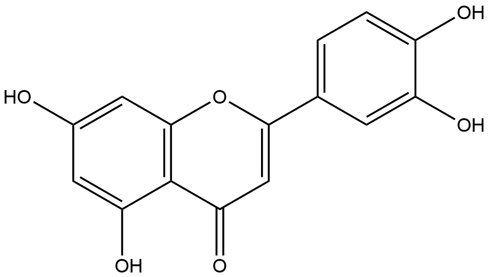

# Functional Group Transfer Reactions (FRs) Family 2

<!--[TOC]在这里不可以用-->

<ul id="myTab" class="nav nav-tabs">
  <!-- active 指的是默认页 -->
  <li class="active">
    <!-- herf中名字于下文id对应 -->
    <!-- 这里只改herf和tab1 -->
    <a href="#tab1" data-toggle="tab">Q9RE05</a>
  </li>
  <li><a href="#tab2" data-toggle="tab">Q9ZAR4</a></li>
</ul>

  <!-- 此处的id与上文herf对应 其他的不要改-->
  

##  Literature Information

| Title    | Leuconostoc mesenteroides glucansucrase synthesis of flavonoid glucosides by acceptor reactions in aqueous-organic solvents |
| :------- | :----------------------------------------------------------- |
| Author   | Anne Bertrand, Sandrine Morel, François Lefoulon, Yves Rolland, Pierre Monsan, Magali Remaud-Simeon |
| DOI      | [10.1016/j.carres.2006.02.008](https://doi.org/10.1016/j.carres.2006.02.008) |
| Abstract | The enzymatic glucosylation of luteolin was attempted using two glucansucrases: the dextransucrase from Leuconostoc mesenteroides NRRL B-512F and the alternansucrase from *L. mesenteroides* NRRL B-23192. Reactions were carried out in aqueous-organic solvents to improve luteolin solubility. A molar conversion of 44% was achieved after 24h of reaction catalysed by dextransucrase from L. mesenteroides NRRL B-512F in a mixture of acetate buffer (70%)/bis(2-methoxyethyl) ether (30%). Two products were characterised by nuclear magnetic resonance (NMR) spectroscopy: luteolin-3'-O-alpha-d-glucopyranoside and luteolin-4'-O-alpha-d-glucopyranoside. In the presence of alternansucrase from *L. mesenteroides* NRRL B-23192, three additional products were obtained with a luteolin conversion of 8%. Both enzymes were also able to glucosylate quercetin and myricetin with conversion of 4% and 49%, respectively. |

##  Experimental results

- **Enzyme**

Uniprot ID: [Q9RE05](https://www.uniprot.org/uniprot/Q9RE05)

Protein: Dextransucrase

Organism: *Leuconostoc mesenteroides*

Length: 2,057 AA

Taxonomic identifier: [1245](https://www.uniprot.org/taxonomy/1245) [[NCBI](https://www.ncbi.nlm.nih.gov/Taxonomy/Browser/wwwtax.cgi?lvl=0&id=1245)]

- **Pfam**

| Source | Domain         | Start | End  | E-value (Domain) | Coverage |
| ------ | -------------- | ----- | ---- | ---------------- | -------- |
| Pfam-A | Glyco_hydro_70 | 453   | 1312 | 4.8e-302         | 0.998    |

Program: `hmmscan`

Version: 3.1b2 (February 2015)

Method: `hmmscan --domtblout hmmscan.tbl --noali -E 1e-5 pfam query.fa `

Date: Mon Jul 20 14:32:16 2020

Description:

Glyco_hydro_70

[**Pfam**](https://pfam.xfam.org/family/Glyco_hydro_70)

Members of this family belong to glycosyl hydrolase family 70[^1] Glucosyltransferases or sucrose 6-glycosyl transferases (GTF-S) catalyse the transfer of D-glucopyramnosyl units from sucrose onto acceptor molecules[^2] EC:2.4.1.5. This family roughly corresponds to the N-terminal catalytic domain of the enzyme. Members of this family also contain the Putative cell wall binding domain [PF01473](https://pfam.xfam.org/family/PF01473) which corresponds with the C-terminal glucan-binding domain.

[**InterPro**](http://www.ebi.ac.uk/interpro/entry/InterPro/IPR003318/)

O-Glycosyl hydrolases ([3.2.1.](http://www.ebi.ac.uk/intenz/query?cmd=SearchEC&ec=3.2.1.)) are a widespread group of enzymes that hydrolyse the glycosidic bond between two or more carbohydrates, or between a carbohydrate and a non-carbohydrate moiety. A classification system for glycosyl hydrolases, based on sequence similarity, has led to the definition of 85 different families [^3][^4]. This classification is available on the CAZy (CArbohydrate-Active EnZymes) website.

Glucosyltransferases or sucrose 6-glycosyl transferases (GTF-S) ([2.4.1.5](http://www.ebi.ac.uk/intenz/query?md=SearchEC&ec=2.4.1.5), [GH70](http://www.cazy.org/fam/GH70.html)) catalyse the transfer of D-glucopyramnosyl units from sucrose onto acceptor molecules [^2]. This entry represents a domain that roughly corresponds to the N-terminal catalytic domain of the enzyme. Members of this family also contain the putative cell wall binding domain [PF01473](http://www.ebi.ac.uk/interpro/entry/pfam/PF01473/) which corresponds with the C-terminal glucan-binding domain.

- **Reaction**

[luteolin](https://pubchem.ncbi.nlm.nih.gov/compound/luteolin) &rArr; [luteolin-3'-O-α-D-glucopyranoside](https://pubchem.ncbi.nlm.nih.gov/compound/Luteolin-3_-glucoside) + [luteolin-4'-O-α-Dglucopyranoside](https://pubchem.ncbi.nlm.nih.gov/compound/Luteolin-4_-o-glucoside) + luteolin-4'-O-α-D-tri-glucoside + luteolin-4'-O-α-di-glucosides

## References

[^1]:Henrissat B. A classification of glycosyl hydrolases based on amino acid sequence similarities[J]. Biochemical journal, 1991, 280(2): 309-316.
[^2]:Monchois V, Willemot R M, Remaud-Simeon M, et al. Cloning and sequencing of a gene coding for a novel dextransucrase from Leuconostoc mesenteroides NRRL B-1299 synthesizing only α (1–6) and α (1–3) linkages[J]. Gene, 1996, 182(1-2): 23-32.
[^3]:Henrissat B, Callebaut I, Fabrega S, et al. Conserved catalytic machinery and the prediction of a common fold for several families of glycosyl hydrolases[J]. Proceedings of the National Academy of Sciences, 1995, 92(15): 7090-7094.
[^4]:Davies G, Henrissat B. Structures and mechanisms of glycosyl hydrolases[J]. Structure, 1995, 3(9): 853-859.

  

  

##  Literature Information

| Title    | Leuconostoc mesenteroides glucansucrase synthesis of flavonoid glucosides by acceptor reactions in aqueous-organic solvents |
| :------- | :----------------------------------------------------------- |
| Author   | Anne Bertrand, Sandrine Morel, François Lefoulon, Yves Rolland, Pierre Monsan, Magali Remaud-Simeon |
| DOI      | [10.1016/j.carres.2006.02.008](https://doi.org/10.1016/j.carres.2006.02.008) |
| Abstract | The enzymatic glucosylation of luteolin was attempted using two glucansucrases: the dextransucrase from Leuconostoc mesenteroides NRRL B-512F and the alternansucrase from *L. mesenteroides* NRRL B-23192. Reactions were carried out in aqueous-organic solvents to improve luteolin solubility. A molar conversion of 44% was achieved after 24h of reaction catalysed by dextransucrase from L. mesenteroides NRRL B-512F in a mixture of acetate buffer (70%)/bis(2-methoxyethyl) ether (30%). Two products were characterised by nuclear magnetic resonance (NMR) spectroscopy: luteolin-3'-O-alpha-d-glucopyranoside and luteolin-4'-O-alpha-d-glucopyranoside. In the presence of alternansucrase from *L. mesenteroides* NRRL B-23192, three additional products were obtained with a luteolin conversion of 8%. Both enzymes were also able to glucosylate quercetin and myricetin with conversion of 4% and 49%, respectively. |

##  Experimental results

- **Enzyme**

Uniprot ID: [Q9ZAR4](https://www.uniprot.org/uniprot/Q9ZAR4)

Protein: Dextransucrase

Organism: *Leuconostoc mesenteroides*

Length: 1,527 AA

Taxonomic identifier: [1245](https://www.uniprot.org/taxonomy/1245) [[NCBI](https://www.ncbi.nlm.nih.gov/Taxonomy/Browser/wwwtax.cgi?lvl=0&id=1245)]

- **Pfam**

| Source | Domain         | Start | End  | E-value (Domain) | Coverage |
| ------ | -------------- | ----- | ---- | ---------------- | -------- |
| Pfam-A | Glyco_hydro_70 | 370   | 1169 | 0                | 0.999    |

Program: `hmmscan`

Version: 3.1b2 (February 2015)

Method: `hmmscan --domtblout hmmscan.tbl --noali -E 1e-5 pfam query.fa `

Date: Mon Jul 20 14:32:16 2020

Description:

Glyco_hydro_70

[**Pfam**](https://pfam.xfam.org/family/Glyco_hydro_70)

Members of this family belong to glycosyl hydrolase family 70[^1] Glucosyltransferases or sucrose 6-glycosyl transferases (GTF-S) catalyse the transfer of D-glucopyramnosyl units from sucrose onto acceptor molecules[^2] EC:2.4.1.5. This family roughly corresponds to the N-terminal catalytic domain of the enzyme. Members of this family also contain the Putative cell wall binding domain [PF01473](https://pfam.xfam.org/family/PF01473) which corresponds with the C-terminal glucan-binding domain.

[**InterPro**](http://www.ebi.ac.uk/interpro/entry/InterPro/IPR003318/)

O-Glycosyl hydrolases ([3.2.1.](http://www.ebi.ac.uk/intenz/query?cmd=SearchEC&ec=3.2.1.)) are a widespread group of enzymes that hydrolyse the glycosidic bond between two or more carbohydrates, or between a carbohydrate and a non-carbohydrate moiety. A classification system for glycosyl hydrolases, based on sequence similarity, has led to the definition of 85 different families [^3][^4]. This classification is available on the CAZy (CArbohydrate-Active EnZymes) website.

Glucosyltransferases or sucrose 6-glycosyl transferases (GTF-S) ([2.4.1.5](http://www.ebi.ac.uk/intenz/query?md=SearchEC&ec=2.4.1.5), [GH70](http://www.cazy.org/fam/GH70.html)) catalyse the transfer of D-glucopyramnosyl units from sucrose onto acceptor molecules [^2]. This entry represents a domain that roughly corresponds to the N-terminal catalytic domain of the enzyme. Members of this family also contain the putative cell wall binding domain [PF01473](http://www.ebi.ac.uk/interpro/entry/pfam/PF01473/) which corresponds with the C-terminal glucan-binding domain.

- **Reaction**

[luteolin](https://pubchem.ncbi.nlm.nih.gov/compound/luteolin) &rArr; [luteolin-3'-O-α-D-glucopyranoside](https://pubchem.ncbi.nlm.nih.gov/compound/Luteolin-3_-glucoside) + [luteolin-4'-O-α-Dglucopyranoside](https://pubchem.ncbi.nlm.nih.gov/compound/Luteolin-4_-o-glucoside)

<figure>

  

    
  

  

    
  

  

    
  

  

    
  

  

    
  

</figure>

## References

[^1]: Henrissat B. A classification of glycosyl hydrolases based on amino acid sequence similarities[J]. Biochemical journal, 1991, 280(2): 309-316.
[^2]: Monchois V, Willemot R M, Remaud-Simeon M, et al. Cloning and sequencing of a gene coding for a novel dextransucrase from Leuconostoc mesenteroides NRRL B-1299 synthesizing only α (1–6) and α (1–3) linkages[J]. Gene, 1996, 182(1-2): 23-32.
[^3]: Henrissat B, Callebaut I, Fabrega S, et al. Conserved catalytic machinery and the prediction of a common fold for several families of glycosyl hydrolases[J]. Proceedings of the National Academy of Sciences, 1995, 92(15): 7090-7094.
[^4]: Davies G, Henrissat B. Structures and mechanisms of glycosyl hydrolases[J]. Structure, 1995, 3(9): 853-859.

  

