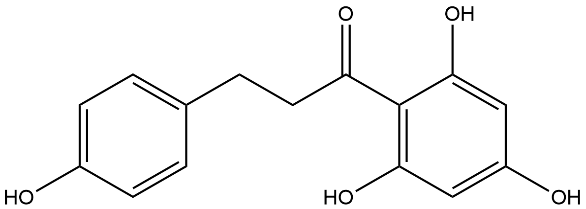

# Functional Group Transfer Reactions (FRs) Family 3 / Subfamily 1

##  Literature Information

| Title    | Enzymatic Sulfation of Phenolic Hydroxy Groups of Various Plant Metabolites by an Arylsulfotransferase |
| :------- | :----------------------------------------------------------- |
| Author   | Michael A. van der Horst  Aloysius F. Hartog  Rabab El Morabet  Arthur Marais  Menzo Kircz  Ron Wever |
| DOI      | [10.1002/ejoc.201402875](https://doi.org/10.1002/ejoc.201402875) |
| Abstract | The bacterial arylsulfate sulfotransferase (AST) from *Desulfitobacterium hafniense* was used as a catalytic tool to derivatize poorly soluble aromatic compounds (polyphenols). As examples, we sulfated the natural occurring compounds ==*p*‐coumaric acid, 6‐hydroxyflavone, resveratrol, phloretin==, and ==quercetin==, using *p*‐nitrophenylsulfate as the sulfate donor. The water‐soluble sulfate esters were purified and characterized. Depending on the nature of the compound, one or more sulfate groups could be introduced in a stepwise order. The sulfation of resveratrol resulted in two different monosulfates (4′‐ and 3‐sulfates), the 3,4′‐disulfate, and the 3,5,4′‐trisulfate. Sulfation of phloretin resulted in a monosulfate (4′‐sulfate) and a disulfate (4,4′‐disulfate). Although quercetin has five hydroxy groups that could be sulfated, surprisingly this enzyme system primarily catalyses the sulfation only at the 4′ position. This simple enzymatic one‐step sulfation method is easy to use, and it allows a convenient and simple production of sulfated compounds with improved solubility. |

##  Experimental results

- **Enzyme**

Uniprot ID: [B8FRJ0](https://www.uniprot.org/uniprot/B8FRJ0)

Protein: Arylsulfotransferase

Organism: *Desulfitobacterium hafniense (strain DCB-2 / DSM 10664)*

Length: 628 AA

Taxonomic identifier: [272564](https://www.uniprot.org/taxonomy/272564) [[NCBI](https://www.ncbi.nlm.nih.gov/Taxonomy/Browser/wwwtax.cgi?lvl=0&id=272564)]

- **Pfam**

| Source | Domain          | Start | End  | E-value (Domain) | Coverage |
| ------ | --------------- | ----- | ---- | ---------------- | -------- |
| Pfam-A | Arylsulfotran_N | 38    | 117  | 3.1e-20          | 0.978    |
| Pfam-A | Arylsulfotrans  | 127   | 485  | 4.9e-106         | 0.976    |

Program: `hmmscan`

Version: 3.1b2 (February 2015)

Method: `hmmscan --domtblout hmmscan.tbl --noali -E 1e-5 pfam query.fa `

Date: Mon Jul 20 14:32:16 2020

Description:

Arylsulfotran_N

[**Pfam**](https://pfam.xfam.org/family/Arylsulfotran_N)

This family consists of several bacterial Arylsulfotransferase proteins. Arylsulfotransferase (ASST) transfers a sulfate group from phenolic sulfate esters to a phenolic acceptor substrate[^1]. This domain has an Ig-like fold.

[**InterPro**](http://www.ebi.ac.uk/interpro/entry/InterPro/IPR035391/)

This entry represents the N-terminal Ig-like domain found in arylsulfotransferases. Arylsulphotransferase (ASST) transfers a sulphate group from phenolic sulphate esters to a phenolic acceptor substrate[^1].

Arylsulfotrans

[**Pfam**](https://pfam.xfam.org/family/Arylsulfotrans)

This family consists of several bacterial Arylsulfotransferase proteins. Arylsulfotransferase (ASST) transfers a sulfate group from phenolic sulfate esters to a phenolic acceptor substrate[^1].

[**InterPro**](http://www.ebi.ac.uk/interpro/entry/InterPro/IPR010262/)

This entry represents a group of arylsulphotransferase (ASST) mostly from bacteria. It transfers a sulphate group from phenolic sulphate esters to a phenolic acceptor substrate[^1].

- **Reaction**

[phloretin](https://pubchem.ncbi.nlm.nih.gov/compound/phloretin) + [4-Nitrophenyl sulfate](https://pubchem.ncbi.nlm.nih.gov/compound/4-Nitrophenyl%20sulfate) &rArr; [monosulfate](https://pubchem.ncbi.nlm.nih.gov/compound/122231132)  

<figure>

  

    
  

  

    
  

  

    
  

  

    
  

  

    
  

</figure>
[phloretin](https://pubchem.ncbi.nlm.nih.gov/compound/phloretin) + [4-Nitrophenyl sulfate](https://pubchem.ncbi.nlm.nih.gov/compound/4-Nitrophenyl%20sulfate) &rArr; [4,4'-phloretin disulfate](https://pubchem.ncbi.nlm.nih.gov/compound/122231134)

<figure>

  

    
  

  

    
  

  

    
  

  

    
  

  

    
  

</figure>

## References

[^1]:Baek M C, Kim S K, Kim D H, et al. Cloning and sequencing of the Klebsiella K‐36 astA gene, encoding an arylsulfate sulfotransferase[J]. Microbiology and immunology, 1996, 40(8): 531-537.