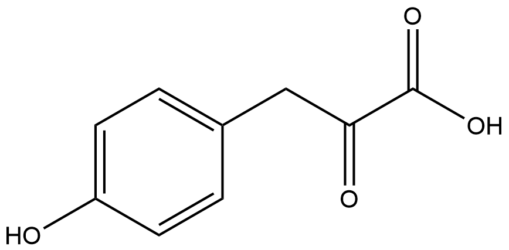
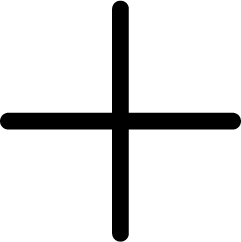
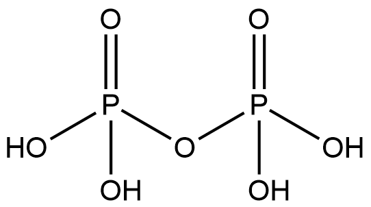

# Functional Group Transfer Reactions (FRs) Family 4 / Subfamily 1

##  Literature Information

| Title    | NovQ is a prenyltransferase capable of catalyzing the addition of a dimethylallyl group to both phenylpropanoids and flavonoids |
| :------- | :----------------------------------------------------------- |
| Author   | Taro Ozaki, Satoshi Mishima, Makoto Nishiyama & Tomohisa Kuzuyama |
| DOI      | [10.1038/ja.2009.48](https://doi.org/10.1038/ja.2009.48)     |
| Abstract | NovQ is a member of a recently identified CloQ/NphB class of prenyltransferases. Although NphB has been well characterized as a prenyltransferase with flexibility against aromatic substrates, few studies have been carried out on characterization of NovQ. Hence, in this study, we investigate the kinetics, substrate specificity and regiospecificity of NovQ. The corresponding *novQ* gene was cloned from *Streptomyces niveus,* which produces an aminocoumarin antibiotic, novobiocin. Recombinant NovQ was overexpressed in *Escherichia coli* and purified to homogeneity. The purified enzyme was a soluble monomeric 40-kDa protein that catalyzed the transfer of a dimethylallyl group to ==4-hydroxyphenylpyruvate (4-HPP)== independently of divalent cations to yield ==3-dimethylallyl-4-HPP==, an intermediate of novobiocin. Steady-state kinetic constants for NovQ with the two substrates, 4-HPP and dimethylallyl diphosphate, were also calculated. In addition to the prenylation of 4-HPP, NovQ catalyzed carbon–carbon-based and carbon–oxygen-based prenylations of a diverse collection of phenylpropanoids, flavonoids and dihydroxynaphthalenes. Despite its catalytic promiscuity, the NovQ-catalyzed prenylation occurred in a regiospecific manner. NovQ is the first reported prenyltransferase capable of catalyzing the transfer of a dimethylallyl group to both phenylpropanoids, such as *p*-coumaric acid and caffeic acid, and the B-ring of flavonoids. This study shows that NovQ can serve as a useful biocatalyst for the synthesis of prenylated phenylpropanoids and prenylated flavonoids. |

##  Experimental results

- **Enzyme**

Uniprot ID: [Q9L9F1](https://www.uniprot.org/uniprot/Q9L9F1)

Protein: 4-hydroxyphenylpyruvate 3-dimethylallyltransferase

Organism: *Streptomyces niveus (Streptomyces spheroides)*

Length: 323 AA

Taxonomic identifier: [ 193462](https://www.uniprot.org/taxonomy/193462) [[NCBI](https://www.ncbi.nlm.nih.gov/Taxonomy/Browser/wwwtax.cgi?lvl=0&id=193462)]

- **Pfam**

| Source | Domain     | Start | End  | E-value (Domain) | Coverage |
| ------ | ---------- | ----- | ---- | ---------------- | -------- |
| Pfam-A | PTase_Orf2 | 10    | 296  | 1.4e-113         | 0.997    |

Program: `hmmscan`

Version: 3.1b2 (February 2015)

Method: `hmmscan --domtblout hmmscan.tbl --noali -E 1e-5 pfam query.fa `

Date: Mon Jul 20 14:32:16 2020

Description:

PTase_Orf2

[**Pfam**](https://pfam.xfam.org/family/PTase_Orf2)

In vivo Orf2 attaches a geranyl group to a 1,3,6,8-tetrahydroxynaphthalene-derived polyketide during naphterpin biosynthesis[^1]. In vitro, Orf2 catalyses carbon-carbon based and carbon-oxygen based prenylation of hydroxyl-containing aromatic acceptors of synthetic, microbial and plant origin[^1].

[**InterPro**](http://www.ebi.ac.uk/interpro/entry/InterPro/IPR020965/)

This entry includes prenyltransferase-like proteins, including:

&triangleright;Aromatic prenyltransferases NovQ from Streptomyces niveus and CloQ from Streptomyces roseochromogenes. They catalyse the transfer of a dimethylallyl group to 4-hydroxyphenylpyruvate to produce the ring A structure in the novobiocin and clorobiocin biosynthesis pathways, respectively[^2][^3].

&triangleright;triangleright;Flaviolin linalyltransferase from Streptomyces cinnamonensis. It is involved in the biosynthesis of furanonaphthoquinone I (FNQ I). It catalyses C- and O-prenylations of different phenolic substrates[^4][^5].

&triangleright;5,10-dihydrophenazine-1-carboxylate 9-dimethylallyltransferase from Streptomyces anulatus. It is involved in the biosynthesis of prenylated phenazines. It catalyses the transfer of a dimethylallyl moiety to C-9 of 5,10-dihydrophenazine 1-carboxylate (dihydro-PCA). It is specific for both dimethylallyl diphosphate and dihydro-PCA[^6].

- **Reaction**

[4-hydroxyphenylpyruvate](https://pubchem.ncbi.nlm.nih.gov/compound/4-hydroxyphenylpyruvate) + [dimethylallyl diphosphate](https://pubchem.ncbi.nlm.nih.gov/compound/647) &rArr; [diphosphate](https://pubchem.ncbi.nlm.nih.gov/compound/644102) + [3-dimethylallyl-4-hydroxyphenylpyruvate](https://pubchem.ncbi.nlm.nih.gov/compound/3-dimethylallyl-4-hydroxyphenylpyruvate)  

<figure>

  

    
  

  

    
  

  

    
  

  

    
  

  

    
  

  

    
  

  

    
  

</figure>

## ferences

[^1]:Kuzuyama T, Noel J P, Richard S B. Structural basis for the promiscuous biosynthetic prenylation of aromatic natural products[J]. Nature, 2005, 435(7044): 983-987.

[^2]:Ozaki T, Mishima S, Nishiyama M, et al. NovQ is a prenyltransferase capable of catalyzing the addition of a dimethylallyl group to both phenylpropanoids and flavonoids[J]. The Journal of antibiotics, 2009, 62(7): 385-392.
[^3]:Pojer F, Wemakor E, Kammerer B, et al. CloQ, a prenyltransferase involved in clorobiocin biosynthesis[J]. Proceedings of the National Academy of Sciences, 2003, 100(5): 2316-2321.
[^4]:Haagen Y, Glück K, Fay K, et al. A gene cluster for prenylated naphthoquinone and prenylated phenazine biosynthesis in Streptomyces cinnamonensis DSM 1042[J]. Chembiochem, 2006, 7(12): 2016-2027.
[^5]:Haagen Y, Unsöld I, Westrich L, et al. A soluble, magnesium-independent prenyltransferase catalyzes reverse and regular C-prenylations and O-prenylations of aromatic substrates[J]. FEBS letters, 2007, 581(16): 2889-2893.
[^6]:Saleh O, Gust B, Boll B, et al. Aromatic prenylation in phenazine biosynthesis dihydrophenazine-1-carboxylate dimethylallyltransferase from Streptomyces anulatus[J]. Journal of Biological Chemistry, 2009, 284(21): 14439-14447.
