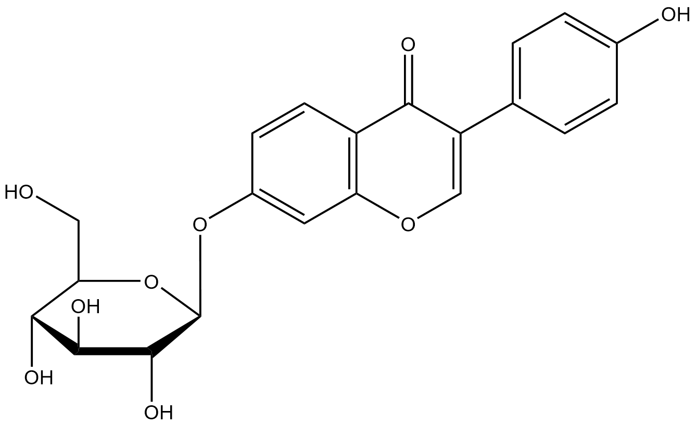
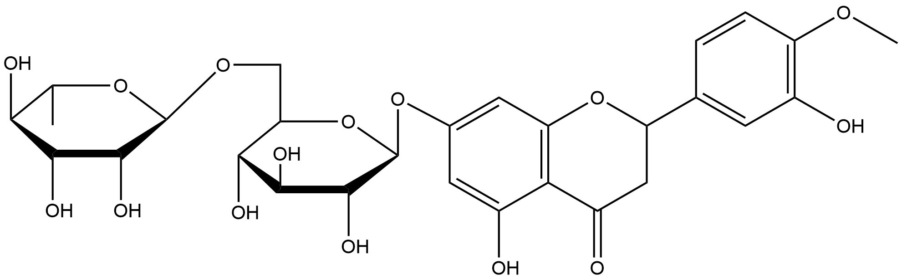

# Hydrolysis Reactions (HRs) Family 1

<!--[TOC]在这里不可以用-->

<ul id="myTab" class="nav nav-tabs">
  <!-- active 指的是默认页 -->
  <li class="active">
    <!-- herf中名字于下文id对应 -->
    <!-- 这里只改herf和tab1 -->
    <a href="#tab1" data-toggle="tab">A0A0E3K5E4</a>
  </li>
  <li><a href="#tab2" data-toggle="tab">J9XU85</a></li>
  <li><a href="#tab3" data-toggle="tab">Q51723</a></li>
</ul>

  <!-- 此处的id与上文herf对应 其他的不要改-->
  

<h2>Literature Information</h2>
<table>
<thead>
<tr>
<th style="text-align:left">Title</th>
<th style="text-align:left">Improved conversion of ginsenoside Rb1 to compound K by semi-rational design of <em>Sulfolobus solfataricus</em> β-glycosidase</th>
</tr>
</thead>
<tbody>
<tr>
<td style="text-align:left">Author</td>
<td style="text-align:left">Kyung-Chul Shin, Hye-Yeon Choi, Min-Ju Seo &amp; Deok-Kun Oh</td>
</tr>
<tr>
<td style="text-align:left">DOI</td>
<td style="text-align:left"><a href="https://doi.org/10.4014/jmb.1208.08028">10.4014/jmb.1208.08028</a></td>
</tr>
<tr>
<td style="text-align:left">Abstract</td>
<td style="text-align:left">Ginsenoside compound K has been used as a key nutritional and cosmetic component because of its anti-fatigue and skin anti-aging effects. β-Glycosidase from <em>Sulfolobus solfataricus</em> (SS-BGL) is known as the most efficient enzyme for compound K production. The hydrolytic pathway from ginsenoside Rb1 to compound K via Rd and F2 is the most important because Rb1 is the most abundant component in ginseng extract. However, the enzymatic conversion of ginsenoside Rd to F2 is a limiting step in the hydrolytic pathway because of the relatively low activity for Rd. A V209 residue obtained from error-prone PCR was related to Rd-hydrolyzing activity, and a docking pose showing an interaction with Val209 was selected from numerous docking poses. W361F was obtained by rational design using the docking pose that exhibited 4.2-fold higher activity, 3.7-fold higher catalytic efficiency, and 3.1-fold lower binding energy for Rd than the wild-type enzyme, indicating that W361F compensated for the limiting step. W361F completely converted <mark>Rb1</mark> to <mark>compound K</mark> with a productivity of 843 mg l-1 h-1 in 80 min, and showed also 7.4-fold higher activity for the flavanone, hesperidin, than the wild-type enzyme. Therefore, the W361F variant SS-BGL can be useful for hydrolysis of other glycosides as well as compound K production from Rb1, and semi-rational design is a useful tool for enhancing hydrolytic activity of β-glycosidase.</td>
</tr>
</tbody>
</table>
<h2>Experimental results</h2>
<ul>
<li><strong>Enzyme</strong></li>
</ul>

Uniprot ID: <a href="https://www.uniprot.org/uniprot/A0A0E3K5E4">A0A0E3K5E4</a>

Protein:  Beta-galactosidase

Organism: <em>Saccharolobus solfataricus (Sulfolobus solfataricus)</em>

Length: 489 AA

Taxonomic identifier: <a href="https://www.uniprot.org/taxonomy/2287">2287</a> [<a href="https://www.ncbi.nlm.nih.gov/Taxonomy/Browser/wwwtax.cgi?lvl=0&amp;id=2287">NCBI</a>]

<ul>
<li><strong>Pfam</strong></li>
</ul>
<table>
<thead>
<tr>
<th>Source</th>
<th>Domain</th>
<th>Start</th>
<th>End</th>
<th>E-value (Domain)</th>
<th>Coverage</th>
</tr>
</thead>
<tbody>
<tr>
<td>Pfam-A</td>
<td>Glyco_hydro_1</td>
<td>122</td>
<td>468</td>
<td>1.9e-58</td>
<td>0.790</td>
</tr>
</tbody>
</table>

Program: <code>hmmscan</code>

Version: 3.1b2 (February 2015)

Method: <code>hmmscan --domtblout hmmscan.tbl --noali -E 1e-5 pfam query.fa </code>

Date: Mon Jul 20 14:32:16 2020

Description:

Glyco_hydro_1

<a href="https://pfam.xfam.org/family/Glyco_hydro_1"><strong>Pfam</strong></a>

No Pfam abstract.

<a href="http://www.ebi.ac.uk/interpro/entry/InterPro/IPR001360/"><strong>InterPro</strong></a>

O-Glycosyl hydrolases (<a href="http://www.ebi.ac.uk/intenz/query?cmd=SearchEC&amp;ec=3.2.1.">3.2.1.</a>) are a widespread group of enzymes that hydrolyse the glycosidic bond between two or more carbohydrates, or between a carbohydrate and a non-carbohydrate moiety. A classification system for glycosyl hydrolases, based on sequence similarity, has led to the definition of 85 different families <a href="#fn1" id="fnref1">[1]</a><a href="#fn2" id="fnref2">[2]</a>. This classification is available on the CAZy (CArbohydrate-Active EnZymes) website.

Glycoside hydrolase family 1 <a href="http://www.cazy.org/fam/GH1.html">GH1</a> comprises enzymes with a number of known activities; beta-glucosidase (<a href="http://www.ebi.ac.uk/intenz/query?cmd=SearchEC&amp;ec=3.2.1.21">3.2.1.21</a>); beta-galactosidase (<a href="http://www.ebi.ac.uk/intenz/query?cmd=SearchEC&amp;ec=3.2.1.23">3.2.1.23</a>); 6-phospho-beta-galactosidase (<a href="http://www.ebi.ac.uk/intenz/query?cmd=SearchEC&amp;ec=3.2.1.85">3.2.1.85</a>); 6-phospho-beta-glucosidase (<a href="http://www.ebi.ac.uk/intenz/query?cmd=SearchEC&amp;ec=3.2.1.86">3.2.1.86</a>); lactase-phlorizin hydrolase (<a href="http://www.ebi.ac.uk/intenz/query?cmd=SearchEC&amp;ec=3.2.1.62">3.2.1.62</a>), (<a href="http://www.ebi.ac.uk/intenz/query?cmd=SearchEC&amp;ec=3.2.1.108">3.2.1.108</a>); beta-mannosidase (<a href="http://www.ebi.ac.uk/intenz/query?cmd=SearchEC&amp;ec=3.2.1.25">3.2.1.25</a>); myrosinase (<a href="http://www.ebi.ac.uk/intenz/query?cmd=SearchEC&amp;ec=3.2.1.147">3.2.1.147</a>).

<ul>
<li><strong>Reaction</strong></li>
</ul>

<a href="https://pubchem.ncbi.nlm.nih.gov/compound/9898279">ginsenoside Rb1</a> ⇒ <a href="https://pubchem.ncbi.nlm.nih.gov/compound/ginsenoside%20compound%20K">ginsenoside compound K</a>

<figure>

  

    
  

  

    
  

  

    
  

</figure>
<h2>References</h2>

<section class="footnotes">
<ol class="footnotes-list">
<li id="fn1" class="footnote-item">
Henrissat B, Callebaut I, Fabrega S, et al. Conserved catalytic machinery and the prediction of a common fold for several families of glycosyl hydrolases[J]. Proceedings of the National Academy of Sciences, 1995, 92(15): 7090-7094. <a href="#fnref1" class="footnote-backref">↩︎</a>

</li>
<li id="fn2" class="footnote-item">
Davies G, Henrissat B. Structures and mechanisms of glycosyl hydrolases[J]. Structure, 1995, 3(9): 853-859. <a href="#fnref2" class="footnote-backref">↩︎</a>

</li>
</ol>
</section>

  

  

<h2>Literature Information</h2>
<table>
<thead>
<tr>
<th style="text-align:left">Title</th>
<th style="text-align:left">Identification of the β-Glucosidase Gene from Bifidobacterium animalis subsp. lactis and Its Expression in B. bifidum BGN4</th>
</tr>
</thead>
<tbody>
<tr>
<td style="text-align:left">Author</td>
<td style="text-align:left">So Youn Youn , Myeong Soo Park and Geun Eog Ji</td>
</tr>
<tr>
<td style="text-align:left">DOI</td>
<td style="text-align:left"><a href="https://doi.org/10.1186/s13568-017-0487-x">10.4014/jmb.1208.08028</a></td>
</tr>
<tr>
<td style="text-align:left">Abstract</td>
<td style="text-align:left">β-Glucosidase is necessary for the bioconversion of glycosidic phytochemicals in food. Two Bifidobacterium strains (<em>Bifidobacterium animalis</em> subsp. <em>lactis</em> SH5 and <em>B. animalis</em> subsp. <em>lactis</em> RD68) with relatively high β- glucosidase activities were selected among 46 lactic acid bacteria. A β-glucosidase gene (bbg572) from B. lactis was shotgun cloned, fully sequenced, and analyzed for its transcription start site, structural gene, and deduced transcriptional terminator. The structural gene of bbg572 was 1,383 bp. Based on amino sequence similarities, bbg572 was assigned to family 1 of the glycosyl hydrolases. To overexpress bbg572 in Bifidobacterium, several bifidobacteria expression vectors were constructed by combining several promoters and a terminator sequence from different <em>bifidobacteria</em>. The maximum activity of recombinant Bbg572 was achieved when it was expressed under its own promoter and terminator. Its enzyme activity increased 31-fold compared with those of its parental strains. The optimal pH for Bbg572 was pH 6.0. Bbg572 was stable at 37-40oC. It hydrolyzed <mark>isoflavones</mark>, <mark>quercetins</mark>, and <mark>disaccharides</mark> with various β-glucoside linkages. Bbg572 also converted the ginsenosides Rb1 and Rb2. These results suggest that this new β-glucosidase-positive Bifidobacterium transformant can be utilized for the production of specific aglycone products.</td>
</tr>
</tbody>
</table>
<h2>Experimental results</h2>
<ul>
<li><strong>Enzyme</strong></li>
</ul>

Uniprot ID: <a href="https://www.uniprot.org/uniprot/J9XU85">J9XU85</a>

Protein: Beta-glucosidase

Organism: <em>Bifidobacterium animalis subsp. lactis (Bifidobacterium lactis)</em>

Length: 460 AA

Taxonomic identifier: <a href="https://www.uniprot.org/taxonomy/302911">302911</a> [<a href="https://www.ncbi.nlm.nih.gov/Taxonomy/Browser/wwwtax.cgi?lvl=0&amp;id=302911">NCBI</a>]

<ul>
<li><strong>Pfam</strong></li>
</ul>
<table>
<thead>
<tr>
<th>Source</th>
<th>Domain</th>
<th>Start</th>
<th>End</th>
<th>E-value (Domain)</th>
<th>Coverage</th>
</tr>
</thead>
<tbody>
<tr>
<td>Pfam-A</td>
<td>Glyco_hydro_1</td>
<td>2</td>
<td>457</td>
<td>1.8e-146</td>
<td>0.991</td>
</tr>
</tbody>
</table>

Program: <code>hmmscan</code>

Version: 3.1b2 (February 2015)

Method: <code>hmmscan --domtblout hmmscan.tbl --noali -E 1e-5 pfam query.fa </code>

Date: Mon Jul 20 14:32:16 2020

Description:

Glyco_hydro_1

<a href="https://pfam.xfam.org/family/Glyco_hydro_1"><strong>Pfam</strong></a>

No Pfam abstract.

<a href="http://www.ebi.ac.uk/interpro/entry/InterPro/IPR001360/"><strong>InterPro</strong></a>

O-Glycosyl hydrolases (<a href="http://www.ebi.ac.uk/intenz/query?cmd=SearchEC&amp;ec=3.2.1.">3.2.1.</a>) are a widespread group of enzymes that hydrolyse the glycosidic bond between two or more carbohydrates, or between a carbohydrate and a non-carbohydrate moiety. A classification system for glycosyl hydrolases, based on sequence similarity, has led to the definition of 85 different families <a href="#fn1" id="fnref1">[1]</a><a href="#fn2" id="fnref2">[2]</a>. This classification is available on the CAZy (CArbohydrate-Active EnZymes) website.

Glycoside hydrolase family 1 <a href="http://www.cazy.org/fam/GH1.html">GH1</a> comprises enzymes with a number of known activities; beta-glucosidase (<a href="http://www.ebi.ac.uk/intenz/query?cmd=SearchEC&amp;ec=3.2.1.21">3.2.1.21</a>); beta-galactosidase (<a href="http://www.ebi.ac.uk/intenz/query?cmd=SearchEC&amp;ec=3.2.1.23">3.2.1.23</a>); 6-phospho-beta-galactosidase (<a href="http://www.ebi.ac.uk/intenz/query?cmd=SearchEC&amp;ec=3.2.1.85">3.2.1.85</a>); 6-phospho-beta-glucosidase (<a href="http://www.ebi.ac.uk/intenz/query?cmd=SearchEC&amp;ec=3.2.1.86">3.2.1.86</a>); lactase-phlorizin hydrolase (<a href="http://www.ebi.ac.uk/intenz/query?cmd=SearchEC&amp;ec=3.2.1.62">3.2.1.62</a>), (<a href="http://www.ebi.ac.uk/intenz/query?cmd=SearchEC&amp;ec=3.2.1.108">3.2.1.108</a>); beta-mannosidase (<a href="http://www.ebi.ac.uk/intenz/query?cmd=SearchEC&amp;ec=3.2.1.25">3.2.1.25</a>); myrosinase (<a href="http://www.ebi.ac.uk/intenz/query?cmd=SearchEC&amp;ec=3.2.1.147">3.2.1.147</a>).

<ul>
<li><strong>Reaction</strong></li>
</ul>

<a href="https://pubchem.ncbi.nlm.nih.gov/compound/daidzin">daidzin</a> ⇒ <a href="https://pubchem.ncbi.nlm.nih.gov/compound/daidzein">daidzein</a> + <a href="https://pubchem.ncbi.nlm.nih.gov/compound/glucose">glucose</a>

<figure>

  

    
  

  

    
  

  

    
  

  

    
  

  

    
  

</figure>
<h2>References</h2>

<section class="footnotes">
<ol class="footnotes-list">
<li id="fn1" class="footnote-item">
Henrissat B, Callebaut I, Fabrega S, et al. Conserved catalytic machinery and the prediction of a common fold for several families of glycosyl hydrolases[J]. Proceedings of the National Academy of Sciences, 1995, 92(15): 7090-7094. <a href="#fnref1" class="footnote-backref">↩︎</a>

</li>
<li id="fn2" class="footnote-item">
Davies G, Henrissat B. Structures and mechanisms of glycosyl hydrolases[J]. Structure, 1995, 3(9): 853-859. <a href="#fnref2" class="footnote-backref">↩︎</a>

</li>
</ol>
</section>

  

  

<h2>Literature Information</h2>
<table>
<thead>
<tr>
<th style="text-align:left">Title</th>
<th style="text-align:left">Hydrolysis of Flavanone Glycosides by β-Glucosidase from <em>Pyrococcus furiosus</em> and Its Application to the Production of Flavanone Aglycones from Citrus Extracts</th>
</tr>
</thead>
<tbody>
<tr>
<td style="text-align:left">Author</td>
<td style="text-align:left">Kyung-Chul Shin, Hyun-Koo Nam, and Deok-Kun Oh</td>
</tr>
<tr>
<td style="text-align:left">DOI</td>
<td style="text-align:left"><a href="https://doi.org/10.1021/jf403332e">10.1021/jf403332e</a></td>
</tr>
<tr>
<td style="text-align:left">Abstract</td>
<td style="text-align:left">The hydrolytic activity of the recombinant β-glucosidase from <em>Pyrococcus furiosus</em> for the flavanone glycoside hesperidin was optimal at pH 5.5 and 95 °C in the presence of 0.5% (v/v) dimethyl sulfoxide (DMSO) and 0.1% (w/v) Tween 40 with a half-life of 88 h, a <em>K</em>m of 1.6 mM, and a <em>k</em>cat of 68.4 1/s. The specific activity of the enzyme for flavonoid glycosides followed the order hesperidin &gt; neohesperidin &gt; naringin &gt; narirutin &gt; poncirin &gt; diosmin &gt; neoponcirin &gt; rutin. The specific activity for flavanone was higher than that for flavone or flavonol. DMSO at 10% (v/v) was used to increase the solubility of flavanone glycosides as substrates. The enzyme completely converted flavanone glycosides (1 g/L) to flavanone aglycones and disaccharides via one-step reaction. The major flavanone in grapefruit peel, grapefruit pulp, or orange peel extract was naringin (47.5 mg/g), naringin (16.6 mg/g), or hesperidin (18.2 mg/g), respectively. β-Glucosidase from <em>P. furiosus</em> completely converted naringin and narirutin in 100% (w/v) grapefruit peel extract to 22.5 g/L naringenin after 12 h, with a productivity of 1.88 g L–1 h–1; naringin and narirutin in 100% (w/v) grapefruit pulp extract to 8.1 g/L naringenin after 9 h, with a productivity of 0.90 g L–1 h–1; and hesperidin in 100% (w/v) orange peel extract to 9.0 g/L hesperetin after 9 h, with a productivity of 1.00 g L–1 h–1. The conversion yields, concentrations, and productivities of flavanone aglycones in this study are the highest among those obtained from citrus extracts. Thus, this enzyme may be useful for the industrial hydrolysis of flavanone glycosides in citrus extracts.</td>
</tr>
</tbody>
</table>
<h2>Experimental results</h2>
<ul>
<li><strong>Enzyme</strong></li>
</ul>

Uniprot ID: <a href="https://www.uniprot.org/uniprot/Q51723">Q51723</a>

Protein:  Beta-galactosidase

Organism: <em>Pyrococcus furiosus</em>

Length: 472 AA

Taxonomic identifier: <a href="https://www.uniprot.org/taxonomy/2261">2261</a> [<a href="https://www.ncbi.nlm.nih.gov/Taxonomy/Browser/wwwtax.cgi?lvl=0&amp;id=2261">NCBI</a>]

<ul>
<li><strong>Pfam</strong></li>
</ul>
<table>
<thead>
<tr>
<th>Source</th>
<th>Domain</th>
<th>Start</th>
<th>End</th>
<th>E-value (Domain)</th>
<th>Coverage</th>
</tr>
</thead>
<tbody>
<tr>
<td>Pfam-A</td>
<td>Glyco_hydro_1</td>
<td>122</td>
<td>280</td>
<td>8e-20</td>
<td>0.318</td>
</tr>
<tr>
<td>Pfam-A</td>
<td>Glyco_hydro_1</td>
<td>281</td>
<td>455</td>
<td>3.5e-37</td>
<td>0.393</td>
</tr>
</tbody>
</table>

Program: <code>hmmscan</code>

Version: 3.1b2 (February 2015)

Method: <code>hmmscan --domtblout hmmscan.tbl --noali -E 1e-5 pfam query.fa </code>

Date: Mon Jul 20 14:32:16 2020

Description:

Glyco_hydro_1

<a href="https://pfam.xfam.org/family/Glyco_hydro_1"><strong>Pfam</strong></a>

No Pfam abstract.

<a href="http://www.ebi.ac.uk/interpro/entry/InterPro/IPR001360/"><strong>InterPro</strong></a>

O-Glycosyl hydrolases (<a href="http://www.ebi.ac.uk/intenz/query?cmd=SearchEC&amp;ec=3.2.1.">3.2.1.</a>) are a widespread group of enzymes that hydrolyse the glycosidic bond between two or more carbohydrates, or between a carbohydrate and a non-carbohydrate moiety. A classification system for glycosyl hydrolases, based on sequence similarity, has led to the definition of 85 different families <a href="#fn1" id="fnref1">[1]</a><a href="#fn2" id="fnref2">[2]</a>. This classification is available on the CAZy (CArbohydrate-Active EnZymes) website.

Glycoside hydrolase family 1 <a href="http://www.cazy.org/fam/GH1.html">GH1</a> comprises enzymes with a number of known activities; beta-glucosidase (<a href="http://www.ebi.ac.uk/intenz/query?cmd=SearchEC&amp;ec=3.2.1.21">3.2.1.21</a>); beta-galactosidase (<a href="http://www.ebi.ac.uk/intenz/query?cmd=SearchEC&amp;ec=3.2.1.23">3.2.1.23</a>); 6-phospho-beta-galactosidase (<a href="http://www.ebi.ac.uk/intenz/query?cmd=SearchEC&amp;ec=3.2.1.85">3.2.1.85</a>); 6-phospho-beta-glucosidase (<a href="http://www.ebi.ac.uk/intenz/query?cmd=SearchEC&amp;ec=3.2.1.86">3.2.1.86</a>); lactase-phlorizin hydrolase (<a href="http://www.ebi.ac.uk/intenz/query?cmd=SearchEC&amp;ec=3.2.1.62">3.2.1.62</a>), (<a href="http://www.ebi.ac.uk/intenz/query?cmd=SearchEC&amp;ec=3.2.1.108">3.2.1.108</a>); beta-mannosidase (<a href="http://www.ebi.ac.uk/intenz/query?cmd=SearchEC&amp;ec=3.2.1.25">3.2.1.25</a>); myrosinase (<a href="http://www.ebi.ac.uk/intenz/query?cmd=SearchEC&amp;ec=3.2.1.147">3.2.1.147</a>).

<ul>
<li><strong>Reaction</strong></li>
</ul>

<a href="https://pubchem.ncbi.nlm.nih.gov/compound/hesperidin">hesperidin</a> + <a href="https://pubchem.ncbi.nlm.nih.gov/compound/Water">H2O</a> ⇒ <a href="https://pubchem.ncbi.nlm.nih.gov/compound/hesperetin">hesperetin</a> + <a href="https://pubchem.ncbi.nlm.nih.gov/compound/5460038">rutinose</a>

<figure>

  

    
  

  

    
  

  

    
  

  

    
  

  

    
  

  

    
  

  

    
  

</figure>
<h2>References</h2>

<section class="footnotes">
<ol class="footnotes-list">
<li id="fn1" class="footnote-item">
Henrissat B, Callebaut I, Fabrega S, et al. Conserved catalytic machinery and the prediction of a common fold for several families of glycosyl hydrolases[J]. Proceedings of the National Academy of Sciences, 1995, 92(15): 7090-7094. <a href="#fnref1" class="footnote-backref">↩︎</a>

</li>
<li id="fn2" class="footnote-item">
Davies G, Henrissat B. Structures and mechanisms of glycosyl hydrolases[J]. Structure, 1995, 3(9): 853-859. <a href="#fnref2" class="footnote-backref">↩︎</a>

</li>
</ol>
</section>

  

