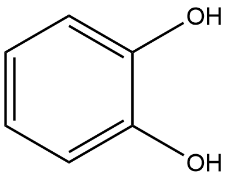
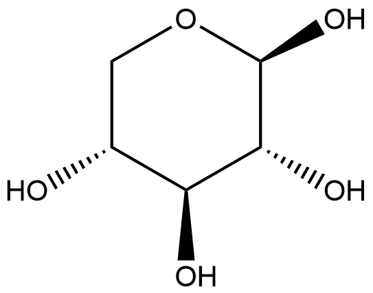

#  Hydrolysis Reactions (HRs) Family 2 / Subfamily 1

##  Literature Information

| Title    | Characterization of a Novel Polyphenol-Specific Oligoxyloside Transfer Reaction by a Family 11 Xylanase from *Bacillus* sp. KT12 |
| :------- | :----------------------------------------------------------- |
| Author   | Kazuhiro CHIKU, Jun UZAWA, Hiroko SEKI, Seigo AMACHI, Takaaki FUJII & Hirofumi SHINOYAMA |
| DOI      | [10.1271/bbb.80116](https://doi.org/10.1271/bbb.80116)       |
| Abstract | A culture filtrate of *Bacillus* sp. KT12 was used to prepare polyphenyl β-oligoxylosides from xylan and polyphenols in a one-step reaction. One oligoxyloside transfer enzyme was purified from multiple xylanolytic enzymes in the culture filtrate. N-terminal amino acid sequence determination classified the enzyme as a glycosyl hydrolase family 11 (endo-xylanase). The xylanolytic enzyme activities could be markedly altered; its hydrolytic activity was almost entirely inhibited at acidic pH, whereas near constant transxylosylation activity was observed at pH 4–11. Further, metal ions activated transxylosylation and almost completely inhibited hydrolysis. The enzyme specifically induced a β-xylosyl transfer reaction to acceptor molecules, such as divalent and trivalent phenolic hydroxyl groups, and displayed no activity toward alcoholic compounds. The *Bacillus* sp. KT12 xylanolytic enzyme was a suitable enzyme for the synthesis of polyphenyl β-oligoxylosides. |

##  Experimental results

- **Enzyme**

Uniprot ID: [Q45VU2](https://www.uniprot.org/uniprot/Q45VU2)

Protein:  Endo-1,4-beta-xylanase

Organism: *Bacillus subtilis*

Length: 213 AA

Taxonomic identifier: [1423](https://www.uniprot.org/taxonomy/1423) [[NCBI](https://www.ncbi.nlm.nih.gov/Taxonomy/Browser/wwwtax.cgi?lvl=0&id=1423)]

- **Pfam**

| Source | Domain         | Start | End  | E-value (Domain) | Coverage |
| ------ | -------------- | ----- | ---- | ---------------- | -------- |
| Pfam-A | Glyco_hydro_11 | 31    | 211  | 6.7e-69          | 0.983    |

Program: `hmmscan`

Version: 3.1b2 (February 2015)

Method: `hmmscan --domtblout hmmscan.tbl --noali -E 1e-5 pfam query.fa `

Date: Mon Jul 20 14:32:16 2020

Description:

Glyco_hydro_11

[**Pfam**](https://pfam.xfam.org/family/Glyco_hydro_11)

No Pfam abstract.

[**InterPro**](http://www.ebi.ac.uk/interpro/entry/InterPro/IPR033123/)

The microbial degradation of cellulose and xylans requires several types of enzymes such as endoglucanases ([3.2.1.4](http://www.ebi.ac.uk/intenz/query?cmd=SearchEC&ec=3.2.1.4)), cellobiohydrolases ([3.2.1.91](http://www.ebi.ac.uk/intenz/query?cmd=SearchEC&ec=3.2.1.91)) (exoglucanases), or xylanases ([3.2.1.8](http://www.ebi.ac.uk/intenz/query?cmd=SearchEC&ec=3.2.1.8))[^1][^2]. Fungi and bacteria produces a spectrum of cellulolytic enzymes (cellulases) and xylanases which, on the basis of sequence similarities, can be classified into families. One of these families is known as the cellulase family G[^3] or as the glycosyl hydrolases family 11 (GH11)[^4].

The GH11 domain folds into a jelly-roll shape likened to a partially closed right hand. Several anti-parallel beta-strands bend almost 90deg to produce a substrate-binding groove characteristic of the GH11 domain active sites. Two catalytic Glu residues face each other from opposite sides of the groove. The hydrolysis reaction is believed to follow a double- displacement mechanism, with one Glu residue acting as a general acid/base catalyst and the other as a nucleophile.

- **Reaction**

[catechol](https://pubchem.ncbi.nlm.nih.gov/compound/catechol) + [xylan](https://pubchem.ncbi.nlm.nih.gov/compound/125409) &rArr; [2-hydroxyphenyl O-β-D-xylopyranoside](https://pubchem.ncbi.nlm.nih.gov/compound/101378878)

<figure>

  

    
  

  

    
  

  

    
  

  

    
  

  

    
  

</figure>

## References

[^1]:Béguin P. Molecular biology of cellulose degradation[J]. Annual review of microbiology, 1990, 44(1): 219-248.
[^2]:Gilkes N R, Henrissat B, Kilburn D G, et al. Domains in microbial beta-1, 4-glycanases: sequence conservation, function, and enzyme families[J]. Microbiology and Molecular Biology Reviews, 1991, 55(2): 303-315.

[^3]:Henrissat B, Claeyssens M, Tomme P, et al. Cellulase families revealed by hydrophobic cluster analysi[J]. Gene, 1989, 81(1): 83-95.
[^4]:Henrissat B. A classification of glycosyl hydrolases based on amino acid sequence similarities[J]. Biochemical journal, 1991, 280(2): 309-316.

