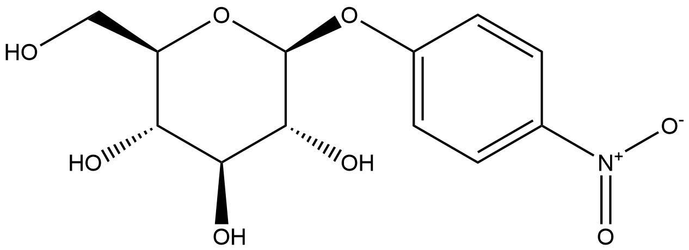
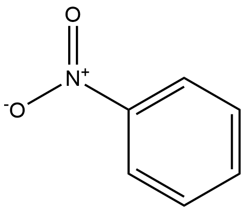

# Hydrolysis Reactions (HRs) Family 3 / Subfamily 1

<!--[TOC]在这里不可以用-->

<ul id="myTab" class="nav nav-tabs">
  <!-- active 指的是默认页 -->
  <li class="active">
    <!-- herf中名字于下文id对应 -->
    <!-- 这里只改herf和tab1 -->
    <a href="#tab1" data-toggle="tab">A0A072MSE8</a>
  </li>
  <li><a href="#tab2" data-toggle="tab">A0A072N4Q2</a></li>
</ul>

  <!-- 此处的id与上文herf对应 其他的不要改-->
  

<h2>Literature Information</h2>
<table>
<thead>
<tr>
<th style="text-align:left">Title</th>
<th style="text-align:left">Characterization of four β-glucosidases acting on isoflavone-glycosides from <em>Bifidobacterium pseudocatenulatum</em> IPLA 36007</th>
</tr>
</thead>
<tbody>
<tr>
<td style="text-align:left">Author</td>
<td style="text-align:left">Lucía Guadamuro, Ana Belén Flórez, Ángel Alegría, Lucía Vázquez, Baltasar Mayo</td>
</tr>
<tr>
<td style="text-align:left">DOI</td>
<td style="text-align:left"><a href="https://doi.org/10.1016/j.foodres.2017.07.024">10.1016/j.foodres.2017.07.024</a></td>
</tr>
<tr>
<td style="text-align:left">Abstract</td>
<td style="text-align:left"><em>Bifidobacterium pseudocatenulatum</em> IPLA 36007 acts on <a href="https://www.sciencedirect.com/topics/food-science/isoflavones">isoflavone</a> <a href="https://www.sciencedirect.com/topics/food-science/glycoside">glycosides</a>, releasing their corresponding aglycones. This strain-specific activity might be a key step in making isoflavones bioavailable and harnessing their oestrogenic activity. To investigate the molecular mechanisms involved in this activity, four glycosyl hydrolase-encoding genes in the IPLA 36007 genome (<em>AW18_01575</em>, <em>AW18_09810</em>, <em>AW18_08145</em>, and <em>AW18_08090</em>) were selected, synthesized with heterologous promoter and terminator signals (r-β-<em>gluA</em>, r-β-<em>gluB</em>, r-β-<em>gluD</em> and r-β-<em>gluE</em>, respectively), cloned into <em>Escherichia coli</em>, overexpressed as His-tagged proteins, and the enzymes purified and characterized. All four enzymes – GluAHis, GluBHis, GluDHis and GluEHis – proved to have β-glucosidase activity and deglycosylated (although at different rates) the isoflavone glycosides daidzin and genistin, releasing the aglycone moieties daidzein and genistein, respectively. GluDHis and GluEHis were also shown to hydrolyse β-glucosyl <a href="https://www.sciencedirect.com/topics/food-science/disaccharides">disaccharides</a> such as cellobiose and gentiobiose, while GluAHis and GluBHis did not. Differences in activity were recorded for all four β-glucosidases at different pHs and temperatures under otherwise similar assay conditions, suggesting they have complementary activities under different environmental conditions. Two of the recombinant genes, r-β-<em>gluA</em>, and r-β-<em>gluD</em>, were cloned and expressed in the model <a href="https://www.sciencedirect.com/topics/food-science/lactic-acid-bacteria">lactic acid bacterium</a> <em>Lactococcus lactis</em>, suggesting starter and probiotic organisms could be endowed with β-glucosidase activity. <em>B. pseudocatenulatum</em> IPLA 36007 contains additional β-glucosidases to those studied in this work, indicating a high level of redundancy for this enzymatic activity. Knowledge of glycoside-degrading enzymes should facilitate the development of novel, more effective or more selective prebiotics or functional foods for the promotion of bifidobacterial numbers in the human gut. It might also be of interest in the development of novel probiotics with specific health-promoting activities.</td>
</tr>
</tbody>
</table>
<h2>Experimental results</h2>
<ul>
<li><strong>Enzyme</strong></li>
</ul>

Uniprot ID: <a href="https://www.uniprot.org/uniprot/A0A072MSE8">A0A072MSE8</a>

Protein:  Beta-glucosidase

Organism: <em>Bifidobacterium pseudocatenulatum IPLA36007</em>

Length: 809 AA

Taxonomic identifier: <a href="https://www.uniprot.org/taxonomy/1454376">1454376</a> [<a href="https://www.ncbi.nlm.nih.gov/Taxonomy/Browser/wwwtax.cgi?lvl=0&amp;id=1454376">NCBI</a>]

<ul>
<li><strong>Pfam</strong></li>
</ul>
<table>
<thead>
<tr>
<th>Source</th>
<th>Domain</th>
<th>Start</th>
<th>End</th>
<th>E-value (Domain)</th>
<th>Coverage</th>
</tr>
</thead>
<tbody>
<tr>
<td>Pfam-A</td>
<td>Glyco_hydro_3_C</td>
<td>315</td>
<td>548</td>
<td>1.2e-46</td>
<td>0.990</td>
</tr>
<tr>
<td>Pfam-A</td>
<td>Fn3-like</td>
<td>578</td>
<td>646</td>
<td>1.7e-21</td>
<td>0.958</td>
</tr>
<tr>
<td>Pfam-A</td>
<td>Glyco_hydro_3</td>
<td>26</td>
<td>278</td>
<td>4.6e-52</td>
<td>0.806</td>
</tr>
</tbody>
</table>

Program: <code>hmmscan</code>

Version: 3.1b2 (February 2015)

Method: <code>hmmscan --domtblout hmmscan.tbl --noali -E 1e-5 pfam query.fa </code>

Date: Mon Jul 20 14:32:16 2020

Description:

Glyco_hydro_3_C

<a href="https://pfam.xfam.org/family/Glyco_hydro_3_C"><strong>Pfam</strong></a>

This domain is involved in catalysis and may be involved in binding beta-glucan<a href="#fn1" id="fnref1">[1]</a>. This domain is found associated with <a href="https://pfam.xfam.org/family/PF00933">PF00933</a>.

<a href="http://www.ebi.ac.uk/interpro/entry/InterPro/IPR002772/"><strong>InterPro</strong></a>

Glycoside hydrolase family 3 <a href="http://www.cazy.org/fam/GH3.html">GH3</a> comprises enzymes with a number of known activities; beta-glucosidase (<a href="http://www.ebi.ac.uk/intenz/query?cmd=SearchEC&amp;ec=3.2.1.21">3.2.1.21</a>); beta-xylosidase (<a href="http://www.ebi.ac.uk/intenz/query?cmd=SearchEC&amp;ec=3.2.1.37">3.2.1.37</a>); N-acetyl beta-glucosaminidase (<a href="http://www.ebi.ac.uk/intenz/query?cmd=SearchEC&amp;ec=3.2.1.52">3.2.1.52</a>); glucan beta-1,3-glucosidase (<a href="http://www.ebi.ac.uk/intenz/query?cmd=SearchEC&amp;ec=3.2.1.58">3.2.1.58</a>); cellodextrinase(<a href="http://www.ebi.ac.uk/intenz/query?cmd=SearchEC&amp;ec=3.2.1.74">3.2.1.74</a>); exo-1,3-1,4-glucanase (<a href="http://www.ebi.ac.uk/intenz/query?cmd=SearchEC&amp;ec=3.2.1">3.2.1</a>).

These enzymes are two-domain globular proteins that are N-glycosylated at three sites<a href="#fn1" id="fnref1:1">[1:1]</a>. This entry represents the C-terminal domain, involved in catalysis and may be involved in binding beta-glucan<a href="#fn1" id="fnref1:2">[1:2]</a>. It is found associated with <a href="http://www.ebi.ac.uk/interpro/entry/pfam/PF00933/">PF00933</a>.

Fn3-like

<a href="https://pfam.xfam.org/family/Fn3-like"><strong>Pfam</strong></a>

This domain has a fibronectin type III-like structure<a href="#fn2" id="fnref2">[2]</a>. It is often found in association with <a href="https://pfam.xfam.org/family/PF00933">PF00933</a> and <a href="https://pfam.xfam.org/family/PF01915">PF01915</a>. Its function is unknown.

<a href="http://www.ebi.ac.uk/interpro/entry/InterPro/IPR026891/"><strong>InterPro</strong></a>

This domain has a fibronectin type III-like structure<a href="#fn2" id="fnref2:1">[2:1]</a>. It is often found in association with <a href="http://www.ebi.ac.uk/interpro/entry/pfam/PF00933/">PF00933</a> and <a href="http://www.ebi.ac.uk/interpro/entry/pfam/PF01915/">PF01915</a>. Its function is unknown.

Glyco_hydro_3

<a href="https://pfam.xfam.org/family/Glyco_hydro_3"><strong>Pfam</strong></a>

No Pfam abstract.

<a href="http://www.ebi.ac.uk/interpro/entry/InterPro/IPR001764/"><strong>InterPro</strong></a>

O-Glycosyl hydrolases (<a href="http://www.ebi.ac.uk/intenz/query?cmd=SearchEC&amp;ec=3.2.1.">3.2.1.</a>) are a widespread group of enzymes that hydrolyse the glycosidic bond between two or more carbohydrates, or between a carbohydrate and a non-carbohydrate moiety. A classification system for glycosyl hydrolases, based on sequence similarity, has led to the definition of 85 different families<a href="#fn3" id="fnref3">[3]</a><a href="#fn4" id="fnref4">[4]</a>. This classification is available on the CAZy (CArbohydrate-Active EnZymes) website.

Glycoside hydrolase family 3 <a href="http://www.cazy.org/fam/GH3.html">GH3</a> comprises enzymes with a number of known activities; beta-glucosidase (<a href="http://www.ebi.ac.uk/intenz/query?cmd=SearchEC&amp;ec=3.2.1.21">3.2.1.21</a>); beta-xylosidase (<a href="http://www.ebi.ac.uk/intenz/query?cmd=SearchEC&amp;ec=3.2.1.37">3.2.1.37</a>); N-acetyl beta-glucosaminidase (<a href="http://www.ebi.ac.uk/intenz/query?cmd=SearchEC&amp;ec=3.2.1.52">3.2.1.52</a>); glucan beta-1,3-glucosidase (<a href="http://www.ebi.ac.uk/intenz/query?cmd=SearchEC&amp;ec=3.2.1.58">3.2.1.58</a>); cellodextrinase (<a href="http://www.ebi.ac.uk/intenz/query?cmd=SearchEC&amp;ec=3.2.1.74">3.2.1.74</a>); exo-1,3-1,4-glucanase (<a href="http://www.ebi.ac.uk/intenz/query?cmd=SearchEC&amp;ec=3.2.1">3.2.1</a>). These enzymes are two-domain globular proteins that are N-glycosylated at three sites<a href="#fn1" id="fnref1:3">[1:3]</a>. This domain is often N-terminal to the glycoside hydrolase family 3, C-terminal domain <a href="http://www.ebi.ac.uk/interpro/entry/InterPro/IPR002772/">IPR002772</a>.

<ul>
<li><strong>Reaction</strong></li>
</ul>

<a href="https://pubchem.ncbi.nlm.nih.gov/compound/4-Nitrophenyl-beta-D-glucopyranoside">p-nitrophenyl-β-D-glucopyranoside</a> ⇒ <a href="https://pubchem.ncbi.nlm.nih.gov/compound/p-nitrophenyl">p-nitrophenyl</a> + <a href="https://pubchem.ncbi.nlm.nih.gov/compound/64689">β-D-Glucopyranose</a>

<figure>

  

    
  

  

    
  

  

    
  

  

    
  

  

    
  

</figure>
<h2>References</h2>

<section class="footnotes">
<ol class="footnotes-list">
<li id="fn1" class="footnote-item">
Varghese J N, Hrmova M, Fincher G B. Three-dimensional structure of a barley β-D-glucan exohydrolase, a family 3 glycosyl hydrolase[J]. Structure, 1999, 7(2): 179-190. <a href="#fnref1" class="footnote-backref">↩︎</a> <a href="#fnref1:1" class="footnote-backref">↩︎</a> <a href="#fnref1:2" class="footnote-backref">↩︎</a> <a href="#fnref1:3" class="footnote-backref">↩︎</a>

</li>
<li id="fn2" class="footnote-item">
Pozzo T, Pasten J L, Karlsson E N, et al. Structural and functional analyses of β-glucosidase 3B from Thermotoga neapolitana: a thermostable three-domain representative of glycoside hydrolase 3[J]. Journal of molecular biology, 2010, 397(3): 724-739. <a href="#fnref2" class="footnote-backref">↩︎</a> <a href="#fnref2:1" class="footnote-backref">↩︎</a>

</li>
<li id="fn3" class="footnote-item">
Henrissat B, Callebaut I, Fabrega S, et al. Conserved catalytic machinery and the prediction of a common fold for several families of glycosyl hydrolases[J]. Proceedings of the National Academy of Sciences, 1995, 92(15): 7090-7094. <a href="#fnref3" class="footnote-backref">↩︎</a>

</li>
<li id="fn4" class="footnote-item">
Davies G, Henrissat B. Structures and mechanisms of glycosyl hydrolases[J]. Structure, 1995, 3(9): 853-859. <a href="#fnref4" class="footnote-backref">↩︎</a>

</li>
</ol>
</section>

  

  

<h2>Literature Information</h2>
<table>
<thead>
<tr>
<th style="text-align:left">Title</th>
<th style="text-align:left">Characterization of four β-glucosidases acting on isoflavone-glycosides from <em>Bifidobacterium pseudocatenulatum</em> IPLA 36007</th>
</tr>
</thead>
<tbody>
<tr>
<td style="text-align:left">Author</td>
<td style="text-align:left">Lucía Guadamuro, Ana Belén Flórez, Ángel Alegría, Lucía Vázquez, Baltasar Mayo</td>
</tr>
<tr>
<td style="text-align:left">DOI</td>
<td style="text-align:left"><a href="https://doi.org/10.1016/j.foodres.2017.07.024">10.1016/j.foodres.2017.07.024</a></td>
</tr>
<tr>
<td style="text-align:left">Abstract</td>
<td style="text-align:left"><em>Bifidobacterium pseudocatenulatum</em> IPLA 36007 acts on <a href="https://www.sciencedirect.com/topics/food-science/isoflavones">isoflavone</a> <a href="https://www.sciencedirect.com/topics/food-science/glycoside">glycosides</a>, releasing their corresponding aglycones. This strain-specific activity might be a key step in making isoflavones bioavailable and harnessing their oestrogenic activity. To investigate the molecular mechanisms involved in this activity, four glycosyl hydrolase-encoding genes in the IPLA 36007 genome (<em>AW18_01575</em>, <em>AW18_09810</em>, <em>AW18_08145</em>, and <em>AW18_08090</em>) were selected, synthesized with heterologous promoter and terminator signals (r-β-<em>gluA</em>, r-β-<em>gluB</em>, r-β-<em>gluD</em> and r-β-<em>gluE</em>, respectively), cloned into <em>Escherichia coli</em>, overexpressed as His-tagged proteins, and the enzymes purified and characterized. All four enzymes – GluAHis, GluBHis, GluDHis and GluEHis – proved to have β-glucosidase activity and deglycosylated (although at different rates) the isoflavone glycosides daidzin and genistin, releasing the aglycone moieties daidzein and genistein, respectively. GluDHis and GluEHis were also shown to hydrolyse β-glucosyl <a href="https://www.sciencedirect.com/topics/food-science/disaccharides">disaccharides</a> such as cellobiose and gentiobiose, while GluAHis and GluBHis did not. Differences in activity were recorded for all four β-glucosidases at different pHs and temperatures under otherwise similar assay conditions, suggesting they have complementary activities under different environmental conditions. Two of the recombinant genes, r-β-<em>gluA</em>, and r-β-<em>gluD</em>, were cloned and expressed in the model <a href="https://www.sciencedirect.com/topics/food-science/lactic-acid-bacteria">lactic acid bacterium</a> <em>Lactococcus lactis</em>, suggesting starter and probiotic organisms could be endowed with β-glucosidase activity. <em>B. pseudocatenulatum</em> IPLA 36007 contains additional β-glucosidases to those studied in this work, indicating a high level of redundancy for this enzymatic activity. Knowledge of glycoside-degrading enzymes should facilitate the development of novel, more effective or more selective prebiotics or functional foods for the promotion of bifidobacterial numbers in the human gut. It might also be of interest in the development of novel probiotics with specific health-promoting activities.</td>
</tr>
</tbody>
</table>
<h2>Experimental results</h2>
<ul>
<li><strong>Enzyme</strong></li>
</ul>

Uniprot ID: <a href="https://www.uniprot.org/uniprot/A0A072N4Q2">A0A072N4Q2</a>

Protein:  Beta-glucosidase

Organism: <em>Bifidobacterium pseudocatenulatum IPLA36007</em>

Length: 748 AA

Taxonomic identifier: <a href="https://www.uniprot.org/taxonomy/1454376">1454376</a> [<a href="https://www.ncbi.nlm.nih.gov/Taxonomy/Browser/wwwtax.cgi?lvl=0&amp;id=1454376">NCBI</a>]

<ul>
<li><strong>Pfam</strong></li>
</ul>
<table>
<thead>
<tr>
<th>Source</th>
<th>Domain</th>
<th>Start</th>
<th>End</th>
<th>E-value (Domain)</th>
<th>Coverage</th>
</tr>
</thead>
<tbody>
<tr>
<td>Pfam-A</td>
<td>Glyco_hydro_3_C</td>
<td>316</td>
<td>548</td>
<td>1.6e-57</td>
<td>0.995</td>
</tr>
<tr>
<td>Pfam-A</td>
<td>Fn3-like</td>
<td>582</td>
<td>652</td>
<td>3.3e-25</td>
<td>0.986</td>
</tr>
<tr>
<td>Pfam-A</td>
<td>Glyco_hydro_3</td>
<td>67</td>
<td>279</td>
<td>1.6e-47</td>
<td>0.718</td>
</tr>
</tbody>
</table>

Program: <code>hmmscan</code>

Version: 3.1b2 (February 2015)

Method: <code>hmmscan --domtblout hmmscan.tbl --noali -E 1e-5 pfam query.fa </code>

Date: Mon Jul 20 14:32:16 2020

Description:

Glyco_hydro_3_C

<a href="https://pfam.xfam.org/family/Glyco_hydro_3_C"><strong>Pfam</strong></a>

This domain is involved in catalysis and may be involved in binding beta-glucan<a href="#fn1" id="fnref1">[1]</a>. This domain is found associated with <a href="https://pfam.xfam.org/family/PF00933">PF00933</a>.

<a href="http://www.ebi.ac.uk/interpro/entry/InterPro/IPR002772/"><strong>InterPro</strong></a>

Glycoside hydrolase family 3 <a href="http://www.cazy.org/fam/GH3.html">GH3</a> comprises enzymes with a number of known activities; beta-glucosidase (<a href="http://www.ebi.ac.uk/intenz/query?cmd=SearchEC&amp;ec=3.2.1.21">3.2.1.21</a>); beta-xylosidase (<a href="http://www.ebi.ac.uk/intenz/query?cmd=SearchEC&amp;ec=3.2.1.37">3.2.1.37</a>); N-acetyl beta-glucosaminidase (<a href="http://www.ebi.ac.uk/intenz/query?cmd=SearchEC&amp;ec=3.2.1.52">3.2.1.52</a>); glucan beta-1,3-glucosidase (<a href="http://www.ebi.ac.uk/intenz/query?cmd=SearchEC&amp;ec=3.2.1.58">3.2.1.58</a>); cellodextrinase(<a href="http://www.ebi.ac.uk/intenz/query?cmd=SearchEC&amp;ec=3.2.1.74">3.2.1.74</a>); exo-1,3-1,4-glucanase (<a href="http://www.ebi.ac.uk/intenz/query?cmd=SearchEC&amp;ec=3.2.1">3.2.1</a>).

These enzymes are two-domain globular proteins that are N-glycosylated at three sites<a href="#fn1" id="fnref1:1">[1:1]</a>. This entry represents the C-terminal domain, involved in catalysis and may be involved in binding beta-glucan<a href="#fn1" id="fnref1:2">[1:2]</a>. It is found associated with <a href="http://www.ebi.ac.uk/interpro/entry/pfam/PF00933/">PF00933</a>.

Fn3-like

<a href="https://pfam.xfam.org/family/Fn3-like"><strong>Pfam</strong></a>

This domain has a fibronectin type III-like structure<a href="#fn2" id="fnref2">[2]</a>. It is often found in association with <a href="https://pfam.xfam.org/family/PF00933">PF00933</a> and <a href="https://pfam.xfam.org/family/PF01915">PF01915</a>. Its function is unknown.

<a href="http://www.ebi.ac.uk/interpro/entry/InterPro/IPR026891/"><strong>InterPro</strong></a>

This domain has a fibronectin type III-like structure<a href="#fn2" id="fnref2:1">[2:1]</a>. It is often found in association with <a href="http://www.ebi.ac.uk/interpro/entry/pfam/PF00933/">PF00933</a> and <a href="http://www.ebi.ac.uk/interpro/entry/pfam/PF01915/">PF01915</a>. Its function is unknown.

Glyco_hydro_3

<a href="https://pfam.xfam.org/family/Glyco_hydro_3"><strong>Pfam</strong></a>

No Pfam abstract.

<a href="http://www.ebi.ac.uk/interpro/entry/InterPro/IPR001764/"><strong>InterPro</strong></a>

O-Glycosyl hydrolases (<a href="http://www.ebi.ac.uk/intenz/query?cmd=SearchEC&amp;ec=3.2.1.">3.2.1.</a>) are a widespread group of enzymes that hydrolyse the glycosidic bond between two or more carbohydrates, or between a carbohydrate and a non-carbohydrate moiety. A classification system for glycosyl hydrolases, based on sequence similarity, has led to the definition of 85 different families<a href="#fn3" id="fnref3">[3]</a><a href="#fn4" id="fnref4">[4]</a>. This classification is available on the CAZy (CArbohydrate-Active EnZymes) website.

Glycoside hydrolase family 3 <a href="http://www.cazy.org/fam/GH3.html">GH3</a> comprises enzymes with a number of known activities; beta-glucosidase (<a href="http://www.ebi.ac.uk/intenz/query?cmd=SearchEC&amp;ec=3.2.1.21">3.2.1.21</a>); beta-xylosidase (<a href="http://www.ebi.ac.uk/intenz/query?cmd=SearchEC&amp;ec=3.2.1.37">3.2.1.37</a>); N-acetyl beta-glucosaminidase (<a href="http://www.ebi.ac.uk/intenz/query?cmd=SearchEC&amp;ec=3.2.1.52">3.2.1.52</a>); glucan beta-1,3-glucosidase (<a href="http://www.ebi.ac.uk/intenz/query?cmd=SearchEC&amp;ec=3.2.1.58">3.2.1.58</a>); cellodextrinase (<a href="http://www.ebi.ac.uk/intenz/query?cmd=SearchEC&amp;ec=3.2.1.74">3.2.1.74</a>); exo-1,3-1,4-glucanase (<a href="http://www.ebi.ac.uk/intenz/query?cmd=SearchEC&amp;ec=3.2.1">3.2.1</a>). These enzymes are two-domain globular proteins that are N-glycosylated at three sites<a href="#fn1" id="fnref1:3">[1:3]</a>. This domain is often N-terminal to the glycoside hydrolase family 3, C-terminal domain <a href="http://www.ebi.ac.uk/interpro/entry/InterPro/IPR002772/">IPR002772</a>.

<ul>
<li><strong>Reaction</strong></li>
</ul>

<a href="https://pubchem.ncbi.nlm.nih.gov/compound/4-Nitrophenyl-beta-D-glucopyranoside">p-nitrophenyl-β-D-glucopyranoside</a> ⇒ <a href="https://pubchem.ncbi.nlm.nih.gov/compound/p-nitrophenyl">p-nitrophenyl</a> + <a href="https://pubchem.ncbi.nlm.nih.gov/compound/64689">β-D-Glucopyranose</a>

<figure>

  

    
  

  

    
  

  

    
  

  

    
  

  

    
  

</figure>
<h2>References</h2>

<section class="footnotes">
<ol class="footnotes-list">
<li id="fn1" class="footnote-item">
Varghese J N, Hrmova M, Fincher G B. Three-dimensional structure of a barley β-D-glucan exohydrolase, a family 3 glycosyl hydrolase[J]. Structure, 1999, 7(2): 179-190. <a href="#fnref1" class="footnote-backref">↩︎</a> <a href="#fnref1:1" class="footnote-backref">↩︎</a> <a href="#fnref1:2" class="footnote-backref">↩︎</a> <a href="#fnref1:3" class="footnote-backref">↩︎</a>

</li>
<li id="fn2" class="footnote-item">
Pozzo T, Pasten J L, Karlsson E N, et al. Structural and functional analyses of β-glucosidase 3B from Thermotoga neapolitana: a thermostable three-domain representative of glycoside hydrolase 3[J]. Journal of molecular biology, 2010, 397(3): 724-739. <a href="#fnref2" class="footnote-backref">↩︎</a> <a href="#fnref2:1" class="footnote-backref">↩︎</a>

</li>
<li id="fn3" class="footnote-item">
Henrissat B, Callebaut I, Fabrega S, et al. Conserved catalytic machinery and the prediction of a common fold for several families of glycosyl hydrolases[J]. Proceedings of the National Academy of Sciences, 1995, 92(15): 7090-7094. <a href="#fnref3" class="footnote-backref">↩︎</a>

</li>
<li id="fn4" class="footnote-item">
Davies G, Henrissat B. Structures and mechanisms of glycosyl hydrolases[J]. Structure, 1995, 3(9): 853-859. <a href="#fnref4" class="footnote-backref">↩︎</a>

</li>
</ol>
</section>

  

