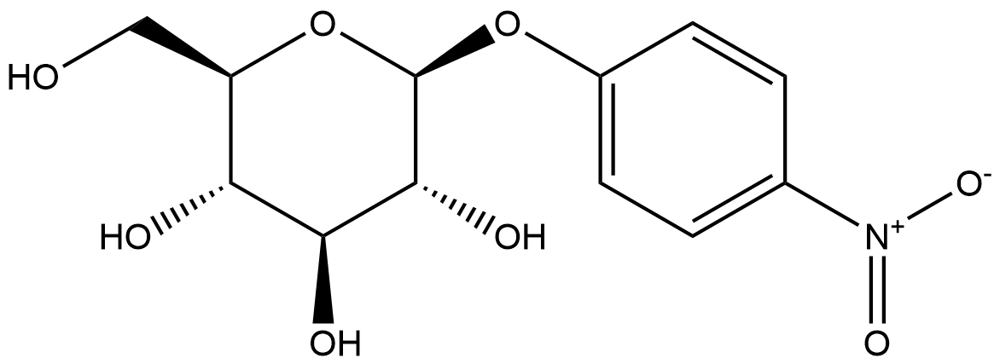
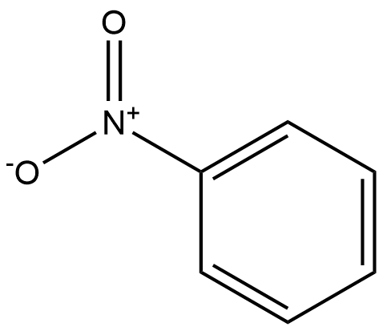
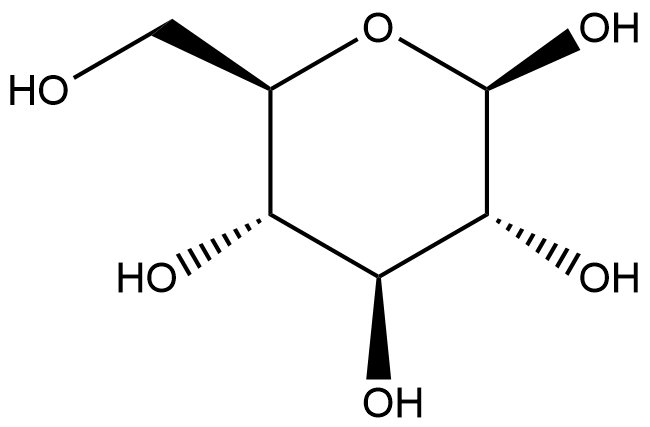

#  Hydrolysis Reactions (HRs) Family 3 / Subfamily 2

##  Literature Information

| Title    | Characterization and application of an acidophilic and thermostable β-glucosidase from Thermofilum pendens |
| :------- | :----------------------------------------------------------- |
| Author   | Dan Li, Xiaolei Li, Wei Dang, Phuong Lan Tran, Sung-Hoon Park, Byung-Chul Oh, Wan-Soo Hong, Jin-Sil Lee, Kwan-Hwa Park |
| DOI      | [10.1016/j.jbiosc.2012.11.009](https://doi.org/10.1016/j.jbiosc.2012.11.009) |
| Abstract | The gene encoding a β-glucosidase from the archaeon Thermofilum pendens (Tpbgl) was cloned and expressed in Escherichia coli. The purified recombinant enzyme had a molecular mass of 77.8 kDa and released glucose or mannose from p-nitrophenyl-β-d-glucopyranoside (pNPG), cellobiose, mannobiose, and genistin. Peak Tpbgl activity was detected at 90°C, and 50% activity remained after incubation for 60 min at 95°C. The optimal pH for pNPG hydrolysis was 3.5. When the enzyme was incubated with pNPG in the presence of ethanol and propanol, the glucose moiety was transferred to acceptor alcohols. Tpbgl is the archaeal β-glucosidase from glucoside hydrolase family 3 and found to be most heat stable under extremely acidic conditions (pH 3.5). The kinetic parameters revealed that Tpbgl had the highest catalytic efficiency toward pNPG (kcat/Km = 3.05) with strong substrate affinity for such natural substrates as cellobiose (Km = 0.149) and mannobiose (Km = 0.147). Genistin solubilized in 10-40% DMSO was hydrolyzed to genistein with nearly 99% conversion, indicating that high concentrations of the water-insoluble isoflavone glycoside can be treated by the enzyme. Our results indicate that Tpbgl has great potential in cellulose saccharification and the glucoside hydrolysis of natural compounds. |

##  Experimental results

- **Enzyme**

Uniprot ID: [A1S0B1](https://www.uniprot.org/uniprot/A1S0B1)

Protein:  Glycoside hydrolase, family 3 domain protein

Organism: *Thermofilum pendens (strain DSM 2475 / Hrk 5)*

Length: 701 AA

Taxonomic identifier: [368408](https://www.uniprot.org/taxonomy/368408) [[NCBI](https://www.ncbi.nlm.nih.gov/Taxonomy/Browser/wwwtax.cgi?lvl=0&id=368408)]

- **Pfam**

| Source | Domain          | Start | End  | E-value (Domain) | Coverage |
| ------ | --------------- | ----- | ---- | ---------------- | -------- |
| Pfam-A | Glyco_hydro_3_C | 312   | 578  | 3.2e-47          | 0.995    |
| Pfam-A | Fn3-like        | 611   | 682  | 4.2e-24          | 0.986    |
| Pfam-A | Glyco_hydro_3   | 32    | 279  | 1.3e-59          | 0.811    |

Program: `hmmscan`

Version: 3.1b2 (February 2015)

Method: `hmmscan --domtblout hmmscan.tbl --noali -E 1e-5 pfam query.fa `

Date: Mon Jul 20 14:32:16 2020

Description:

Glyco_hydro_3_C

[**Pfam**](https://pfam.xfam.org/family/Glyco_hydro_3_C)

This domain is involved in catalysis and may be involved in binding beta-glucan[^1]. This domain is found associated with [PF00933](https://pfam.xfam.org/family/PF00933).

[**InterPro**](http://www.ebi.ac.uk/interpro/entry/InterPro/IPR002772/)

Glycoside hydrolase family 3 [GH3](http://www.cazy.org/fam/GH3.html) comprises enzymes with a number of known activities; beta-glucosidase ([3.2.1.21](http://www.ebi.ac.uk/intenz/query?cmd=SearchEC&ec=3.2.1.21)); beta-xylosidase ([3.2.1.37](http://www.ebi.ac.uk/intenz/query?cmd=SearchEC&ec=3.2.1.37)); N-acetyl beta-glucosaminidase ([3.2.1.52](http://www.ebi.ac.uk/intenz/query?cmd=SearchEC&ec=3.2.1.52)); glucan beta-1,3-glucosidase ([3.2.1.58](http://www.ebi.ac.uk/intenz/query?cmd=SearchEC&ec=3.2.1.58)); cellodextrinase([3.2.1.74](http://www.ebi.ac.uk/intenz/query?cmd=SearchEC&ec=3.2.1.74)); exo-1,3-1,4-glucanase ([3.2.1](http://www.ebi.ac.uk/intenz/query?cmd=SearchEC&ec=3.2.1)).

These enzymes are two-domain globular proteins that are N-glycosylated at three sites[^1]. This entry represents the C-terminal domain, involved in catalysis and may be involved in binding beta-glucan[^1]. It is found associated with [PF00933](http://www.ebi.ac.uk/interpro/entry/pfam/PF00933/).

Fn3-like 

[**Pfam**](https://pfam.xfam.org/family/Fn3-like)

This domain has a fibronectin type III-like structure[^2]. It is often found in association with [PF00933](https://pfam.xfam.org/family/PF00933) and [PF01915](https://pfam.xfam.org/family/PF01915). Its function is unknown.

[**InterPro**](http://www.ebi.ac.uk/interpro/entry/InterPro/IPR026891/)

This domain has a fibronectin type III-like structure[^2]. It is often found in association with [PF00933](http://www.ebi.ac.uk/interpro/entry/pfam/PF00933/) and [PF01915](http://www.ebi.ac.uk/interpro/entry/pfam/PF01915/). Its function is unknown.

Glyco_hydro_3

[**Pfam**](https://pfam.xfam.org/family/Glyco_hydro_3)

No Pfam abstract.

[**InterPro**](http://www.ebi.ac.uk/interpro/entry/InterPro/IPR001764/)

O-Glycosyl hydrolases ([3.2.1.](http://www.ebi.ac.uk/intenz/query?cmd=SearchEC&ec=3.2.1.)) are a widespread group of enzymes that hydrolyse the glycosidic bond between two or more carbohydrates, or between a carbohydrate and a non-carbohydrate moiety. A classification system for glycosyl hydrolases, based on sequence similarity, has led to the definition of 85 different families[^3][^4]. This classification is available on the CAZy (CArbohydrate-Active EnZymes) website.

Glycoside hydrolase family 3 [GH3](http://www.cazy.org/fam/GH3.html) comprises enzymes with a number of known activities; beta-glucosidase ([3.2.1.21](http://www.ebi.ac.uk/intenz/query?cmd=SearchEC&ec=3.2.1.21)); beta-xylosidase ([3.2.1.37](http://www.ebi.ac.uk/intenz/query?cmd=SearchEC&ec=3.2.1.37)); N-acetyl beta-glucosaminidase ([3.2.1.52](http://www.ebi.ac.uk/intenz/query?cmd=SearchEC&ec=3.2.1.52)); glucan beta-1,3-glucosidase ([3.2.1.58](http://www.ebi.ac.uk/intenz/query?cmd=SearchEC&ec=3.2.1.58)); cellodextrinase ([3.2.1.74](http://www.ebi.ac.uk/intenz/query?cmd=SearchEC&ec=3.2.1.74)); exo-1,3-1,4-glucanase ([3.2.1](http://www.ebi.ac.uk/intenz/query?cmd=SearchEC&ec=3.2.1)). These enzymes are two-domain globular proteins that are N-glycosylated at three sites[^1]. This domain is often N-terminal to the glycoside hydrolase family 3, C-terminal domain [IPR002772](http://www.ebi.ac.uk/interpro/entry/InterPro/IPR002772/).

- **Reaction**

[p-nitrophenyl-β-D-glucopyranoside](https://pubchem.ncbi.nlm.nih.gov/compound/4-Nitrophenyl-beta-D-glucopyranoside) &rArr; [p-nitrophenyl](https://pubchem.ncbi.nlm.nih.gov/compound/p-nitrophenyl) + [β-D-Glucopyranose](https://pubchem.ncbi.nlm.nih.gov/compound/64689)

<figure>

  

    
  

  

    
  

  

    
  

  

    
  

  

    
  

</figure>

## References

[^1]:Varghese J N, Hrmova M, Fincher G B. Three-dimensional structure of a barley β-D-glucan exohydrolase, a family 3 glycosyl hydrolase[J]. Structure, 1999, 7(2): 179-190.
[^2]:Pozzo T, Pasten J L, Karlsson E N, et al. Structural and functional analyses of β-glucosidase 3B from Thermotoga neapolitana: a thermostable three-domain representative of glycoside hydrolase 3[J]. Journal of molecular biology, 2010, 397(3): 724-739.
[^3]:Henrissat B, Callebaut I, Fabrega S, et al. Conserved catalytic machinery and the prediction of a common fold for several families of glycosyl hydrolases[J]. Proceedings of the National Academy of Sciences, 1995, 92(15): 7090-7094.
[^4]:Davies G, Henrissat B. Structures and mechanisms of glycosyl hydrolases[J]. Structure, 1995, 3(9): 853-859.

