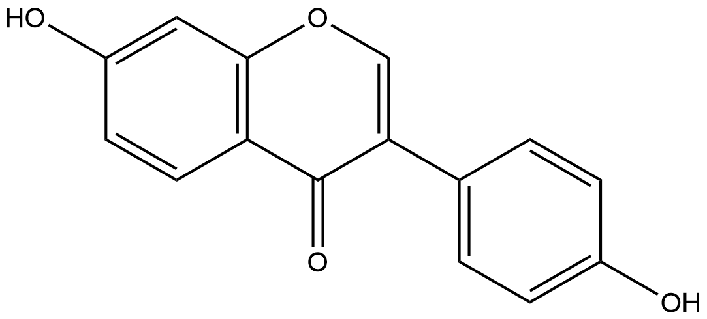

#  Hydrolysis Reactions (HRs) Family 4 / Subfamily 2

##  Literature Information

| Title    | Identification and functional expression of genes encoding flavonoid *O*‐ and *C*‐glycosidases in intestinal bacteria |
| :------- | :----------------------------------------------------------- |
| Author   | Annett Braune, Wolfram Engst, Michael Blaut                  |
| DOI      | [10.1111/1462-2920.12864](https://doi.org/10.1111/1462-2920.12864) |
| Abstract | Gut bacteria play a crucial role in the metabolism of dietary flavonoids and thereby influence the bioactivity of these compounds in the host. The intestinal *Lachnospiraceae* strain CG19‐1 and *Eubacterium cellulosolvens* are able to deglycosylate *C*‐ and *O*‐coupled flavonoid glucosides. Growth of strain CG19‐1 in the presence of the isoflavone *C*‐glucoside puerarin (daidzein 8‐*C*‐glucoside) led to the induction of two proteins (DfgC, DfgD). Heterologous expression of the encoding genes (*dfgC*, *dfgD*) in *Escherichia coli* revealed no *C*‐deglycosylating activity in the resulting cell extracts but cleavage of flavonoid *O*‐glucosides such as daidzin (daidzein 7‐*O*‐glucoside). The recombinant DfgC and DfgD proteins were purified and characterized with respect to their quaternary structure, substrate and cofactor specificity. The products of the corresponding genes (*dfgC*, *dfgD*) from *E. cellulosolvens* also catalysed the ==*O*‐deglycosylation of daidzin== following their expression in *E. coli*. In combination with three recombinant proteins encoded by adjacent genes in *E. cellulosolvens* (*dfgA*, *dfgB*, *dfgE*), DfgC and DfgD from *E. cellulosolvens* catalysed the deglycosylation of the flavone *C*‐glucosides homoorientin (luteolin 6‐*C*‐glucoside) and isovitexin (apigenin 6‐*C*‐glucoside). Even intact cells of *E**. coli* expressing the five *E. cellulosolvens* genes cleaved these flavone *C*‐glucosides and, also, flavonoid *O*‐glucosides to the corresponding aglycones. |

##  Experimental results

- **Enzyme**

Uniprot ID: [I5AX50](https://www.uniprot.org/uniprot/I5AX50)

Protein: Sugar phosphate isomerase/epimerase

Organism: *[Eubacterium] cellulosolvens 6*

Length: 290 AA

Taxonomic identifier: [633697](https://www.uniprot.org/taxonomy/633697) [[NCBI](https://www.ncbi.nlm.nih.gov/Taxonomy/Browser/wwwtax.cgi?lvl=0&id=633697)]

- **Pfam**

| Source | Domain       | Start | End  | E-value (Domain) | Coverage |
| ------ | ------------ | ----- | ---- | ---------------- | -------- |
| Pfam-A | AP_endonuc_2 | 32    | 189  | 1.6e-15          | 0.771    |

Program: `hmmscan`

Version: 3.1b2 (February 2015)

Method: `hmmscan --domtblout hmmscan.tbl --noali -E 1e-5 pfam query.fa `

Date: Mon Jul 20 14:32:16 2020

Description:

AP_endonuc_2

[**Pfam**](https://pfam.xfam.org/family/AP_endonuc_2)

This TIM alpha/beta barrel structure is found in xylose isomerase ([P19148](http://www.uniprot.org/entry/P19148)) and in endonuclease IV ([P12638](http://www.uniprot.org/entry/P12638) EC:3.1.21.2). This domain is also found in the N termini of bacterial myo-inositol catabolism proteins. These are involved in the myo-inositol catabolism pathway, and is required for growth on myo-inositol in Rhizobium leguminosarum bv. viciae[^1].

[**InterPro**](http://www.ebi.ac.uk/interpro/entry/InterPro/IPR013022/)

This entry represents a structural motif with a beta/alpha TIM barrel found in several proteins families:
&triangleright; Endonuclease IV ([3.1.21.2](http://www.ebi.ac.uk/intenz/query?cmd=SearchEC&ec=3.1.21.2)), an AP (apurinic/apyrimidinic) endonuclease that primes DNA repair synthesis by cleaving the DNA backbone 5' of AP sites[^2].
&triangleright; L-rhamnose isomerase ([5.3.1.14](http://www.ebi.ac.uk/intenz/query?cmd=SearchEC&ec=5.3.1.14)), a tetramer of four TIM barrels that catalyses the isomerisation between aldoses and ketoses, such as between L-rhamnose and L-rhamnulose[^3].
&triangleright; Xylose isomerase ([5.3.1.5](http://www.ebi.ac.uk/intenz/query?cmd=SearchEC&ec=5.3.1.5)), which catalyses the first reaction in the catabolism of D-xylose by converting D-xylose to D-xylulose[^4].
&triangleright; Mannonate dehydratase UxuA, which along with mannonate oxidoreductase converts D-fructuronate to 2-keto-3-deoxy-D-gluconate[^5].

These proteins share similar, but not identical, metal-binding sites. In addition, xylose isomerase and L-rhamnose isomerase each have additional alpha-helical domains involved in tetramer formation.

- **Reaction**

*Catalyse  reaction with expression of  [I5AX46](https://www.uniprot.org/uniprot/I5AX46)/[I5AX47](https://www.uniprot.org/uniprot/I5AX47)/[I5AX48](https://www.uniprot.org/uniprot/I5AX48)/[I5AX49](https://www.uniprot.org/uniprot/I5AX49)/[I5AX50](https://www.uniprot.org/uniprot/I5AX50) simultaneously*

[daidzin](https://pubchem.ncbi.nlm.nih.gov/compound/107971
) &rArr; [daidzein](https://pubchem.ncbi.nlm.nih.gov/compound/daidzein) + [glucose](https://pubchem.ncbi.nlm.nih.gov/compound/glucose)

<figure>

  

    
  

  

    
  

  

    
  

  

    
  

  

    
  

</figure>

## References

[^1]:Fry J, Wood M, Poole P S. Investigation of myo-inositol catabolism in Rhizobium leguminosarum bv. viciae and its effect on nodulation competitiveness[J]. Molecular plant-microbe interactions, 2001, 14(8): 1016-1025.

[^2]:Hosfield D J, Guan Y, Haas B J, et al. Structure of the DNA repair enzyme endonuclease IV and its DNA complex: double-nucleotide flipping at abasic sites and three-metal-ion catalysis[J]. Cell, 1999, 98(3): 397-408.
[^3]:Yoshida H, Yamada M, Ohyama Y, et al. The structures of L-rhamnose isomerase from Pseudomonas stutzeri in complexes with L-rhamnose and D-allose provide insights into broad substrate specificity[J]. Journal of molecular biology, 2007, 365(5): 1505-1516.
[^4]:Meilleur F, Snell E H, Van der Woerd M J, et al. A quasi-Laue neutron crystallographic study of D-xylose isomerase[J]. European Biophysics Journal, 2006, 35(7): 601-609.
[^5]:Robert-Baudouy J, Portalier R, Stoeber F. Regulation of hexuronate system genes in Escherichia coli K-12: multiple regulation of the uxu operon by exuR and uxuR gene products[J]. Journal of Bacteriology, 1981, 145(1): 211-220.