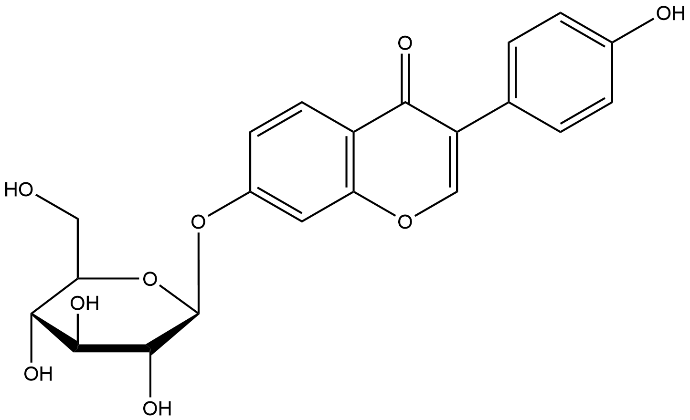
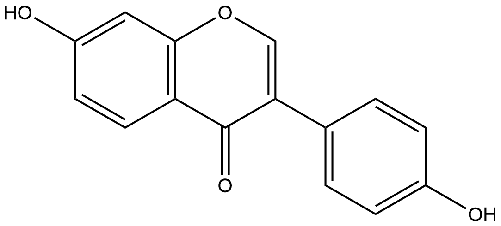
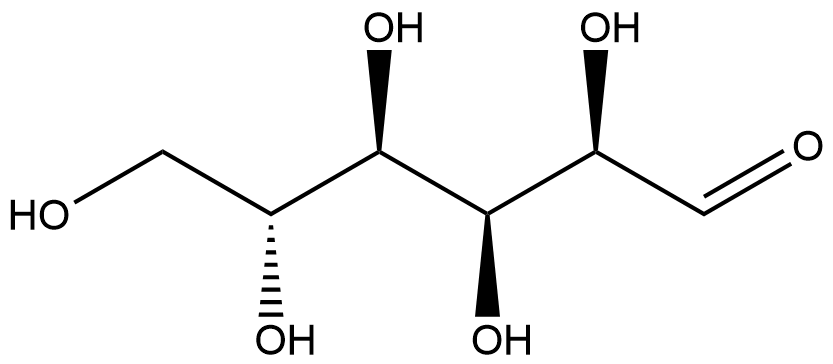

#  Hydrolysis Reactions (HRs) Family 5 / Subfamily 1

##  Literature Information

| Title    | Identification and functional expression of genes encoding flavonoid *O*‐ and *C*‐glycosidases in intestinal bacteria |
| :------- | :----------------------------------------------------------- |
| Author   | Annett Braune, Wolfram Engst, Michael Blaut                  |
| DOI      | [10.1111/1462-2920.12864](https://doi.org/10.1111/1462-2920.12864) |
| Abstract | Gut bacteria play a crucial role in the metabolism of dietary flavonoids and thereby influence the bioactivity of these compounds in the host. The intestinal *Lachnospiraceae* strain CG19‐1 and *Eubacterium cellulosolvens* are able to deglycosylate *C*‐ and *O*‐coupled flavonoid glucosides. Growth of strain CG19‐1 in the presence of the isoflavone *C*‐glucoside puerarin (daidzein 8‐*C*‐glucoside) led to the induction of two proteins (DfgC, DfgD). Heterologous expression of the encoding genes (*dfgC*, *dfgD*) in *Escherichia coli* revealed no *C*‐deglycosylating activity in the resulting cell extracts but cleavage of flavonoid *O*‐glucosides such as daidzin (daidzein 7‐*O*‐glucoside). The recombinant DfgC and DfgD proteins were purified and characterized with respect to their quaternary structure, substrate and cofactor specificity. The products of the corresponding genes (*dfgC*, *dfgD*) from *E. cellulosolvens* also catalysed the ==*O*‐deglycosylation of daidzin== following their expression in *E. coli*. In combination with three recombinant proteins encoded by adjacent genes in *E. cellulosolvens* (*dfgA*, *dfgB*, *dfgE*), DfgC and DfgD from *E.  cellulosolvens* catalysed the deglycosylation of the flavone *C*‐glucosides homoorientin (luteolin 6‐*C*‐glucoside) and isovitexin (apigenin 6‐*C*‐glucoside). Even intact cells of *E. coli* expressing the five *E. cellulosolvens* genes cleaved these flavone *C*‐glucosides and, also, flavonoid *O*‐glucosides to the corresponding aglycones. |

##  Experimental results

- **Enzyme**

Uniprot ID: [I5AX46](https://www.uniprot.org/uniprot/I5AX46)

Protein: Putative dehydrogenase

Organism: *[Eubacterium] cellulosolvens 6*

Length: 357 AA

Taxonomic identifier: [633697](https://www.uniprot.org/taxonomy/633697) [[NCBI](https://www.ncbi.nlm.nih.gov/Taxonomy/Browser/wwwtax.cgi?lvl=0&id=633697)]

- **Pfam**

| Source | Domain       | Start | End  | E-value (Domain) | Coverage |
| ------ | ------------ | ----- | ---- | ---------------- | -------- |
| Pfam-A | GFO_IDH_MocA | 5     | 119  | 3.8e-26          | 0.975    |

Program: `hmmscan`

Version: 3.1b2 (February 2015)

Method: `hmmscan --domtblout hmmscan.tbl --noali -E 1e-5 pfam query.fa `

Date: Mon Jul 20 14:32:16 2020

Description:

GFO_IDH_MocA

[**Pfam**](https://pfam.xfam.org/family/GFO_IDH_MocA)

This family of enzymes utilise NADP or NAD. This family is called the GFO/IDH/MOCA family in swiss-prot.

[**InterPro**](http://www.ebi.ac.uk/interpro/entry/InterPro/IPR000683/)

This group of enzymes utilise NADP or NAD, and is known as the GFO/IDH/MOCA family in UniProtKB/Swiss-Prot. GFO is a glucose--fructose oxidoreductase, which converts D-glucose and D-fructose into D-gluconolactone and D-glucitol in the sorbitol-gluconate pathway. MOCA is a rhizopine catabolism protein which may catalyse the NADH-dependent dehydrogenase reaction involved in rhizopine catabolism. Other proteins belonging to this family include Gal80, a negative regulator for the expression of lactose and galactose metabolic genes; and several hypothetical proteins from yeast, Escherichia coli and Bacillus subtilis.

The oxidoreductase, N-terminal domain is almost always associated with the oxidoreductase, C-terminal domain (see [IPR004104](http://www.ebi.ac.uk/interpro/entry/InterPro/IPR004104/)).

- **Reaction**

*Catalyse  reaction with expression of  [I5AX46](https://www.uniprot.org/uniprot/I5AX46)/[I5AX47](https://www.uniprot.org/uniprot/I5AX47)/[I5AX48](https://www.uniprot.org/uniprot/I5AX48)/[I5AX49](https://www.uniprot.org/uniprot/I5AX49)/[I5AX50](https://www.uniprot.org/uniprot/I5AX50) simultaneously*

[daidzin](https://pubchem.ncbi.nlm.nih.gov/compound/107971
) &rArr; [daidzein](https://pubchem.ncbi.nlm.nih.gov/compound/daidzein) + [glucose](https://pubchem.ncbi.nlm.nih.gov/compound/glucose)

<figure>

  

    
  

  

    
  

  

    
  

  

    
  

  

    
  

</figure>

## References