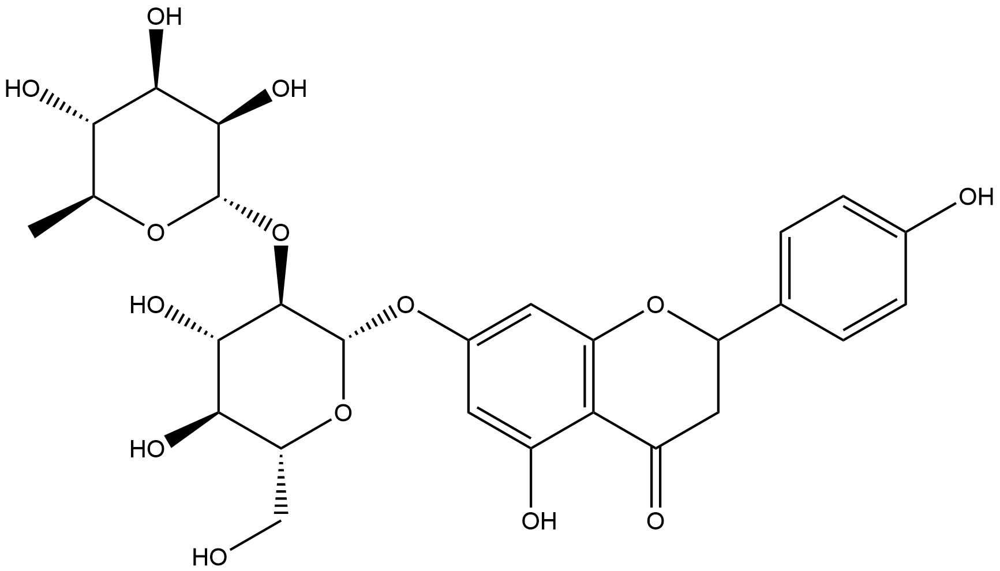
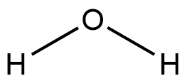
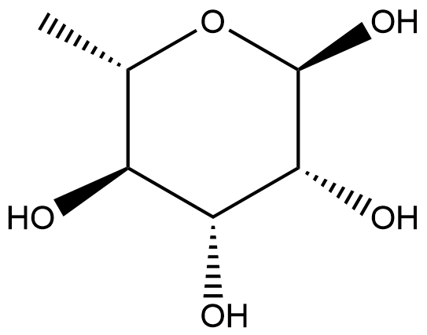
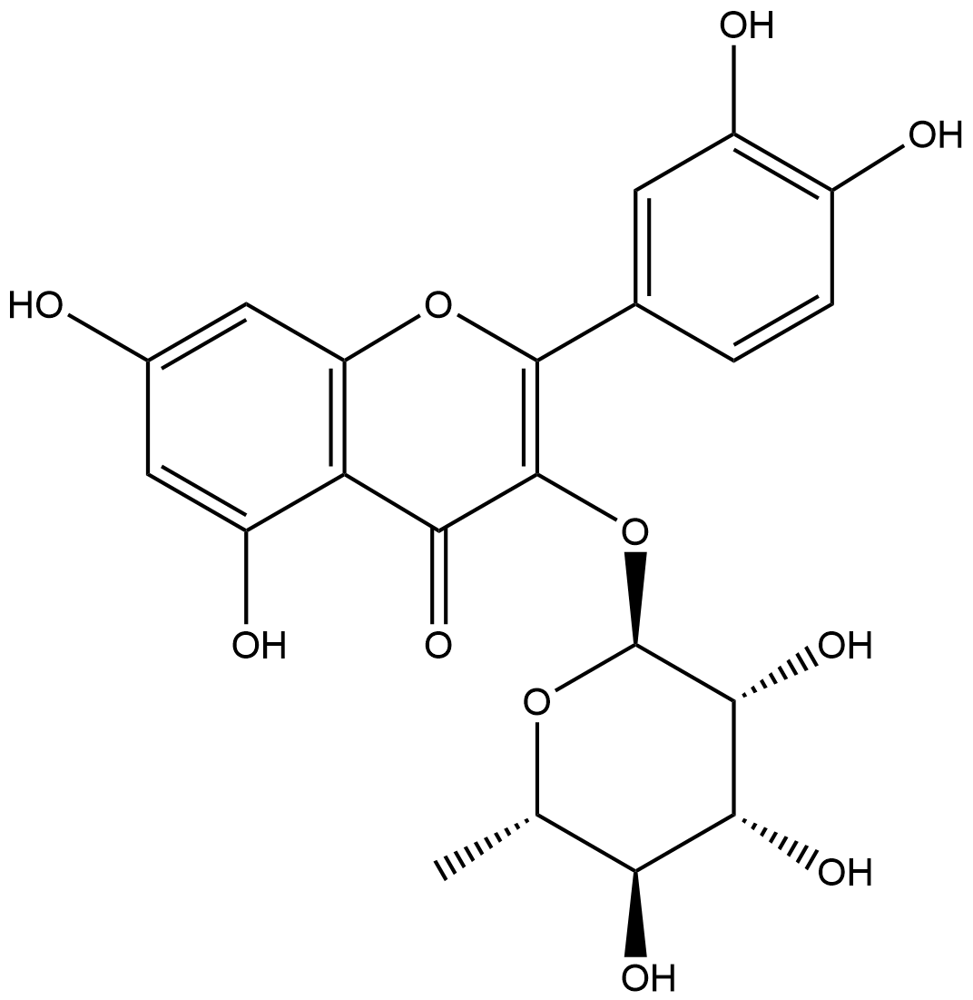
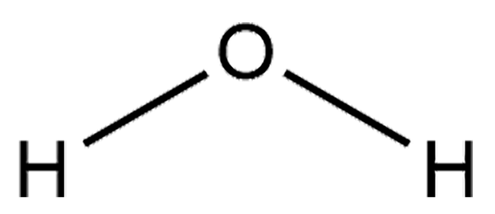
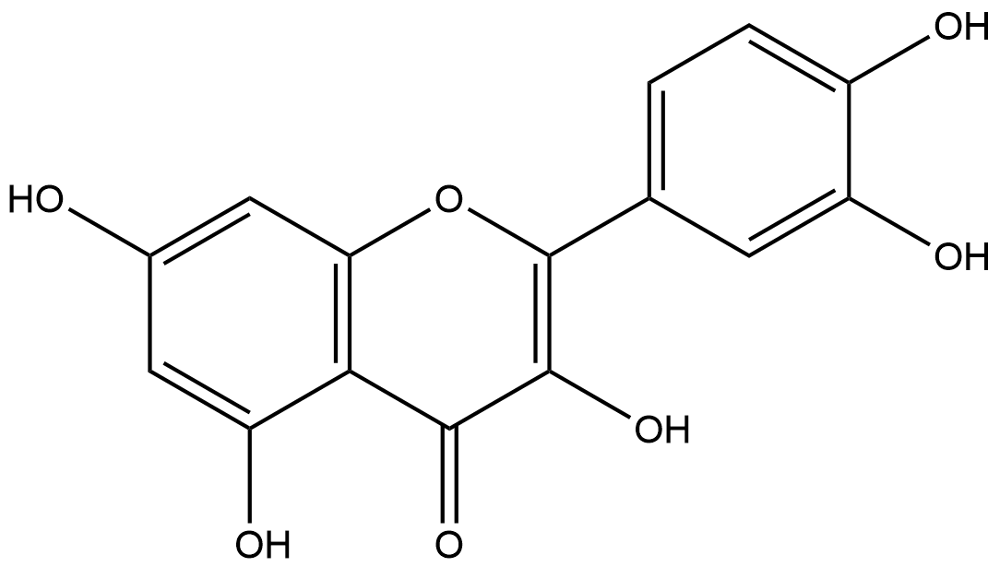

#  Hydrolysis Reactions (HRs) Family 6

<!--[TOC]在这里不可以用-->

<ul id="myTab" class="nav nav-tabs">
  <!-- active 指的是默认页 -->
  <li class="active">
    <!-- herf中名字于下文id对应 -->
    <!-- 这里只改herf和tab1 -->
    <a href="#tab1" data-toggle="tab">F6IEX3</a>
  </li>
  <li><a href="#tab2" data-toggle="tab">Q76LC4</a></li>
</ul>

  <!-- 此处的id与上文herf对应 其他的不要改-->
  

##  Literature Information

| Title    | Structural and functional insights into RHA-P, a bacterial GH106 α-L-rhamnosidase from Novosphingobium sp. PP1Y |
| :------- | :----------------------------------------------------------- |
| Author   | Francesca Mensitieri , Federica De Lise, Andrea Strazzulli, Marco Moracci, Eugenio Notomista , Valeria Cafaro, Emiliano Bedini, Matthew Howard Sazinsky, Marco Trifuoggi, Alberto Di Donato, Viviana Izzo |
| DOI      | [10.1016/j.abb.2018.04.013](https://doi.org/10.1016/j.abb.2018.04.013) |
| Abstract | α-L-Rhamnosidases (α-RHAs, EC 3.2.1.40) are glycosyl hydrolases (GHs) hydrolyzing terminal α-l-rhamnose residues from different substrates such as heteropolysaccharides, glycosylated proteins and natural flavonoids. Although the possibility to hydrolyze rhamnose from natural flavonoids has boosted the use of these enzymes in several biotechnological applications over the past decades, to date only few bacterial rhamnosidases have been fully characterized and only one crystal structure of a rhamnosidase of the GH106 family has been described. In our previous work, an α-l-rhamnosidase belonging to this family, named RHA-P, was isolated from the marine microorganism Novosphingobium sp. PP1Y. The initial biochemical characterization highlighted the biotechnological potential of RHA-P for bioconversion applications. In this work, further functional and structural characterization of the enzyme is provided. The recombinant protein was obtained fused to a C-terminal His-tag and, starting from the periplasmic fractions of induced recombinant cells of E. coli strain BL21(DE3), was purified through a single step purification protocol. Homology modeling of RHA-P in combination with a site directed mutagenesis analysis confirmed the function of residues D503, E506, E644, likely located at the catalytic site of RHA-P. In addition, a kinetic characterization of the enzyme on natural flavonoids such as naringin, rutin, hesperidin and quercitrin was performed. RHA-P showed activity on all flavonoids tested, with a catalytic efficiency comparable or even higher than other bacterial α-RHAs described in literature. The results confirm that RHA-P is able to hydrolyze both α-1,2 and α-1,6 glycosidic linkages, and suggest that the enzyme may locate different polyphenolic aromatic moities in the active site. |

##  Experimental results

- **Enzyme**

Uniprot ID: [F6IEX3](https://www.uniprot.org/uniprot/F6IEX3)

Protein: Glycoside hydrolase family protein

Organism: *Novosphingobium sp. PP1Y*

Length: 1,146 AA

Taxonomic identifier: [702113](https://www.uniprot.org/taxonomy/702113) [[NCBI](https://www.ncbi.nlm.nih.gov/Taxonomy/Browser/wwwtax.cgi?lvl=0&id=702113)]

- **Pfam**

| Source | Domain          | Start | End  | E-value (Domain) | Coverage |
| ------ | --------------- | ----- | ---- | ---------------- | -------- |
| Pfam-A | Glyco_hydro_106 | 47    | 945  | 0                | 0.999    |

Program: `hmmscan`

Version: 3.1b2 (February 2015)

Method: `hmmscan --domtblout hmmscan.tbl --noali -E 1e-5 pfam query.fa `

Date: Mon Jul 20 14:32:16 2020

Description:

Glyco_hydro_106

[**Pfam**](https://pfam.xfam.org/family/Glyco_hydro_106)

No Pfam abstract.

[**InterPro**](http://www.ebi.ac.uk/interpro/)

No InterPro results.

- **Reaction**

[naringin](https://pubchem.ncbi.nlm.nih.gov/compound/naringin) + [H2O](https://pubchem.ncbi.nlm.nih.gov/compound/Water) &rArr; [naringenin](https://pubchem.ncbi.nlm.nih.gov/compound/naringenin) + [L-rhamnose](https://pubchem.ncbi.nlm.nih.gov/compound/L-rhamnose)

<figure>

  

    
  

  

    
  

  

    
  

  

    
  

  

    
  

  

    
  

  

    
  

</figure>

## References

  

  

##  Literature Information

| Title    | Structural and functional insights into RHA-P, a bacterial GH106 α-L-rhamnosidase from Novosphingobium sp. PP1Y |
| :------- | :----------------------------------------------------------- |
| Author   | Francesca Mensitieri , Federica De Lise, Andrea Strazzulli, Marco Moracci, Eugenio Notomista , Valeria Cafaro, Emiliano Bedini, Matthew Howard Sazinsky, Marco Trifuoggi, Alberto Di Donato, Viviana Izzo |
| DOI      | [10.1016/j.abb.2018.04.013](https://doi.org/10.1016/j.abb.2018.04.013) |
| Abstract | α-L-Rhamnosidases (α-RHAs, EC 3.2.1.40) are glycosyl hydrolases (GHs) hydrolyzing terminal α-l-rhamnose residues from different substrates such as heteropolysaccharides, glycosylated proteins and natural flavonoids. Although the possibility to hydrolyze rhamnose from natural flavonoids has boosted the use of these enzymes in several biotechnological applications over the past decades, to date only few bacterial rhamnosidases have been fully characterized and only one crystal structure of a rhamnosidase of the GH106 family has been described. In our previous work, an α-l-rhamnosidase belonging to this family, named RHA-P, was isolated from the marine microorganism Novosphingobium sp. PP1Y. The initial biochemical characterization highlighted the biotechnological potential of RHA-P for bioconversion applications. In this work, further functional and structural characterization of the enzyme is provided. The recombinant protein was obtained fused to a C-terminal His-tag and, starting from the periplasmic fractions of induced recombinant cells of E. coli strain BL21(DE3), was purified through a single step purification protocol. Homology modeling of RHA-P in combination with a site directed mutagenesis analysis confirmed the function of residues D503, E506, E644, likely located at the catalytic site of RHA-P. In addition, a kinetic characterization of the enzyme on natural flavonoids such as naringin, rutin, hesperidin and quercitrin was performed. RHA-P showed activity on all flavonoids tested, with a catalytic efficiency comparable or even higher than other bacterial α-RHAs described in literature. The results confirm that RHA-P is able to hydrolyze both α-1,2 and α-1,6 glycosidic linkages, and suggest that the enzyme may locate different polyphenolic aromatic moities in the active site. |

##  Experimental results

- **Enzyme**

Uniprot ID: [Q76LC4](https://www.uniprot.org/uniprot/Q76LC4)

Protein: Alpha-L-rhamnosidase

Organism: *Sphingomonas paucimobilis (Pseudomonas paucimobilis)*

Length: 1,117 AA

Taxonomic identifier: [13689](https://www.uniprot.org/taxonomy/13689) [[NCBI](https://www.ncbi.nlm.nih.gov/Taxonomy/Browser/wwwtax.cgi?lvl=0&id=13689)]

- **Pfam**

| Source | Domain          | Start | End  | E-value (Domain) | Coverage |
| ------ | --------------- | ----- | ---- | ---------------- | -------- |
| Pfam-A | Glyco_hydro_106 | 33    | 916  | 0                | 0.996    |

Program: `hmmscan`

Version: 3.1b2 (February 2015)

Method: `hmmscan --domtblout hmmscan.tbl --noali -E 1e-5 pfam query.fa `

Date: Mon Jul 20 14:32:16 2020

Description:

Glyco_hydro_106

[**Pfam**](https://pfam.xfam.org/family/Glyco_hydro_106)

No Pfam abstract.

[**InterPro**](http://www.ebi.ac.uk/interpro/)

No InterPro results.

- **Reaction**

[quercitrin](https://pubchem.ncbi.nlm.nih.gov/compound/quercitrin) + [H2O](https://pubchem.ncbi.nlm.nih.gov/compound/Water) &rArr; [L-rhamnose](https://pubchem.ncbi.nlm.nih.gov/compound/L-rhamnose) + [quercetin](https://pubchem.ncbi.nlm.nih.gov/compound/quercetin)

<figure>

  

    
  

  

    
  

  

    
  

  

    
  

  

    
  

  

    
  

  

    
  

</figure>

## References

  

