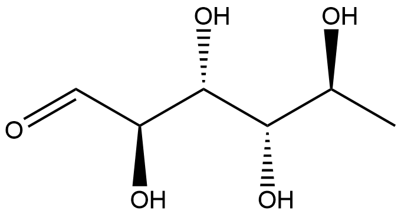

# Hydrolysis Reactions (HRs) Family 7 / Subfamily 1

<!--[TOC]在这里不可以用-->

<ul id="myTab" class="nav nav-tabs">
  <!-- active 指的是默认页 -->
  <li class="active">
    <!-- herf中名字于下文id对应 -->
    <!-- 这里只改herf和tab1 -->
    <a href="#tab1" data-toggle="tab">Q6RCI9</a>
  </li>
  <li><a href="#tab2" data-toggle="tab">Q9S3L0</a></li>
  <li><a href="#tab3" data-toggle="tab">X2CNV1</a></li>
</ul>

  <!-- 此处的id与上文herf对应 其他的不要改-->
  

<h2>Literature Information</h2>
<table>
<thead>
<tr>
<th style="text-align:left">Title</th>
<th style="text-align:left">Two new thermostable α-l-rhamnosidases from a novel thermophilic bacterium</th>
</tr>
</thead>
<tbody>
<tr>
<td style="text-align:left">Author</td>
<td style="text-align:left">Hákon Birgisson, Gudmundur O. Hreggvidsson, Olafur H. Fridjónsson , Andrew Mort, Jakob K. Kristjánsson, Bo Mattiasson</td>
</tr>
<tr>
<td style="text-align:left">DOI</td>
<td style="text-align:left"><a href="https://doi.org/10.1016/j.enzmictec.2003.12.012">10.1016/j.enzmictec.2003.12.012</a></td>
</tr>
<tr>
<td style="text-align:left">Abstract</td>
<td style="text-align:left">Two new thermostable α-l-rhamnosidases with novel substrate <a href="https://www.sciencedirect.com/topics/biochemistry-genetics-and-molecular-biology/enzymatic-hydrolysis">hydrolysis</a> pattern were cloned and expressed from a new <a href="https://www.sciencedirect.com/topics/biochemistry-genetics-and-molecular-biology/thermophilic-bacterium">thermophilic bacterium</a>. Fragments of the two α-l-rhamnosidase genes, <em>rhmA</em> and <em>rhmB</em> were identified in a partially <a href="https://www.sciencedirect.com/topics/immunology-and-microbiology/sequenced-genomes">sequenced genome</a> of the bacterium. Whole genes were recovered by amplifying <a href="https://www.sciencedirect.com/topics/biochemistry-genetics-and-molecular-biology/dna-flanking-region">flanking sequences</a> with single specific primers and nonspecific <a href="https://www.sciencedirect.com/topics/biochemistry-genetics-and-molecular-biology/primer-walking">walking primers</a>. The recovered genes were then cloned into <em>Escherichia coli</em> and their enzymes produced and purified. Both enzymes were <a href="https://www.sciencedirect.com/topics/chemical-engineering/dimer">dimers</a> and the MW of the <a href="https://www.sciencedirect.com/topics/chemical-engineering/monomer">monomers</a>, were 104 and 107 kDa for RhmA and RhmB, respectively. Both rhamnosidases had a temperature optimum at 70 °C. RhmA had pH optimum at 7.9 and RhmB had a broad pH optimum of 5.0 to 6.9 and RhmA had over 50% activity in the pH interval 5.0 to 8.7 and RhmB in the pH interval 4.0 to 7.9. Both enzymes had over 20% residual activity after 24-h incubation at 60 °C. RhmA and RhmB had <em>K</em>m values of 0.46 and 0.66 mM and <em>V</em>max values of 134 and 352 U mg−1 respectively, on <em>p</em>-nitrophenyl-α-l-rhamnopyranoside. Both rhamnosidases were active on both α-1,2- and α-1,6-linkages to beta-d-glucoside.</td>
</tr>
</tbody>
</table>
<h2>Experimental results</h2>
<ul>
<li><strong>Enzyme</strong></li>
</ul>

Uniprot ID: <a href="https://www.uniprot.org/uniprot/Q6RCI9">Q6RCI9</a>

Protein: Alpha-L-rhamnosidase

Organism: <em>Thermomicrobia bacterium PRI-1686</em>

Length: 932 AA

Taxonomic identifier: <a href="https://www.uniprot.org/taxonomy/260956">260956</a> [<a href="https://www.ncbi.nlm.nih.gov/Taxonomy/Browser/wwwtax.cgi?lvl=0&amp;id=260956">NCBI</a>]

<ul>
<li><strong>Pfam</strong></li>
</ul>
<table>
<thead>
<tr>
<th>Source</th>
<th>Domain</th>
<th>Start</th>
<th>End</th>
<th>E-value (Domain)</th>
<th>Coverage</th>
</tr>
</thead>
<tbody>
<tr>
<td>Pfam-A</td>
<td>Bac_rhamnosid6H</td>
<td>425</td>
<td>771</td>
<td>1.2e-125</td>
<td>0.994</td>
</tr>
</tbody>
</table>

Program: <code>hmmscan</code>

Version: 3.1b2 (February 2015)

Method: <code>hmmscan --domtblout hmmscan.tbl --noali -E 1e-5 pfam query.fa </code>

Date: Mon Jul 20 14:32:16 2020

Description:

Bac_rhamnosid6H

<a href="https://pfam.xfam.org/family/Bac_rhamnosid6H"><strong>Pfam</strong></a>

This family consists of bacterial rhamnosidase A and B enzymes. L-Rhamnose is abundant in biomass as a common constituent of glycolipids and glycosides, such as plant pigments, pectic polysaccharides, gums or biosurfactants. Some rhamnosides are important bioactive compounds. For example, terpenyl glycosides, the glycosidic precursor of aromatic terpenoids, act as important flavouring substances in grapes. Other rhamnosides act as cytotoxic rhamnosylated terpenoids, as signal substances in plants or play a role in the antigenicity of pathogenic bacteria<a href="#fn1" id="fnref1">[1]</a>.

<a href="http://www.ebi.ac.uk/interpro/entry/InterPro/IPR035396/"><strong>InterPro</strong></a>

The six-hairpin glycoside transferase domain contains up to seven alpha-hairpins arranged in closed circular array. Proteins containing this domain include bacterial rhamnosidase A and B enzymes. L-Rhamnose is abundant in biomass as a common constituent of glycolipids and glycosides, such as plant pigments, pectic polysaccharides, gums or biosurfactants. Some rhamnosides are important bioactive compounds. For example, terpenyl glycosides, the glycosidic precursor of aromatic terpenoids, act as important flavouring substances in grapes. Other rhamnosides act as cytotoxic rhamnosylated terpenoids, as signal substances in plants or play a role in the antigenicity of pathogenic bacteria<a href="#fn1" id="fnref1:1">[1:1]</a>.

<em>Information is taken from Pfam and InterPro web site.</em>

<ul>
<li><strong>Reaction</strong></li>
</ul>

<a href="https://pubchem.ncbi.nlm.nih.gov/compound/4-Nitrophenyl-beta-D-glucopyranoside">p-nitrophenyl-α-L-rhamnopyranoside</a> + <a href="https://pubchem.ncbi.nlm.nih.gov/compound/Water">H2O</a> ⇒ <a href="https://pubchem.ncbi.nlm.nih.gov/compound/L-rhamnose">L-rhamnose</a> + <a href="https://pubchem.ncbi.nlm.nih.gov/compound/p-nitrophenyl">p-nitrophenyl</a>

<figure>

  

    
  

  

    
  

  

    
  

  

    
  

  

    
  

  

    
  

  

    
  

</figure>
<h2>References</h2>
<section class="footnotes">
<ol class="footnotes-list">
<li id="fn1" class="footnote-item">
Zverlov V V, Hertel C, Bronnenmeier K, et al. The thermostable α‐L‐rhamnosidase RamA of Clostridium stercorarium: biochemical characterization and primary structure of a bacterial α‐L‐rhamnoside hydrolase, a new type of inverting glycoside hydrolase[J]. Molecular microbiology, 2000, 35(1): 173-179. <a href="#fnref1" class="footnote-backref">↩︎</a> <a href="#fnref1:1" class="footnote-backref">↩︎</a>

</li>
</ol>
</section>

  

  

<h2>Literature Information</h2>
<table>
<thead>
<tr>
<th style="text-align:left">Title</th>
<th style="text-align:left">The thermostable alpha-L-rhamnosidase RamA of Clostridium stercorarium: biochemical characterization and primary structure of a bacterial alpha-L-rhamnoside hydrolase, a new type of inverting glycoside hydrolase</th>
</tr>
</thead>
<tbody>
<tr>
<td style="text-align:left">Author</td>
<td style="text-align:left">V V Zverlov, C Hertel, K Bronnenmeier, A Hroch, J Kellermann, W H Schwarz</td>
</tr>
<tr>
<td style="text-align:left">DOI</td>
<td style="text-align:left"><a href="https://doi.org/10.1046/j.1365-2958.2000.01691.x">10.1046/j.1365-2958.2000.01691.x</a></td>
</tr>
<tr>
<td style="text-align:left">Abstract</td>
<td style="text-align:left">An alpha-L-rhamnosidase clone was isolated from a genomic library of the thermophilic anaerobic bacterium Clostridium stercorarium and its primary structure was determined. The recombinant gene product, RamA, was expressed in Escherichia coli, purified to homogeneity and characterized. It is a dimer of two identical subunits with a monomeric molecular mass of 95 kDa in SDS polyacrylamide gel electrophoresis. At pH 7.5 it is optimally active at 60 degrees C and insensitive to moderate concentrations of Triton X100, ethanol and EDTA. It hydrolysed p-nitrophenyl-alpha-L-rhamnopyranoside, naringin and hesperidin with a specific activity of 82, 1.5 and 0.46 U mg-1 respectively. Hydrolysis occurs by inversion of the anomeric configuration as detected using 1H-NMR, indicating a single displacement mechanism. Naringin was hydrolysed to rhamnose and prunin, which could further be degraded by incubation with a thermostable beta-glucosidase. The secondary structure of RamA consists of 27% alpha-helices and 50% beta-sheets, as detected by circular dichroism. The primary structure of the ramA gene has no similarity to other glycoside hydrolase sequences and possibly is the first member of a new enzyme family.</td>
</tr>
</tbody>
</table>
<h2>Experimental results</h2>
<ul>
<li><strong>Enzyme</strong></li>
</ul>

Uniprot ID: <a href="https://www.uniprot.org/uniprot/Q9S3L0">Q9S3L0</a>

Protein: Alpha-L-rhamnosidase

Organism: <em>Thermoclostridium stercorarium (Clostridium stercorarium)</em>

Length: 874 AA

Taxonomic identifier: <a href="https://www.uniprot.org/taxonomy/1510">1510</a> [<a href="https://www.ncbi.nlm.nih.gov/Taxonomy/Browser/wwwtax.cgi?lvl=0&amp;id=1510">NCBI</a>]

<ul>
<li><strong>Pfam</strong></li>
</ul>
<table>
<thead>
<tr>
<th>Source</th>
<th>Domain</th>
<th>Start</th>
<th>End</th>
<th>E-value (Domain)</th>
<th>Coverage</th>
</tr>
</thead>
<tbody>
<tr>
<td>Pfam-A</td>
<td>Bac_rhamnosid6H</td>
<td>407</td>
<td>755</td>
<td>5.9e-128</td>
<td>0.994</td>
</tr>
</tbody>
</table>

Program: <code>hmmscan</code>

Version: 3.1b2 (February 2015)

Method: <code>hmmscan --domtblout hmmscan.tbl --noali -E 1e-5 pfam query.fa </code>

Date: Mon Jul 20 14:32:16 2020

Description:

Bac_rhamnosid6H

<a href="https://pfam.xfam.org/family/Bac_rhamnosid6H"><strong>Pfam</strong></a>

This family consists of bacterial rhamnosidase A and B enzymes. L-Rhamnose is abundant in biomass as a common constituent of glycolipids and glycosides, such as plant pigments, pectic polysaccharides, gums or biosurfactants. Some rhamnosides are important bioactive compounds. For example, terpenyl glycosides, the glycosidic precursor of aromatic terpenoids, act as important flavouring substances in grapes. Other rhamnosides act as cytotoxic rhamnosylated terpenoids, as signal substances in plants or play a role in the antigenicity of pathogenic bacteria<a href="#fn1" id="fnref1">[1]</a>.

<a href="http://www.ebi.ac.uk/interpro/entry/InterPro/IPR035396/"><strong>InterPro</strong></a>

The six-hairpin glycoside transferase domain contains up to seven alpha-hairpins arranged in closed circular array. Proteins containing this domain include bacterial rhamnosidase A and B enzymes. L-Rhamnose is abundant in biomass as a common constituent of glycolipids and glycosides, such as plant pigments, pectic polysaccharides, gums or biosurfactants. Some rhamnosides are important bioactive compounds. For example, terpenyl glycosides, the glycosidic precursor of aromatic terpenoids, act as important flavouring substances in grapes. Other rhamnosides act as cytotoxic rhamnosylated terpenoids, as signal substances in plants or play a role in the antigenicity of pathogenic bacteria<a href="#fn1" id="fnref1:1">[1:1]</a>.

<em>Information is taken from Pfam and InterPro web site.</em>

<ul>
<li><strong>Reaction</strong></li>
</ul>

<a href="https://pubchem.ncbi.nlm.nih.gov/compound/4-Nitrophenyl-beta-D-glucopyranoside">p-nitrophenyl-α-L-rhamnopyranoside</a> + <a href="https://pubchem.ncbi.nlm.nih.gov/compound/Water">H2O</a> ⇒ <a href="https://pubchem.ncbi.nlm.nih.gov/compound/L-rhamnose">L-rhamnose</a> + <a href="https://pubchem.ncbi.nlm.nih.gov/compound/p-nitrophenyl">p-nitrophenyl</a>

<figure>

  

    
  

  

    
  

  

    
  

  

    
  

  

    
  

  

    
  

  

    
  

</figure>
<h2>References</h2>
<section class="footnotes">
<ol class="footnotes-list">
<li id="fn1" class="footnote-item">
Zverlov V V, Hertel C, Bronnenmeier K, et al. The thermostable α‐L‐rhamnosidase RamA of Clostridium stercorarium: biochemical characterization and primary structure of a bacterial α‐L‐rhamnoside hydrolase, a new type of inverting glycoside hydrolase[J]. Molecular microbiology, 2000, 35(1): 173-179. <a href="#fnref1" class="footnote-backref">↩︎</a> <a href="#fnref1:1" class="footnote-backref">↩︎</a>

</li>
</ol>
</section>
  

  

<h2>Literature Information</h2>
<table>
<thead>
<tr>
<th style="text-align:left">Title</th>
<th style="text-align:left">Metabolism of Rutin and Poncirin by Human Intestinal Microbiota and Cloning of Their Metabolizing α-L-Rhamnosidase from Bifidobacterium dentium</th>
</tr>
</thead>
<tbody>
<tr>
<td style="text-align:left">Author</td>
<td style="text-align:left">Seo-Hyeon Bang , Yang-Jin Hyun, Juwon Shim, Sung-Woon Hong and Dong-Hyun Kim</td>
</tr>
<tr>
<td style="text-align:left">DOI</td>
<td style="text-align:left"><a href="https://doi.org/10.4014/jmb.1404.04060">10.4014/jmb.1404.04060</a></td>
</tr>
<tr>
<td style="text-align:left">Abstract</td>
<td style="text-align:left">To understand the metabolism of flavonoid rhamnoglycosides by human intestinal microbiota, we measured the metabolic activity of rutin and poncirin (distributed in many functional foods and herbal medicine) by 100 human stool specimens. The average α-Lrhamnosidase activities on the p-nitrophenyl-α-L-rhamnopyranoside, rutin, and poncirin subtrates were 0.10 ± 0.07, 0.25 ± 0.08, and 0.15 ± 0.09 pmol/min/mg, respectively. To investigate the enzymatic properties, α-L-rhamnosidase-producing bacteria were isolated from the specimens, and the α-L-rhamnosidase gene was cloned from a selected organism, Bifidobacterium dentium, and expressed in E. coli. The cloned α-L-rhamnosidase gene contained a 2,673 bp sequcence encoding 890 amino acid residues. The cloned gene was expressed using the pET 26b(+) vector in E. coli BL21, and the expressed enzyme was purified using Ni2+-NTA and Q-HP column chromatography. The specific activity of the purified α-L-rhamnosidase was 23.3 μmol/min/mg. Of the tested natural product constituents, the cloned α-L-rhamnosidase hydrolyzed <mark>rutin</mark> most potently, followed by <mark>poncirin</mark>, <mark>naringin</mark>, and <mark>ginsenoside Re</mark>. However, it was unable to hydrolyze quercitrin. This is the first report describing the cloning, expression, and characterization of α-L-rhamnosidase, a flavonoid rhamnoglycosidemetabolizing enzyme, from bifidobacteria. Based on these findings, the α-L-rhamnosidase of intestinal bacteria such as <em>B. dentium</em> seem to be more effective in hydrolyzing (1→6) bonds than (1→2) bonds of rhamnoglycosides, and may play an important role in the metabolism and pharmacological effect of rhamnoglycosides.</td>
</tr>
</tbody>
</table>
<h2>Experimental results</h2>
<ul>
<li><strong>Enzyme</strong></li>
</ul>

Uniprot ID: <a href="https://www.uniprot.org/uniprot/X2CNV1">X2CNV1</a>

Protein: Alpha-L-rhamnosidase

Organism: <em>Bifidobacterium dentium</em>

Length: 890 AA

Taxonomic identifier: <a href="https://www.uniprot.org/taxonomy/1689">1689</a> [<a href="https://www.ncbi.nlm.nih.gov/Taxonomy/Browser/wwwtax.cgi?lvl=0&amp;id=1689">NCBI</a>]

<ul>
<li><strong>Pfam</strong></li>
</ul>
<table>
<thead>
<tr>
<th>Source</th>
<th>Domain</th>
<th>Start</th>
<th>End</th>
<th>E-value (Domain)</th>
<th>Coverage</th>
</tr>
</thead>
<tbody>
<tr>
<td>Pfam-A</td>
<td>Bac_rhamnosid6H</td>
<td>452</td>
<td>807</td>
<td>1.4e-111</td>
<td>0.994</td>
</tr>
</tbody>
</table>

Program: <code>hmmscan</code>

Version: 3.1b2 (February 2015)

Method: <code>hmmscan --domtblout hmmscan.tbl --noali -E 1e-5 pfam query.fa </code>

Date: Mon Jul 20 14:32:16 2020

Description:

Bac_rhamnosid6H

<a href="https://pfam.xfam.org/family/Bac_rhamnosid6H"><strong>Pfam</strong></a>

This family consists of bacterial rhamnosidase A and B enzymes. L-Rhamnose is abundant in biomass as a common constituent of glycolipids and glycosides, such as plant pigments, pectic polysaccharides, gums or biosurfactants. Some rhamnosides are important bioactive compounds. For example, terpenyl glycosides, the glycosidic precursor of aromatic terpenoids, act as important flavouring substances in grapes. Other rhamnosides act as cytotoxic rhamnosylated terpenoids, as signal substances in plants or play a role in the antigenicity of pathogenic bacteria<a href="#fn1" id="fnref1">[1]</a>.

<a href="http://www.ebi.ac.uk/interpro/entry/InterPro/IPR035396/"><strong>InterPro</strong></a>

The six-hairpin glycoside transferase domain contains up to seven alpha-hairpins arranged in closed circular array. Proteins containing this domain include bacterial rhamnosidase A and B enzymes. L-Rhamnose is abundant in biomass as a common constituent of glycolipids and glycosides, such as plant pigments, pectic polysaccharides, gums or biosurfactants. Some rhamnosides are important bioactive compounds. For example, terpenyl glycosides, the glycosidic precursor of aromatic terpenoids, act as important flavouring substances in grapes. Other rhamnosides act as cytotoxic rhamnosylated terpenoids, as signal substances in plants or play a role in the antigenicity of pathogenic bacteria<a href="#fn1" id="fnref1:1">[1:1]</a>.

<em>Information is taken from Pfam and InterPro web site.</em>

<ul>
<li><strong>Reaction</strong></li>
</ul>

<a href="https://pubchem.ncbi.nlm.nih.gov/compound/4-Nitrophenyl-beta-D-glucopyranoside">p-nitrophenyl-α-L-rhamnopyranoside</a> + <a href="https://pubchem.ncbi.nlm.nih.gov/compound/Water">H2O</a> ⇒ <a href="https://pubchem.ncbi.nlm.nih.gov/compound/L-rhamnose">L-rhamnose</a> + <a href="https://pubchem.ncbi.nlm.nih.gov/compound/p-nitrophenyl">p-nitrophenyl</a>

<figure>

  

    
  

  

    
  

  

    
  

  

    
  

  

    
  

  

    
  

  

    
  

</figure>
<h2>References</h2>
<section class="footnotes">
<ol class="footnotes-list">
<li id="fn1" class="footnote-item">
Zverlov V V, Hertel C, Bronnenmeier K, et al. The thermostable α‐L‐rhamnosidase RamA of Clostridium stercorarium: biochemical characterization and primary structure of a bacterial α‐L‐rhamnoside hydrolase, a new type of inverting glycoside hydrolase[J]. Molecular microbiology, 2000, 35(1): 173-179. <a href="#fnref1" class="footnote-backref">↩︎</a> <a href="#fnref1:1" class="footnote-backref">↩︎</a>

</li>
</ol>
</section>

  

