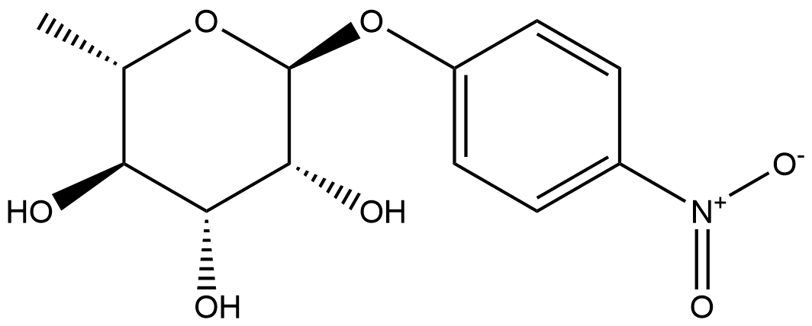
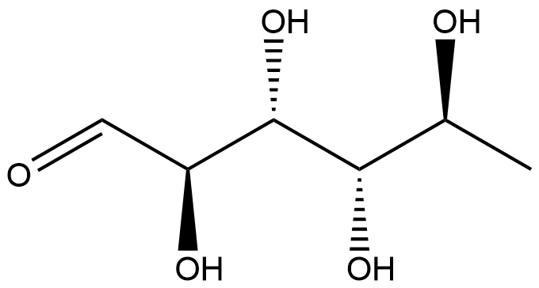
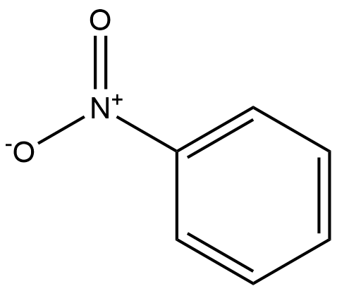

#  Hydrolysis Reactions (HRs) Family 7 / Subfamily 3

##  Literature Information

| Title    | Physiological and biochemical characterization of the two *α*-L-rhamnosidases of *Lactobacillus plantarum* NCC245 |
| :------- | :----------------------------------------------------------- |
| Author   | Marta Ávila, Muriel Jaquet, Deborah Moine, Teresa Requena, Carmen Peláez, Fabrizio Arigoni, Ivana Jankovic |
| DOI      | [10.1099/mic.0.027789-0](https://doi.org/10.1099/mic.0.027789-0) |
| Abstract | This work is believed to be the first report on the physiological and biochemical characterization of *α*-l-rhamnosidases in lactic acid bacteria. A total of 216 strains representing 37 species and eight genera of food-grade bacteria were screened for *α*-l-rhamnosidase activity. The majority of positive bacteria (25 out of 35) were *Lactobacillus plantarum* strains, and activity of the *L. plantarum* strain NCC245 was examined in more detail. The analysis of *α*-l-rhamnosidase activity under different growth conditions revealed dual regulation of the enzyme activity, involving carbon catabolite repression and induction: the enzyme activity was downregulated by glucose and upregulated by l-rhamnose. The expression of the two *α*-l-rhamnosidase genes *rhaB1* and *rhaB2* and two predicted permease genes *rhaP1* and *rhaP2*, identified in a probable operon *rhaP2B2P1B1*, was repressed by glucose and induced by l-rhamnose, showing regulation at the transcriptional level. The two *α*-l-rhamnosidase genes were overexpressed and purified from *Escherichia coli*. RhaB1 activity was maximal at 50 °C and at neutral pH and RhaB2 maximal activity was detected at 60 °C and at pH 5, with high residual activity at 70 °C. Both enzymes showed a preference for the *α*-1,6 linkage of l-rhamnose to *β*-d-glucose, ==hesperidin== and ==rutin== being their best substrates, but, surprisingly, no activity was detected towards the *α*-1,2 linkage in naringin under the tested conditions. In conclusion, we identified and characterized the strain *L. plantarum* NCC245 and its two *α*-l-rhamnosidase enzymes, which might be applied for improvement of bioavailability of health-beneficial polyphenols, such as hesperidin, in humans. |

##  Experimental results

- **Enzyme**

Uniprot ID: [C4PG45](https://www.uniprot.org/uniprot/C4PG45)

Protein: RhaB2

Organism: *Lactobacillus plantarum*

Length: 525 AA

Taxonomic identifier: [1590](https://www.uniprot.org/taxonomy/1590) [[NCBI](https://www.ncbi.nlm.nih.gov/Taxonomy/Browser/wwwtax.cgi?lvl=0&id=1590)]

- **Pfam**

| Source | Domain          | Start | End  | E-value (Domain) | Coverage |
| ------ | --------------- | ----- | ---- | ---------------- | -------- |
| Pfam-A | Bac_rhamnosid6H | 194   | 522  | 2.9e-20          | 0.965    |

Program: `hmmscan`

Version: 3.1b2 (February 2015)

Method: `hmmscan --domtblout hmmscan.tbl --noali -E 1e-5 pfam query.fa `

Date: Mon Jul 20 14:32:16 2020

Description:

Bac_rhamnosid6H

[**Pfam**](https://pfam.xfam.org/family/Bac_rhamnosid6H)

This family consists of bacterial rhamnosidase A and B enzymes. L-Rhamnose is abundant in biomass as a common constituent of glycolipids and glycosides, such as plant pigments, pectic polysaccharides, gums or biosurfactants. Some rhamnosides are important bioactive compounds. For example, terpenyl glycosides, the glycosidic precursor of aromatic terpenoids, act as important flavouring substances in grapes. Other rhamnosides act as cytotoxic rhamnosylated terpenoids, as signal substances in plants or play a role in the antigenicity of pathogenic bacteria[^1].

[**InterPro**](http://www.ebi.ac.uk/interpro/entry/InterPro/IPR035396/)

The six-hairpin glycoside transferase domain contains up to seven alpha-hairpins arranged in closed circular array. Proteins containing this domain include bacterial rhamnosidase A and B enzymes. L-Rhamnose is abundant in biomass as a common constituent of glycolipids and glycosides, such as plant pigments, pectic polysaccharides, gums or biosurfactants. Some rhamnosides are important bioactive compounds. For example, terpenyl glycosides, the glycosidic precursor of aromatic terpenoids, act as important flavouring substances in grapes. Other rhamnosides act as cytotoxic rhamnosylated terpenoids, as signal substances in plants or play a role in the antigenicity of pathogenic bacteria[^1].

- **Reaction**

[p-nitrophenyl-α-L-rhamnopyranoside](https://pubchem.ncbi.nlm.nih.gov/compound/4-Nitrophenyl-beta-D-glucopyranoside
) + [H2O](https://pubchem.ncbi.nlm.nih.gov/compound/Water) &rArr; [L-rhamnose](https://pubchem.ncbi.nlm.nih.gov/compound/L-rhamnose) + [p-nitrophenyl](https://pubchem.ncbi.nlm.nih.gov/compound/p-nitrophenyl)

<figure>

  

    
  

  

    
  

  

    
  

  

    
  

  

    
  

  

    
  

  

    
  

</figure>

## References

[^1]:Zverlov V V, Hertel C, Bronnenmeier K, et al. The thermostable α‐L‐rhamnosidase RamA of Clostridium stercorarium: biochemical characterization and primary structure of a bacterial α‐L‐rhamnoside hydrolase, a new type of inverting glycoside hydrolase[J]. Molecular microbiology, 2000, 35(1): 173-179.
