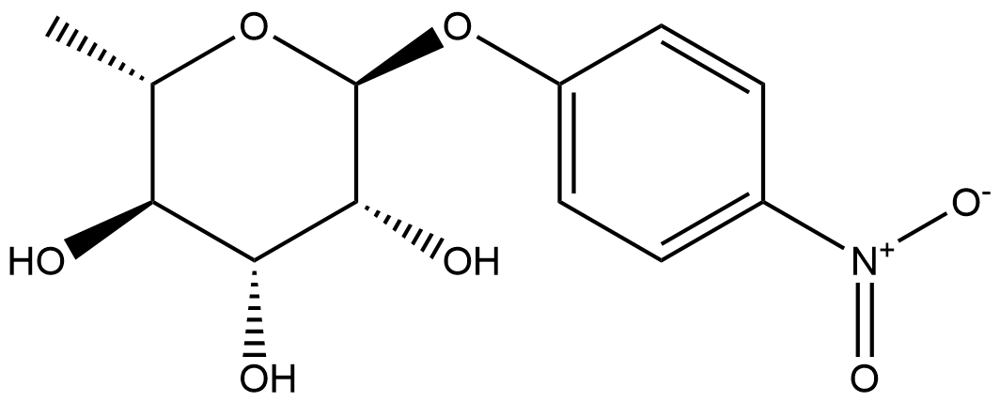
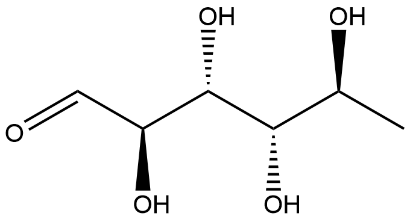
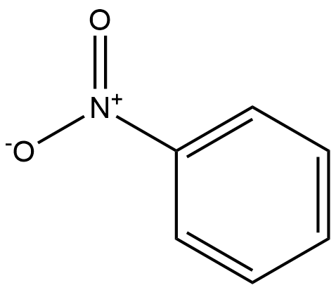

#  Hydrolysis Reactions (HRs) Family 7 / Subfamily 4

##  Literature Information

| Title    | Two new thermostable α-l-rhamnosidases from a novel thermophilic bacterium |
| :------- | :----------------------------------------------------------- |
| Author   | Hákon Birgisson, Gudmundur O. Hreggvidsson, Olafur H. Fridjónsson , Andrew Mort, Jakob K. Kristjánsson, Bo Mattiasson |
| DOI      | [10.1016/j.enzmictec.2003.12.012](https://doi.org/10.1016/j.enzmictec.2003.12.012) |
| Abstract | Two new thermostable α-l-rhamnosidases with novel substrate [hydrolysis](https://www.sciencedirect.com/topics/biochemistry-genetics-and-molecular-biology/enzymatic-hydrolysis) pattern were cloned and expressed from a new [thermophilic bacterium](https://www.sciencedirect.com/topics/biochemistry-genetics-and-molecular-biology/thermophilic-bacterium). Fragments of the two α-l-rhamnosidase genes, *rhmA* and *rhmB* were identified in a partially [sequenced genome](https://www.sciencedirect.com/topics/immunology-and-microbiology/sequenced-genomes) of the bacterium. Whole genes were recovered by amplifying [flanking sequences](https://www.sciencedirect.com/topics/biochemistry-genetics-and-molecular-biology/dna-flanking-region) with single specific primers and nonspecific [walking primers](https://www.sciencedirect.com/topics/biochemistry-genetics-and-molecular-biology/primer-walking). The recovered genes were then cloned into *Escherichia coli* and their enzymes produced and purified. Both enzymes were [dimers](https://www.sciencedirect.com/topics/chemical-engineering/dimer) and the MW of the [monomers](https://www.sciencedirect.com/topics/chemical-engineering/monomer), were 104 and 107 kDa for RhmA and RhmB, respectively. Both rhamnosidases had a temperature optimum at 70 °C. RhmA had pH optimum at 7.9 and RhmB had a broad pH optimum of 5.0 to 6.9 and RhmA had over 50% activity in the pH interval 5.0 to 8.7 and RhmB in the pH interval 4.0 to 7.9. Both enzymes had over 20% residual activity after 24-h incubation at 60 °C. RhmA and RhmB had *K*m values of 0.46 and 0.66 mM and *V*max values of 134 and 352 U mg−1 respectively, on *p*-nitrophenyl-α-l-rhamnopyranoside. Both rhamnosidases were active on both α-1,2- and α-1,6-linkages to beta-d-glucoside. |

##  Experimental results

- **Enzyme**

Uniprot ID: [Q6RCI8](https://www.uniprot.org/uniprot/Q6RCI8)

Protein: Alpha-L-rhamnosidase

Organism: *Thermomicrobia bacterium PRI-1686*

Length: 954 AA

Taxonomic identifier: [260956](https://www.uniprot.org/taxonomy/260956) [[NCBI](https://www.ncbi.nlm.nih.gov/Taxonomy/Browser/wwwtax.cgi?lvl=0&id=260956)]

- **Pfam**

| Source | Domain          | Start | End  | E-value (Domain) | Coverage |
| ------ | --------------- | ----- | ---- | ---------------- | -------- |
| Pfam-A | Bac_rhamnosid6H | 538   | 873  | 1.8e-82          | 0.994    |

Program: `hmmscan`

Version: 3.1b2 (February 2015)

Method: `hmmscan --domtblout hmmscan.tbl --noali -E 1e-5 pfam query.fa `

Date: Mon Jul 20 14:32:16 2020

Description:

Bac_rhamnosid6H

[**Pfam**](https://pfam.xfam.org/family/Bac_rhamnosid6H)

This family consists of bacterial rhamnosidase A and B enzymes. L-Rhamnose is abundant in biomass as a common constituent of glycolipids and glycosides, such as plant pigments, pectic polysaccharides, gums or biosurfactants. Some rhamnosides are important bioactive compounds. For example, terpenyl glycosides, the glycosidic precursor of aromatic terpenoids, act as important flavouring substances in grapes. Other rhamnosides act as cytotoxic rhamnosylated terpenoids, as signal substances in plants or play a role in the antigenicity of pathogenic bacteria[^1].

[**InterPro**](http://www.ebi.ac.uk/interpro/entry/InterPro/IPR035396/)

The six-hairpin glycoside transferase domain contains up to seven alpha-hairpins arranged in closed circular array. Proteins containing this domain include bacterial rhamnosidase A and B enzymes. L-Rhamnose is abundant in biomass as a common constituent of glycolipids and glycosides, such as plant pigments, pectic polysaccharides, gums or biosurfactants. Some rhamnosides are important bioactive compounds. For example, terpenyl glycosides, the glycosidic precursor of aromatic terpenoids, act as important flavouring substances in grapes. Other rhamnosides act as cytotoxic rhamnosylated terpenoids, as signal substances in plants or play a role in the antigenicity of pathogenic bacteria[^1].

- **Reaction**

[p-nitrophenyl-α-L-rhamnopyranoside](https://pubchem.ncbi.nlm.nih.gov/compound/4-Nitrophenyl-beta-D-glucopyranoside
) + [H2O](https://pubchem.ncbi.nlm.nih.gov/compound/Water) &rArr; [L-rhamnose](https://pubchem.ncbi.nlm.nih.gov/compound/L-rhamnose) + [p-nitrophenyl](https://pubchem.ncbi.nlm.nih.gov/compound/p-nitrophenyl)

<figure>

  

    
  

  

    
  

  

    
  

  

    
  

  

    
  

  

    
  

  

    
  

</figure>

## References

[^1]:Zverlov V V, Hertel C, Bronnenmeier K, et al. The thermostable α‐L‐rhamnosidase RamA of Clostridium stercorarium: biochemical characterization and primary structure of a bacterial α‐L‐rhamnoside hydrolase, a new type of inverting glycoside hydrolase[J]. Molecular microbiology, 2000, 35(1): 173-179.
