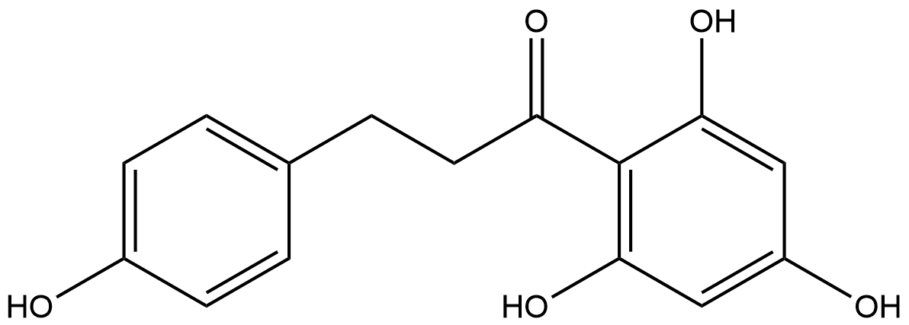

#  Hydrolysis Reactions (HRs) Family 8 / Subfamily 1

##  Literature Information

| Title    | Cloning and Expression of a Phloretin Hydrolase Gene from *Eubacterium ramulus* and Characterization of the Recombinant Enzyme |
| :------- | :----------------------------------------------------------- |
| Author   | Lilian Schoefer, Annett Braune, Michael Blaut                |
| DOI      | [10.1128/AEM.70.10.6131-6137.2004](https://doi.org/10.1128/AEM.70.10.6131-6137.2004) |
| Abstract | Phloretin hydrolase catalyzes the hydrolytic C-C cleavage of phloretin to phloroglucinol and 3-(4-hydroxyphenyl)propionic acid during flavonoid degradation in *Eubacterium ramulus*. The gene encoding the enzyme was cloned by screening a gene library for hydrolase activity. The insert of a clone conferring phloretin hydrolase activity was sequenced. Sequence analysis revealed an open reading frame of 822 bp (*phy*), a putative promoter region, and a terminating stem-loop structure. The deduced amino acid sequence of *phy* showed similarities to a putative protein of the 2,4-diacetylphloroglucinol biosynthetic operon from *Pseudomonas fluorescens*. The phloretin hydrolase was heterologously expressed in *Escherichia coli* and purified. The molecular mass of the native enzyme was approximately 55 kDa as determined by gel filtration. The results of sodium dodecyl sulfate-polyacrylamide gel electrophoresis and the deduced amino acid sequence of *phy* indicated molecular masses of 30 and 30.8 kDa, respectively, suggesting that the enzyme is a homodimer. The recombinant phloretin hydrolase catalyzed the hydrolysis of phloretin to equimolar amounts of phloroglucinol and 3-(4-hydroxyphenyl)propionic acid. The optimal temperature and pH of the catalyzed reaction mixture were 37°C and 7.0, respectively. The *Km* for phloretin was 13 ± 3 μM and the *k*cat was 10 ± 2 s−1. The enzyme did not transform phloretin-2′-glucoside (phloridzin), neohesperidin dihydrochalcone, 1,3-diphenyl-1,3-propandione, or *trans*-1,3-diphenyl-2,3-epoxy-propan-1-one. The catalytic activity of the phloretin hydrolase was reduced by *N*-bromosuccinimide, *o*-phenanthroline, *N*-ethylmaleimide, and CuCl2 to 3, 20, 35, and 85%, respectively. Phloroglucinol and 3-(4-hydroxyphenyl)propionic acid reduced the activity to 54 and 70%, respectively. |

##  Experimental results

- **Enzyme**

Uniprot ID: [Q715L4](https://www.uniprot.org/uniprot/Q715L4)

Protein: Phloretin hydrolase

Organism: *Eubacterium ramulus*

Length: 274 AA

Taxonomic identifier: [39490](https://www.uniprot.org/taxonomy/39490) [[NCBI](https://www.ncbi.nlm.nih.gov/Taxonomy/Browser/wwwtax.cgi?lvl=0&id=39490)]

- **Pfam**

| Source | Domain         | Start | End  | E-value (Domain) | Coverage |
| ------ | -------------- | ----- | ---- | ---------------- | -------- |
| Pfam-A | DAPG_hydrolase | 57    | 268  | 2.1e-65          | 0.978    |

Program: `hmmscan`

Version: 3.1b2 (February 2015)

Method: `hmmscan --domtblout hmmscan.tbl --noali -E 1e-5 pfam query.fa `

Date: Mon Jul 20 14:32:16 2020

Description:

DAPG_hydrolase

[**Pfam**](https://pfam.xfam.org/family/DAPG_hydrolase)

This domain is found in 2,4-diacetylphloroglucinol hydrolase PhiG present in Pseudomonas fluorescens. 2,4-diacetylphloroglucinol hydrolase is the gene product of PhiG that is responsible for cleaving toxic 2,4-diacetylphloroglucinol (DAPG). The small N-terminal region of the domain is involved in dimerization through hydrogen bonding of the dimer interface. The C-terminal catalytic region resembles the tetracenomycin aromatase/cyclase and has a Bet v1-like fold. DAPG PhiG is the first discovered hydrolase whose catalytic domain belongs to the Bet v1-like fold, rather than the classical alpha/beta-fold hydrolases[^1].

[**InterPro**](http://www.ebi.ac.uk/interpro/entry/InterPro/IPR041526/)

This domain is found in 2,4-diacetylphloroglucinol hydrolase PhiG present in Pseudomonas fluorescens. 2,4-diacetylphloroglucinol hydrolase is the gene product of PhiG that is responsible for cleaving toxic 2,4-diacetylphloroglucinol (DAPG). The small N-terminal region of the domain is involved in dimerization through hydrogen bonding of the dimer interface. The C-terminal catalytic region resembles the tetracenomycin aromatase/cyclase and has a Bet v1-like fold. DAPG PhiG is the first discovered hydrolase whose catalytic domain belongs to the Bet v1-like fold, rather than the classical alpha/beta-fold hydrolases[^1].

- **Reaction**

[phloretin](https://pubchem.ncbi.nlm.nih.gov/compound/phloretin) + [H2O](https://pubchem.ncbi.nlm.nih.gov/compound/Water) &rArr; [Phloretic acid](https://pubchem.ncbi.nlm.nih.gov/compound/Phloretic%20acid) + [phloroglucinol](https://pubchem.ncbi.nlm.nih.gov/compound/phloroglucinol)

<figure>

  

    
  

  

    
  

  

    
  

  

    
  

  

    
  

  

    
  

  

    
  

</figure>
## References

[^1]:He Y X, Huang L, Xue Y, et al. Crystal structure and computational analyses provide insights into the catalytic mechanism of 2, 4-diacetylphloroglucinol hydrolase PhlG from Pseudomonas fluorescens[J]. Journal of Biological Chemistry, 2010, 285(7): 4603-4611.

