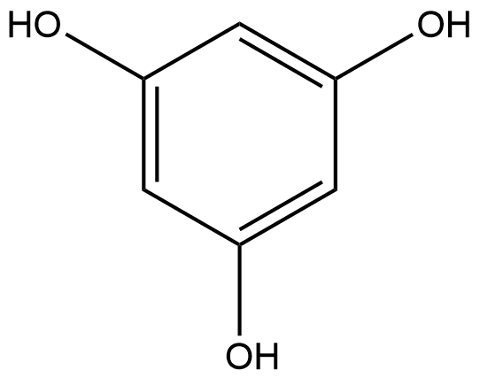

#  Hydrolysis Reactions (HRs) Family 8 / Subfamily 2

##  Literature Information

| Title    | Discovery and structural analysis of a phloretin hydrolase from the opportunistic human pathogen *Mycobacterium abscessus* |
| :------- | :----------------------------------------------------------- |
| Author   | Jian‐Ting Han  Si‐Ping Zhang  Wen‐Juan Jia  Zhang Zhang  Yong Wang  Yong‐Xing He |
| DOI      | [10.1111/febs.14792](https://doi.org/10.1111/febs.14792)     |
| Abstract | The family of PhlG proteins catalyses the hydrolysis of carbon‐carbon bonds and is widely distributed across diverse bacterial species. Two members of the PhlG family have been separately identified as 2,4‐diacetylphloroglucinol (2,4‐DAPG) hydrolase and phloretin hydrolase; however, the extent of functional divergence and catalytic substrates for most members of this family is still unknown. Here, using sequence similarity network and gene co‐occurrence analysis, we categorized PhlG proteins into several subgroups and inferred that PhlG proteins from *Mycobacterium abscessus* (MaPhlG) are likely to be functionally equivalent to phloretin hydrolase. Indeed, we confirmed the hydrolytic activity of MaPhlG towards phloretin and its analog monoacetylphloroglucinol (MAPG), and the crystal structure of MaPhlG in complex with MAPG revealed the key residues involved in catalysis and substrate binding. Through mutagenesis and enzymatic assays, we demonstrated that H160, I162, A213 and Q266, which are substituted in 2,4‐DAPG hydrolase, are essential for the activity towards phloretin. Based on the conservation of these residues, potential phloretin hydrolases were identified from *Frankia*, *Colletotrichum tofieldiae* and *Magnaporthe grisea*, which are rhizosphere inhabitants. These enzymes may be important for rhizosphere adaptation of the producing microbes by providing a carbon source through anaerobic degradation of flavonoids. Taken together, our results provided a framework for understanding the mechanism of functional divergence of PhlG proteins. |

##  Experimental results

- **Enzyme**

Uniprot ID: [B1MK49](https://www.uniprot.org/uniprot/B1MK49)

Protein: Phloretin hydrolase

Organism: *Mycobacteroides abscessus (strain ATCC 19977 / DSM 44196 / CIP 104536 / JCM 13569 / NCTC 13031 / TMC 1543) (Mycobacterium abscessus)*

Length: 281 AA

Taxonomic identifier: [561007](https://www.uniprot.org/taxonomy/561007) [[NCBI](https://www.ncbi.nlm.nih.gov/Taxonomy/Browser/wwwtax.cgi?lvl=0&id=561007)]

- **Pfam**

| Source | Domain         | Start | End  | E-value (Domain) | Coverage |
| ------ | -------------- | ----- | ---- | ---------------- | -------- |
| Pfam-A | DAPG_hydrolase | 59    | 276  | 2.7e-77          | 0.978    |

Program: `hmmscan`

Version: 3.1b2 (February 2015)

Method: `hmmscan --domtblout hmmscan.tbl --noali -E 1e-5 pfam query.fa `

Date: Mon Jul 20 14:32:16 2020

Description:

DAPG_hydrolase

[**Pfam**](https://pfam.xfam.org/family/DAPG_hydrolase)

This domain is found in 2,4-diacetylphloroglucinol hydrolase PhiG present in Pseudomonas fluorescens. 2,4-diacetylphloroglucinol hydrolase is the gene product of PhiG that is responsible for cleaving toxic 2,4-diacetylphloroglucinol (DAPG). The small N-terminal region of the domain is involved in dimerization through hydrogen bonding of the dimer interface. The C-terminal catalytic region resembles the tetracenomycin aromatase/cyclase and has a Bet v1-like fold. DAPG PhiG is the first discovered hydrolase whose catalytic domain belongs to the Bet v1-like fold, rather than the classical alpha/beta-fold hydrolases[^1].

[**InterPro**](http://www.ebi.ac.uk/interpro/entry/InterPro/IPR041526/)

This domain is found in 2,4-diacetylphloroglucinol hydrolase PhiG present in Pseudomonas fluorescens. 2,4-diacetylphloroglucinol hydrolase is the gene product of PhiG that is responsible for cleaving toxic 2,4-diacetylphloroglucinol (DAPG). The small N-terminal region of the domain is involved in dimerization through hydrogen bonding of the dimer interface. The C-terminal catalytic region resembles the tetracenomycin aromatase/cyclase and has a Bet v1-like fold. DAPG PhiG is the first discovered hydrolase whose catalytic domain belongs to the Bet v1-like fold, rather than the classical alpha/beta-fold hydrolases[^1].

- **Reaction**

[phloretin](https://pubchem.ncbi.nlm.nih.gov/compound/phloretin) + [H2O](https://pubchem.ncbi.nlm.nih.gov/compound/Water) &rArr; [Phloretic acid](https://pubchem.ncbi.nlm.nih.gov/compound/Phloretic%20acid) + [phloroglucinol](https://pubchem.ncbi.nlm.nih.gov/compound/phloroglucinol)

<figure>

  

    
  

  

    
  

  

    
  

  

    
  

  

    
  

  

    
  

  

    
  

</figure>

## References

[^1]:He Y X, Huang L, Xue Y, et al. Crystal structure and computational analyses provide insights into the catalytic mechanism of 2, 4-diacetylphloroglucinol hydrolase PhlG from Pseudomonas fluorescens[J]. Journal of Biological Chemistry, 2010, 285(7): 4603-4611.

