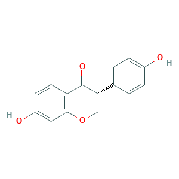
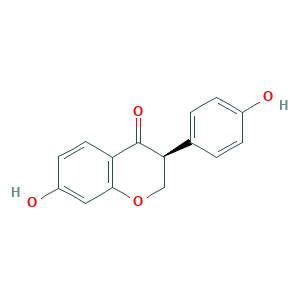

# Isomerization Reactions (IRs) Family 1

##  Literature Information

| Title    | Identification of a Novel Dihydrodaidzein Racemase Essential for Biosynthesis of Equol from Daidzein in *Lactococcus* sp. Strain 20-92 |
| :------- | :----------------------------------------------------------- |
| Author   | Yoshikazu Shimada, Masayuki Takahashi, Norihiro Miyazawa, Yasuhiro Abiru, Shigeto Uchiyama, Haretsugu Hishigaki |
| DOI      | [10.1128/AEM.00410-12](https://doi.org/10.1128/AEM.00410-12) |
| Abstract | Equol is metabolized from daidzein, a soy isoflavone, by the gut microflora. In this study, we identified a novel dihydrodaidzein racemase (l-DDRC) that is involved in equol biosynthesis in a lactic acid bacterium, *Lactococcus* sp. strain 20-92, and confirmed that histidine-tagged recombinant l-DDRC (l-DDRC-His) was able to convert both the (*R*)- and (*S*)-enantiomers of dihydrodaidzein to the racemate. Moreover, we showed that recombinant l-DDRC-His was essential for *in vitro* equol production from ==daidzein== by a recombinant enzyme mixture and that efficient *in vitro* equol production from daidzein was possible using at least four enzymes, including l-DDRC. We also proposed a model of the metabolic pathway from daidzein to equol in *Lactococcus* strain 20-92. |

##  Experimental results

- **Enzyme**

Uniprot ID: [I7H868](https://www.uniprot.org/uniprot/I7H868)

Protein: Dihydrodaizein racemase

Organism: *Lactococcus garvieae*

Length: 158 AA

Taxonomic identifier: [1363](https://www.uniprot.org/taxonomy/1363) [[NCBI](https://www.ncbi.nlm.nih.gov/Taxonomy/Browser/wwwtax.cgi?lvl=0&id=1363)]

- **Pfam**

| Source | Domain       | Start | End  | E-value (Domain) | Coverage |
| ------ | ------------ | ----- | ---- | ---------------- | -------- |
| Pfam-A | Glyoxalase_4 | 10    | 104  | 6.5e-11          | 0.844    |

Program: `hmmscan`

Version: 3.1b2 (February 2015)

Method: `hmmscan --domtblout hmmscan.tbl --noali -E 1e-5 pfam query.fa `

Date: Mon Jul 20 14:32:16 2020

Description:

Glyoxalase_4

[**Pfam**](https://pfam.xfam.org/family/Glyoxalase_4)

No Pfam abstract.

[**InterPro**](http://www.ebi.ac.uk/interpro/)

No InterPro results.

- **Reaction**

[(R)-dihydrodaidzein](https://pubchem.ncbi.nlm.nih.gov/compound/11579739) &rArr; [(S)-dihydrodaidzein](https://pubchem.ncbi.nlm.nih.gov/compound/(S)-dihydrodaidzein)

<figure>

  

    
  

  

    
  

  

    
  

</figure>

## References
