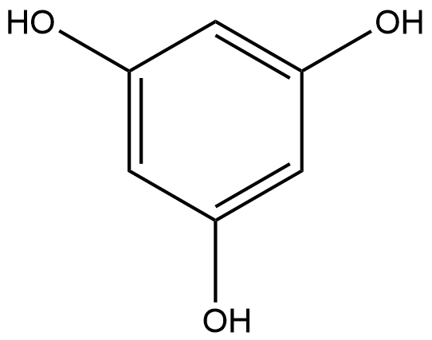

# Isomerization Reactions (IRs) Family 2

##  Literature Information

| Title    | First bacterial chalcone isomerase isolated from Eubacterium ramulus |
| :------- | :----------------------------------------------------------- |
| Author   | Claudia Herles , Annett Braune, Michael Blaut                |
| DOI      | [10.1007/s00203-004-0676-2](https://doi.org/10.1007/s00203-004-0676-2) |
| Abstract | The human fecal anaerobe Eubacterium ramulus is capable of degrading various flavonoids, including the flavone naringenin. The first step in the proposed degradation pathway is the isomerization of naringenin to the corresponding chalcone. Cell-free extracts of E. ramulus displayed chalcone isomerase activity. The enzyme from E. ramulus was purified to homogeneity. Its apparent molecular mass was estimated to be 136 and 129 kDa according to gel filtration and native polyacrylamide gel electrophoresis, respectively. Chalcone isomerase is composed of one type of subunit of 30 kDa. The purified enzyme catalyzed the isomerization of ==naringenin chalcone==, ==isoliquiritigenin==, and ==butein==, three chalcones that differ in their hydroxylation pattern. N-bromosuccinimide, but also naringenin and phloretin, inhibited the purified enzyme considerably. This is the first report on a bacterial chalcone isomerase. The physiological function of the purified enzyme is unclear, but an involvement in the conversion of the flavanone naringenin to the chalcone is proposed. |

##  Experimental results

- **Enzyme**

Uniprot ID: [V9P0A9](https://www.uniprot.org/uniprot/V9P0A9)

Protein: Chalcone isomerase

Organism: *Eubacterium ramulus*

Length: 283 AA

Taxonomic identifier: [39490](https://www.uniprot.org/taxonomy/39490) [[NCBI](https://www.ncbi.nlm.nih.gov/Taxonomy/Browser/wwwtax.cgi?lvl=0&id=39490)]

- **Pfam**

| Source | Domain     | Start | End  | E-value (Domain) | Coverage |
| ------ | ---------- | ----- | ---- | ---------------- | -------- |
| Pfam-A | Chalcone_N | 6     | 106  | 2.8e-49          | 0.980    |

Program: `hmmscan`

Version: 3.1b2 (February 2015)

Method: `hmmscan --domtblout hmmscan.tbl --noali -E 1e-5 pfam query.fa `

Date: Mon Jul 20 14:32:16 2020

Description:

Chalcone_N

[**Pfam**](https://pfam.xfam.org/family/Chalcone_N)

This is the N-terminal domain of chalcone isomerase present in Eubacterium ramulus. Chalcone isomerase is involved in the degradation pathway of flavone naringenin[^1].

[**InterPro**](http://www.ebi.ac.uk/interpro/entry/InterPro/IPR040518/)

This is the N-terminal domain of chalcone isomerase present in Eubacterium ramulus. Chalcone isomerase is involved in the degradation pathway of flavone naringenin[^1].

- **Reaction**

[naringenin chalcone](https://pubchem.ncbi.nlm.nih.gov/compound/naringenin%20chalcone) &rArr; [3-(4-hydroxyphenyl)propionic acid](https://pubchem.ncbi.nlm.nih.gov/compound/3-(4-hydroxyphenyl)propionic%20acid) + [phloroglucinol](https://pubchem.ncbi.nlm.nih.gov/compound/phloroglucinol)

<figure>

  

    
  

  

    
  

  

    
  

  

    
  

  

    
  

</figure>

## References

[^1]:Herles C, Braune A, Blaut M. First bacterial chalcone isomerase isolated from Eubacterium ramulus[J]. Archives of microbiology, 2004, 181(6): 428-434.

