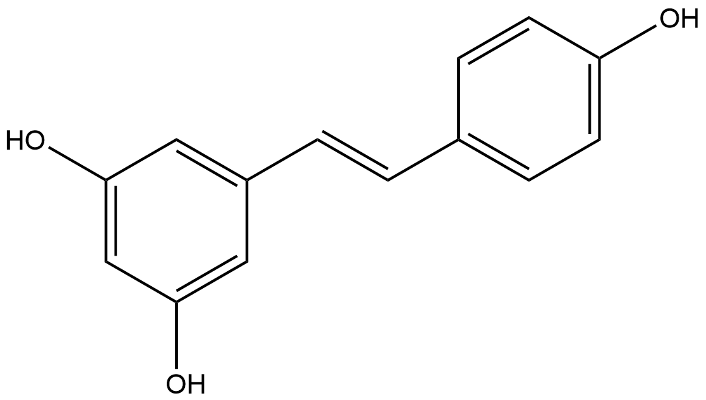

# Non-hydrolytic Cleaving Reactions (NCRs) Family 1

##  Literature Information

| Title    | Enzymatic carboxylation of hydroxystilbenes by the γ-resorcylic acid decarboxylase from *Rhizobium radiobacter* WU-0108 under reverse reaction conditions |
| :------- | :----------------------------------------------------------- |
| Author   | Masaru Sato, Nozomu Sakurai, Hideyuki Suzuki, Daisuke Shibata, Kuniki Kino |
| DOI      | [10.1016/j.molcatb.2015.10.006](https://doi.org/10.1016/j.molcatb.2015.10.006) |
| Abstract | We examined 66 aromatics for carboxylation by the γ-resorcylic acid decarboxylase from *Rhizobium radiobacter* WU-0108 under reverse reaction conditions. The enzyme carboxylated ==resorcinol, catechol, 5-methylresorcinol== and three hydroxystilbenes (==resveratrol==, ==gnetol==, and ==piceatannol==) with high yields. Except for catechol, the structures of these substrates include a 1,3-dihydroxybenzene moiety. Other compounds gave no reaction products. The reaction products from resveratrol and gnetol were 2,6-dihydroxy-4-[(E)-2-(4-hydroxyphenyl)ethenyl]benzoic acid and 2,6-dihydroxy-4-[(E)-2-(2,6-dihydroxyphenyl)ethenyl]benzoic acid, respectively, as determined by mass spectrometry and nuclear magnetic resonance analyses. Kinetic analyses of the carboxylation reactions indicated that resveratrol and gnetol are better substrates than resorcinol or catechol. |

##  Experimental results

- **Enzyme**

Uniprot ID: [Q60FX6](https://www.uniprot.org/uniprot/Q60FX6)

Protein: Reversible 2,6-dihydroxybenzoic acid decarboxylase

Organism: *Rhizobium radiobacter (Agrobacterium tumefaciens) (Agrobacterium radiobacter)*

Length: 327 AA

Taxonomic identifier: [358](https://www.uniprot.org/taxonomy/358) [[NCBI](https://www.ncbi.nlm.nih.gov/Taxonomy/Browser/wwwtax.cgi?lvl=0&id=358)]

- **Pfam**

| Source | Domain       | Start | End  | E-value (Domain) | Coverage |
| ------ | ------------ | ----- | ---- | ---------------- | -------- |
| Pfam-A | Amidohydro_2 | 35    | 324  | 3.3e-47          | 0.931    |

Program: `hmmscan`

Version: 3.1b2 (February 2015)

Method: `hmmscan --domtblout hmmscan.tbl --noali -E 1e-5 pfam query.fa `

Date: Mon Jul 20 14:32:16 2020

Description:

Amidohydro_2

[**Pfam**](https://pfam.xfam.org/family/Amidohydro_2)

These proteins are amidohydrolases that are related to [PF01979](https://pfam.xfam.org/family/PF01979)[^1].

[**InterPro**](http://www.ebi.ac.uk/interpro/entry/InterPro/IPR006680/)

Proteins containing this domain are enzymes from a large metal dependent hydrolase superfamily[^1]. The family includes adenine deaminase ([3.5.4.2](http://www.ebi.ac.uk/intenz/query?cmd=SearchEC&ec=3.5.4.2)) that hydrolyses adenine to form hypoxanthine and ammonia. This reaction is important for adenine utilisation as a purine and also as a nitrogen source[^2]. The family also includes dihydroorotase and N-acetylglucosamine-6-phosphate deacetylases ([3.5.1.25](http://www.ebi.ac.uk/intenz/query?cmd=SearchEC&ec=3.5.1.25)). The domain is also found in the urease alpha subunit, where it is the catalytic domain[^3].

- **Reaction**

[resveratrol](https://pubchem.ncbi.nlm.nih.gov/compound/resveratrol) &rArr; [2,6-Dihydroxy-4-[(E)-2-(4-hydroxyphenyl)ethenyl]benzoic acid](https://pubchem.ncbi.nlm.nih.gov/compound/122214550)

<figure>

  

    
  

  

    
  

  

    
  

</figure>

## References

[^1]:Holm L, Sander C. An evolutionary treasure: unification of a broad set of amidohydrolases related to urease[J]. Proteins: Structure, Function, and Bioinformatics, 1997, 28(1): 72-82.
[^2]:Nygaard P, Duckert P, Saxild H H. Role of adenine deaminase in purine salvage and nitrogen metabolism and characterization of the ade gene in Bacillus subtilis[J]. Journal of Bacteriology, 1996, 178(3): 846-853.
[^3]:Jabri E, Carr M B, Hausinger R P, et al. The crystal structure of urease from Klebsiella aerogenes[J]. Science, 1995, 268(5213): 998-1004.

