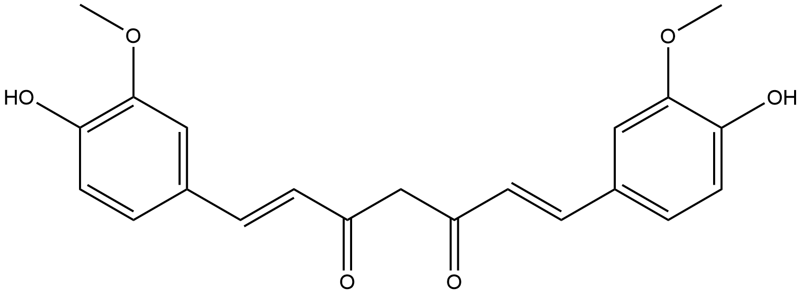
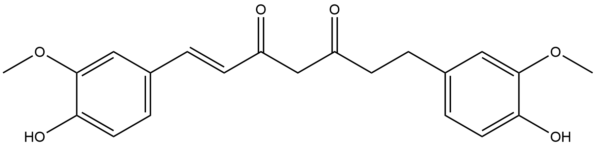

#  Oxidation/Reduction Reactions (ORs) Family 1

##  Literature Information

| Title    | Discovery of the curcumin metabolic pathway involving a unique enzyme in an intestinal microorganism |
| :------- | :----------------------------------------------------------- |
| Author   | Azam Hassaninasab, Yoshiteru Hashimoto, Kaori Tomita-Yokotani, and Michihiko Kobayashi |
| DOI      | [10.1073/pnas.1016217108](https://doi.org/10.1073/pnas.1016217108) |
| Abstract | Polyphenol curcumin, a yellow pigment, derived from the rhizomes of a plant (Curcuma longa Linn) is a natural antioxidant exhibiting a variety of pharmacological activities and therapeutic properties. It has long been used as a traditional medicine and as a preservative and coloring agent in foods. Here, curcumin-converting microorganisms were isolated from human feces, the one exhibiting the highest activity being identified as Escherichia coli. We are thus unique in discovering that E. coli was able to act on curcumin. The curcumin-converting enzyme was purified from E. coli and characterized. The native enzyme had a molecular mass of about 82 kDa and consisted of two identical subunits. The enzyme has a narrow substrate spectrum, preferentially acting on curcumin. The microbial metabolism of curcumin by the purified enzyme was found to comprise a two-step reduction, <mark>curcumin</mark> being converted NADPH-dependently into <mark>an intermediate product</mark>, <mark>dihydrocurcumin</mark>, and then the end product, <mark>tetrahydrocurcumin</mark>. We named this enzyme “NADPH-dependent curcumin/dihydrocurcumin reductase” (CurA). The gene (curA) encoding this enzyme was also identified. A homology search with the BLAST program revealed that a unique enzyme involved in curcumin metabolism belongs to the medium-chain dehydrogenase/reductase superfamily. |

---

##  Experimental results

- **Enzyme**

Uniprot ID: [B1XDG0](https://www.uniprot.org/uniprot/B1XDG0)

Protein:  NADPH-dependent curcumin / dihydrocurcumin reductase

Organism: *Escherichia coli (strain K12 / DH10B)*

Length: 345 AA

Taxonomic identifier: [316385](https://www.uniprot.org/taxonomy/316385) [[NCBI](https://www.ncbi.nlm.nih.gov/Taxonomy/Browser/wwwtax.cgi?lvl=0&id=316385)]

- **Pfam**

| Source | Domain     | Start | End  | E-value (Domain) | Coverage |
| ------ | ---------- | ----- | ---- | ---------------- | -------- |
| Pfam-A | ADH_N_2    | 9     | 115  | 2.4e-43          | 0.981    |
| Pfam-A | ADH_zinc_N | 161   | 299  | 7.4e-19          | 0.946    |

Program: `hmmscan`

Version: 3.1b2 (February 2015)

Method: `hmmscan --domtblout hmmscan.tbl --noali -E 1e-5 pfam query.fa `

Date: Mon Jul 20 14:32:16 2020

Description:

1. ADH_N_2

   [**Pfam**](https://pfam.xfam.org/family/ADH_N_2)

   N-terminal region of oxidoreductase and prostaglandin reductase and alcohol dehydrogenase. 

   [**InterPro**](http://www.ebi.ac.uk/interpro/entry/InterPro/IPR041694/)

   This is the N-terminal domain of prostaglandin reductase and other oxidoreductases.

2. ADH_zinc_N

   [**Pfam**](https://pfam.xfam.org/family/ADH_zinc_N)

   No Pfam abstract.

   [**InterPro**](http://www.ebi.ac.uk/interpro/entry/InterPro/IPR013149/)

   Alcohol dehydrogenase ([1.1.1.1](http://www.ebi.ac.uk/intenz/query?cmd=SearchEC&ec=1.1.1.1)) (ADH) catalyzes the reversible oxidation of alcohols to their corresponding acetaldehyde or ketone with the concomitant reduction of NAD: alcohol + NAD = aldehyde or ketone + NADH Currently three structurally and catalytically different types of alcohol dehydrogenases are known:

   &triangleright; Zinc-containing 'long-chain' alcohol dehydrogenases. 
   
   &triangleright; Insect-type, or 'short-chain' alcohol dehydrogenases. 
   
   &triangleright; Iron-containing alcohol dehydrogenases. 
   
   Zinc-containing ADH's[^1][^2] are dimeric or tetrameric enzymes that bind two atoms of zinc per subunit. One of the zinc atom is essential for catalytic activity while the other is not. Both zinc atoms are coordinated by either cysteine or histidine residues; the catalytic zinc is coordinated by two cysteines and one histidine. Zinc-containing ADH's are found in bacteria, mammals, plants, and in fungi. In many species there is more than one isozyme (for example, humans have at least six isozymes, yeast have three, etc.). A number of other zinc-dependent dehydrogenases are closely related to zinc ADH[^3] and are included in this family.

   &triangleright; Sorbitol dehydrogenase ([1.1.1.14](http://www.ebi.ac.uk/intenz/query?cmd=SearchEC&ec=1.1.1.14))
   
   &triangleright; L-threonine 3-dehydrogenase ([1.1.1.103](http://www.ebi.ac.uk/intenz/query?cmd=SearchEC&ec=1.1.1.103))
   
   &triangleright; Glutathione-dependent formaldehyde dehydrogenase ([1.1.1.284](http://www.ebi.ac.uk/intenz/query?cmd=SearchEC&ec=1.1.1.284))
   
   &triangleright; Mannitol dehydrogenase ([1.1.1.255](http://www.ebi.ac.uk/intenz/query?cmd=SearchEC&ec=1.1.1.255))

   In addition, this family includes NADP-dependent quinone oxidoreductase ([1.6.5.5](http://www.ebi.ac.uk/intenz/query?cmd=SearchEC&ec=1.6.5.5)), an enzyme found in bacteria (gene qor), in yeast and in mammals where, in some species such as rodents, it has been recruited as an eye lens protein and is known as zeta-crystallin[^4]. The sequence of quinone oxidoreductase is distantly related to that other zinc-containing alcohol dehydrogenases and it lacks the zinc-ligand residues. The torpedo fish and mammalian synaptic vesicle membrane protein vat-1 is related to qor.

   This entry represents the cofactor-binding domain of these enzymes, which is normally found towards the C terminus. Structural studies indicate that it forms a classical Rossman fold that reversibly binds NAD(H)[^5][^6][^7].

- **Reaction**

[curcumin](https://pubchem.ncbi.nlm.nih.gov/compound/curcumin) + [NADPH](https://pubchem.ncbi.nlm.nih.gov/compound/5884) + [H+](https://pubchem.ncbi.nlm.nih.gov/compound/1038) &rArr; [dihydrocurcumin](https://pubchem.ncbi.nlm.nih.gov/compound/dihydrocurcumin)[intermediate product] + [NADP+](https://pubchem.ncbi.nlm.nih.gov/compound/15938972)

[dihydrocurcumin](https://pubchem.ncbi.nlm.nih.gov/compound/dihydrocurcumin) + [NADPH](https://pubchem.ncbi.nlm.nih.gov/compound/5884) + [H+](https://pubchem.ncbi.nlm.nih.gov/compound/1038) &rArr; [tetrahydrocurcumin](https://pubchem.ncbi.nlm.nih.gov/compound/tetrahydrocurcumin) + [NADP+](https://pubchem.ncbi.nlm.nih.gov/compound/15938972)

<figure>

  

    
  

  

    
  

  

    
  

  

    
  

  

    
  

</figure>
## References

[^1]: JÖRNVALL H, PERSSON B, JEFFERY J. Characteristics of alcohol/polyol dehydrogenases: The zinc‐containing long‐chain alcohol dehydrogenases[J]. European Journal of Biochemistry, 1987, 167(2): 195-201.
[^2]: Sun H W, Plapp B V. Progressive sequence alignment and molecular evolution of the Zn-containing alcohol dehydrogenase family[J]. Journal of molecular evolution, 1992, 34(6): 522-535.
[^3]: Persson B, Hallborn J, Walfridsson M, et al. Dual relationships of xylitol and alcohol dehydrogenases in families of two protein types[J]. FEBS letters, 1993, 324(1): 9-14.
[^4]: Jörnvall H, Persson B, Du Bois G C, et al. ζ‐Crystallin versus other members of the alcohol dehydrogenase super‐family Variability as a functional characteristic[J]. FEBS letters, 1993, 322(3): 240-244.
[^5]: Pauly T A, Ekstrom J L, Beebe D A, et al. X-ray crystallographic and kinetic studies of human sorbitol dehydrogenase[J]. Structure, 2003, 11(9): 1071-1085.
[^6]: Rubach J K, Plapp B V. Amino acid residues in the nicotinamide binding site contribute to catalysis by horse liver alcohol dehydrogenase[J]. Biochemistry, 2003, 42(10): 2907-2915.
[^7]: Crystal structure of Escherichia coli QOR quinone oxidoreductase complexed with NADPH. Thorn JM, Barton JD, Dixon NE, Ollis DL, Edwards KJ. *J. Mol. Biol.* 249, 785-99, (1995
