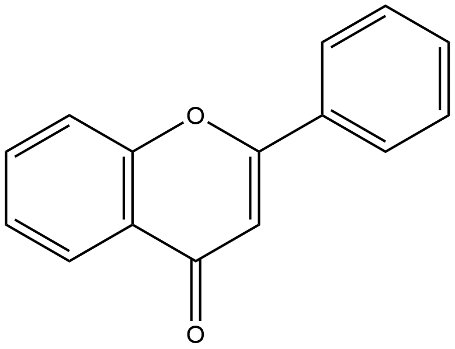

#  Oxidation/Reduction Reactions (ORs) Family 2

##  Literature Information

| Title    | Epoxide Formation on the Aromatic B Ring of Flavanone by Biphenyl Dioxygenase of Pseudomonas pseudoalcaligenes KF707 |
| :------- | :----------------------------------------------------------- |
| Author   | Jaehong Han, Song-Young Kim, Jihyun Jung, Yoongho Lim, Joong-Hoon Ahn, Su-Il Kim, Hor-Gil Hur |
| DOI      | [10.1128/AEM.71.9.5354-5361.2005](https://doi.org/10.1128/AEM.71.9.5354-5361.2005) |
| Abstract | Prokaryotic dioxygenase is known to catalyze aromatic compounds into their corresponding *cis*-dihydrodiols without the formation of an epoxide intermediate. Biphenyl dioxygenase from *Pseudomonas pseudoalcaligenes* KF707 showed novel monooxygenase activity by converting 2(*R*)- and 2(*S*)-flavanone to their corresponding epoxides (2-(7-oxabicyclo[4.1.0]hepta-2,4-dien-2-yl)-2, 3-dihydro-4*H*-chromen-4-one), whereby the epoxide bond was formed between C2′ and C3′ on the B ring of the flavanone. The enzyme also converted 6-hydroxyflavanone and 7-hydroxyflavanone, which do not contain a hydroxyl group on the B-ring, to their corresponding epoxides. In a previous report (S.-Y. Kim, J. Jung, Y. Lim, J.-H. Ahn, S.-I. Kim, and H.-G. Hur, Antonie Leeuwenhoek 84:261-268, 2003), however, we found that the same enzyme showed dioxygenase activity toward ==flavone==, resulting in the production of ==flavone *cis*-2′,3′-dihydrodiol==. Extensive structural identification of the metabolites of flavanone by using high-pressure liquid chromatography, liquid chromatography/mass spectrometry, and nuclear magnetic resonance confirmed the presence of an epoxide functional group on the metabolites. Epoxide formation as the initial activation step of aromatic compounds by oxygenases has been reported to occur only by eukaryotic monooxygenases. To the best of our knowledge, biphenyl dioxygenase from *P. pseudoalcaligenes* KF707 is the first prokaryotic enzyme detected that can produce an epoxide derivative on the aromatic ring structure of flavanone. |

---

##  Experimental results

- **Enzyme**

Uniprot ID: [Q52028](https://www.uniprot.org/uniprot/Q52028)

Protein: Biphenyl dioxygenase subunit alpha

Organism: *Pseudomonas furukawaii*

Length: 458 AA

Taxonomic identifier: [1149133](https://www.uniprot.org/taxonomy/1149133) [[NCBI](https://www.ncbi.nlm.nih.gov/Taxonomy/Browser/wwwtax.cgi?lvl=0&id=1149133)]

- **Pfam**

| Source | Domain          | Start | End  | E-value (Domain) | Coverage |
| :----- | :-------------- | :---- | :--- | :--------------- | :------- |
| Pfam-A | Rieske          | 57    | 141  | 1.6e-22          | 0.933    |
| Pfam-A | Ring_hydroxyl_A | 183   | 450  | 4.8e-58          | 0.995    |

Program: `hmmscan`

Version: 3.1b2 (February 2015)

Method: `hmmscan --domtblout hmmscan.tbl --noali -E 1e-5 pfam query.fa `

Date: Mon Jul 20 14:32:16 2020

Description:

1. Rieske

   [**Pfam**](https://pfam.xfam.org/family/Rieske)

   The rieske domain has a [2Fe-2S] centre. Two conserved cysteines coordinate one Fe ion, while the other Fe ion is coordinated by two conserved histidines. In hyperthermophilic archaea there is a SKTPCX(2-3)C motif at the C-terminus. The cysteines in this motif form a disulphide bridge, which stabilises the protein [^1].

   [**InterPro**](http://www.ebi.ac.uk/interpro/entry/InterPro/IPR017941/)

   There are multiple types of iron-sulphur clusters which are grouped into three main categories based on their atomic content: [2Fe-2S], [3Fe-4S], [4Fe-4S] (see [prositedoc:PDOC00176]), and other hybrid or mixed metal types. Two general types of [2Fe-2S] clusters are known and they differ in their coordinating residues. The ferredoxin-type [2Fe-2S] clusters are coordinated to the protein by four cysteine residues (see [prositedoc:PDOC00175]). The Rieske-type [2Fe-2S] cluster is coordinated to its protein by two cysteine residues and two histidine residues [^2][^3].The structure of several Rieske domains has been solved [^4]. It contains three layers of antiparallel beta sheets forming two beta sandwiches. Both beta sandwiches share the central sheet 2. The metal-binding site is at the top of the beta sandwich formed by the sheets 2 and 3. The Fe1 iron of the Rieske cluster is coordinated by two cysteines while the other iron Fe2 is coordinated by two histidines. Two inorganic sulphide ions bridge the two iron ions forming a flat, rhombic cluster.

   Rieske-type iron-sulphur clusters are common to electron transfer chains of mitochondria and chloroplast and to non-haem iron oxygenase systems:

   &triangleright; The Rieske protein of the Ubiquinol-cytochrome c reductase ([1.10.2.2](http://www.ebi.ac.uk/intenz/query?cmd=SearchEC&ec=1.10.2.2)) (also known as the bc1 complex or complex III), a complex of the electron transport chains of mitochondria and of some aerobic prokaryotes; it catalyses the oxidoreduction of ubiquinol and cytochrome c.
   
   &triangleright; The Rieske protein of chloroplastic plastoquinone-plastocyanin reductase ([1.10.99.1](http://www.ebi.ac.uk/intenz/query?cmd=SearchEC&ec=1.10.99.1)) (also known as the b6f complex). It is functionally similar to the bc1 complex and catalyses the oxidoreduction of plastoquinol and cytochrome f.
   
   &triangleright; Bacterial naphthalene 1,2-dioxygenase subunit alpha, a component of the naphthalene dioxygenase (NDO) multicomponent enzyme system which catalyses the incorporation of both atoms of molecular oxygen into naphthalene to form cis-naphthalene dihydrodiol.
   
   &triangleright; Bacterial 3-phenylpropionate dioxygenase ferredoxin subunit.
   
   &triangleright; Bacterial toluene monoxygenase.
   
   &triangleright; Bacterial biphenyl dioxygenase.

2. Ring_hydroxyl_A

   [**Pfam**](https://pfam.xfam.org/family/Ring_hydroxyl_A)

   This family is the catalytic domain of aromatic-ring- hydroxylating dioxygenase systems. The active site contains a non-heme ferrous ion coordinated by three ligands.

   [**InterPro**](http://www.ebi.ac.uk/interpro/entry/InterPro/IPR015879/)

   Aromatic ring hydroxylating dioxygenases are multicomponent 1,2-dioxygenase complexes that convert closed-ring structures to non-aromatic cis-diols[^5]. The complex has both hydroxylase and electron transfer components. The hydroxylase component is itself composed of two subunits: an alpha-subunit of about 50kDa, and a beta-subunit of about 20kDa. The electron transfer component is either composed of two subunits: a ferredoxin and a ferredoxin reductase or by a single bifunctional ferredoxin/reductase subunit. Sequence analysis of hydroxylase subunits of ring hydroxylating systems (including toluene, benzene and napthalene 1,2-dioxygenases) suggests they are derived from a common ancestor[^5]. The alpha-subunit binds both a Rieske-like 2Fe-2S cluster and an iron atom: conserved Cys and His residues in the N-terminal region may provide 2Fe-2S ligands, while conserved His and Tyr residues may coordinate the iron. The beta subunit may be responsible for the substrate specificity of the dioxygenase system[^5].

   This entry represents the conserved C-terminal domain found in the alpha subunit of aromatic-ring-hydroxylating dioxygenases. It is the catalytic domain of aromatic-ring- hydroxylating dioxygenase systems. The active site contains a non-heme ferrous ion coordinated by three ligands.

- **Reaction**

[flavone](https://pubchem.ncbi.nlm.nih.gov/compound/flavone) &rArr; [flavone  cis-2',3'-dihydrodiol](https://pubchem.ncbi.nlm.nih.gov/compound/129732577)

<figure>

  

    
  

  

    
  

  

    
  

</figure>

## References

[^1]:Botelho H M, Leal S S, Veith A, et al. Role of a novel disulfide bridge within the all-beta fold of soluble Rieske proteins[J]. JBIC Journal of Biological Inorganic Chemistry, 2010, 15(2): 271-281.
[^2]:Ferraro D J, Gakhar L, Ramaswamy S. Rieske business: structure–function of Rieske non-heme oxygenases[J]. Biochemical and biophysical research communications, 2005, 338(1): 175-190.
[^3]:Schneider D, Schmidt C L. Multiple Rieske proteins in prokaryotes: where and why?[J]. Biochimica et Biophysica Acta (BBA)-Bioenergetics, 2005, 1710(1): 1-12.
[^4]:Iwata S, Saynovits M, Link T A, et al. Structure of a water soluble fragment of the ‘Rieske’iron–sulfur protein of the bovine heart mitochondrial cytochrome bc1 complex determined by MAD phasing at 1.5 Å resolution[J]. Structure, 1996, 4(5): 567-579.
[^5]:Neidle E L, Hartnett C, Ornston L N, et al. Nucleotide sequences of the Acinetobacter calcoaceticus benABC genes for benzoate 1, 2-dioxygenase reveal evolutionary relationships among multicomponent oxygenases[J]. Journal of Bacteriology, 1991, 173(17): 5385-5395.