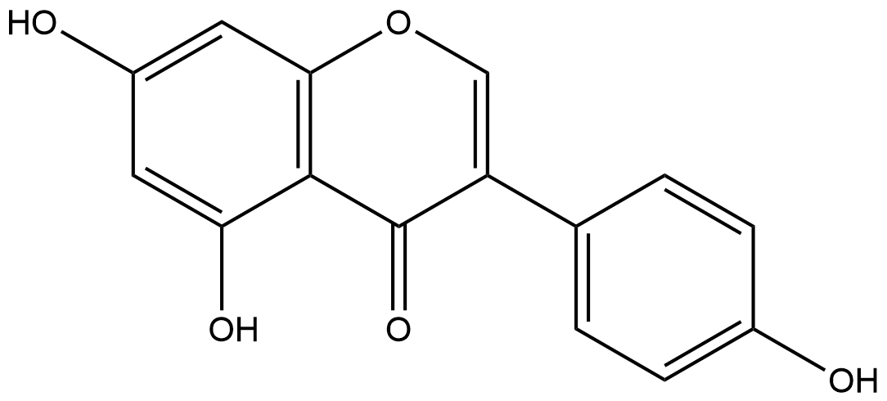
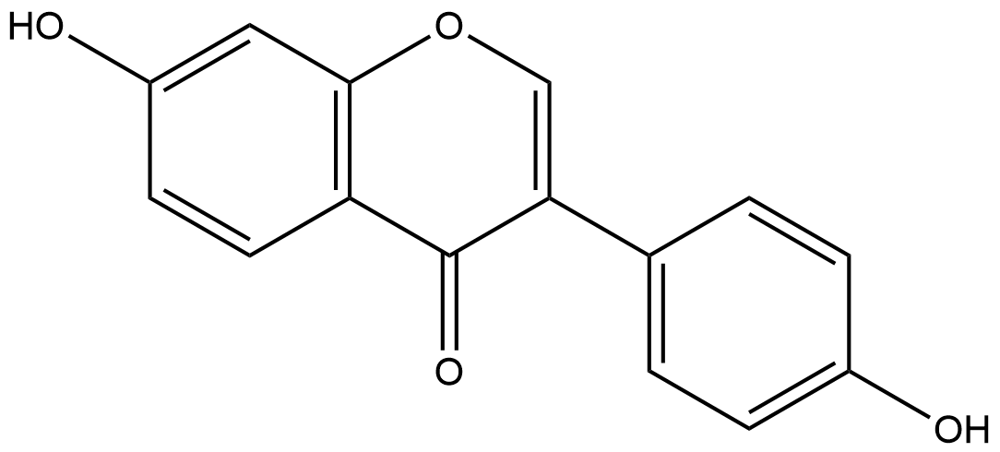

#  Oxidation/Reduction Reactions (ORs) Family 3

<!--[TOC]在这里不可以用-->

<ul id="myTab" class="nav nav-tabs">
  <!-- active 指的是默认页 -->
  <li class="active">
    <!-- herf中名字于下文id对应 -->
    <!-- 这里只改herf和tab1 -->
    <a href="#tab1" data-toggle="tab">A0A0U1WKA6</a>
  </li>
  <li><a href="#tab2" data-toggle="tab">E1CIA4</a></li>
  <li><a href="#tab3" data-toggle="tab">F7V1S0</a></li>
  <li><a href="#tab4" data-toggle="tab">H3JUE4</a></li>
  <li><a href="#tab5" data-toggle="tab">M9NZ71</a></li>
  <li><a href="#tab6" data-toggle="tab">V9P074</a></li>
</ul>

  <!-- 此处的id与上文herf对应 其他的不要改-->
  

<h2 class="code-line" data-line-start=0 data-line-end=1 >Literature Information</h2>
<table class="table table-striped table-bordered">
<thead>
<tr>
<th style="text-align:left">Title</th>
<th style="text-align:left">Reduction of soy isoflavones by use of <em>Escherichia coli</em> whole‐cell biocatalyst expressing isoflavone reductase under aerobic conditions</th>
</tr>
</thead>
<tbody>
<tr>
<td style="text-align:left">Author</td>
<td style="text-align:left">Y.‐N. Gao  Q.‐H. Hao  H.‐L. Zhang  B. Zhou  X.‐M. Yu  X.‐L. Wang</td>
</tr>
<tr>
<td style="text-align:left">DOI</td>
<td style="text-align:left"><a href="https://doi.org/10.1111/lam.12594">10.1111/lam.12594</a></td>
</tr>
<tr>
<td style="text-align:left">Abstract</td>
<td style="text-align:left">Soy isoflavone metabolites are currently receiving much attention due to the stronger and wider bioactivities than that of isoflavones. Therefore, biosynthesis of isoflavone metabolites by isolated isoflavone biotransforming bacteria is important. However, the biosynthesis process must be under obligate anaerobic conditions due to the reduction reactions catalysed by isoflavone biotransforming bacteria. In this study, we cloned the daidzein and genistein reductase gene (<em>dgr</em>) from <em>Slackia</em> sp. AUH‐JLC159. The recombinant <em>Escherichia coli</em> (<em>E. coli</em>) whole‐cell was used for the first time as the biocatalyst for aerobic biosynthesis of <mark>dihydrodaidzein (DHD)</mark> and <mark>dihydrogenistein (DHG)</mark> from soy isoflavones daidzein and genistein. Our results indicated that the recombinant <em>E. coli</em> whole‐cell was able to reduce daidzein and genistein to DHD and DHG under aerobic conditions, while the maximal concentration of the substrate daidzein or genistein that the <em>E. coli</em> whole‐cell was able to convert efficiently was only 0.4 mmol l&lt;sup&gt;−1&lt;/sup&gt;. Under the optimized conditions, the maximal concentration of daidzein or genistein that the <em>E. coli</em> whole‐cell was able to convert efficiently was increased to 1.4 mmol l&lt;sup&gt;−1&lt;/sup&gt;. Our results demonstrated that <em>E. coli</em> whole‐cell is an efficient biocatalyst for biosynthesis of isoflavone metabolites under aerobic conditions.</td>
</tr>
</tbody>
</table>
<h2 class="code-line" data-line-start=8 data-line-end=9 >Experimental results</h2>
<ul>
<li class="has-line-data" data-line-start="10" data-line-end="12"><strong>Enzyme</strong></li>
</ul>

Uniprot ID: <a href="https://www.uniprot.org/uniprot/A0A0U1WKA6">A0A0U1WKA6</a>

Protein: Daidzein and genistein reductase

Organism: <em>Slackia sp. AUH-JLC159</em>

Length: 644 AA

Taxonomic identifier: <a href="https://www.uniprot.org/taxonomy/1352935">1352935</a> [<a href="https://www.ncbi.nlm.nih.gov/Taxonomy/Browser/wwwtax.cgi?lvl=0&amp;id=1352935">NCBI</a>]

<ul>
<li class="has-line-data" data-line-start="22" data-line-end="24"><strong>Pfam</strong></li>
</ul>
<table class="table table-striped table-bordered">
<thead>
<tr>
<th style="text-align:left">Source</th>
<th style="text-align:left">Domain</th>
<th style="text-align:left">Start</th>
<th style="text-align:left">End</th>
<th style="text-align:left">E-value (Domain)</th>
<th style="text-align:left">Coverage</th>
</tr>
</thead>
<tbody>
<tr>
<td style="text-align:left">Pfam-A</td>
<td style="text-align:left">Pyr_redox_2</td>
<td style="text-align:left">384</td>
<td style="text-align:left">601</td>
<td style="text-align:left">1.3e-20</td>
<td style="text-align:left">0.813</td>
</tr>
<tr>
<td style="text-align:left">Pfam-A</td>
<td style="text-align:left">Oxidored_FMN</td>
<td style="text-align:left">15</td>
<td style="text-align:left">338</td>
<td style="text-align:left">9e-46</td>
<td style="text-align:left">0.974</td>
</tr>
</tbody>
</table>

Program: <code>hmmscan</code>

Version: 3.1b2 (February 2015)

Method: <code>hmmscan --domtblout hmmscan.tbl --noali -E 1e-5 pfam query.fa</code>

Date: Mon Jul 20 14:32:16 2020

Description:

<ol>
<li class="has-line-data" data-line-start="39" data-line-end="55">

Pyr_redox_2

<a href="https://pfam.xfam.org/family/Pyr_redox_2"><strong>Pfam</strong></a>

This family includes both class I and class II oxidoreductases and also NADH oxidases and peroxidases. This domain is actually a small NADH binding domain within a larger FAD binding domain<a href="#fn1" id="fnref1">[1]</a>.

<a href="http://www.ebi.ac.uk/interpro/entry/InterPro/IPR023753/"><strong>InterPro</strong></a>

FAD flavoproteins belonging to the family of pyridine nucleotide-disulphide oxidoreductases (glutathione reductase, trypanothione reductase, lipoamide dehydrogenase, mercuric reductase, thioredoxin reductase, alkyl hydroperoxide reductase) share sequence similarity with a number of other flavoprotein oxidoreductases, in particular with ferredoxin-NAD+ reductases involved in oxidative metabolism of a variety of hydrocarbons (rubredoxin reductase, putidaredoxin reductase, terpredoxin reductase, ferredoxin-NAD+ reductase components of benzene 1,2-dioxygenase, toluene 1,2-dioxygenase, chlorobenzene dioxygenase, biphenyl dioxygenase), NADH oxidase and NADH peroxidase [cite:PUB00003255], [cite:PUB00003296], [cite:PUB00004100] . Comparison of the crystal structures of human glutathione reductase and Escherichia coli thioredoxin reductase reveals different locations of their active sites, suggesting that the enzymes diverged from an ancestral FAD/NAD§H reductase and acquired their disulphide reductase activities independently<a href="#fn2" id="fnref2">[2]</a>.

Despite functional similarities, oxidoreductases of this family show no sequence similarity with adrenodoxin reductases<a href="#fn3" id="fnref3">[3]</a> and flavoprotein pyridine nucleotide cytochrome reductases (FPNCR)<a href="#fn4" id="fnref4">[4]</a>. Assuming that disulphide reductase activity emerged later, during divergent evolution, the family can be referred to as FAD-dependent pyridine nucleotide reductases, FADPNR.

To date, 3D structures of glutathione reductase<a href="#fn5" id="fnref5">[5]</a>, thioredoxin reductase<a href="#fn2" id="fnref2:1">[2]</a>, mercuric reductase<a href="#fn6" id="fnref6">[6]</a>, lipoamide dehydrogenase<a href="#fn7" id="fnref7">[7]</a>, trypanothione reductase<a href="#fn8" id="fnref8">[8]</a> and NADH peroxidas<a href="#fn9" id="fnref9">[9]</a> have been solved. The enzymes share similar tertiary structures based on a doubly-wound alpha/beta fold, but the relative orientations of their FAD- and NAD§H-binding domains may vary significantly. By contrast with the FPNCR family, the folds of the FAD- and NAD§H-binding domains are similar, suggesting that the domains evolved by gene duplication<a href="#fn10" id="fnref10">[10]</a>.

This entry describes the FAD binding domain which has a nested NADH binding domain and is found in both class I and class II oxidoreductases.

</li>
<li class="has-line-data" data-line-start="55" data-line-end="77">

Oxidored_FMN

<a href="https://pfam.xfam.org/family/Oxidored_FMN"><strong>Pfam</strong></a>

No Pfam abstract.

<a href="http://www.ebi.ac.uk/interpro/entry/InterPro/IPR001155/"><strong>InterPro</strong></a>

The TIM-barrel fold is a closed barrel structure composed of an eight-fold repeat of beta-alpha units, where the eight parallel beta strands on the inside are covered by the eight alpha helices on the outside<a href="#fn11" id="fnref11">[11]</a>. It is a widely distributed fold which has been found in many enzyme families that catalyse completely unrelated reactions<a href="#fn12" id="fnref12">[12]</a>. The active site is always found at the C-terminal end of this domain.

Proteins in this entry are a variety of NADH:flavin oxidoreductase/NADH oxidase enzymes, found mostly in bacteria or fungi, that contain a TIM-barrel fold. They commonly use FMN/FAD as cofactor and include:

▹ dimethylamine dehydrogenase

▹ trimethylamine dehydrogenase

▹ 12-oxophytodienoate reductase

▹ NADPH dehydrogenase

▹ NADH oxidase

</li>
</ol>
<ul>
<li class="has-line-data" data-line-start="77" data-line-end="79"><strong>Reaction</strong></li>
</ul>

<a href="https://pubchem.ncbi.nlm.nih.gov/compound/genistein">genistein</a> ⇒ <a href="https://pubchem.ncbi.nlm.nih.gov/compound/dihydrogenistein">dihydrogenistein</a>

<figure>

  

    
  

  

    
  

  

    
  

</figure>

<h2 class="code-line" data-line-start=81 data-line-end=82 >References</h2>

<section class="footnotes">
<ol class="footnotes-list">
<li id="fn1"  class="footnote-item">
Mande S S, Sarfaty S, Allen M D, et al. Protein–protein interactions in the pyruvate dehydrogenase multienzyme complex: dihydrolipoamide dehydrogenase complexed with the binding domain of dihydrolipoamide acetyltransferase[J]. Structure, 1996, 4(3): 277-286. <a href="#fnref1" class="footnote-backref">↩</a>

</li>
<li id="fn2"  class="footnote-item">
Kuriyan J, Krishna T S R, Wong L, et al. Convergent evolution of similar function in two structurally divergent enzymes[J]. Nature, 1991, 352(6331): 172-174. <a href="#fnref2" class="footnote-backref">↩</a> <a href="#fnref2:1" class="footnote-backref">↩</a>

</li>
<li id="fn3"  class="footnote-item">
Hanukoglu I, Gutfinger T. cDNA sequence of adrenodoxin reductase: Identification of NADP‐binding sites in oxidoreductases[J]. European journal of biochemistry, 1989, 180(2): 479-484. <a href="#fnref3" class="footnote-backref">↩</a>

</li>
<li id="fn4"  class="footnote-item">
Hyde G E, Crawford N M, Campbell W H. The sequence of squash NADH: nitrate reductase and its relationship to the sequences of other flavoprotein oxidoreductases. A family of flavoprotein pyridine nucleotide cytochrome reductases[J]. Journal of Biological Chemistry, 1991, 266(35): 23542-23547. <a href="#fnref4" class="footnote-backref">↩</a>

</li>
<li id="fn5"  class="footnote-item">
Karplus P A, Schulz G E. Refined structure of glutathione reductase at 1.54 Å resolution[J]. Journal of molecular biology, 1987, 195(3): 701-729. <a href="#fnref5" class="footnote-backref">↩</a>

</li>
<li id="fn6"  class="footnote-item">
Schiering N, Kabsch W, Moore M J, et al. Structure of the detoxification catalyst mercuric ion reductase from Bacillus sp. strain RC607[J]. Nature, 1991, 352(6331): 168-172. <a href="#fnref6" class="footnote-backref">↩</a>

</li>
<li id="fn7"  class="footnote-item">
Mattevi A, Schierbeek A J, Hol W G J. Refined crystal structure of li[poamide dehydrogenase from Azotobacter vinelandii at 2.2 Å resolution: A comparison with the structure of glutathione reductase[J]. Journal of molecular biology, 1991, 220(4): 975-994. <a href="#fnref7" class="footnote-backref">↩</a>

</li>
<li id="fn8"  class="footnote-item">
Kuriyan J, Kong X P, Krishna T S, et al. X-ray structure of trypanothione reductase from Crithidia fasciculata at 2.4-A resolution[J]. Proceedings of the National Academy of Sciences, 1991, 88(19): 8764-8768. <a href="#fnref8" class="footnote-backref">↩</a>

</li>
<li id="fn9"  class="footnote-item">
Stehle T, Ahmed S A, Claiborne A, et al. Structure of NADH peroxidase from Streptococcus faecalis 10C1 refined at 2.16 Åresolution[J]. Journal of molecular biology, 1991, 221(4): 1325-1344. <a href="#fnref9" class="footnote-backref">↩</a>

</li>
<li id="fn10"  class="footnote-item">
Schulz G E. Gene duplication in glutathione reductase[J]. Journal of molecular biology, 1980, 138(2): 335-347. <a href="#fnref10" class="footnote-backref">↩</a>

</li>
<li id="fn11"  class="footnote-item">
Wierenga R K. The TIM-barrel fold: a versatile framework for efficient enzymes[J]. FEBS letters, 2001, 492(3): 193-198. <a href="#fnref11" class="footnote-backref">↩</a>

</li>
<li id="fn12"  class="footnote-item">
Nagano N, Orengo C A, Thornton J M. One fold with many functions: the evolutionary relationships between TIM barrel families based on their sequences, structures and functions[J]. Journal of molecular biology, 2002, 321(5): 741-765. <a href="#fnref12" class="footnote-backref">↩</a>

</li>
</ol>
</section>

  

  

<h2 class="code-line" data-line-start=1 data-line-end=2 >Literature Information</h2>
<table class="table table-striped table-bordered">
<thead>
<tr>
<th style="text-align:left">Title</th>
<th style="text-align:left">Cloning and Expression of a Novel NADP(H)-Dependent Daidzein Reductase, an Enzyme Involved in the Metabolism of Daidzein, from Equol-Producing <em>Lactococcus</em> Strain 20-92</th>
</tr>
</thead>
<tbody>
<tr>
<td style="text-align:left">Author</td>
<td style="text-align:left">Yoshikazu Shimada, Setsuko Yasuda, Masayuki Takahashi, Takashi Hayashi, Norihiro Miyazawa, Ikutaro Sato, Yasuhiro Abiru, Shigeto Uchiyama, Haretsugu Hishigaki</td>
</tr>
<tr>
<td style="text-align:left">DOI</td>
<td style="text-align:left"><a href="https://doi.org/10.1128/AEM.01101-10">10.1128/AEM.01101-10</a></td>
</tr>
<tr>
<td style="text-align:left">Abstract</td>
<td style="text-align:left">Equol is a metabolite produced from daidzein by enteric microflora, and it has attracted a great deal of attention because of its protective or ameliorative ability against several sex hormone-dependent diseases (e.g., menopausal disorder and lower bone density), which is more potent than that of other isoflavonoids. We purified a novel NADP(H)-dependent daidzein reductase (L-DZNR) from <em>Lactococcus</em> strain 20-92 (<em>Lactococcus</em> 20-92; S. Uchiyama, T. Ueno, and T. Suzuki, international patent WO2005/000042) that is involved in the metabolism of soy isoflavones and equol production and converts <mark>daidzein</mark> to <mark>dihydrodaidzein</mark>. Partial amino acid sequences were determined from purified L-DZNR, and the gene encoding L-DZNR was cloned. The nucleotide sequence of this gene consists of an open reading frame of 1,935 nucleotides, and the deduced amino acid sequence consists of 644 amino acids. L-DZNR contains two cofactor binding motifs and an 4Fe-4S cluster. It was further suggested that L-DZNR was an NAD(H)/NADP(H):flavin oxidoreductase belonging to the <em>o</em>ld <em>y</em>ellow <em>e</em>nzyme (OYE) family. Recombinant histidine-tagged L-DZNR was expressed in <em>Escherichia coli</em>. The recombinant protein converted daidzein to (<em>S</em>)-dihydrodaidzein with enantioselectivity. This is the first report of the isolation of an enzyme related to daidzein metabolism and equol production in enteric bacteria.</td>
</tr>
</tbody>
</table>
<h2 class="code-line" data-line-start=9 data-line-end=10 >Experimental results</h2>
<ul>
<li class="has-line-data" data-line-start="11" data-line-end="13"><strong>Enzyme</strong></li>
</ul>

Uniprot ID: <a href="https://www.uniprot.org/uniprot/E1CIA4">E1CIA4</a>

Protein: Daidzein reductase

Organism: <em>Lactococcus garvieae</em>

Length: 644 AA

Taxonomic identifier: <a href="https://www.uniprot.org/taxonomy/1363">1363</a> [<a href="https://www.ncbi.nlm.nih.gov/Taxonomy/Browser/wwwtax.cgi?lvl=0&amp;id=1363">NCBI</a>]

<ul>
<li class="has-line-data" data-line-start="23" data-line-end="25"><strong>Pfam</strong></li>
</ul>
<table class="table table-striped table-bordered">
<thead>
<tr>
<th style="text-align:left">Source</th>
<th style="text-align:left">Domain</th>
<th style="text-align:left">Start</th>
<th style="text-align:left">End</th>
<th style="text-align:left">E-value (Domain)</th>
<th style="text-align:left">Coverage</th>
</tr>
</thead>
<tbody>
<tr>
<td style="text-align:left">Pfam-A</td>
<td style="text-align:left">Pyr_redox_2</td>
<td style="text-align:left">384</td>
<td style="text-align:left">601</td>
<td style="text-align:left">1.8e-20</td>
<td style="text-align:left">0.813</td>
</tr>
<tr>
<td style="text-align:left">Pfam-A</td>
<td style="text-align:left">Oxidored_FMN</td>
<td style="text-align:left">15</td>
<td style="text-align:left">338</td>
<td style="text-align:left">2.5e-46</td>
<td style="text-align:left">0.974</td>
</tr>
</tbody>
</table>

Program: <code>hmmscan</code>

Version: 3.1b2 (February 2015)

Method: <code>hmmscan --domtblout hmmscan.tbl --noali -E 1e-5 pfam query.fa</code>

Date: Mon Jul 20 14:32:16 2020

Description:

<ol>
<li class="has-line-data" data-line-start="40" data-line-end="56">

Pyr_redox_2

<a href="https://pfam.xfam.org/family/Pyr_redox_2"><strong>Pfam</strong></a>

This family includes both class I and class II oxidoreductases and also NADH oxidases and peroxidases. This domain is actually a small NADH binding domain within a larger FAD binding domain<a href="#fn1" id="fnref1">[1]</a>.

<a href="http://www.ebi.ac.uk/interpro/entry/InterPro/IPR023753/"><strong>InterPro</strong></a>

FAD flavoproteins belonging to the family of pyridine nucleotide-disulphide oxidoreductases (glutathione reductase, trypanothione reductase, lipoamide dehydrogenase, mercuric reductase, thioredoxin reductase, alkyl hydroperoxide reductase) share sequence similarity with a number of other flavoprotein oxidoreductases, in particular with ferredoxin-NAD+ reductases involved in oxidative metabolism of a variety of hydrocarbons (rubredoxin reductase, putidaredoxin reductase, terpredoxin reductase, ferredoxin-NAD+ reductase components of benzene 1,2-dioxygenase, toluene 1,2-dioxygenase, chlorobenzene dioxygenase, biphenyl dioxygenase), NADH oxidase and NADH peroxidase [cite:PUB00003255], [cite:PUB00003296], [cite:PUB00004100] . Comparison of the crystal structures of human glutathione reductase and Escherichia coli thioredoxin reductase reveals different locations of their active sites, suggesting that the enzymes diverged from an ancestral FAD/NAD§H reductase and acquired their disulphide reductase activities independently<a href="#fn2" id="fnref2">[2]</a>.

Despite functional similarities, oxidoreductases of this family show no sequence similarity with adrenodoxin reductases<a href="#fn3" id="fnref3">[3]</a> and flavoprotein pyridine nucleotide cytochrome reductases (FPNCR)<a href="#fn4" id="fnref4">[4]</a>. Assuming that disulphide reductase activity emerged later, during divergent evolution, the family can be referred to as FAD-dependent pyridine nucleotide reductases, FADPNR.

To date, 3D structures of glutathione reductase<a href="#fn5" id="fnref5">[5]</a>, thioredoxin reductase<a href="#fn2" id="fnref2:1">[2]</a>, mercuric reductase<a href="#fn6" id="fnref6">[6]</a>, lipoamide dehydrogenase<a href="#fn7" id="fnref7">[7]</a>, trypanothione reductase<a href="#fn8" id="fnref8">[8]</a> and NADH peroxidas<a href="#fn9" id="fnref9">[9]</a> have been solved. The enzymes share similar tertiary structures based on a doubly-wound alpha/beta fold, but the relative orientations of their FAD- and NAD§H-binding domains may vary significantly. By contrast with the FPNCR family, the folds of the FAD- and NAD§H-binding domains are similar, suggesting that the domains evolved by gene duplication<a href="#fn10" id="fnref10">[10]</a>.

This entry describes the FAD binding domain which has a nested NADH binding domain and is found in both class I and class II oxidoreductases.

</li>
<li class="has-line-data" data-line-start="56" data-line-end="78">

Oxidored_FMN

<a href="https://pfam.xfam.org/family/Oxidored_FMN"><strong>Pfam</strong></a>

No Pfam abstract.

<a href="http://www.ebi.ac.uk/interpro/entry/InterPro/IPR001155/"><strong>InterPro</strong></a>

The TIM-barrel fold is a closed barrel structure composed of an eight-fold repeat of beta-alpha units, where the eight parallel beta strands on the inside are covered by the eight alpha helices on the outside<a href="#fn11" id="fnref11">[11]</a>. It is a widely distributed fold which has been found in many enzyme families that catalyse completely unrelated reactions<a href="#fn12" id="fnref12">[12]</a>. The active site is always found at the C-terminal end of this domain.

Proteins in this entry are a variety of NADH:flavin oxidoreductase/NADH oxidase enzymes, found mostly in bacteria or fungi, that contain a TIM-barrel fold. They commonly use FMN/FAD as cofactor and include:

▹ dimethylamine dehydrogenase

▹ trimethylamine dehydrogenase

▹ 12-oxophytodienoate reductase

▹ NADPH dehydrogenase

▹ NADH oxidase

</li>
</ol>
<ul>
<li class="has-line-data" data-line-start="78" data-line-end="80"><strong>Reaction</strong></li>
</ul>

<a href="https://pubchem.ncbi.nlm.nih.gov/compound/daidzein">daidzein</a> + <a href="https://pubchem.ncbi.nlm.nih.gov/compound/5884">NADPH</a> + <a href="https://pubchem.ncbi.nlm.nih.gov/compound/1038">H&lt;sup&gt;+&lt;/sup&gt;</a> ⇒ <a href="https://pubchem.ncbi.nlm.nih.gov/compound/(S)-dihydrodaidzein">(S)-dihydrodaidzein</a> + <a href="https://pubchem.ncbi.nlm.nih.gov/compound/15938972">NADP&lt;sup&gt;+&lt;/sup&gt;</a>

<figure>

  

    
  

  

    
  

  

    
  

  

    
  

  

    
  

  

    
  

  

    
  

  

    
  

  

    
  

</figure>

<h2 class="code-line" data-line-start=82 data-line-end=83 >References</h2>

<section class="footnotes">
<ol class="footnotes-list">
<li id="fn1"  class="footnote-item">
Mande S S, Sarfaty S, Allen M D, et al. Protein–protein interactions in the pyruvate dehydrogenase multienzyme complex: dihydrolipoamide dehydrogenase complexed with the binding domain of dihydrolipoamide acetyltransferase[J]. Structure, 1996, 4(3): 277-286. <a href="#fnref1" class="footnote-backref">↩</a>

</li>
<li id="fn2"  class="footnote-item">
Kuriyan J, Krishna T S R, Wong L, et al. Convergent evolution of similar function in two structurally divergent enzymes[J]. Nature, 1991, 352(6331): 172-174. <a href="#fnref2" class="footnote-backref">↩</a> <a href="#fnref2:1" class="footnote-backref">↩</a>

</li>
<li id="fn3"  class="footnote-item">
Hanukoglu I, Gutfinger T. cDNA sequence of adrenodoxin reductase: Identification of NADP‐binding sites in oxidoreductases[J]. European journal of biochemistry, 1989, 180(2): 479-484. <a href="#fnref3" class="footnote-backref">↩</a>

</li>
<li id="fn4"  class="footnote-item">
Hyde G E, Crawford N M, Campbell W H. The sequence of squash NADH: nitrate reductase and its relationship to the sequences of other flavoprotein oxidoreductases. A family of flavoprotein pyridine nucleotide cytochrome reductases[J]. Journal of Biological Chemistry, 1991, 266(35): 23542-23547. <a href="#fnref4" class="footnote-backref">↩</a>

</li>
<li id="fn5"  class="footnote-item">
Karplus P A, Schulz G E. Refined structure of glutathione reductase at 1.54 Å resolution[J]. Journal of molecular biology, 1987, 195(3): 701-729. <a href="#fnref5" class="footnote-backref">↩</a>

</li>
<li id="fn6"  class="footnote-item">
Schiering N, Kabsch W, Moore M J, et al. Structure of the detoxification catalyst mercuric ion reductase from Bacillus sp. strain RC607[J]. Nature, 1991, 352(6331): 168-172. <a href="#fnref6" class="footnote-backref">↩</a>

</li>
<li id="fn7"  class="footnote-item">
Mattevi A, Schierbeek A J, Hol W G J. Refined crystal structure of li[poamide dehydrogenase from Azotobacter vinelandii at 2.2 Å resolution: A comparison with the structure of glutathione reductase[J]. Journal of molecular biology, 1991, 220(4): 975-994. <a href="#fnref7" class="footnote-backref">↩</a>

</li>
<li id="fn8"  class="footnote-item">
Kuriyan J, Kong X P, Krishna T S, et al. X-ray structure of trypanothione reductase from Crithidia fasciculata at 2.4-A resolution[J]. Proceedings of the National Academy of Sciences, 1991, 88(19): 8764-8768. <a href="#fnref8" class="footnote-backref">↩</a>

</li>
<li id="fn9"  class="footnote-item">
Stehle T, Ahmed S A, Claiborne A, et al. Structure of NADH peroxidase from Streptococcus faecalis 10C1 refined at 2.16 Åresolution[J]. Journal of molecular biology, 1991, 221(4): 1325-1344. <a href="#fnref9" class="footnote-backref">↩</a>

</li>
<li id="fn10"  class="footnote-item">
Schulz G E. Gene duplication in glutathione reductase[J]. Journal of molecular biology, 1980, 138(2): 335-347. <a href="#fnref10" class="footnote-backref">↩</a>

</li>
<li id="fn11"  class="footnote-item">
Wierenga R K. The TIM-barrel fold: a versatile framework for efficient enzymes[J]. FEBS letters, 2001, 492(3): 193-198. <a href="#fnref11" class="footnote-backref">↩</a>

</li>
<li id="fn12"  class="footnote-item">
Nagano N, Orengo C A, Thornton J M. One fold with many functions: the evolutionary relationships between TIM barrel families based on their sequences, structures and functions[J]. Journal of molecular biology, 2002, 321(5): 741-765. <a href="#fnref12" class="footnote-backref">↩</a>

</li>
</ol>
</section>

  

  

  <h2 class="code-line" data-line-start=0 data-line-end=1 >Literature Information</h2>
<table class="table table-striped table-bordered">
<thead>
<tr>
<th style="text-align:left">Title</th>
<th style="text-align:left">The production of S-equol from daidzein is associated with a cluster of three genes in Eggerthella sp. YY7918</th>
</tr>
</thead>
<tbody>
<tr>
<td style="text-align:left">Author</td>
<td style="text-align:left">Yuika Kawada , Shinichiro Yokoyama , Emiko Yanase , Toshio Niwa , Tohru Suzuki</td>
</tr>
<tr>
<td style="text-align:left">DOI</td>
<td style="text-align:left"><a href="https://doi.org/10.12938/bmfh.2015-023">10.12938/bmfh.2015-023</a></td>
</tr>
<tr>
<td style="text-align:left">Abstract</td>
<td style="text-align:left"><mark>Daidzein</mark> (DZN) is converted to equol (EQL) by intestinal bacteria. We previously reported that Eggerthella sp. YY7918, which is found in human feces, is an EQL-producing bacterium and analyzed its whole genomic sequence. We found three coding sequences (CDSs) in this bacterium that showed 99% similarity to the EQL-producing enzymes of Lactococcus sp. 20-92. These identified CDSs were designated eqlA, eqlB, and eqlC and thought to encode daidzein reductase (DZNR), dihydrodaidzein reductase (DHDR), and tetrahydrodaidzein reductase (THDR), respectively. These genes were cloned into pColdII. Recombinant plasmids were then introduced into Escherichia coli BL21 (DE3) and DZNR, DHDR, and THDR were expressed and purified by 6×His-Tag chromatography. We confirmed that these three enzymes were involved in the conversion of DZN to EQL. Purified DZNR converted DZN to <mark>dihydrodaizein</mark> (DHD) in the presence of NADPH. DHDR converted DHD to <mark>tetrahydrodaizein</mark> (THD) in the presence of NADPH. Neither enzyme showed activities with NADH. THDR converted THD in the absence of cofactors, NAD§H, and also produced DHD as a by-product. Thus, we propose that THDR is not a reductase but a new type of dismutase. The GC content of these clusters was 64%, similar to the overall genomic GC content for Eggerthella and Coriobacteriaceae (56-60%), and higher than that for Lactococcus garvieae (39%), even though the gene cluster showed 99% similarity to that in Lactococcus sp. 20-92. Taken together, our results indicate that the gene cluster associated with EQL production evolved in high-GC bacteria including Coriobacteriaceae and was then laterally transferred to Lactococcus sp. 20-92.</td>
</tr>
</tbody>
</table>
<h2 class="code-line" data-line-start=8 data-line-end=9 >Experimental results</h2>
<ul>
<li class="has-line-data" data-line-start="10" data-line-end="12"><strong>Enzyme</strong></li>
</ul>

Uniprot ID: <a href="https://www.uniprot.org/uniprot/F7V1S0">F7V1S0</a>

Protein: NADH:flavin oxidoreductase

Organism: <em>Eggerthella sp. (strain YY7918)</em>

Length: 644 AA

Taxonomic identifier: <a href="https://www.uniprot.org/taxonomy/502558">502558</a> [<a href="https://www.ncbi.nlm.nih.gov/Taxonomy/Browser/wwwtax.cgi?lvl=0&amp;id=502558">NCBI</a>]

<ul>
<li class="has-line-data" data-line-start="22" data-line-end="24"><strong>Pfam</strong></li>
</ul>
<table class="table table-striped table-bordered">
<thead>
<tr>
<th style="text-align:left">Source</th>
<th style="text-align:left">Domain</th>
<th style="text-align:left">Start</th>
<th style="text-align:left">End</th>
<th style="text-align:left">E-value (Domain)</th>
<th style="text-align:left">Coverage</th>
</tr>
</thead>
<tbody>
<tr>
<td style="text-align:left">Pfam-A</td>
<td style="text-align:left">Pyr_redox_2</td>
<td style="text-align:left">384</td>
<td style="text-align:left">601</td>
<td style="text-align:left">8.1e-21</td>
<td style="text-align:left">0.813</td>
</tr>
<tr>
<td style="text-align:left">Pfam-A</td>
<td style="text-align:left">Oxidored_FMN</td>
<td style="text-align:left">15</td>
<td style="text-align:left">338</td>
<td style="text-align:left">3.9e-46</td>
<td style="text-align:left">0.974</td>
</tr>
</tbody>
</table>

Program: <code>hmmscan</code>

Version: 3.1b2 (February 2015)

Method: <code>hmmscan --domtblout hmmscan.tbl --noali -E 1e-5 pfam query.fa</code>

Date: Mon Jul 20 14:32:16 2020

Description:

<ol>
<li class="has-line-data" data-line-start="39" data-line-end="55">

Pyr_redox_2

<a href="https://pfam.xfam.org/family/Pyr_redox_2"><strong>Pfam</strong></a>

This family includes both class I and class II oxidoreductases and also NADH oxidases and peroxidases. This domain is actually a small NADH binding domain within a larger FAD binding domain<a href="#fn1" id="fnref1">[1]</a>.

<a href="http://www.ebi.ac.uk/interpro/entry/InterPro/IPR023753/"><strong>InterPro</strong></a>

FAD flavoproteins belonging to the family of pyridine nucleotide-disulphide oxidoreductases (glutathione reductase, trypanothione reductase, lipoamide dehydrogenase, mercuric reductase, thioredoxin reductase, alkyl hydroperoxide reductase) share sequence similarity with a number of other flavoprotein oxidoreductases, in particular with ferredoxin-NAD+ reductases involved in oxidative metabolism of a variety of hydrocarbons (rubredoxin reductase, putidaredoxin reductase, terpredoxin reductase, ferredoxin-NAD+ reductase components of benzene 1,2-dioxygenase, toluene 1,2-dioxygenase, chlorobenzene dioxygenase, biphenyl dioxygenase), NADH oxidase and NADH peroxidase [cite:PUB00003255], [cite:PUB00003296], [cite:PUB00004100] . Comparison of the crystal structures of human glutathione reductase and Escherichia coli thioredoxin reductase reveals different locations of their active sites, suggesting that the enzymes diverged from an ancestral FAD/NAD§H reductase and acquired their disulphide reductase activities independently<a href="#fn2" id="fnref2">[2]</a>.

Despite functional similarities, oxidoreductases of this family show no sequence similarity with adrenodoxin reductases<a href="#fn3" id="fnref3">[3]</a> and flavoprotein pyridine nucleotide cytochrome reductases (FPNCR)<a href="#fn4" id="fnref4">[4]</a>. Assuming that disulphide reductase activity emerged later, during divergent evolution, the family can be referred to as FAD-dependent pyridine nucleotide reductases, FADPNR.

To date, 3D structures of glutathione reductase<a href="#fn5" id="fnref5">[5]</a>, thioredoxin reductase<a href="#fn2" id="fnref2:1">[2]</a>, mercuric reductase<a href="#fn6" id="fnref6">[6]</a>, lipoamide dehydrogenase<a href="#fn7" id="fnref7">[7]</a>, trypanothione reductase<a href="#fn8" id="fnref8">[8]</a> and NADH peroxidas<a href="#fn9" id="fnref9">[9]</a> have been solved. The enzymes share similar tertiary structures based on a doubly-wound alpha/beta fold, but the relative orientations of their FAD- and NAD§H-binding domains may vary significantly. By contrast with the FPNCR family, the folds of the FAD- and NAD§H-binding domains are similar, suggesting that the domains evolved by gene duplication<a href="#fn10" id="fnref10">[10]</a>.

This entry describes the FAD binding domain which has a nested NADH binding domain and is found in both class I and class II oxidoreductases.

</li>
<li class="has-line-data" data-line-start="55" data-line-end="77">

Oxidored_FMN

<a href="https://pfam.xfam.org/family/Oxidored_FMN"><strong>Pfam</strong></a>

No Pfam abstract.

<a href="http://www.ebi.ac.uk/interpro/entry/InterPro/IPR001155/"><strong>InterPro</strong></a>

The TIM-barrel fold is a closed barrel structure composed of an eight-fold repeat of beta-alpha units, where the eight parallel beta strands on the inside are covered by the eight alpha helices on the outside<a href="#fn11" id="fnref11">[11]</a>. It is a widely distributed fold which has been found in many enzyme families that catalyse completely unrelated reactions<a href="#fn12" id="fnref12">[12]</a>. The active site is always found at the C-terminal end of this domain.

Proteins in this entry are a variety of NADH:flavin oxidoreductase/NADH oxidase enzymes, found mostly in bacteria or fungi, that contain a TIM-barrel fold. They commonly use FMN/FAD as cofactor and include:

▹ dimethylamine dehydrogenase

▹ trimethylamine dehydrogenase

▹ 12-oxophytodienoate reductase

▹ NADPH dehydrogenase

▹ NADH oxidase

</li>
</ol>
<ul>
<li class="has-line-data" data-line-start="77" data-line-end="79"><strong>Reaction</strong></li>
</ul>

<a href="https://pubchem.ncbi.nlm.nih.gov/compound/daidzein">daidzein</a> + <a href="https://pubchem.ncbi.nlm.nih.gov/compound/5884">NADPH</a> + <a href="https://pubchem.ncbi.nlm.nih.gov/compound/1038">H&lt;sup&gt;+&lt;/sup&gt;</a> ⇒ <a href="https://pubchem.ncbi.nlm.nih.gov/compound/(S)-dihydrodaidzein">(S)-dihydrodaidzein</a> + <a href="https://pubchem.ncbi.nlm.nih.gov/compound/15938972">NADP&lt;sup&gt;+&lt;/sup&gt;</a>

<figure>

  

    
  

  

    
  

  

    
  

  

    
  

  

    
  

  

    
  

  

    
  

  

    
  

  

    
  

</figure>

<h2 class="code-line" data-line-start=81 data-line-end=82 >References</h2>

<section class="footnotes">
<ol class="footnotes-list">
<li id="fn1"  class="footnote-item">
Mande S S, Sarfaty S, Allen M D, et al. Protein–protein interactions in the pyruvate dehydrogenase multienzyme complex: dihydrolipoamide dehydrogenase complexed with the binding domain of dihydrolipoamide acetyltransferase[J]. Structure, 1996, 4(3): 277-286. <a href="#fnref1" class="footnote-backref">↩</a>

</li>
<li id="fn2"  class="footnote-item">
Kuriyan J, Krishna T S R, Wong L, et al. Convergent evolution of similar function in two structurally divergent enzymes[J]. Nature, 1991, 352(6331): 172-174. <a href="#fnref2" class="footnote-backref">↩</a> <a href="#fnref2:1" class="footnote-backref">↩</a>

</li>
<li id="fn3"  class="footnote-item">
Hanukoglu I, Gutfinger T. cDNA sequence of adrenodoxin reductase: Identification of NADP‐binding sites in oxidoreductases[J]. European journal of biochemistry, 1989, 180(2): 479-484. <a href="#fnref3" class="footnote-backref">↩</a>

</li>
<li id="fn4"  class="footnote-item">
Hyde G E, Crawford N M, Campbell W H. The sequence of squash NADH: nitrate reductase and its relationship to the sequences of other flavoprotein oxidoreductases. A family of flavoprotein pyridine nucleotide cytochrome reductases[J]. Journal of Biological Chemistry, 1991, 266(35): 23542-23547. <a href="#fnref4" class="footnote-backref">↩</a>

</li>
<li id="fn5"  class="footnote-item">
Karplus P A, Schulz G E. Refined structure of glutathione reductase at 1.54 Å resolution[J]. Journal of molecular biology, 1987, 195(3): 701-729. <a href="#fnref5" class="footnote-backref">↩</a>

</li>
<li id="fn6"  class="footnote-item">
Schiering N, Kabsch W, Moore M J, et al. Structure of the detoxification catalyst mercuric ion reductase from Bacillus sp. strain RC607[J]. Nature, 1991, 352(6331): 168-172. <a href="#fnref6" class="footnote-backref">↩</a>

</li>
<li id="fn7"  class="footnote-item">
Mattevi A, Schierbeek A J, Hol W G J. Refined crystal structure of li[poamide dehydrogenase from Azotobacter vinelandii at 2.2 Å resolution: A comparison with the structure of glutathione reductase[J]. Journal of molecular biology, 1991, 220(4): 975-994. <a href="#fnref7" class="footnote-backref">↩</a>

</li>
<li id="fn8"  class="footnote-item">
Kuriyan J, Kong X P, Krishna T S, et al. X-ray structure of trypanothione reductase from Crithidia fasciculata at 2.4-A resolution[J]. Proceedings of the National Academy of Sciences, 1991, 88(19): 8764-8768. <a href="#fnref8" class="footnote-backref">↩</a>

</li>
<li id="fn9"  class="footnote-item">
Stehle T, Ahmed S A, Claiborne A, et al. Structure of NADH peroxidase from Streptococcus faecalis 10C1 refined at 2.16 Åresolution[J]. Journal of molecular biology, 1991, 221(4): 1325-1344. <a href="#fnref9" class="footnote-backref">↩</a>

</li>
<li id="fn10"  class="footnote-item">
Schulz G E. Gene duplication in glutathione reductase[J]. Journal of molecular biology, 1980, 138(2): 335-347. <a href="#fnref10" class="footnote-backref">↩</a>

</li>
<li id="fn11"  class="footnote-item">
Wierenga R K. The TIM-barrel fold: a versatile framework for efficient enzymes[J]. FEBS letters, 2001, 492(3): 193-198. <a href="#fnref11" class="footnote-backref">↩</a>

</li>
<li id="fn12"  class="footnote-item">
Nagano N, Orengo C A, Thornton J M. One fold with many functions: the evolutionary relationships between TIM barrel families based on their sequences, structures and functions[J]. Journal of molecular biology, 2002, 321(5): 741-765. <a href="#fnref12" class="footnote-backref">↩</a>

</li>
</ol>
</section>
  

    

  <h2 class="code-line" data-line-start=0 data-line-end=1 >Literature Information</h2>
<table class="table table-striped table-bordered">
<thead>
<tr>
<th style="text-align:left">Title</th>
<th style="text-align:left">Identification of an Enzyme System for Daidzein-to-Equol Conversion in <em>Slackia</em> sp. Strain NATTS</th>
</tr>
</thead>
<tbody>
<tr>
<td style="text-align:left">Author</td>
<td style="text-align:left">Hirokazu Tsuji, Kaoru Moriyama, Koji Nomoto, Hideyuki Akaza</td>
</tr>
<tr>
<td style="text-align:left">DOI</td>
<td style="text-align:left"><a href="https://doi.org/10.1128/AEM.06779-11">10.1128/AEM.06779-11</a></td>
</tr>
<tr>
<td style="text-align:left">Abstract</td>
<td style="text-align:left">An <em>Escherichia coli</em> library comprising 8,424 strains incorporating gene fragments of the equol-producing bacterium <em>Slackia</em> sp. strain NATTS was constructed and screened for <em>E. coli</em> strains having daidzein- and dihydrodaidzein (DHD)- metabolizing activity. We obtained 3 clones that functioned to convert daidzein to DHD and 2 clones that converted DHD to equol. We then sequenced the gene fragments inserted into plasmids contained by these 5 clones. All of the gene fragments were contiguous, encoding three open reading frames (ORF-1, -2, and -3). Analysis of <em>E. coli</em> strains containing an expression vector incorporating one of the <em>orf-1</em>, <em>-2</em>, or <em>-3</em> genes revealed that (i) the protein encoded by <em>orf</em>-<em>1</em> was involved in the conversion of <mark>*cis/trans-*tetrahydrodaidzein</mark> (*cis/trans-*THD) to <mark>equol</mark>, (ii) the protein encoded by <em>orf</em>-<em>2</em> was involved in the conversion of DHD to <mark>*cis/trans-*THD</mark>, and (iii) the protein encoded by <em>orf</em>-<em>3</em> was involved in the conversion of <mark>daidzein</mark> to DHD. ORF-1 had a primary amino acid structure similar to that of succinate dehydrogenase. ORF-2 was presumed to be an enzyme belonging to the short-chain dehydrogenase/reductase superfamily. ORF-3 was predicted to have 42% identity to the daidzein reductase of <em>Lactococcus</em> strain 20-92 and belonged to the NADH:flavin oxidoreductase family. These findings showed that the daidzein-to-equol conversion reaction in the <em>Slackia</em> sp. NATTS strain proceeds by the action of these three enzymes.</td>
</tr>
</tbody>
</table>
<h2 class="code-line" data-line-start=8 data-line-end=9 >Experimental results</h2>
<ul>
<li class="has-line-data" data-line-start="10" data-line-end="12"><strong>Enzyme</strong></li>
</ul>

Uniprot ID: <a href="https://www.uniprot.org/uniprot/H3JUE4">H3JUE4</a>

Protein: Daidzein-to-DHD conversion enzyme

Organism: <em>Slackia sp. NATTS</em>

Length: 644 AA

Taxonomic identifier: <a href="https://www.uniprot.org/taxonomy/647703">647703</a> [<a href="https://www.ncbi.nlm.nih.gov/Taxonomy/Browser/wwwtax.cgi?lvl=0&amp;id=647703">NCBI</a>]

<ul>
<li class="has-line-data" data-line-start="22" data-line-end="24"><strong>Pfam</strong></li>
</ul>
<table class="table table-striped table-bordered">
<thead>
<tr>
<th style="text-align:left">Source</th>
<th style="text-align:left">Domain</th>
<th style="text-align:left">Start</th>
<th style="text-align:left">End</th>
<th style="text-align:left">E-value (Domain)</th>
<th style="text-align:left">Coverage</th>
</tr>
</thead>
<tbody>
<tr>
<td style="text-align:left">Pfam-A</td>
<td style="text-align:left">Pyr_redox_2</td>
<td style="text-align:left">384</td>
<td style="text-align:left">607</td>
<td style="text-align:left">1.4e-23</td>
<td style="text-align:left">0.827</td>
</tr>
<tr>
<td style="text-align:left">Pfam-A</td>
<td style="text-align:left">Oxidored_FMN</td>
<td style="text-align:left">9</td>
<td style="text-align:left">338</td>
<td style="text-align:left">6.1e-53</td>
<td style="text-align:left">0.991</td>
</tr>
</tbody>
</table>

Program: <code>hmmscan</code>

Version: 3.1b2 (February 2015)

Method: <code>hmmscan --domtblout hmmscan.tbl --noali -E 1e-5 pfam query.fa</code>

Date: Mon Jul 20 14:32:16 2020

Description:

<ol>
<li class="has-line-data" data-line-start="39" data-line-end="55">

Pyr_redox_2

<a href="https://pfam.xfam.org/family/Pyr_redox_2"><strong>Pfam</strong></a>

This family includes both class I and class II oxidoreductases and also NADH oxidases and peroxidases. This domain is actually a small NADH binding domain within a larger FAD binding domain<a href="#fn1" id="fnref1">[1]</a>.

<a href="http://www.ebi.ac.uk/interpro/entry/InterPro/IPR023753/"><strong>InterPro</strong></a>

FAD flavoproteins belonging to the family of pyridine nucleotide-disulphide oxidoreductases (glutathione reductase, trypanothione reductase, lipoamide dehydrogenase, mercuric reductase, thioredoxin reductase, alkyl hydroperoxide reductase) share sequence similarity with a number of other flavoprotein oxidoreductases, in particular with ferredoxin-NAD+ reductases involved in oxidative metabolism of a variety of hydrocarbons (rubredoxin reductase, putidaredoxin reductase, terpredoxin reductase, ferredoxin-NAD+ reductase components of benzene 1,2-dioxygenase, toluene 1,2-dioxygenase, chlorobenzene dioxygenase, biphenyl dioxygenase), NADH oxidase and NADH peroxidase [cite:PUB00003255], [cite:PUB00003296], [cite:PUB00004100] . Comparison of the crystal structures of human glutathione reductase and Escherichia coli thioredoxin reductase reveals different locations of their active sites, suggesting that the enzymes diverged from an ancestral FAD/NAD§H reductase and acquired their disulphide reductase activities independently<a href="#fn2" id="fnref2">[2]</a>.

Despite functional similarities, oxidoreductases of this family show no sequence similarity with adrenodoxin reductases<a href="#fn3" id="fnref3">[3]</a> and flavoprotein pyridine nucleotide cytochrome reductases (FPNCR)<a href="#fn4" id="fnref4">[4]</a>. Assuming that disulphide reductase activity emerged later, during divergent evolution, the family can be referred to as FAD-dependent pyridine nucleotide reductases, FADPNR.

To date, 3D structures of glutathione reductase<a href="#fn5" id="fnref5">[5]</a>, thioredoxin reductase<a href="#fn2" id="fnref2:1">[2]</a>, mercuric reductase<a href="#fn6" id="fnref6">[6]</a>, lipoamide dehydrogenase<a href="#fn7" id="fnref7">[7]</a>, trypanothione reductase<a href="#fn8" id="fnref8">[8]</a> and NADH peroxidas<a href="#fn9" id="fnref9">[9]</a> have been solved. The enzymes share similar tertiary structures based on a doubly-wound alpha/beta fold, but the relative orientations of their FAD- and NAD§H-binding domains may vary significantly. By contrast with the FPNCR family, the folds of the FAD- and NAD§H-binding domains are similar, suggesting that the domains evolved by gene duplication<a href="#fn10" id="fnref10">[10]</a>.

This entry describes the FAD binding domain which has a nested NADH binding domain and is found in both class I and class II oxidoreductases.

</li>
<li class="has-line-data" data-line-start="55" data-line-end="77">

Oxidored_FMN

<a href="https://pfam.xfam.org/family/Oxidored_FMN"><strong>Pfam</strong></a>

No Pfam abstract.

<a href="http://www.ebi.ac.uk/interpro/entry/InterPro/IPR001155/"><strong>InterPro</strong></a>

The TIM-barrel fold is a closed barrel structure composed of an eight-fold repeat of beta-alpha units, where the eight parallel beta strands on the inside are covered by the eight alpha helices on the outside<a href="#fn11" id="fnref11">[11]</a>. It is a widely distributed fold which has been found in many enzyme families that catalyse completely unrelated reactions<a href="#fn12" id="fnref12">[12]</a>. The active site is always found at the C-terminal end of this domain.

Proteins in this entry are a variety of NADH:flavin oxidoreductase/NADH oxidase enzymes, found mostly in bacteria or fungi, that contain a TIM-barrel fold. They commonly use FMN/FAD as cofactor and include:

▹ dimethylamine dehydrogenase

▹ trimethylamine dehydrogenase

▹ 12-oxophytodienoate reductase

▹ NADPH dehydrogenase

▹ NADH oxidase

</li>
</ol>
<ul>
<li class="has-line-data" data-line-start="77" data-line-end="79"><strong>Reaction</strong></li>
</ul>

<a href="https://pubchem.ncbi.nlm.nih.gov/compound/daidzein">daidzein</a> + <a href="https://pubchem.ncbi.nlm.nih.gov/compound/5884">NADPH</a> + <a href="https://pubchem.ncbi.nlm.nih.gov/compound/1038">H&lt;sup&gt;+&lt;/sup&gt;</a> ⇒ <a href="https://pubchem.ncbi.nlm.nih.gov/compound/(S)-dihydrodaidzein">(S)-dihydrodaidzein</a> + <a href="https://pubchem.ncbi.nlm.nih.gov/compound/15938972">NADP&lt;sup&gt;+&lt;/sup&gt;</a>

<figure>

  

    
  

  

    
  

  

    
  

  

    
  

  

    
  

  

    
  

  

    
  

  

    
  

  

    
  

</figure>

<h2 class="code-line" data-line-start=81 data-line-end=82 >References</h2>

<section class="footnotes">
<ol class="footnotes-list">
<li id="fn1"  class="footnote-item">
Mande S S, Sarfaty S, Allen M D, et al. Protein–protein interactions in the pyruvate dehydrogenase multienzyme complex: dihydrolipoamide dehydrogenase complexed with the binding domain of dihydrolipoamide acetyltransferase[J]. Structure, 1996, 4(3): 277-286. <a href="#fnref1" class="footnote-backref">↩</a>

</li>
<li id="fn2"  class="footnote-item">
Kuriyan J, Krishna T S R, Wong L, et al. Convergent evolution of similar function in two structurally divergent enzymes[J]. Nature, 1991, 352(6331): 172-174. <a href="#fnref2" class="footnote-backref">↩</a> <a href="#fnref2:1" class="footnote-backref">↩</a>

</li>
<li id="fn3"  class="footnote-item">
Hanukoglu I, Gutfinger T. cDNA sequence of adrenodoxin reductase: Identification of NADP‐binding sites in oxidoreductases[J]. European journal of biochemistry, 1989, 180(2): 479-484. <a href="#fnref3" class="footnote-backref">↩</a>

</li>
<li id="fn4"  class="footnote-item">
Hyde G E, Crawford N M, Campbell W H. The sequence of squash NADH: nitrate reductase and its relationship to the sequences of other flavoprotein oxidoreductases. A family of flavoprotein pyridine nucleotide cytochrome reductases[J]. Journal of Biological Chemistry, 1991, 266(35): 23542-23547. <a href="#fnref4" class="footnote-backref">↩</a>

</li>
<li id="fn5"  class="footnote-item">
Karplus P A, Schulz G E. Refined structure of glutathione reductase at 1.54 Å resolution[J]. Journal of molecular biology, 1987, 195(3): 701-729. <a href="#fnref5" class="footnote-backref">↩</a>

</li>
<li id="fn6"  class="footnote-item">
Schiering N, Kabsch W, Moore M J, et al. Structure of the detoxification catalyst mercuric ion reductase from Bacillus sp. strain RC607[J]. Nature, 1991, 352(6331): 168-172. <a href="#fnref6" class="footnote-backref">↩</a>

</li>
<li id="fn7"  class="footnote-item">
Mattevi A, Schierbeek A J, Hol W G J. Refined crystal structure of li[poamide dehydrogenase from Azotobacter vinelandii at 2.2 Å resolution: A comparison with the structure of glutathione reductase[J]. Journal of molecular biology, 1991, 220(4): 975-994. <a href="#fnref7" class="footnote-backref">↩</a>

</li>
<li id="fn8"  class="footnote-item">
Kuriyan J, Kong X P, Krishna T S, et al. X-ray structure of trypanothione reductase from Crithidia fasciculata at 2.4-A resolution[J]. Proceedings of the National Academy of Sciences, 1991, 88(19): 8764-8768. <a href="#fnref8" class="footnote-backref">↩</a>

</li>
<li id="fn9"  class="footnote-item">
Stehle T, Ahmed S A, Claiborne A, et al. Structure of NADH peroxidase from Streptococcus faecalis 10C1 refined at 2.16 Åresolution[J]. Journal of molecular biology, 1991, 221(4): 1325-1344. <a href="#fnref9" class="footnote-backref">↩</a>

</li>
<li id="fn10"  class="footnote-item">
Schulz G E. Gene duplication in glutathione reductase[J]. Journal of molecular biology, 1980, 138(2): 335-347. <a href="#fnref10" class="footnote-backref">↩</a>

</li>
<li id="fn11"  class="footnote-item">
Wierenga R K. The TIM-barrel fold: a versatile framework for efficient enzymes[J]. FEBS letters, 2001, 492(3): 193-198. <a href="#fnref11" class="footnote-backref">↩</a>

</li>
<li id="fn12"  class="footnote-item">
Nagano N, Orengo C A, Thornton J M. One fold with many functions: the evolutionary relationships between TIM barrel families based on their sequences, structures and functions[J]. Journal of molecular biology, 2002, 321(5): 741-765. <a href="#fnref12" class="footnote-backref">↩</a>

</li>
</ol>
</section>
  

    

  <h2 class="code-line" data-line-start=0 data-line-end=1 >Literature Information</h2>
<table class="table table-striped table-bordered">
<thead>
<tr>
<th style="text-align:left">Title</th>
<th style="text-align:left">Identification and expression of genes involved in the conversion of daidzein and genistein by the equol-forming <em>Slackia isoflavoniconvertens</em></th>
</tr>
</thead>
<tbody>
<tr>
<td style="text-align:left">Author</td>
<td style="text-align:left">Christine Schröder, Anastasia Matthies, Wolfram Engst, Michael Blaut, Annett Braune</td>
</tr>
<tr>
<td style="text-align:left">DOI</td>
<td style="text-align:left"><a href="https://doi.org/10.1128/AEM.03693-12">10.1128/AEM.03693-12</a></td>
</tr>
<tr>
<td style="text-align:left">Abstract</td>
<td style="text-align:left">Gut bacteria play a key role in the metabolism of dietary isoflavones, thereby influencing the availability and bioactivation of these polyphenols in the intestine. The human intestinal <em>Slackia isoflavoniconvertens</em> converts the main soybean isoflavones daidzein and genistein to equol and 5-hydroxy-equol, respectively. Cell extracts of <em>S. isoflavoniconvertens</em> catalyzed the conversion of daidzein <em>via</em> dihydrodaidzein to equol and that of genistein to dihydrogenistein. Growth of <em>S. isoflavoniconvertens</em> in the presence of daidzein led to the induction of several proteins as observed by two-dimensional difference gel electrophoresis. Based on determined peptide sequences, we identified a cluster of eight genes encoding the daidzein-induced proteins. Heterologous expression of three of these genes in <em>Escherichia coli</em> and enzyme activity tests with resulting cell extracts identified the corresponding gene products as a daidzein reductase (DZNR), a dihydrodaidzein reductase (DHDR) and a tetrahydrodaidzein reductase (THDR). The recombinant DZNR also converted <mark>genistein</mark> to <mark>dihydrogenistein</mark> at higher rates than observed for the conversion of daidzein to dihydrodaidzein. Higher rates were also observed with cell extracts of <em>S. isoflavoniconvertens</em>. The recombinant DHDR and THDR catalyzed the reduction of dihydrodaidzein to equol, while the corresponding conversion of dihydrogenistein to 5-hydroxy-equol was not observed. The DZNR, DHDR and THDR were expressed as <em>Strep</em>-tag fusion proteins and subsequently purified by affinity chromatography. The purified enzymes were further characterized with regard to their activity, stereochemistry, quaternary structure, and content of flavin cofactors.</td>
</tr>
</tbody>
</table>
<h2 class="code-line" data-line-start=8 data-line-end=9 >Experimental results</h2>
<ul>
<li class="has-line-data" data-line-start="10" data-line-end="12"><strong>Enzyme</strong></li>
</ul>

Uniprot ID: <a href="https://www.uniprot.org/uniprot/M9NZ71">M9NZ71</a>

Protein: Daidzein reductase

Organism: <em>Slackia isoflavoniconvertens</em>

Length: 644 AA

Taxonomic identifier: <a href="https://www.uniprot.org/taxonomy/572010">572010</a> [<a href="https://www.ncbi.nlm.nih.gov/Taxonomy/Browser/wwwtax.cgi?lvl=0&amp;id=572010">NCBI</a>]

<ul>
<li class="has-line-data" data-line-start="22" data-line-end="24"><strong>Pfam</strong></li>
</ul>
<table class="table table-striped table-bordered">
<thead>
<tr>
<th style="text-align:left">Source</th>
<th style="text-align:left">Domain</th>
<th style="text-align:left">Start</th>
<th style="text-align:left">End</th>
<th style="text-align:left">E-value (Domain)</th>
<th style="text-align:left">Coverage</th>
</tr>
</thead>
<tbody>
<tr>
<td style="text-align:left">Pfam-A</td>
<td style="text-align:left">Pyr_redox_2</td>
<td style="text-align:left">384</td>
<td style="text-align:left">607</td>
<td style="text-align:left">4e-23</td>
<td style="text-align:left">0.827</td>
</tr>
<tr>
<td style="text-align:left">Pfam-A</td>
<td style="text-align:left">Oxidored_FMN</td>
<td style="text-align:left">9</td>
<td style="text-align:left">337</td>
<td style="text-align:left">1.1e-52</td>
<td style="text-align:left">0.988</td>
</tr>
</tbody>
</table>

Program: <code>hmmscan</code>

Version: 3.1b2 (February 2015)

Method: <code>hmmscan --domtblout hmmscan.tbl --noali -E 1e-5 pfam query.fa</code>

Date: Mon Jul 20 14:32:16 2020

Description:

<ol>
<li class="has-line-data" data-line-start="39" data-line-end="55">

Pyr_redox_2

<a href="https://pfam.xfam.org/family/Pyr_redox_2"><strong>Pfam</strong></a>

This family includes both class I and class II oxidoreductases and also NADH oxidases and peroxidases. This domain is actually a small NADH binding domain within a larger FAD binding domain<a href="#fn1" id="fnref1">[1]</a>.

<a href="http://www.ebi.ac.uk/interpro/entry/InterPro/IPR023753/"><strong>InterPro</strong></a>

FAD flavoproteins belonging to the family of pyridine nucleotide-disulphide oxidoreductases (glutathione reductase, trypanothione reductase, lipoamide dehydrogenase, mercuric reductase, thioredoxin reductase, alkyl hydroperoxide reductase) share sequence similarity with a number of other flavoprotein oxidoreductases, in particular with ferredoxin-NAD+ reductases involved in oxidative metabolism of a variety of hydrocarbons (rubredoxin reductase, putidaredoxin reductase, terpredoxin reductase, ferredoxin-NAD+ reductase components of benzene 1,2-dioxygenase, toluene 1,2-dioxygenase, chlorobenzene dioxygenase, biphenyl dioxygenase), NADH oxidase and NADH peroxidase [cite:PUB00003255], [cite:PUB00003296], [cite:PUB00004100] . Comparison of the crystal structures of human glutathione reductase and Escherichia coli thioredoxin reductase reveals different locations of their active sites, suggesting that the enzymes diverged from an ancestral FAD/NAD§H reductase and acquired their disulphide reductase activities independently<a href="#fn2" id="fnref2">[2]</a>.

Despite functional similarities, oxidoreductases of this family show no sequence similarity with adrenodoxin reductases<a href="#fn3" id="fnref3">[3]</a> and flavoprotein pyridine nucleotide cytochrome reductases (FPNCR)<a href="#fn4" id="fnref4">[4]</a>. Assuming that disulphide reductase activity emerged later, during divergent evolution, the family can be referred to as FAD-dependent pyridine nucleotide reductases, FADPNR.

To date, 3D structures of glutathione reductase<a href="#fn5" id="fnref5">[5]</a>, thioredoxin reductase<a href="#fn2" id="fnref2:1">[2]</a>, mercuric reductase<a href="#fn6" id="fnref6">[6]</a>, lipoamide dehydrogenase<a href="#fn7" id="fnref7">[7]</a>, trypanothione reductase<a href="#fn8" id="fnref8">[8]</a> and NADH peroxidas<a href="#fn9" id="fnref9">[9]</a> have been solved. The enzymes share similar tertiary structures based on a doubly-wound alpha/beta fold, but the relative orientations of their FAD- and NAD§H-binding domains may vary significantly. By contrast with the FPNCR family, the folds of the FAD- and NAD§H-binding domains are similar, suggesting that the domains evolved by gene duplication<a href="#fn10" id="fnref10">[10]</a>.

This entry describes the FAD binding domain which has a nested NADH binding domain and is found in both class I and class II oxidoreductases.

</li>
<li class="has-line-data" data-line-start="55" data-line-end="77">

Oxidored_FMN

<a href="https://pfam.xfam.org/family/Oxidored_FMN"><strong>Pfam</strong></a>

No Pfam abstract.

<a href="http://www.ebi.ac.uk/interpro/entry/InterPro/IPR001155/"><strong>InterPro</strong></a>

The TIM-barrel fold is a closed barrel structure composed of an eight-fold repeat of beta-alpha units, where the eight parallel beta strands on the inside are covered by the eight alpha helices on the outside<a href="#fn11" id="fnref11">[11]</a>. It is a widely distributed fold which has been found in many enzyme families that catalyse completely unrelated reactions<a href="#fn12" id="fnref12">[12]</a>. The active site is always found at the C-terminal end of this domain.

Proteins in this entry are a variety of NADH:flavin oxidoreductase/NADH oxidase enzymes, found mostly in bacteria or fungi, that contain a TIM-barrel fold. They commonly use FMN/FAD as cofactor and include:

▹ dimethylamine dehydrogenase

▹ trimethylamine dehydrogenase

▹ 12-oxophytodienoate reductase

▹ NADPH dehydrogenase

▹ NADH oxidase

</li>
</ol>
<ul>
<li class="has-line-data" data-line-start="77" data-line-end="79"><strong>Reaction</strong></li>
</ul>

<a href="https://pubchem.ncbi.nlm.nih.gov/compound/genistein">genistein</a> ⇒ <a href="https://pubchem.ncbi.nlm.nih.gov/compound/dihydrogenistein">dihydrogenistein</a>

<figure>

  

    
  

  

    
  

  

    
  

</figure>

<h2 class="code-line" data-line-start=81 data-line-end=82 >References</h2>

<section class="footnotes">
<ol class="footnotes-list">
<li id="fn1"  class="footnote-item">
Mande S S, Sarfaty S, Allen M D, et al. Protein–protein interactions in the pyruvate dehydrogenase multienzyme complex: dihydrolipoamide dehydrogenase complexed with the binding domain of dihydrolipoamide acetyltransferase[J]. Structure, 1996, 4(3): 277-286. <a href="#fnref1" class="footnote-backref">↩</a>

</li>
<li id="fn2"  class="footnote-item">
Kuriyan J, Krishna T S R, Wong L, et al. Convergent evolution of similar function in two structurally divergent enzymes[J]. Nature, 1991, 352(6331): 172-174. <a href="#fnref2" class="footnote-backref">↩</a> <a href="#fnref2:1" class="footnote-backref">↩</a>

</li>
<li id="fn3"  class="footnote-item">
Hanukoglu I, Gutfinger T. cDNA sequence of adrenodoxin reductase: Identification of NADP‐binding sites in oxidoreductases[J]. European journal of biochemistry, 1989, 180(2): 479-484. <a href="#fnref3" class="footnote-backref">↩</a>

</li>
<li id="fn4"  class="footnote-item">
Hyde G E, Crawford N M, Campbell W H. The sequence of squash NADH: nitrate reductase and its relationship to the sequences of other flavoprotein oxidoreductases. A family of flavoprotein pyridine nucleotide cytochrome reductases[J]. Journal of Biological Chemistry, 1991, 266(35): 23542-23547. <a href="#fnref4" class="footnote-backref">↩</a>

</li>
<li id="fn5"  class="footnote-item">
Karplus P A, Schulz G E. Refined structure of glutathione reductase at 1.54 Å resolution[J]. Journal of molecular biology, 1987, 195(3): 701-729. <a href="#fnref5" class="footnote-backref">↩</a>

</li>
<li id="fn6"  class="footnote-item">
Schiering N, Kabsch W, Moore M J, et al. Structure of the detoxification catalyst mercuric ion reductase from Bacillus sp. strain RC607[J]. Nature, 1991, 352(6331): 168-172. <a href="#fnref6" class="footnote-backref">↩</a>

</li>
<li id="fn7"  class="footnote-item">
Mattevi A, Schierbeek A J, Hol W G J. Refined crystal structure of li[poamide dehydrogenase from Azotobacter vinelandii at 2.2 Å resolution: A comparison with the structure of glutathione reductase[J]. Journal of molecular biology, 1991, 220(4): 975-994. <a href="#fnref7" class="footnote-backref">↩</a>

</li>
<li id="fn8"  class="footnote-item">
Kuriyan J, Kong X P, Krishna T S, et al. X-ray structure of trypanothione reductase from Crithidia fasciculata at 2.4-A resolution[J]. Proceedings of the National Academy of Sciences, 1991, 88(19): 8764-8768. <a href="#fnref8" class="footnote-backref">↩</a>

</li>
<li id="fn9"  class="footnote-item">
Stehle T, Ahmed S A, Claiborne A, et al. Structure of NADH peroxidase from Streptococcus faecalis 10C1 refined at 2.16 Åresolution[J]. Journal of molecular biology, 1991, 221(4): 1325-1344. <a href="#fnref9" class="footnote-backref">↩</a>

</li>
<li id="fn10"  class="footnote-item">
Schulz G E. Gene duplication in glutathione reductase[J]. Journal of molecular biology, 1980, 138(2): 335-347. <a href="#fnref10" class="footnote-backref">↩</a>

</li>
<li id="fn11"  class="footnote-item">
Wierenga R K. The TIM-barrel fold: a versatile framework for efficient enzymes[J]. FEBS letters, 2001, 492(3): 193-198. <a href="#fnref11" class="footnote-backref">↩</a>

</li>
<li id="fn12"  class="footnote-item">
Nagano N, Orengo C A, Thornton J M. One fold with many functions: the evolutionary relationships between TIM barrel families based on their sequences, structures and functions[J]. Journal of molecular biology, 2002, 321(5): 741-765. <a href="#fnref12" class="footnote-backref">↩</a>

</li>
</ol>
</section>
  

    

  <h2 class="code-line" data-line-start=0 data-line-end=1 >Literature Information</h2>
<table class="table table-striped table-bordered">
<thead>
<tr>
<th style="text-align:left">Title</th>
<th style="text-align:left">An NADH-Dependent Reductase from <em>Eubacterium ramulus</em> Catalyzes the Stereospecific Heteroring Cleavage of Flavanones and Flavanonols</th>
</tr>
</thead>
<tbody>
<tr>
<td style="text-align:left">Author</td>
<td style="text-align:left">Annett Braune, Michael Gütschow, Michael Blaut</td>
</tr>
<tr>
<td style="text-align:left">DOI</td>
<td style="text-align:left"><a href="https://doi.org/10.1128/AEM.01233-19">10.1128/AEM.01233-19</a></td>
</tr>
<tr>
<td style="text-align:left">Abstract</td>
<td style="text-align:left">The human intestinal anaerobe <em>Eubacterium ramulus</em> is known for its ability to degrade various dietary flavonoids. In the present study, we demonstrate the cleavage of the heterocyclic C-ring of flavanones and flavanonols by an oxygen-sensitive NADH-dependent reductase, previously described as enoate reductase, from <em>E. ramulus</em>. This flavanone- and flavanonol-cleaving reductase (Fcr) was purified following its heterologous expression in <em>Escherichia coli</em> and further characterized. Fcr cleaved the flavanones naringenin, eriodictyol, liquiritigenin, and homoeriodictyol. Moreover, the flavanonols taxifolin and dihydrokaempferol served as substrates. The catalyzed reactions were stereospecific for the (2<em>R</em>)-enantiomers of the flavanone substrates and for the (2<em>S</em>,3<em>S</em>)-configured flavanonols. The enantioenrichment of the nonconverted stereoisomers allowed for the determination of hitherto unknown flavanone racemization rates. Fcr formed the corresponding dihydrochalcones and hydroxydihydrochalcones in the course of an unusual reductive cleavage of cyclic ether bonds. Fcr did not convert members of other flavonoid subclasses, including flavones, flavonols, and chalcones, the latter indicating that the reaction does not involve a chalcone intermediate. This view is strongly supported by the observed enantiospecificity of Fcr. Cinnamic acids, which are typical substrates of bacterial enoate reductases, were also not reduced by Fcr. Based on the presence of binding motifs for dinucleotide cofactors and a 4Fe-4S cluster in the amino acid sequence of Fcr, a cofactor-mediated hydride transfer from NADH onto C-2 of the respective substrate is proposed.</td>
</tr>
</tbody>
</table>
<h2 class="code-line" data-line-start=8 data-line-end=9 >Experimental results</h2>
<ul>
<li class="has-line-data" data-line-start="10" data-line-end="12"><strong>Enzyme</strong></li>
</ul>

Uniprot ID: <a href="https://www.uniprot.org/uniprot/V9P074">V9P074</a>

Protein: Enoate reductase

Organism: <em>Eubacterium ramulus</em>

Length: 678 AA

Taxonomic identifier: <a href="https://www.uniprot.org/taxonomy/39490">39490</a> [<a href="https://www.ncbi.nlm.nih.gov/Taxonomy/Browser/wwwtax.cgi?lvl=0&amp;id=39490">NCBI</a>]

<ul>
<li class="has-line-data" data-line-start="22" data-line-end="24"><strong>Pfam</strong></li>
</ul>
<table class="table table-striped table-bordered">
<thead>
<tr>
<th style="text-align:left">Source</th>
<th style="text-align:left">Domain</th>
<th style="text-align:left">Start</th>
<th style="text-align:left">End</th>
<th style="text-align:left">E-value (Domain)</th>
<th style="text-align:left">Coverage</th>
</tr>
</thead>
<tbody>
<tr>
<td style="text-align:left">Pfam-A</td>
<td style="text-align:left">Pyr_redox_2</td>
<td style="text-align:left">418</td>
<td style="text-align:left">648</td>
<td style="text-align:left">3.3e-21</td>
<td style="text-align:left">0.840</td>
</tr>
<tr>
<td style="text-align:left">Pfam-A</td>
<td style="text-align:left">Oxidored_FMN</td>
<td style="text-align:left">11</td>
<td style="text-align:left">356</td>
<td style="text-align:left">1.2e-50</td>
<td style="text-align:left">0.991</td>
</tr>
</tbody>
</table>

Program: <code>hmmscan</code>

Version: 3.1b2 (February 2015)

Method: <code>hmmscan --domtblout hmmscan.tbl --noali -E 1e-5 pfam query.fa</code>

Date: Mon Jul 20 14:32:16 2020

Description:

<ol>
<li class="has-line-data" data-line-start="39" data-line-end="55">

Pyr_redox_2

<a href="https://pfam.xfam.org/family/Pyr_redox_2"><strong>Pfam</strong></a>

This family includes both class I and class II oxidoreductases and also NADH oxidases and peroxidases. This domain is actually a small NADH binding domain within a larger FAD binding domain<a href="#fn1" id="fnref1">[1]</a>.

<a href="http://www.ebi.ac.uk/interpro/entry/InterPro/IPR023753/"><strong>InterPro</strong></a>

FAD flavoproteins belonging to the family of pyridine nucleotide-disulphide oxidoreductases (glutathione reductase, trypanothione reductase, lipoamide dehydrogenase, mercuric reductase, thioredoxin reductase, alkyl hydroperoxide reductase) share sequence similarity with a number of other flavoprotein oxidoreductases, in particular with ferredoxin-NAD+ reductases involved in oxidative metabolism of a variety of hydrocarbons (rubredoxin reductase, putidaredoxin reductase, terpredoxin reductase, ferredoxin-NAD+ reductase components of benzene 1,2-dioxygenase, toluene 1,2-dioxygenase, chlorobenzene dioxygenase, biphenyl dioxygenase), NADH oxidase and NADH peroxidase [cite:PUB00003255], [cite:PUB00003296], [cite:PUB00004100] . Comparison of the crystal structures of human glutathione reductase and Escherichia coli thioredoxin reductase reveals different locations of their active sites, suggesting that the enzymes diverged from an ancestral FAD/NAD§H reductase and acquired their disulphide reductase activities independently<a href="#fn2" id="fnref2">[2]</a>.

Despite functional similarities, oxidoreductases of this family show no sequence similarity with adrenodoxin reductases<a href="#fn3" id="fnref3">[3]</a> and flavoprotein pyridine nucleotide cytochrome reductases (FPNCR)<a href="#fn4" id="fnref4">[4]</a>. Assuming that disulphide reductase activity emerged later, during divergent evolution, the family can be referred to as FAD-dependent pyridine nucleotide reductases, FADPNR.

To date, 3D structures of glutathione reductase<a href="#fn5" id="fnref5">[5]</a>, thioredoxin reductase<a href="#fn2" id="fnref2:1">[2]</a>, mercuric reductase<a href="#fn6" id="fnref6">[6]</a>, lipoamide dehydrogenase<a href="#fn7" id="fnref7">[7]</a>, trypanothione reductase<a href="#fn8" id="fnref8">[8]</a> and NADH peroxidas<a href="#fn9" id="fnref9">[9]</a> have been solved. The enzymes share similar tertiary structures based on a doubly-wound alpha/beta fold, but the relative orientations of their FAD- and NAD§H-binding domains may vary significantly. By contrast with the FPNCR family, the folds of the FAD- and NAD§H-binding domains are similar, suggesting that the domains evolved by gene duplication<a href="#fn10" id="fnref10">[10]</a>.

This entry describes the FAD binding domain which has a nested NADH binding domain and is found in both class I and class II oxidoreductases.

</li>
<li class="has-line-data" data-line-start="55" data-line-end="77">

Oxidored_FMN

<a href="https://pfam.xfam.org/family/Oxidored_FMN"><strong>Pfam</strong></a>

No Pfam abstract.

<a href="http://www.ebi.ac.uk/interpro/entry/InterPro/IPR001155/"><strong>InterPro</strong></a>

The TIM-barrel fold is a closed barrel structure composed of an eight-fold repeat of beta-alpha units, where the eight parallel beta strands on the inside are covered by the eight alpha helices on the outside<a href="#fn11" id="fnref11">[11]</a>. It is a widely distributed fold which has been found in many enzyme families that catalyse completely unrelated reactions<a href="#fn12" id="fnref12">[12]</a>. The active site is always found at the C-terminal end of this domain.

Proteins in this entry are a variety of NADH:flavin oxidoreductase/NADH oxidase enzymes, found mostly in bacteria or fungi, that contain a TIM-barrel fold. They commonly use FMN/FAD as cofactor and include:

▹ dimethylamine dehydrogenase

▹ trimethylamine dehydrogenase

▹ 12-oxophytodienoate reductase

▹ NADPH dehydrogenase

▹ NADH oxidase

</li>
</ol>
<ul>
<li class="has-line-data" data-line-start="77" data-line-end="79"><strong>Reaction</strong></li>
</ul>

<a href="https://pubchem.ncbi.nlm.nih.gov/compound/naringenin">naringenin</a> + <a href="https://pubchem.ncbi.nlm.nih.gov/compound/439153">NADH</a> + <a href="https://pubchem.ncbi.nlm.nih.gov/compound/1038">H&lt;sup&gt;+&lt;/sup&gt;</a> ⇒ <a href="https://pubchem.ncbi.nlm.nih.gov/compound/phloretin">phloretin</a> + <a href="https://pubchem.ncbi.nlm.nih.gov/compound/5892">NAD&lt;sup&gt;+&lt;/sup&gt;</a>

<figure>

  

    
  

  

    
  

  

    
  

  

    
  

  

    
  

  

    
  

  

    
  

  

    
  

  

    
  

</figure>

<h2 class="code-line" data-line-start=81 data-line-end=82 >References</h2>

<section class="footnotes">
<ol class="footnotes-list">
<li id="fn1"  class="footnote-item">
Mande S S, Sarfaty S, Allen M D, et al. Protein–protein interactions in the pyruvate dehydrogenase multienzyme complex: dihydrolipoamide dehydrogenase complexed with the binding domain of dihydrolipoamide acetyltransferase[J]. Structure, 1996, 4(3): 277-286. <a href="#fnref1" class="footnote-backref">↩</a>

</li>
<li id="fn2"  class="footnote-item">
Kuriyan J, Krishna T S R, Wong L, et al. Convergent evolution of similar function in two structurally divergent enzymes[J]. Nature, 1991, 352(6331): 172-174. <a href="#fnref2" class="footnote-backref">↩</a> <a href="#fnref2:1" class="footnote-backref">↩</a>

</li>
<li id="fn3"  class="footnote-item">
Hanukoglu I, Gutfinger T. cDNA sequence of adrenodoxin reductase: Identification of NADP‐binding sites in oxidoreductases[J]. European journal of biochemistry, 1989, 180(2): 479-484. <a href="#fnref3" class="footnote-backref">↩</a>

</li>
<li id="fn4"  class="footnote-item">
Hyde G E, Crawford N M, Campbell W H. The sequence of squash NADH: nitrate reductase and its relationship to the sequences of other flavoprotein oxidoreductases. A family of flavoprotein pyridine nucleotide cytochrome reductases[J]. Journal of Biological Chemistry, 1991, 266(35): 23542-23547. <a href="#fnref4" class="footnote-backref">↩</a>

</li>
<li id="fn5"  class="footnote-item">
Karplus P A, Schulz G E. Refined structure of glutathione reductase at 1.54 Å resolution[J]. Journal of molecular biology, 1987, 195(3): 701-729. <a href="#fnref5" class="footnote-backref">↩</a>

</li>
<li id="fn6"  class="footnote-item">
Schiering N, Kabsch W, Moore M J, et al. Structure of the detoxification catalyst mercuric ion reductase from Bacillus sp. strain RC607[J]. Nature, 1991, 352(6331): 168-172. <a href="#fnref6" class="footnote-backref">↩</a>

</li>
<li id="fn7"  class="footnote-item">
Mattevi A, Schierbeek A J, Hol W G J. Refined crystal structure of li[poamide dehydrogenase from Azotobacter vinelandii at 2.2 Å resolution: A comparison with the structure of glutathione reductase[J]. Journal of molecular biology, 1991, 220(4): 975-994. <a href="#fnref7" class="footnote-backref">↩</a>

</li>
<li id="fn8"  class="footnote-item">
Kuriyan J, Kong X P, Krishna T S, et al. X-ray structure of trypanothione reductase from Crithidia fasciculata at 2.4-A resolution[J]. Proceedings of the National Academy of Sciences, 1991, 88(19): 8764-8768. <a href="#fnref8" class="footnote-backref">↩</a>

</li>
<li id="fn9"  class="footnote-item">
Stehle T, Ahmed S A, Claiborne A, et al. Structure of NADH peroxidase from Streptococcus faecalis 10C1 refined at 2.16 Åresolution[J]. Journal of molecular biology, 1991, 221(4): 1325-1344. <a href="#fnref9" class="footnote-backref">↩</a>

</li>
<li id="fn10"  class="footnote-item">
Schulz G E. Gene duplication in glutathione reductase[J]. Journal of molecular biology, 1980, 138(2): 335-347. <a href="#fnref10" class="footnote-backref">↩</a>

</li>
<li id="fn11"  class="footnote-item">
Wierenga R K. The TIM-barrel fold: a versatile framework for efficient enzymes[J]. FEBS letters, 2001, 492(3): 193-198. <a href="#fnref11" class="footnote-backref">↩</a>

</li>
<li id="fn12"  class="footnote-item">
Nagano N, Orengo C A, Thornton J M. One fold with many functions: the evolutionary relationships between TIM barrel families based on their sequences, structures and functions[J]. Journal of molecular biology, 2002, 321(5): 741-765. <a href="#fnref12" class="footnote-backref">↩</a>

</li>
</ol>
</section>
  

