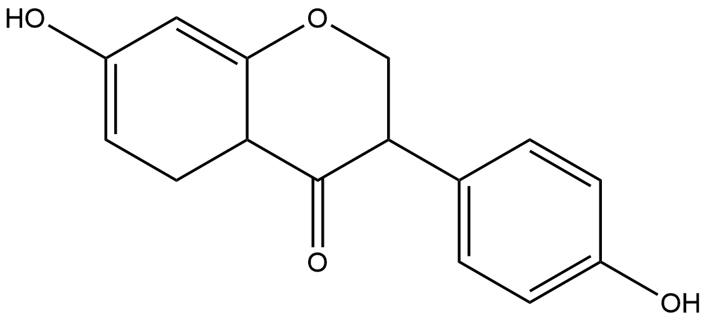
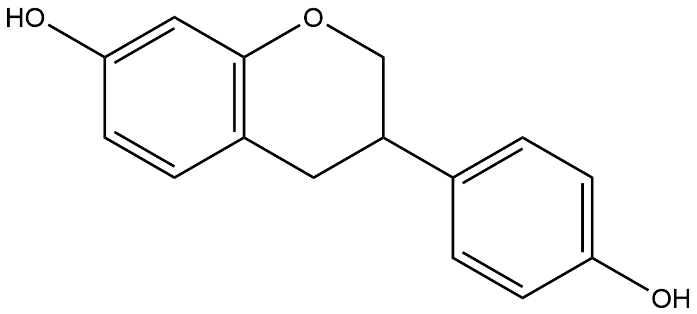
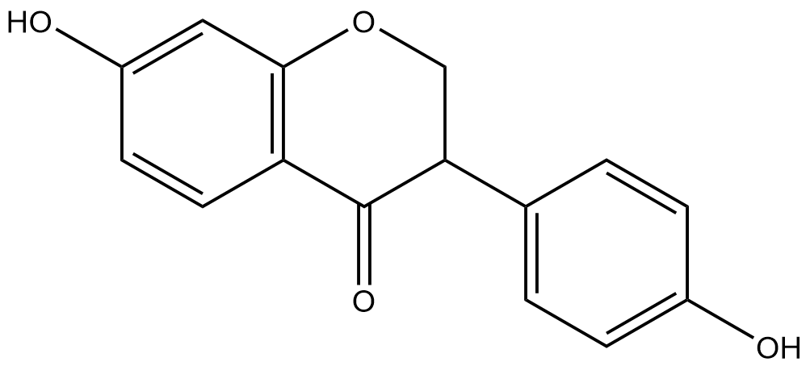
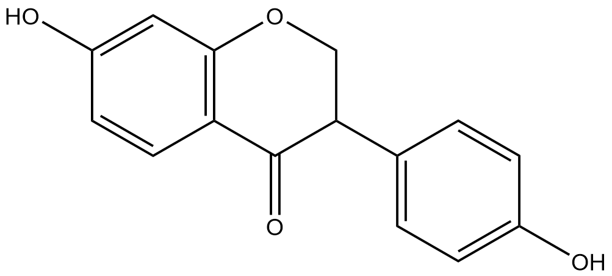
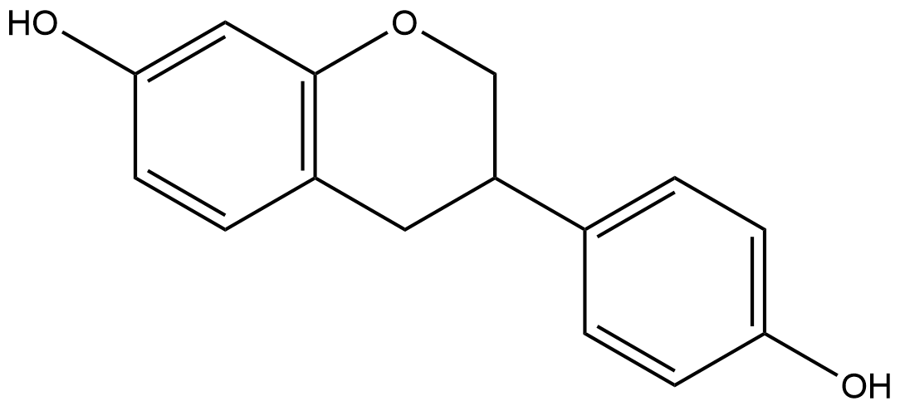

#  Oxidation/Reduction Reactions (ORs) Family 4 / Subfamily 1 

<!--[TOC]在这里不可以用-->

<ul id="myTab" class="nav nav-tabs">
  <!-- active 指的是默认页 -->
  <li class="active">
    <!-- herf中名字于下文id对应 -->
    <!-- 这里只改herf和tab1 -->
    <a href="#tab1" data-toggle="tab">E7FL40</a>
  </li>
  <li><a href="#tab2" data-toggle="tab">F7V1S3</a></li>
  <li><a href="#tab3" data-toggle="tab">H3JUE2</a></li>
  <li><a href="#tab4" data-toggle="tab">M9P0B3</a></li>
</ul>

  <!-- 此处的id与上文herf对应 其他的不要改-->
  

<h2>Literature Information</h2>
<table>
<thead>
<tr>
<th style="text-align:left">Title</th>
<th style="text-align:left">Identification of Two Novel Reductases Involved in Equol Biosynthesis in Lactococcus Strain 20–92</th>
</tr>
</thead>
<tbody>
<tr>
<td style="text-align:left">Author</td>
<td style="text-align:left">Shimada Y. , Takahashi M., Miyazawa N. , Ohtani T., Abiru Y., Uchiyama S., Hishigaki H.</td>
</tr>
<tr>
<td style="text-align:left">DOI</td>
<td style="text-align:left"><a href="https://doi.org/10.1159/000335049">10.1159/000335049</a></td>
</tr>
<tr>
<td style="text-align:left">Abstract</td>
<td style="text-align:left"><em>Lactococcus</em> strain 20–92 is a bacterium that produces equol directly from daidzein under anaerobic conditions. In this study, we reveal that the transcription of the gene encoding daidzein reductase in <em>Lactococcus</em> strain 20–92 (L-DZNR), which is responsible for the first stage of the biosynthesis of equol from daidzein, is regulated by the presence of daidzein. We analyzed the sequence surrounding the L-DZNR gene and found six novel genes, termed orf-US4, orf-US3, orf-US2, orf-US1, orf-DS1 and orf-DS2. These genes were expressed in <em>Escherichia coli,</em> and the resulting gene products were assayed for dihydrodaidzein reductase (DHDR) and tetrahydrodaidzein reductase (THDR) activity. The results showed that orf-US2 and orf-US3 encoded DHDR and THDR, respectively. DHDR in <em>Lactococcus</em> strain 20–92 (L-DHDR) was similar to the 3-oxoacyl-acyl-carrier-protein reductases of several bacteria and belonged to the short chain dehydrogenase/reductase family. THDR in <em>Lactococcus</em> strain 20–92 (L-THDR) was similar to several putative fumarate reductase/succinate dehydrogenase flavoprotein domain proteins. L-DHDR required NAD§H for its activity, whereas L-THDR required neither NADPH nor NADH. Thus, we succeeded in identifying two novel enzymes that are related to the second and third stages of the biosynthetic pathway that converts daidzein to equol.</td>
</tr>
</tbody>
</table>
<h2>Experimental results</h2>
<ul>
<li><strong>Enzyme</strong></li>
</ul>

Uniprot ID: <a href="https://www.uniprot.org/uniprot/E7FL40">E7FL40</a>

Protein: Tetrahydrodaidzein reductase

Organism: <em>Lactococcus garvieae</em>

Length: 486 AA

Taxonomic identifier: <a href="https://www.uniprot.org/taxonomy/1363">1363</a> [<a href="https://www.ncbi.nlm.nih.gov/Taxonomy/Browser/wwwtax.cgi?lvl=0&amp;id=1363">NCBI</a>]

<ul>
<li><strong>Pfam</strong></li>
</ul>
<table>
<thead>
<tr>
<th style="text-align:left">Source</th>
<th style="text-align:left">Domain</th>
<th style="text-align:left">Start</th>
<th style="text-align:left">End</th>
<th style="text-align:left">E-value (Domain)</th>
<th style="text-align:left">Coverage</th>
</tr>
</thead>
<tbody>
<tr>
<td style="text-align:left">Pfam-A</td>
<td style="text-align:left">FAD_binding_2</td>
<td style="text-align:left">9</td>
<td style="text-align:left">458</td>
<td style="text-align:left">9.4e-57</td>
<td style="text-align:left">0.978</td>
</tr>
</tbody>
</table>

Program: <code>hmmscan</code>

Version: 3.1b2 (February 2015)

Method: <code>hmmscan --domtblout hmmscan.tbl --noali -E 1e-5 pfam query.fa </code>

Date: Mon Jul 20 14:32:16 2020

Description:

FAD_binding_2

<a href="https://pfam.xfam.org/family/FAD_binding_2"><strong>Pfam</strong></a>

This family includes members that bind FAD. This family includes the flavoprotein subunits from succinate and fumarate dehydrogenase, aspartate oxidase and the alpha subunit of adenylylsulphate reductase.

<a href="http://www.ebi.ac.uk/interpro/entry/InterPro/IPR003953/"><strong>InterPro</strong></a>

This domain is found in proteins that bind FAD, mainly in FAD-dependent oxidoreductase family 2 proteins, such as the flavoprotein subunits from succinate and fumarate dehydrogenase, and aspartate oxidase<a href="#fn1" id="fnref1">[1]</a>.

<ul>
<li><strong>Reaction</strong></li>
</ul>

<a href="https://pubchem.ncbi.nlm.nih.gov/compound/tetrahydrodaidzein">tetrahydrodaidzein</a> ⇒ <a href="https://pubchem.ncbi.nlm.nih.gov/compound/equol">equol</a>

<figure>

  

    
  

  

    
  

  

    
  

</figure>
<h2>References</h2>

<section class="footnotes">
<ol class="footnotes-list">
<li id="fn1" class="footnote-item">
Mittl P R E, Schulz G E. Structure of glutathione reductase from Escherichia coli at 1.86 Å resolution: comparison with the enzyme from human erythrocytes[J]. Protein Science, 1994, 3(5): 799-809. <a href="#fnref1" class="footnote-backref">↩︎</a>

</li>
</ol>
</section>

  

  

<h2>Literature Information</h2>
<table>
<thead>
<tr>
<th style="text-align:left">Title</th>
<th style="text-align:left">The production of S-equol from daidzein is associated with a cluster of three genes in Eggerthella sp. YY7918</th>
</tr>
</thead>
<tbody>
<tr>
<td style="text-align:left">Author</td>
<td style="text-align:left">Yuika Kawada, Shinichiro Yokoyama, Emiko Yanase, Toshio Niwa, Tohru Suzuki</td>
</tr>
<tr>
<td style="text-align:left">DOI</td>
<td style="text-align:left"><a href="https://doi.org/10.12938/bmfh.2015-023">10.12938/bmfh.2015-023</a></td>
</tr>
<tr>
<td style="text-align:left">Abstract</td>
<td style="text-align:left"><mark>Daidzein</mark> (DZN) is converted to equol (EQL) by intestinal bacteria. We previously reported that <em>Eggerthella</em> sp. YY7918, which is found in human feces, is an EQL-producing bacterium and analyzed its whole genomic sequence. We found three coding sequences (CDSs) in this bacterium that showed 99% similarity to the EQL-producing enzymes of Lactococcus sp. 20-92. These identified CDSs were designated <em>eqlA</em>, <em>eqlB</em>, and <em>eqlC</em> and thought to encode daidzein reductase (DZNR), dihydrodaidzein reductase (DHDR), and tetrahydrodaidzein reductase (THDR), respectively. These genes were cloned into pColdII. Recombinant plasmids were then introduced into Escherichia coli BL21 (DE3) and DZNR, DHDR, and THDR were expressed and purified by 6×His-Tag chromatography. We confirmed that these three enzymes were involved in the conversion of DZN to EQL. Purified DZNR converted DZN to <mark>dihydrodaizein</mark> (DHD) in the presence of NADPH. DHDR converted DHD to <mark>tetrahydrodaizein</mark> (THD) in the presence of NADPH. Neither enzyme showed activities with NADH. THDR converted THD in the absence of cofactors, NAD§H, and also produced DHD as a by-product. Thus, we propose that THDR is not a reductase but a new type of dismutase. The GC content of these clusters was 64%, similar to the overall genomic GC content for <em>Eggerthella</em> and <em>Coriobacteriaceae</em> (56-60%), and higher than that for <em>Lactococcus garvieae</em> (39%), even though the gene cluster showed 99% similarity to that in <em>Lactococcus</em> sp. 20-92. Taken together, our results indicate that the gene cluster associated with EQL production evolved in high-GC bacteria including <em>Coriobacteriaceae</em> and was then laterally transferred to <em>Lactococcus</em> sp. 20-92.</td>
</tr>
</tbody>
</table>
<h2>Experimental results</h2>
<ul>
<li><strong>Enzyme</strong></li>
</ul>

Uniprot ID: <a href="https://www.uniprot.org/uniprot/F7V1S3">F7V1S3</a>

Protein: FAD_binding_2 domain-containing protein

Organism: <em>Eggerthella sp. (strain YY7918)</em>

Length: 486 AA

Taxonomic identifier: <a href="https://www.uniprot.org/taxonomy/502558">502558</a> [<a href="https://www.ncbi.nlm.nih.gov/Taxonomy/Browser/wwwtax.cgi?lvl=0&amp;id=502558">NCBI</a>]

<ul>
<li><strong>Pfam</strong></li>
</ul>
<table>
<thead>
<tr>
<th style="text-align:left">Source</th>
<th style="text-align:left">Domain</th>
<th style="text-align:left">Start</th>
<th style="text-align:left">End</th>
<th style="text-align:left">E-value (Domain)</th>
<th style="text-align:left">Coverage</th>
</tr>
</thead>
<tbody>
<tr>
<td style="text-align:left">Pfam-A</td>
<td style="text-align:left">FAD_binding_2</td>
<td style="text-align:left">9</td>
<td style="text-align:left">458</td>
<td style="text-align:left">2.4e-56</td>
<td style="text-align:left">0.978</td>
</tr>
</tbody>
</table>

Program: <code>hmmscan</code>

Version: 3.1b2 (February 2015)

Method: <code>hmmscan --domtblout hmmscan.tbl --noali -E 1e-5 pfam query.fa </code>

Date: Mon Jul 20 14:32:16 2020

Description:

FAD_binding_2

<a href="https://pfam.xfam.org/family/FAD_binding_2"><strong>Pfam</strong></a>

This family includes members that bind FAD. This family includes the flavoprotein subunits from succinate and fumarate dehydrogenase, aspartate oxidase and the alpha subunit of adenylylsulphate reductase.

<a href="http://www.ebi.ac.uk/interpro/entry/InterPro/IPR003953/"><strong>InterPro</strong></a>

This domain is found in proteins that bind FAD, mainly in FAD-dependent oxidoreductase family 2 proteins, such as the flavoprotein subunits from succinate and fumarate dehydrogenase, and aspartate oxidase<a href="#fn1" id="fnref1">[1]</a>.

<ul>
<li><strong>Reaction</strong></li>
</ul>

<a href="https://pubchem.ncbi.nlm.nih.gov/compound/tetrahydrodaidzein">tetrahydrodaidzein</a> ⇒ <a href="https://pubchem.ncbi.nlm.nih.gov/compound/equol">equol</a>

<figure>

  

    
  

  

    
  

  

    
  

</figure>

<a href="https://pubchem.ncbi.nlm.nih.gov/compound/tetrahydrodaidzein">tetrahydrodaidzein</a> ⇒ <a href="https://pubchem.ncbi.nlm.nih.gov/compound/dihydrodaidzein">dihydrodaidzein</a>[by-product]

<figure>

  

    
  

  

    
  

  

    
  

</figure>
<h2>References</h2>

<section class="footnotes">
<ol class="footnotes-list">
<li id="fn1" class="footnote-item">
Mittl P R E, Schulz G E. Structure of glutathione reductase from Escherichia coli at 1.86 Å resolution: comparison with the enzyme from human erythrocytes[J]. Protein Science, 1994, 3(5): 799-809. <a href="#fnref1" class="footnote-backref">↩︎</a>

</li>
</ol>
</section>

  

  

<h2>Literature Information</h2>
<table>
<thead>
<tr>
<th style="text-align:left">Title</th>
<th style="text-align:left">Identification of an Enzyme System for Daidzein-to-Equol Conversion in <em>Slackia</em> sp. Strain NATTS</th>
</tr>
</thead>
<tbody>
<tr>
<td style="text-align:left">Author</td>
<td style="text-align:left">Hirokazu Tsuji, Kaoru Moriyama, Koji Nomoto, Hideyuki Akaza</td>
</tr>
<tr>
<td style="text-align:left">DOI</td>
<td style="text-align:left"><a href="https://doi.org/10.1128/AEM.06779-11">10.1128/AEM.06779-11</a></td>
</tr>
<tr>
<td style="text-align:left">Abstract</td>
<td style="text-align:left">An <em>Escherichia coli</em> library comprising 8,424 strains incorporating gene fragments of the equol-producing bacterium <em>Slackia</em> sp. strain NATTS was constructed and screened for <em>E. coli</em> strains having daidzein- and dihydrodaidzein (DHD)- metabolizing activity. We obtained 3 clones that functioned to convert <mark>daidzein</mark> to DHD and 2 clones that converted DHD to equol. We then sequenced the gene fragments inserted into plasmids contained by these 5 clones. All of the gene fragments were contiguous, encoding three open reading frames (ORF-1, -2, and -3). Analysis of <em>E. coli</em> strains containing an expression vector incorporating one of the <em>orf-1</em>, <em>-2</em>, or <em>-3</em> genes revealed that (i) the protein encoded by <em>orf</em>-<em>1</em> was involved in the conversion of <mark>*cis/trans-*tetrahydrodaidzein</mark> (*cis/trans-*THD) to <mark>equol</mark>, (ii) the protein encoded by <em>orf</em>-<em>2</em> was involved in the conversion of DHD to *cis/trans-*THD, and (iii) the protein encoded by <em>orf</em>-<em>3</em> was involved in the conversion of daidzein to DHD. ORF-1 had a primary amino acid structure similar to that of succinate dehydrogenase. ORF-2 was presumed to be an enzyme belonging to the short-chain dehydrogenase/reductase superfamily. ORF-3 was predicted to have 42% identity to the daidzein reductase of <em>Lactococcus</em> strain 20-92 and belonged to the NADH:flavin oxidoreductase family. These findings showed that the daidzein-to-equol conversion reaction in the <em>Slackia</em> sp. NATTS strain proceeds by the action of these three enzymes.</td>
</tr>
</tbody>
</table>
<h2>Experimental results</h2>
<ul>
<li><strong>Enzyme</strong></li>
</ul>

Uniprot ID: <a href="https://www.uniprot.org/uniprot/H3JUE2">H3JUE2</a>

Protein: DHD-to-equol conversion enzyme 1

Organism: <em>Slackia sp. NATTS</em>

Length: 486 AA

Taxonomic identifier: <a href="https://www.uniprot.org/taxonomy/647703">647703</a> [<a href="https://www.ncbi.nlm.nih.gov/Taxonomy/Browser/wwwtax.cgi?lvl=0&amp;id=647703">NCBI</a>]

<ul>
<li><strong>Pfam</strong></li>
</ul>
<table>
<thead>
<tr>
<th style="text-align:left">Source</th>
<th style="text-align:left">Domain</th>
<th style="text-align:left">Start</th>
<th style="text-align:left">End</th>
<th style="text-align:left">E-value (Domain)</th>
<th style="text-align:left">Coverage</th>
</tr>
</thead>
<tbody>
<tr>
<td style="text-align:left">Pfam-A</td>
<td style="text-align:left">FAD_binding_2</td>
<td style="text-align:left">9</td>
<td style="text-align:left">459</td>
<td style="text-align:left">1e-56</td>
<td style="text-align:left">0.981</td>
</tr>
</tbody>
</table>

Program: <code>hmmscan</code>

Version: 3.1b2 (February 2015)

Method: <code>hmmscan --domtblout hmmscan.tbl --noali -E 1e-5 pfam query.fa </code>

Date: Mon Jul 20 14:32:16 2020

Description:

FAD_binding_2

<a href="https://pfam.xfam.org/family/FAD_binding_2"><strong>Pfam</strong></a>

This family includes members that bind FAD. This family includes the flavoprotein subunits from succinate and fumarate dehydrogenase, aspartate oxidase and the alpha subunit of adenylylsulphate reductase.

<a href="http://www.ebi.ac.uk/interpro/entry/InterPro/IPR003953/"><strong>InterPro</strong></a>

This domain is found in proteins that bind FAD, mainly in FAD-dependent oxidoreductase family 2 proteins, such as the flavoprotein subunits from succinate and fumarate dehydrogenase, and aspartate oxidase<a href="#fn1" id="fnref1">[1]</a>.

<ul>
<li><strong>Reaction</strong></li>
</ul>

<a href="https://pubchem.ncbi.nlm.nih.gov/compound/tetrahydrodaidzein">tetrahydrodaidzein</a> ⇒ <a href="https://pubchem.ncbi.nlm.nih.gov/compound/equol">equol</a>

<figure>

  

    
  

  

    
  

  

    
  

</figure>
<h2>References</h2>

<section class="footnotes">
<ol class="footnotes-list">
<li id="fn1" class="footnote-item">
Mittl P R E, Schulz G E. Structure of glutathione reductase from Escherichia coli at 1.86 Å resolution: comparison with the enzyme from human erythrocytes[J]. Protein Science, 1994, 3(5): 799-809. <a href="#fnref1" class="footnote-backref">↩︎</a>

</li>
</ol>
</section>

  

  

<h2>Literature Information</h2>
<table>
<thead>
<tr>
<th style="text-align:left">Title</th>
<th style="text-align:left">Identification and expression of genes involved in the conversion of daidzein and genistein by the equol-forming <em>Slackia isoflavoniconvertens</em></th>
</tr>
</thead>
<tbody>
<tr>
<td style="text-align:left">Author</td>
<td style="text-align:left">Christine Schröder, Anastasia Matthies, Wolfram Engst, Michael Blaut, Annett Braune</td>
</tr>
<tr>
<td style="text-align:left">DOI</td>
<td style="text-align:left"><a href="https://doi.org/10.1128/AEM.03693-12">10.1128/AEM.03693-12</a></td>
</tr>
<tr>
<td style="text-align:left">Abstract</td>
<td style="text-align:left">Gut bacteria play a key role in the metabolism of dietary isoflavones, thereby influencing the availability and bioactivation of these polyphenols in the intestine. The human intestinal <em>Slackia isoflavoniconvertens</em> converts the main soybean isoflavones daidzein and genistein to equol and 5-hydroxy-equol, respectively. Cell extracts of <em>S. isoflavoniconvertens</em> catalyzed the conversion of daidzein <em>via</em> dihydrodaidzein to equol and that of genistein to dihydrogenistein. Growth of <em>S. isoflavoniconvertens</em> in the presence of daidzein led to the induction of several proteins as observed by two-dimensional difference gel electrophoresis. Based on determined peptide sequences, we identified a cluster of eight genes encoding the daidzein-induced proteins. Heterologous expression of three of these genes in <em>Escherichia coli</em> and enzyme activity tests with resulting cell extracts identified the corresponding gene products as a daidzein reductase (DZNR), a dihydrodaidzein reductase (DHDR) and a tetrahydrodaidzein reductase (THDR). The recombinant DZNR also converted <mark>genistein</mark> to <mark>dihydrogenistein</mark> at higher rates than observed for the conversion of daidzein to dihydrodaidzein. Higher rates were also observed with cell extracts of <em>S. isoflavoniconvertens</em>. The recombinant DHDR and THDR catalyzed the reduction of <mark>dihydrodaidzein</mark> to <mark>equol</mark>, while the corresponding conversion of dihydrogenistein to 5-hydroxy-equol was not observed. The DZNR, DHDR and THDR were expressed as <em>Strep</em>-tag fusion proteins and subsequently purified by affinity chromatography. The purified enzymes were further characterized with regard to their activity, stereochemistry, quaternary structure, and content of flavin cofactors.</td>
</tr>
</tbody>
</table>
<h2>Experimental results</h2>
<ul>
<li><strong>Enzyme</strong></li>
</ul>

Uniprot ID: <a href="https://www.uniprot.org/uniprot/M9P0B3">M9P0B3</a>

Protein: Succinate dehydrogenase

Organism: <em>Slackia isoflavoniconvertens</em>

Length: 486 AA

Taxonomic identifier: <a href="https://www.uniprot.org/taxonomy/572010"> 572010</a> [<a href="https://www.ncbi.nlm.nih.gov/Taxonomy/Browser/wwwtax.cgi?lvl=0&amp;id=572010">NCBI</a>]

<ul>
<li><strong>Pfam</strong></li>
</ul>
<table>
<thead>
<tr>
<th style="text-align:left">Source</th>
<th style="text-align:left">Domain</th>
<th style="text-align:left">Start</th>
<th style="text-align:left">End</th>
<th style="text-align:left">E-value (Domain)</th>
<th style="text-align:left">Coverage</th>
</tr>
</thead>
<tbody>
<tr>
<td style="text-align:left">Pfam-A</td>
<td style="text-align:left">FAD_binding_2</td>
<td style="text-align:left">9</td>
<td style="text-align:left">459</td>
<td style="text-align:left">5.8e-57</td>
<td style="text-align:left">0.981</td>
</tr>
</tbody>
</table>

Program: <code>hmmscan</code>

Version: 3.1b2 (February 2015)

Method: <code>hmmscan --domtblout hmmscan.tbl --noali -E 1e-5 pfam query.fa </code>

Date: Mon Jul 20 14:32:16 2020

Description:

FAD_binding_2

<a href="https://pfam.xfam.org/family/FAD_binding_2"><strong>Pfam</strong></a>

This family includes members that bind FAD. This family includes the flavoprotein subunits from succinate and fumarate dehydrogenase, aspartate oxidase and the alpha subunit of adenylylsulphate reductase.

<a href="http://www.ebi.ac.uk/interpro/entry/InterPro/IPR003953/"><strong>InterPro</strong></a>

This domain is found in proteins that bind FAD, mainly in FAD-dependent oxidoreductase family 2 proteins, such as the flavoprotein subunits from succinate and fumarate dehydrogenase, and aspartate oxidase<a href="#fn1" id="fnref1">[1]</a>.

<ul>
<li><strong>Reaction</strong></li>
</ul>

<em>Recombined with <a href="https://www.uniprot.org/uniprot/M9NYU8">M9NYU8</a></em>

<a href="https://pubchem.ncbi.nlm.nih.gov/compound/dihydrodaidzein">dihydrodaidzein</a> ⇒ <a href="https://pubchem.ncbi.nlm.nih.gov/compound/equol">equol</a>

<figure>

  

    
  

  

    
  

  

    
  

</figure>
<h2>References</h2>

<section class="footnotes">
<ol class="footnotes-list">
<li id="fn1" class="footnote-item">
Mittl P R E, Schulz G E. Structure of glutathione reductase from Escherichia coli at 1.86 Å resolution: comparison with the enzyme from human erythrocytes[J]. Protein Science, 1994, 3(5): 799-809. <a href="#fnref1" class="footnote-backref">↩︎</a>

</li>
</ol>
</section>

  

