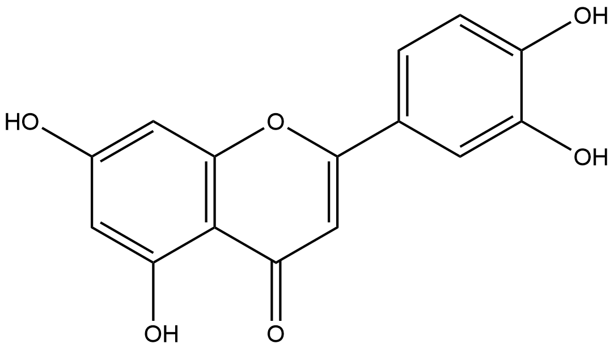
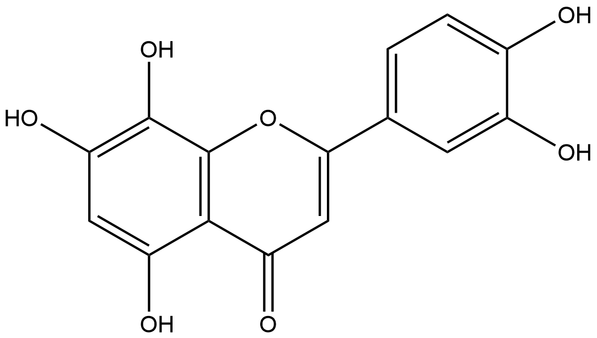

#  Oxidation/Reduction Reactions (ORs) Family 6

##  Literature Information

| Title    | Production of bioactive hydroxyflavones by using monooxygenase from Saccharothrix espanaensis |
| :------- | :----------------------------------------------------------- |
| Author   | Hyejin Lee , Bong-Gyu Kim , Joong-Hoon Ahn                   |
| DOI      | [10.1016/j.jbiotec.2014.02.002](https://doi.org/10.1016/j.jbiotec.2014.02.002) |
| Abstract | Biocatalysts are a valuable tool for the structural modification of fine chemicals. Flavonoids possess several biological activities, which are correlated to their antioxidant activity. The numbers of hydroxyl groups in flavonoids are critical for their antioxidant activity. Development of biocatalysts for hydroxylation of flavonoids is challenging because of the difficulty in expressing flavonoid hydroxylase in Escherichia coli. In this study, a monooxygenase from Saccharothrix espanaensis (Sam5) was used for regioselective hydroxylation of flavonoids. We found that Sam5 hydroxylated isoflavones, flavanones, and flavones but did not produce any detectable hydroxylated product with flavonols. In addition, coexpression of P450 reductase with Sam5 in E. coli enhanced hydroxylation by approximately from 34 to 50%, depending on the flavonoid used. The production of two bioactive flavonoids, ==8-hydroxyluteolin== and ==3'-hydroxydaidzein== was optimized using this Sam5 system. Approximately 88mg/L of 8-hydroxyluteolin and 75mg/L of 3'-hydroxydaidzein were obtained. These results indicate that the Sam5 system could be used for the production of bioactive hydroxylated flavonoids. |

##  Experimental results

- **Enzyme**

Uniprot ID: [Q2EYY8](https://www.uniprot.org/uniprot/Q2EYY8)

Protein:  4-coumarate 3-hydroxylase

Organism: *Saccharothrix espanaensis*

Length: 512 AA

Taxonomic identifier: [103731](https://www.uniprot.org/taxonomy/103731) [[NCBI](https://www.ncbi.nlm.nih.gov/Taxonomy/Browser/wwwtax.cgi?lvl=0&id=103731)]

- **Pfam**

| Source | Domain | Start | End  | E-value (Domain) | Coverage |
| ------ | ------ | ----- | ---- | ---------------- | -------- |
| Pfam-A | HpaB   | 289   | 490  | 2.5e-68          | 0.990    |
| Pfam-A | HpaB_N | 19    | 283  | 3e-94            | 0.996    |

Program: `hmmscan`

Version: 3.1b2 (February 2015)

Method: `hmmscan --domtblout hmmscan.tbl --noali -E 1e-5 pfam query.fa `

Date: Mon Jul 20 14:32:16 2020

Description:

1. HpaB

   [**Pfam**](https://pfam.xfam.org/family/HpaB)

   HpaB [Q57160](http://www.uniprot.org/entry/Q57160) encodes part of the 4-hydroxyphenylacetate 3-hydroxylase from Escherichia coli [^1]. HpaB is part of a heterodimeric enzyme that also requires HpaC. The enzyme is NADH-dependent and uses FAD as the redox chromophore. This family also includes PvcC [O30372](http://www.uniprot.org/entry/O30372) may play a role in one of the proposed hydroxylation steps of pyoverdine chromophore biosynthesis [^2].

   [**InterPro**](http://www.ebi.ac.uk/interpro/entry/InterPro/IPR024719/)

   This C-terminal domain is found in HpaB, which encodes part of the 4-hydroxyphenylacetate 3-hydroxylase from Escherichia coli[^1]. The enzyme is NADH-dependent and uses FAD as the redox chromophore. This domain is also found in pyoverdin chromophore biosynthetic protein PvcC, which may play a role in one of the proposed hydroxylation steps of pyoverdine chromophore biosynthesis[^2] and in 4-hydroxybutyryl-CoA dehydratase (4-BUDH), a key enzyme in the metabolism of gamma-aminobutyrate[^3].

2. HpaB_N

   [**Pfam**](https://pfam.xfam.org/family/HpaB_N)

   HpaB [Q57160](http://www.uniprot.org/entry/Q57160) encodes part of the 4-hydroxyphenylacetate 3-hydroxylase from Escherichia coli[^1]. HpaB is part of a heterodimeric enzyme that also requires HpaC. The enzyme is NADH-dependent and uses FAD as the redox chromophore. This family also includes PvcC [O30372](http://www.uniprot.org/entry/O30372) may play a role in one of the proposed hydroxylation steps of pyoverdine chromophore biosynthesis[^2].

   [**InterPro**](http://www.ebi.ac.uk/interpro/entry/InterPro/IPR024674/)

   This domain is found in the N terminus of HpaB, which encodes part of the 4-hydroxyphenylacetate 3-hydroxylase from Escherichia coli[^1]. The enzyme is NADH-dependent and uses FAD as the redox chromophore. The domain is also found in pyoverdin chromophore biosynthetic protein (PvcC), which may play a role in one of the proposed hydroxylation steps of pyoverdine chromophore biosynthesis[^2] and in 4-hydroxybutyryl-CoA dehydratase (4-BUDH), a key enzyme in the metabolism of gamma-aminobutyrate[^3].

- **Reaction**

[luteolin](https://pubchem.ncbi.nlm.nih.gov/compound/luteolin) &rArr; [8-hydroxyluteolin](https://pubchem.ncbi.nlm.nih.gov/compound/8-hydroxyluteolin)

<figure>

  

    
  

  

    
  

  

    
  

</figure>

## References

[^1]: Prieto M A, Garcia J L. Molecular characterization of 4-hydroxyphenylacetate 3-hydroxylase of Escherichia coli. A two-protein component enzyme[J]. Journal of Biological Chemistry, 1994, 269(36): 22823-22829.
[^2]:Stintzi A, Johnson Z, Stonehouse M, et al. The pvc gene cluster ofPseudomonas aeruginosa: role in synthesis of the pyoverdine chromophore and regulation by PtxR and PvdS[J]. Journal of bacteriology, 1999, 181(13): 4118-4124.
[^3]:SCHERF U, BUCKEL W. Purification and properties of an iron‐sulfur and FAD‐containing 4‐hydroxybutyryl‐CoA dehydratase/vinylacetyl‐CoA delta 3‐delta 2‐isomerase from Clostridium aminobutyricum[J]. European journal of biochemistry, 1993, 215(2): 421-429.

