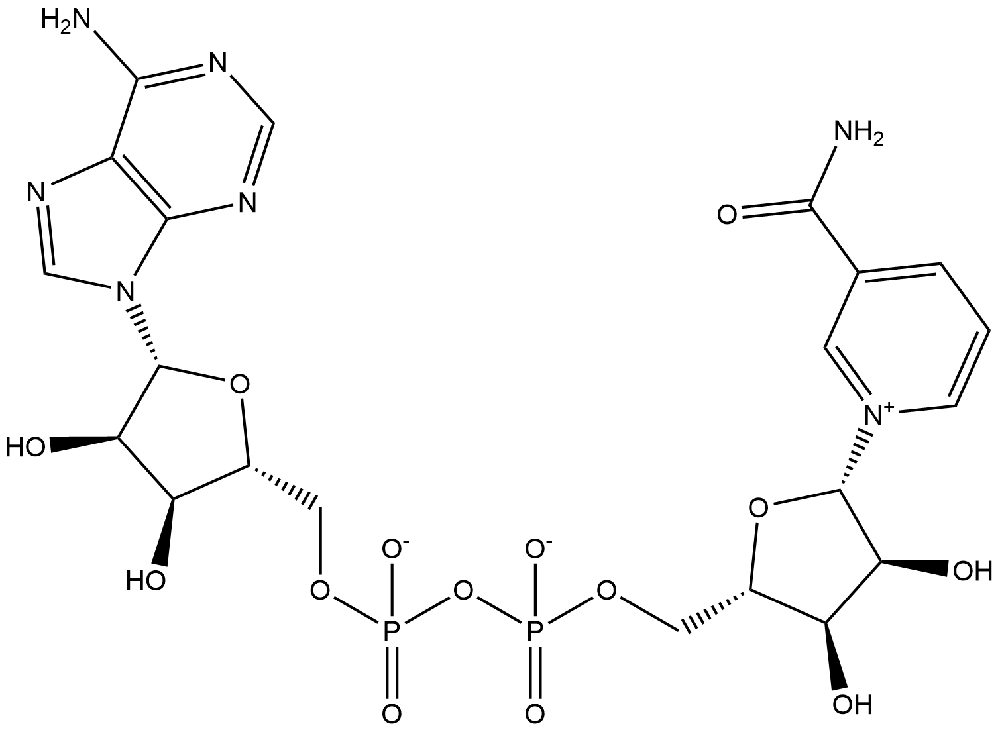

#  Oxidation/Reduction Reactions (ORs) Family 7 / Subfamily 1

<!--[TOC]在这里不可以用-->

<ul id="myTab" class="nav nav-tabs">
  <!-- active 指的是默认页 -->
  <li class="active">
    <!-- herf中名字于下文id对应 -->
    <!-- 这里只改herf和tab1 -->
    <a href="#tab1" data-toggle="tab">Q74HL7</a>
  </li>
  <li><a href="#tab2" data-toggle="tab">Q74HL8</a></li>
</ul>

  <!-- 此处的id与上文herf对应 其他的不要改-->
  

##  Literature Information

| Title    | H2O2 Production in Species of the *Lactobacillus acidophilus* Group: a Central Role for a Novel NADH-Dependent Flavin Reductase |
| :------- | :----------------------------------------------------------- |
| Author   | Rosanne Hertzberger, Jos Arents, Henk L. Dekker, R. David Pridmore, Christof Gysler, Michiel Kleerebezem, M. Joost Teixeira de Mattos |
| DOI      | [10.1128/AEM.04272-13](https://doi.org/10.1128/AEM.04272-13) |
| Abstract | Hydrogen peroxide production is a well-known trait of many bacterial species associated with the human body. In the presence of oxygen, the probiotic lactic acid bacterium *Lactobacillus johnsonii* NCC 533 excretes up to 1 mM H2O2, inducing growth stagnation and cell death. Disruption of genes commonly assumed to be involved in H2O2 production (e.g., pyruvate oxidase, NADH oxidase, and lactate oxidase) did not affect this. Here we describe the purification of a novel NADH-dependent flavin reductase encoded by two highly similar genes (*LJ*_*0548* and *LJ*_*0549*) that are conserved in lactobacilli belonging to the *Lactobacillus acidophilus* group. The genes are predicted to encode two 20-kDa proteins containing flavin mononucleotide (FMN) reductase conserved domains. Reductase activity requires FMN, flavin adenine dinucleotide (FAD), or riboflavin and is specific for NADH and not NADPH. The *Km* for FMN is 30 ± 8 μM, in accordance with its proposed *in vivo* role in H2O2 production. Deletion of the encoding genes in *L. johnsonii* led to a 40-fold reduction of hydrogen peroxide formation. H2O2 production in this mutant could only be restored by in *trans* complementation of both genes. Our work identifies a novel, conserved NADH-dependent flavin reductase that is prominently involved in H2O2 production in *L. johnsonii*. |

##  Experimental results

- **Enzyme**

Uniprot ID: [Q74HL7](https://www.uniprot.org/uniprot/Q74HL7)

Protein:  NADH-dependent flavin reductase subunit 1

Organism: *Lactobacillus johnsonii (strain CNCM I-12250 / La1 / NCC 533)*

Length: 178 AA

Taxonomic identifier: [257314](https://www.uniprot.org/taxonomy/257314) [[NCBI](https://www.ncbi.nlm.nih.gov/Taxonomy/Browser/wwwtax.cgi?lvl=0&id=257314)]

- **Pfam**

| Source | Domain  | Start | End  | E-value (Domain) | Coverage |
| ------ | ------- | ----- | ---- | ---------------- | -------- |
| Pfam-A | FMN_red | 1     | 144  | 2.1e-29          | 0.981    |

Program: `hmmscan`

Version: 3.1b2 (February 2015)

Method: `hmmscan --domtblout hmmscan.tbl --noali -E 1e-5 pfam query.fa `

Date: Mon Jul 20 14:32:16 2020

Description:

FMN_red 

[**Pfam**](https://pfam.xfam.org/family/FMN_red)

No Pfam abstract.

[**InterPro**](http://www.ebi.ac.uk/interpro/entry/InterPro/IPR005025/)

This domain in found in several flavoproteins such as FMN-dependent NADPH-azoreductase, which catalyses the reductive cleavage of azo bond in aromatic azo compounds to the corresponding amines[^1], and NAD(P)H:quinone oxidoreductase, which reduces quinones to the hydroquinone state to prevent interaction of the semiquinone with O2 and production of superoxide[^2]. In Arabidopsis NADPH:quinone oxidoreductase is involved in detoxification pathways[^3]. NAD(P)H:quinone oxidoreductase prefers NADH over NADPH, while FMN-dependent NADPH-azoreductase requires NADPH, but not NADH, as an electron donor for its activity.

Other proteins with this domain include iron-sulfur flavoproteins[^4] and chromate reductase[^5].

- **Reaction**

[flavin mononucleotide](https://pubchem.ncbi.nlm.nih.gov/compound/flavin%20mononucleotide) + [NADH](https://pubchem.ncbi.nlm.nih.gov/compound/439153) + [H+](https://pubchem.ncbi.nlm.nih.gov/compound/1038) &rArr; [1,5-Dihydroriboflavin 5'-(dihydrogen phosphate)](https://pubchem.ncbi.nlm.nih.gov/compound/1,5-Dihydroriboflavin%205'-(dihydrogen%20phosphate)) + [NAD+](https://pubchem.ncbi.nlm.nih.gov/compound/5892)

<figure>

  

    
  

  

    
  

  

    
  

  

    
  

  

    
  

  

    
  

  

    
  

  

    
  

  

    
  

</figure>

## References

[^1]:Deller S, Sollner S, Trenker-El-Toukhy R, et al. Characterization of a thermostable NADPH: FMN oxidoreductase from the mesophilic bacterium Bacillus subtilis[J]. Biochemistry, 2006, 45(23): 7083-7091.
[^2]:Grandori R, Khalifah P, Boice J A, et al. Biochemical characterization of WrbA, founding member of a new family of multimeric flavodoxin-like proteins[J]. Journal of Biological Chemistry, 1998, 273(33): 20960-20966.
[^3]:Sparla F, Tedeschi G, Pupillo P, et al. Cloning and heterologous expression of NAD (P) H: quinone reductase of Arabidopsis thaliana, a functional homologue of animal DT-diaphorase[J]. FEBS letters, 1999, 463(3): 382-386.
[^4]:Zhao T, Cruz F, Ferry J G. Iron-Sulfur Flavoprotein (Isf) fromMethanosarcina thermophila Is the Prototype of a Widely Distributed Family[J]. Journal of Bacteriology, 2001, 183(21): 6225-6233.
[^5]:Ackerley D F, Gonzalez C F, Park C H, et al. Chromate-reducing properties of soluble flavoproteins from Pseudomonas putida and Escherichia coli[J]. Applied and environmental microbiology, 2004, 70(2): 873-882.

  

  

##  Literature Information

| Title    | H2O2 Production in Species of the *Lactobacillus acidophilus* Group: a Central Role for a Novel NADH-Dependent Flavin Reductase |
| :------- | :----------------------------------------------------------- |
| Author   | Rosanne Hertzberger, Jos Arents, Henk L. Dekker, R. David Pridmore, Christof Gysler, Michiel Kleerebezem, M. Joost Teixeira de Mattos |
| DOI      | [10.1128/AEM.04272-13](https://doi.org/10.1128/AEM.04272-13) |
| Abstract | Hydrogen peroxide production is a well-known trait of many bacterial species associated with the human body. In the presence of oxygen, the probiotic lactic acid bacterium *Lactobacillus johnsonii* NCC 533 excretes up to 1 mM H2O2, inducing growth stagnation and cell death. Disruption of genes commonly assumed to be involved in H2O2 production (e.g., pyruvate oxidase, NADH oxidase, and lactate oxidase) did not affect this. Here we describe the purification of a novel NADH-dependent flavin reductase encoded by two highly similar genes (*LJ*_*0548* and *LJ*_*0549*) that are conserved in lactobacilli belonging to the *Lactobacillus acidophilus* group. The genes are predicted to encode two 20-kDa proteins containing flavin mononucleotide (FMN) reductase conserved domains. Reductase activity requires FMN, flavin adenine dinucleotide (FAD), or riboflavin and is specific for NADH and not NADPH. The *Km* for FMN is 30 ± 8 μM, in accordance with its proposed *in vivo* role in H2O2 production. Deletion of the encoding genes in *L. johnsonii* led to a 40-fold reduction of hydrogen peroxide formation. H2O2 production in this mutant could only be restored by in *trans* complementation of both genes. Our work identifies a novel, conserved NADH-dependent flavin reductase that is prominently involved in H2O2 production in *L. johnsonii*. |

##  Experimental results

- **Enzyme**

Uniprot ID: [Q74HL8](https://www.uniprot.org/uniprot/Q74HL8)

Protein:  NADH-dependent flavin reductase subunit 2

Organism: *Lactobacillus johnsonii (strain CNCM I-12250 / La1 / NCC 533)*

Length: 184 AA

Taxonomic identifier: [257314](https://www.uniprot.org/taxonomy/257314) [[NCBI](https://www.ncbi.nlm.nih.gov/Taxonomy/Browser/wwwtax.cgi?lvl=0&id=257314)]

- **Pfam**

| Source | Domain  | Start | End  | E-value (Domain) | Coverage |
| ------ | ------- | ----- | ---- | ---------------- | -------- |
| Pfam-A | FMN_red | 1     | 149  | 7e-30            | 0.987    |

Program: `hmmscan`

Version: 3.1b2 (February 2015)

Method: `hmmscan --domtblout hmmscan.tbl --noali -E 1e-5 pfam query.fa `

Date: Mon Jul 20 14:32:16 2020

Description:

FMN_red 

[**Pfam**](https://pfam.xfam.org/family/FMN_red)

No Pfam abstract.

[**InterPro**](http://www.ebi.ac.uk/interpro/entry/InterPro/IPR005025/)

This domain in found in several flavoproteins such as FMN-dependent NADPH-azoreductase, which catalyses the reductive cleavage of azo bond in aromatic azo compounds to the corresponding amines[^1], and NAD(P)H:quinone oxidoreductase, which reduces quinones to the hydroquinone state to prevent interaction of the semiquinone with O2 and production of superoxide[^2]. In Arabidopsis NADPH:quinone oxidoreductase is involved in detoxification pathways[^3]. NAD(P)H:quinone oxidoreductase prefers NADH over NADPH, while FMN-dependent NADPH-azoreductase requires NADPH, but not NADH, as an electron donor for its activity.

Other proteins with this domain include iron-sulfur flavoproteins[^4] and chromate reductase[^5].

- **Reaction**

[flavin mononucleotide](https://pubchem.ncbi.nlm.nih.gov/compound/flavin%20mononucleotide) + [NADH](https://pubchem.ncbi.nlm.nih.gov/compound/439153) + [H+](https://pubchem.ncbi.nlm.nih.gov/compound/1038) &rArr; [1,5-Dihydroriboflavin 5'-(dihydrogen phosphate)](https://pubchem.ncbi.nlm.nih.gov/compound/1,5-Dihydroriboflavin%205'-(dihydrogen%20phosphate)) + [NAD+](https://pubchem.ncbi.nlm.nih.gov/compound/5892)

<figure>

  

    
  

  

    
  

  

    
  

  

    
  

  

    
  

  

    
  

  

    
  

  

    
  

  

    
  

</figure>

## References

[^1]: Deller S, Sollner S, Trenker-El-Toukhy R, et al. Characterization of a thermostable NADPH: FMN oxidoreductase from the mesophilic bacterium Bacillus subtilis[J]. Biochemistry, 2006, 45(23): 7083-7091.
[^2]: Grandori R, Khalifah P, Boice J A, et al. Biochemical characterization of WrbA, founding member of a new family of multimeric flavodoxin-like proteins[J]. Journal of Biological Chemistry, 1998, 273(33): 20960-20966.
[^3]: Sparla F, Tedeschi G, Pupillo P, et al. Cloning and heterologous expression of NAD (P) H: quinone reductase of Arabidopsis thaliana, a functional homologue of animal DT-diaphorase[J]. FEBS letters, 1999, 463(3): 382-386.
[^4]: Zhao T, Cruz F, Ferry J G. Iron-Sulfur Flavoprotein (Isf) fromMethanosarcina thermophila Is the Prototype of a Widely Distributed Family[J]. Journal of Bacteriology, 2001, 183(21): 6225-6233.
[^5]: Ackerley D F, Gonzalez C F, Park C H, et al. Chromate-reducing properties of soluble flavoproteins from Pseudomonas putida and Escherichia coli[J]. Applied and environmental microbiology, 2004, 70(2): 873-882.

  

