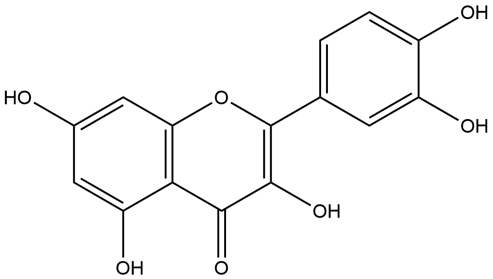

#  Oxidation/Reduction Reactions (ORs) Family 8 / Subfamily 1

##  Literature Information

| Title    | Kinetic and Spectroscopic Studies on the Quercetin 2,3-Dioxygenase from *Bacillus subtilis* |
| :------- | :----------------------------------------------------------- |
| Author   | Matthew R. Schaab, Brett M. Barney, and Wilson A. Francisco  |
| DOI      | [10.1021/bi051571c](https://doi.org/10.1021/bi051571c)       |
| Abstract | Quercetin 2,3-dioxygenase from *Bacillus subtilis* (QueD) converts the flavonol ==quercetin== and molecular oxygen to ==2-protocatechuoylphloroglucinolcarboxylic acid== and carbon monoxide. QueD, the only known quercetin 2,3-dioxygenase from a prokaryotic organism, has been described as an Fe2+-dependent bicupin dioxygenase. Metal-substituted QueDs were generated by expressing the enzyme in *Escherichia coli* grown on minimal media in the presence of a number of divalent metals. The addition of Mn2+, Co2+, and Cu2+ generated active enzymes, but the addition of Zn2+, Fe2+, and Cd2+ did not increase quercetinase activity to any significant level over a control in which no divalent ions were added to the media. The Mn2+- and Co2+-containing QueDs were purified, characterized by metal analysis and EPR spectroscopy, and studied by steady-state kinetics. Mn2+ was found to be incorporated nearly stoichiometrically to the two cupin motifs. The hyperfine coupling constant of the *g* = 2 signal in the EPR spectra of the Mn2+-containing enzyme showed that the two Mn2+ ions are ligated in an octahedral coordination. The turnover number of this enzyme was found to be in the order of 25 s-1, nearly 40-fold higher than that of the Fe2+-containing enzyme and similar in magnitude to that of the Cu2+-containing quercertin 2,3-dioxygenase from *Aspergillus japonicus*. In addition, kinetic and spectroscopic data suggest that the catalytic mechanism of QueD is different from that of the *Aspergillus* quercetinases but similar to that proposed for the extradiol catechol dioxygenases. This study provides evidence that Mn2+ might be the preferred cofactor for this enzyme and identifies QueD as a new member of the manganese dioxygenase family. |

##  Experimental results

- **Enzyme**

Uniprot ID: [P42106](https://www.uniprot.org/uniprot/P42106)

Protein:  Quercetin 2,3-dioxygenase

Organism: *Bacillus subtilis (strain 168)*

Length: 337 AA

Taxonomic identifier: [224308](https://www.uniprot.org/taxonomy/224308) [[NCBI](https://www.ncbi.nlm.nih.gov/Taxonomy/Browser/wwwtax.cgi?lvl=0&id=224308)]

- **Pfam**

| Source | Domain  | Start | End  | E-value (Domain) | Coverage |
| ------ | ------- | ----- | ---- | ---------------- | -------- |
| Pfam-A | Cupin_2 | 55    | 110  | 7.1e-13          | 0.775    |
| Pfam-A | Cupin_2 | 226   | 281  | 5.1e-16          | 0.775    |

Program: `hmmscan`

Version: 3.1b2 (February 2015)

Method: `hmmscan --domtblout hmmscan.tbl --noali -E 1e-5 pfam query.fa `

Date: Mon Jul 20 14:32:16 2020

Description:

Cupin_2

[**Pfam**](https://pfam.xfam.org/family/Cupin_2)

This family represents the conserved barrel domain of the 'cupin' superfamily[^1] ('cupa' is the Latin term for a small barrel).

[**InterPro**](http://www.ebi.ac.uk/interpro/entry/InterPro/IPR013096/)

This family represents the conserved barrel domain of the cupin superfamily[^1] (cupa is the Latin term for a small barrel).

- **Reaction**

[quercetin](https://pubchem.ncbi.nlm.nih.gov/compound/quercetin) + [oxygen](https://pubchem.ncbi.nlm.nih.gov/compound/Oxygen) &rArr; [2-(3,4-dihydroxybenzoyloxy)-4,6-dihydroxybenzoate](https://pubchem.ncbi.nlm.nih.gov/compound/2-(3,4-dihydroxybenzoyloxy)-4,6-dihydroxybenzoate) + [carbon monoxide](https://pubchem.ncbi.nlm.nih.gov/compound/281) + [H+](https://pubchem.ncbi.nlm.nih.gov/compound/1038)

<figure>

  

    
  

  

    
  

  

    
  

  

    
  

  

    
  

  

    
  

  

    
  

  

    
  

  

    
  

</figure>

## References

[^1]:Dunwell J M. Cupins: a new superfamily of functionally diverse proteins that include germins and plant storage proteins[J]. Biotechnology and Genetic Engineering Reviews, 1998, 15(1): 1-32.

