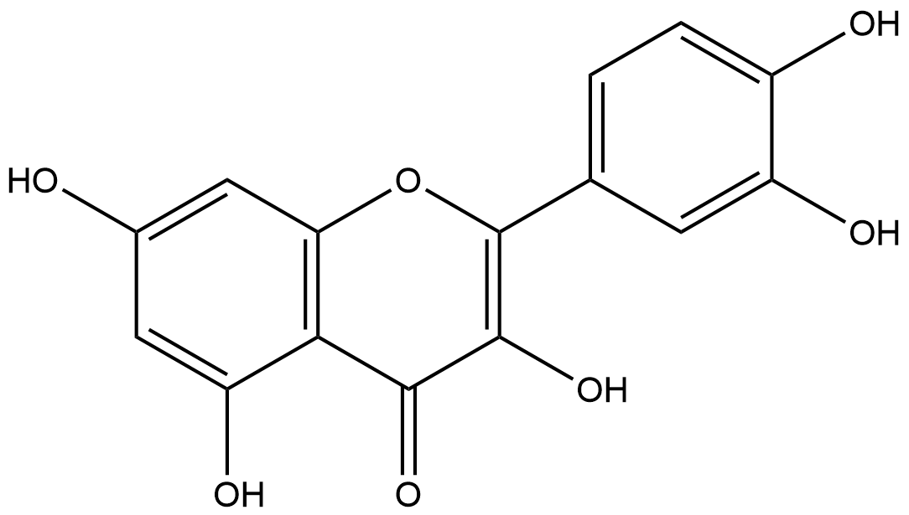

#  Oxidation/Reduction Reactions (ORs) Family 8 / Subfamily 2

##  Literature Information

| Title    | A new monocupin quercetinase of *Streptomyces* sp. FLA: identification and heterologous expression of the *queD* gene and activity of the recombinant enzyme towards different flavonols |
| :------- | :----------------------------------------------------------- |
| Author   | Hedda Merkens, Sonja Sielker, Karsten Rose & Susanne Fetzner |
| DOI      | [10.1007/s00203-007-0215-z](https://doi.org/10.1007/s00203-007-0215-z) |
| Abstract | The gene *queD* encoding quercetinase of *Streptomyces* sp. FLA, a soil isolate related to *S. eurythermus* T, was identified. Quercetinases catalyze the 2,4-dioxygenolytic cleavage of 3,5,7,3′,4′-pentahydroxyflavone to ==2-protocatechuoylphloroglucinol carboxylic acid== and carbon monoxide. The *queD* gene was expressed in *S. lividans* and *E. coli*, and the recombinant hexahistidine-tagged protein (QueDHis6) was purified. Several flavonols were converted by QueDHis6, whereas CO formation from the 2,3-dihydroflavonol taxifolin and the flavone luteolin were not observed. In contrast to bicupin quercetinases from *Aspergillus japonicus* and *Bacillus subtilis*, and bicupin pirins showing quercetinase activity, QueD of strain FLA is a monocupin exhibiting 35.9% sequence identity to the C-terminal domain of *B. subtilis* quercetinase. Its native molecular mass of 63 kDa suggests a multimeric protein. A *queD*-specific probe hybridized with fragments of genomic DNA of four other quercetin degrading *Streptomyces* strains, but not with DNA of *B. subtilis*. Potential ORFs upstream of *queD* probably code for a serine protease and an endoribonuclease; two ORFs downstream of *queD* may encode an amidohydrolase and a carboxylesterase. This arrangement suggests that *queD* is not part of a catabolic gene cluster. Quercetinases might play a major role as detoxifying rather than catabolic enzymes. |

##  Experimental results

- **Enzyme**

Uniprot ID: [A2VA43](https://www.uniprot.org/uniprot/A2VA43)

Protein:  Quercetinase QueD

Organism: *Streptomyces sp. FLA*

Length: 186 AA

Taxonomic identifier: [375060](https://www.uniprot.org/taxonomy/375060) [[NCBI](https://www.ncbi.nlm.nih.gov/Taxonomy/Browser/wwwtax.cgi?lvl=0&id=375060)]

- **Pfam**

| Source | Domain  | Start | End  | E-value (Domain) | Coverage |
| ------ | ------- | ----- | ---- | ---------------- | -------- |
| Pfam-A | Cupin_2 | 61    | 120  | 1.3e-08          | 0.761    |

Program: `hmmscan`

Version: 3.1b2 (February 2015)

Method: `hmmscan --domtblout hmmscan.tbl --noali -E 1e-5 pfam query.fa `

Date: Mon Jul 20 14:32:16 2020

Description:

Cupin_2

[**Pfam**](https://pfam.xfam.org/family/Cupin_2)

This family represents the conserved barrel domain of the 'cupin' superfamily[^1] ('cupa' is the Latin term for a small barrel).

[**InterPro**](http://www.ebi.ac.uk/interpro/entry/InterPro/IPR013096/)

This family represents the conserved barrel domain of the cupin superfamily[^1] (cupa is the Latin term for a small barrel).

- **Reaction**

[quercetin](https://pubchem.ncbi.nlm.nih.gov/compound/quercetin) + [oxygen](https://pubchem.ncbi.nlm.nih.gov/compound/Oxygen) &rArr; [2-(3,4-dihydroxybenzoyloxy)-4,6-dihydroxybenzoate](https://pubchem.ncbi.nlm.nih.gov/compound/2-(3,4-dihydroxybenzoyloxy)-4,6-dihydroxybenzoate) + [carbon monoxide](https://pubchem.ncbi.nlm.nih.gov/compound/281) + [H+](https://pubchem.ncbi.nlm.nih.gov/compound/1038)

<figure>

  

    
  

  

    
  

  

    
  

  

    
  

  

    
  

  

    
  

  

    
  

  

    
  

  

    
  

</figure>

## References

[^1]:Dunwell J M. Cupins: a new superfamily of functionally diverse proteins that include germins and plant storage proteins[J]. Biotechnology and Genetic Engineering Reviews, 1998, 15(1): 1-32.

