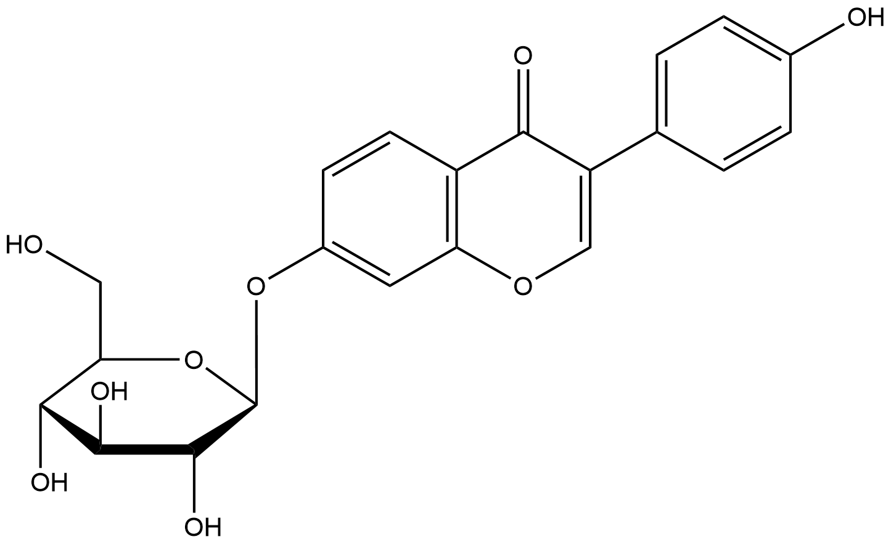

# Unclassified (UCs) Family 1 / Subfamily 1

##  Literature Information

| Title    | Identification and functional expression of genes encoding flavonoid *O*‐ and *C*‐glycosidases in intestinal bacteria |
| :------- | :----------------------------------------------------------- |
| Author   | Annett Braune, Wolfram Engst, Michael Blaut                  |
| DOI      | [10.1111/1462-2920.12864](https://doi.org/10.1111/1462-2920.12864) |
| Abstract | Gut bacteria play a crucial role in the metabolism of dietary flavonoids and thereby influence the bioactivity of these compounds in the host. The intestinal *Lachnospiraceae* strain CG19‐1 and *Eubacterium cellulosolvens* are able to deglycosylate *C*‐ and *O*‐coupled flavonoid glucosides. Growth of strain CG19‐1 in the presence of the isoflavone *C*‐glucoside puerarin (daidzein 8‐*C*‐glucoside) led to the induction of two proteins (DfgC, DfgD). Heterologous expression of the encoding genes (*dfgC*, *dfgD*) in *Escherichia coli* revealed no *C*‐deglycosylating activity in the resulting cell extracts but cleavage of flavonoid *O*‐glucosides such as daidzin (daidzein 7‐*O*‐glucoside). The recombinant DfgC and DfgD proteins were purified and characterized with respect to their quaternary structure, substrate and cofactor specificity. The products of the corresponding genes (*dfgC*, *dfgD*) from *E. cellulosolvens* also catalysed the ==*O*‐deglycosylation of daidzin== following their expression in *E. coli*. In combination with three recombinant proteins encoded by adjacent genes in *E. cellulosolvens* (*dfgA*, *dfgB*, *dfgE*), DfgC and DfgD from *E**. cellulosolvens* catalysed the deglycosylation of the flavone *C*‐glucosides homoorientin (luteolin 6‐*C*‐glucoside) and isovitexin (apigenin 6‐*C*‐glucoside). Even intact cells of *E**. coli* expressing the five *E. cellulosolvens* genes cleaved these flavone *C*‐glucosides and, also, flavonoid *O*‐glucosides to the corresponding aglycones. |

##  Experimental results

- **Enzyme**

Uniprot ID: [I5AX49](https://www.uniprot.org/uniprot/I5AX49)

Protein: Uncharacterized protein

Organism: *[Eubacterium] cellulosolvens 6*

Length: 147 AA

Taxonomic identifier: [633697](https://www.uniprot.org/taxonomy/633697) [[NCBI](https://www.ncbi.nlm.nih.gov/Taxonomy/Browser/wwwtax.cgi?lvl=0&id=633697)]

- **Pfam**

| Source | Domain | Start | End  | E-value (Domain) | Coverage |
| ------ | ------ | ----- | ---- | ---------------- | -------- |
| Pfam-A | -      | -     | -    | -                | -        |

Program: `hmmscan`

Version: 3.1b2 (February 2015)

Method: `hmmscan --domtblout hmmscan.tbl --noali -E 1e-5 pfam query.fa `

Date: Mon Jul 20 14:32:16 2020

Description:

None

- **Reaction**

*Catalyse  reaction with expression of  [I5AX46](https://www.uniprot.org/uniprot/I5AX46)/[I5AX47](https://www.uniprot.org/uniprot/I5AX47)/[I5AX48](https://www.uniprot.org/uniprot/I5AX48)/[I5AX49](https://www.uniprot.org/uniprot/I5AX49)/[I5AX50](https://www.uniprot.org/uniprot/I5AX50) simultaneously*

[daidzin](https://pubchem.ncbi.nlm.nih.gov/compound/107971
) &rArr; [daidzein](https://pubchem.ncbi.nlm.nih.gov/compound/daidzein) + [glucose](https://pubchem.ncbi.nlm.nih.gov/compound/glucose)

<figure>

  

    
  

  

    
  

  

    
  

  

    
  

  

    
  

</figure>

## References

[^1]:Holm L, Sander C. An evolutionary treasure: unification of a broad set of amidohydrolases related to urease[J]. Proteins: Structure, Function, and Bioinformatics, 1997, 28(1): 72-82.
[^2]:Nygaard P, Duckert P, Saxild H H. Role of adenine deaminase in purine salvage and nitrogen metabolism and characterization of the ade gene in Bacillus subtilis[J]. Journal of Bacteriology, 1996, 178(3): 846-853.
[^3]:Jabri E, Carr M B, Hausinger R P, et al. The crystal structure of urease from Klebsiella aerogenes[J]. Science, 1995, 268(5213): 998-1004.
