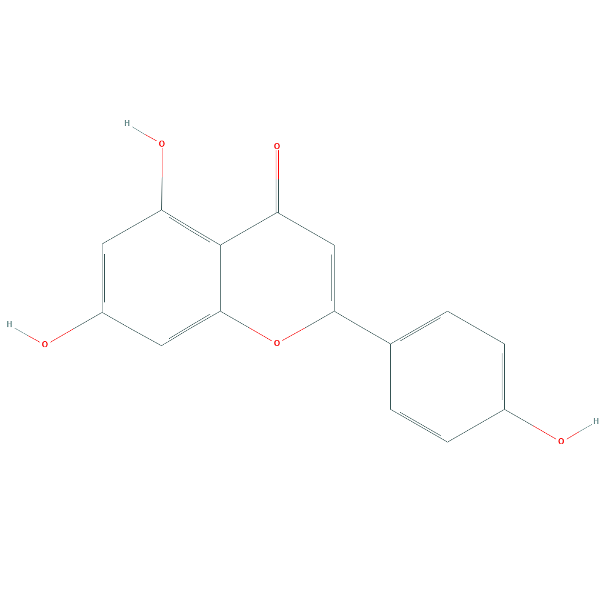
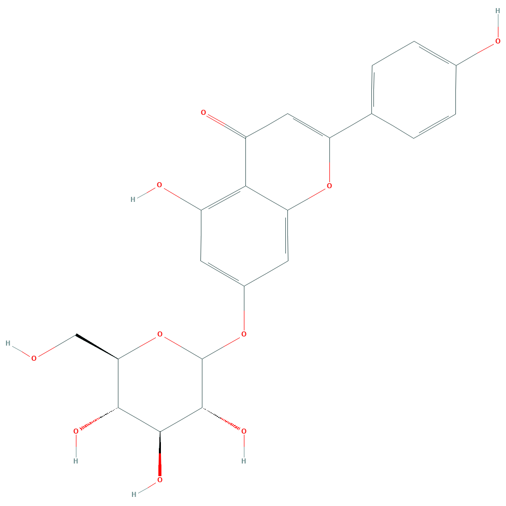

# Unclassified (UCs) Family 2 / Subfamily 1

##  Literature Information

| Title    | Enzymatic synthesis of apigenin glucosides by glucosyltransferase (YjiC) from *Bacillus licheniformis* DSM 13 |
| :------- | :----------------------------------------------------------- |
| Author   | Rit Bahadur Gurung, Eun-Hee Kim, Tae-Jin Oh & Jae Kyung Sohng |
| DOI      | [10.1007/s10059-013-0164-0](https://doi.org/10.1007/s10059-013-0164-0) |
| Abstract | Apigenin, a member of the flavone subclass of flavonoids, has long been considered to have various biological activities. Its glucosides, in particular, have been reported to have higher water solubility, increased chemical stability, and enhanced biological activities. Here, the synthesis of apigenin glucosides by the *in vitro* glucosylation reaction was successfully performed using a UDP-glucosyltransferase YjiC, from *Bacillus licheniformis* DSM 13. The glucosylation has been confirmed at the phenolic groups of C-4′ and C-7 positions ensuing ==apigenin 4′-*O*-glucoside==, ==apigenin 7-*O*-glucoside== and ==apigenin 4′,7-*O*-diglucoside== as the products leaving the C-5 position unglucosylated. The position of glucosylation and the chemical structures of glucosides were elucidated by liquid chromatography/mass spectroscopy and nuclear magnetic resonance spectroscopy. The parameters such as pH, UDP glucose concentration and time of incubation were also analyzed during this study. |

##  Experimental results

- **Enzyme**

Uniprot ID: [Q65JC2](https://www.uniprot.org/uniprot/Q65JC2)

Protein:  Glycosyl transferase Family 1

Organism: *Bacillus licheniformis (strain ATCC 14580 / DSM 13 / JCM 2505 / NBRC 12200 / NCIMB 9375 / NRRL NRS-1264 / Gibson 46)*

Length: 396 AA

Taxonomic identifier: [279010](https://www.uniprot.org/taxonomy/279010) [[NCBI](https://www.ncbi.nlm.nih.gov/Taxonomy/Browser/wwwtax.cgi?lvl=0&id=279010)]

- **Pfam**

| Source | Domain | Start | End  | E-value (Domain) | Coverage |
| ------ | ------ | ----- | ---- | ---------------- | -------- |
| Pfam-A | -      | -     | -    | -                | -        |

Program: `hmmscan`

Version: 3.1b2 (February 2015)

Method: `hmmscan --domtblout hmmscan.tbl --noali -E 1e-5 pfam query.fa `

Date: Mon Jul 20 14:32:16 2020

Description:

None

- **Reaction**

[apigenin](https://pubchem.ncbi.nlm.nih.gov/compound/apigenin) &rArr; [apigenin  4'-O-glucoside](https://pubchem.ncbi.nlm.nih.gov/compound/apigenin%204'-O-glucoside) + [apigenin 7-O-glucoside](https://pubchem.ncbi.nlm.nih.gov/compound/apigenin%207-O-glucoside) + [apigenin 4',7-O-diglucoside](https://pubchem.ncbi.nlm.nih.gov/compound/Apigenin-7_4_-diglucoside)

<figure>

  

    
  

  

    
  

  

    
  

  

    
  

  

    
  

  

    
  

  

    
  

</figure>

## References

[^1]:Holm L, Sander C. An evolutionary treasure: unification of a broad set of amidohydrolases related to urease[J]. Proteins: Structure, Function, and Bioinformatics, 1997, 28(1): 72-82.
[^2]:Nygaard P, Duckert P, Saxild H H. Role of adenine deaminase in purine salvage and nitrogen metabolism and characterization of the ade gene in Bacillus subtilis[J]. Journal of Bacteriology, 1996, 178(3): 846-853.
[^3]:Jabri E, Carr M B, Hausinger R P, et al. The crystal structure of urease from Klebsiella aerogenes[J]. Science, 1995, 268(5213): 998-1004.
