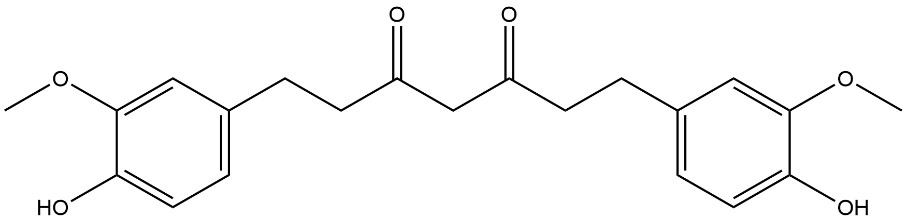

<!--[TOC]在这里不可以用-->

<ul id="myTab" class="nav nav-tabs">
  <!-- active 指的是默认页 -->
  <li class="active">
    <!-- herf中名字于下文id对应 -->
    <!-- 这里只改herf和tab1 -->
    <a href="#tab1" data-toggle="tab">tab1</a>
  </li>
  <li><a href="#tab2" data-toggle="tab">tab2</a></li>
</ul>

  <!-- 此处的id与上文herf对应 其他的不要改-->
  

# B1XDG0
# Oxidation/Reduction Reactions (ORs) Family 1

##  Literature Information

| Title    | Discovery of the curcumin metabolic pathway involving a unique enzyme in an intestinal microorganism |
| -------- | ------------------------------------------------------------ |
| Author   | Azam Hassaninasab, Yoshiteru Hashimoto, Kaori Tomita-Yokotani, and Michihiko Kobayashi |
| DOI      | [10.1073/pnas.1016217108](https://doi.org/10.1073/pnas.1016217108) |
| Abstract | Polyphenol curcumin, a yellow pigment, derived from the rhizomes of a plant (Curcuma longa Linn) is a natural antioxidant exhibiting a variety of pharmacological activities and therapeutic properties. It has long been used as a traditional medicine and as a preservative and coloring agent in foods. Here, curcumin-converting microorganisms were isolated from human feces, the one exhibiting the highest activity being identified as Escherichia coli. We are thus unique in discovering that E. coli was able to act on curcumin. The curcumin-converting enzyme was purified from E. coli and characterized. The native enzyme had a molecular mass of about 82 kDa and consisted of two identical subunits. The enzyme has a narrow substrate spectrum, preferentially acting on curcumin. The microbial metabolism of curcumin by the purified enzyme was found to comprise a two-step reduction, ==curcumin== being converted NADPH-dependently into ==an intermediate product==, ==dihydrocurcumin==, and then the end product, ==tetrahydrocurcumin==. We named this enzyme “NADPH-dependent curcumin/dihydrocurcumin reductase” (CurA). The gene (curA) encoding this enzyme was also identified. A homology search with the BLAST program revealed that a unique enzyme involved in curcumin metabolism belongs to the medium-chain dehydrogenase/reductase superfamily. |

---

##  Experimental results

- **Enzyme**

Uniprot ID: [B1XDG0](https://www.uniprot.org/uniprot/B1XDG0)

Protein:  NADPH-dependent curcumin / dihydrocurcumin reductase

Organism: *Escherichia coli (strain K12 / DH10B)*

Length: 345 AA

Taxonomic identifier: [316385](https://www.uniprot.org/taxonomy/316385) [[NCBI](https://www.ncbi.nlm.nih.gov/Taxonomy/Browser/wwwtax.cgi?lvl=0&id=316385)]

- **Pfam**

| Source | Domain     | Start | End  | E-value (Domain) | Coverage |
| ------ | ---------- | ----- | ---- | ---------------- | -------- |
| Pfam-A | ADH_N_2    | 9     | 115  | 2.4e-43          | 0.981    |
| Pfam-A | ADH_zinc_N | 161   | 299  | 7.4e-19          | 0.946    |

Program: `hmmscan`

Version: 3.1b2 (February 2015)

Method: `hmmscan --domtblout hmmscan.tbl --noali -E 1e-5 pfam query.fa `

Date: Mon Jul 20 14:32:16 2020

Description:

1. ADH_N_2 (View in [Pfam](https://pfam.xfam.org/family/ADH_N_2#tabview=tab0) and [InterPro](http://www.ebi.ac.uk/interpro/entry/InterPro/IPR041694/))

   N-terminal region of oxidoreductase and prostaglandin reductase and alcohol dehydrogenase. 

2. ADH_zinc_N (View in [Pfam](https://pfam.xfam.org/family/ADH_zinc_N) and [InterPro](http://www.ebi.ac.uk/interpro/entry/InterPro/IPR013149/))

   No Pfam abstract.s

- **Reaction**

[curcumin](https://pubchem.ncbi.nlm.nih.gov/compound/curcumin) + [NADPH](https://pubchem.ncbi.nlm.nih.gov/compound/5884) + [H+](https://pubchem.ncbi.nlm.nih.gov/compound/1038) &rArr; [dihydrocurcumin](https://pubchem.ncbi.nlm.nih.gov/compound/dihydrocurcumin)[intermediate product] + [NADP+](https://pubchem.ncbi.nlm.nih.gov/compound/15938972)

[dihydrocurcumin](https://pubchem.ncbi.nlm.nih.gov/compound/dihydrocurcumin)  [NADPH](https://pubchem.ncbi.nlm.nih.gov/compound/5884) + [H+](https://pubchem.ncbi.nlm.nih.gov/compound/1038) &rArr; [tetrahydrocurcumin](https://pubchem.ncbi.nlm.nih.gov/compound/tetrahydrocurcumin) + [NADP+](https://pubchem.ncbi.nlm.nih.gov/compound/15938972)

<figure>

  

    
  

  

    
  

  

    
  

  

    
  

  

    
  

</figure>
  

  

# B1XDG0_2
# Oxidation/Reduction Reactions (ORs) Family 1

##  Literature Information

| Title    | Discovery of the curcumin metabolic pathway involving a unique enzyme in an intestinal microorganism |
| -------- | ------------------------------------------------------------ |
| Author   | Azam Hassaninasab, Yoshiteru Hashimoto, Kaori Tomita-Yokotani, and Michihiko Kobayashi |
| DOI      | [10.1073/pnas.1016217108](https://doi.org/10.1073/pnas.1016217108) |
| Abstract | Polyphenol curcumin, a yellow pigment, derived from the rhizomes of a plant (Curcuma longa Linn) is a natural antioxidant exhibiting a variety of pharmacological activities and therapeutic properties. It has long been used as a traditional medicine and as a preservative and coloring agent in foods. Here, curcumin-converting microorganisms were isolated from human feces, the one exhibiting the highest activity being identified as Escherichia coli. We are thus unique in discovering that E. coli was able to act on curcumin. The curcumin-converting enzyme was purified from E. coli and characterized. The native enzyme had a molecular mass of about 82 kDa and consisted of two identical subunits. The enzyme has a narrow substrate spectrum, preferentially acting on curcumin. The microbial metabolism of curcumin by the purified enzyme was found to comprise a two-step reduction, ==curcumin== being converted NADPH-dependently into ==an intermediate product==, ==dihydrocurcumin==, and then the end product, ==tetrahydrocurcumin==. We named this enzyme “NADPH-dependent curcumin/dihydrocurcumin reductase” (CurA). The gene (curA) encoding this enzyme was also identified. A homology search with the BLAST program revealed that a unique enzyme involved in curcumin metabolism belongs to the medium-chain dehydrogenase/reductase superfamily. |

---

##  Experimental results

- **Enzyme**

Uniprot ID: [B1XDG0](https://www.uniprot.org/uniprot/B1XDG0)

Protein:  NADPH-dependent curcumin / dihydrocurcumin reductase

Organism: *Escherichia coli (strain K12 / DH10B)*

Length: 345 AA

Taxonomic identifier: [316385](https://www.uniprot.org/taxonomy/316385) [[NCBI](https://www.ncbi.nlm.nih.gov/Taxonomy/Browser/wwwtax.cgi?lvl=0&id=316385)]

- **Pfam**

| Source | Domain     | Start | End  | E-value (Domain) | Coverage |
| ------ | ---------- | ----- | ---- | ---------------- | -------- |
| Pfam-A | ADH_N_2    | 9     | 115  | 2.4e-43          | 0.981    |
| Pfam-A | ADH_zinc_N | 161   | 299  | 7.4e-19          | 0.946    |

Program: `hmmscan`

Version: 3.1b2 (February 2015)

Method: `hmmscan --domtblout hmmscan.tbl --noali -E 1e-5 pfam query.fa `

Date: Mon Jul 20 14:32:16 2020

Description:

1. ADH_N_2 (View in [Pfam](https://pfam.xfam.org/family/ADH_N_2#tabview=tab0) and [InterPro](http://www.ebi.ac.uk/interpro/entry/InterPro/IPR041694/))

   N-terminal region of oxidoreductase and prostaglandin reductase and alcohol dehydrogenase. 

2. ADH_zinc_N (View in [Pfam](https://pfam.xfam.org/family/ADH_zinc_N) and [InterPro](http://www.ebi.ac.uk/interpro/entry/InterPro/IPR013149/))

   No Pfam abstract.s

- **Reaction**

[curcumin](https://pubchem.ncbi.nlm.nih.gov/compound/curcumin) + [NADPH](https://pubchem.ncbi.nlm.nih.gov/compound/5884) + [H+](https://pubchem.ncbi.nlm.nih.gov/compound/1038) &rArr; [dihydrocurcumin](https://pubchem.ncbi.nlm.nih.gov/compound/dihydrocurcumin)[intermediate product] + [NADP+](https://pubchem.ncbi.nlm.nih.gov/compound/15938972)

[dihydrocurcumin](https://pubchem.ncbi.nlm.nih.gov/compound/dihydrocurcumin)  [NADPH](https://pubchem.ncbi.nlm.nih.gov/compound/5884) + [H+](https://pubchem.ncbi.nlm.nih.gov/compound/1038) &rArr; [tetrahydrocurcumin](https://pubchem.ncbi.nlm.nih.gov/compound/tetrahydrocurcumin) + [NADP+](https://pubchem.ncbi.nlm.nih.gov/compound/15938972)

<figure>

  

    
  

  

    
  

  

    
  

  

    
  

  

    
  

</figure>
  

