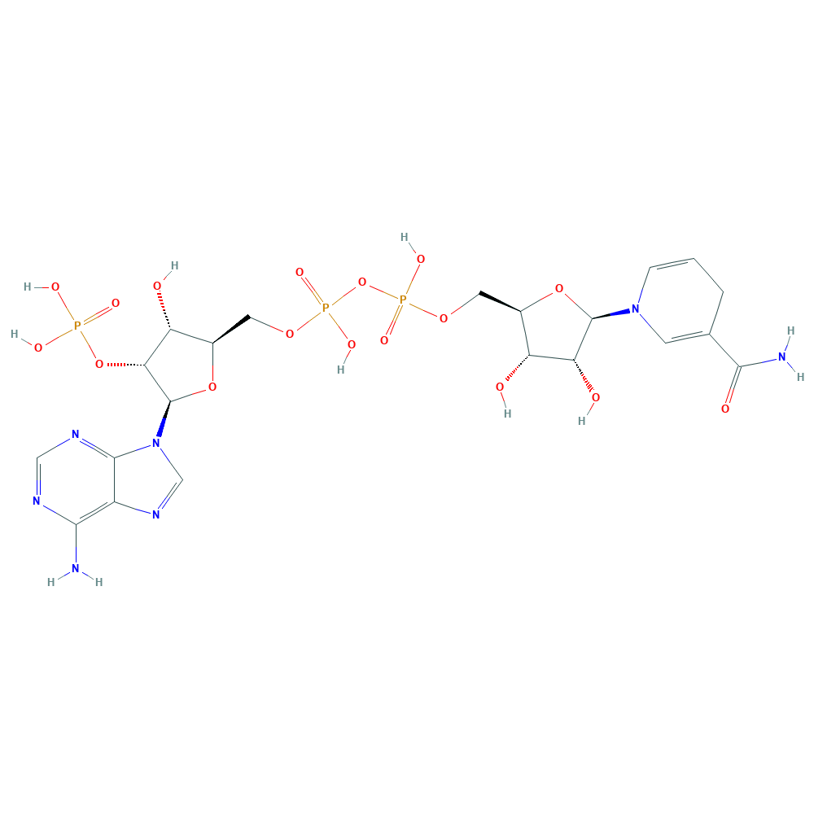

# Oxidation/Reduction Reactions (ORs) Family 9 / Subfamily 1

<!--[TOC]在这里不可以用-->

<ul id="myTab" class="nav nav-tabs">
  <!-- active 指的是默认页 -->
  <li class="active">
    <!-- herf中名字于下文id对应 -->
    <!-- 这里只改herf和tab1 -->
    <a href="#tab1" data-toggle="tab">G2IMF2</a>
  </li>
  <li><a href="#tab2" data-toggle="tab">Q2G4H9</a></li>
</ul>

  <!-- 此处的id与上文herf对应 其他的不要改-->
  

<h2>Literature Information</h2>
<table>
<thead>
<tr>
<th style="text-align:left">Title</th>
<th style="text-align:left">Discovery of pinoresinol reductase genes in sphingomonads</th>
</tr>
</thead>
<tbody>
<tr>
<td style="text-align:left">Author</td>
<td style="text-align:left">Y Fukuhara, N Kamimura, M Nakajima, S Hishiyama, H Hara, D Kasai, Y Tsuji, S Narita-Yamada, S Nakamura, Y Katano, N Fujita, Y Katayama, M Fukuda, S Kajita, E Masai</td>
</tr>
<tr>
<td style="text-align:left">DOI</td>
<td style="text-align:left"><a href="https://doi.org/10.1016/j.enzmictec.2012.10.004">10.1016/j.enzmictec.2012.10.004</a></td>
</tr>
<tr>
<td style="text-align:left">Abstract</td>
<td style="text-align:left">Bacterial genes for the degradation of major dilignols produced in lignifying xylem are expected to be useful tools for the structural modification of lignin in plants. For this purpose, we isolated pinZ involved in the conversion of pinoresinol from Sphingobium sp. strain SYK-6. pinZ showed 43-77% identity at amino acid level with bacterial NmrA-like proteins of unknown function, a subgroup of atypical short chain dehydrogenases/reductases, but revealed only 15-21% identity with plant pinoresinol/lariciresinol reductases. PinZ completely converted <mark>racemic pinoresinol</mark> to <mark>lariciresinol</mark>, showing a specific activity of 46±3 U/mg in the presence of NADPH at 30°C. In contrast, the activity for lariciresinol was negligible. This substrate preference is similar to a pinoresinol reductase, AtPrR1, of Arabidopsis thaliana; however, the specific activity of PinZ toward (±)-pinoresinol was significantly higher than that of AtPrR1. The role of pinZ and a pinZ ortholog of Novosphingobium aromaticivorans DSM 12444 were also characterized.</td>
</tr>
</tbody>
</table>
<h2>Experimental results</h2>
<ul>
<li><strong>Enzyme</strong></li>
</ul>

Uniprot ID: <a href="https://www.uniprot.org/uniprot/G2IMF2">G2IMF2</a>

Protein:  Putative oxidoreductase

Organism: <em>Sphingobium sp. (strain NBRC 103272 / SYK-6)</em>

Length: 316 AA

Taxonomic identifier: <a href="https://www.uniprot.org/taxonomy/627192">627192</a> [<a href="https://www.ncbi.nlm.nih.gov/Taxonomy/Browser/wwwtax.cgi?lvl=0&amp;id=627192">NCBI</a>]

<ul>
<li><strong>Pfam</strong></li>
</ul>
<table>
<thead>
<tr>
<th>Source</th>
<th>Domain</th>
<th>Start</th>
<th>End</th>
<th>E-value (Domain)</th>
<th>Coverage</th>
</tr>
</thead>
<tbody>
<tr>
<td>Pfam-A</td>
<td>NAD_binding_10</td>
<td>11</td>
<td>193</td>
<td>3.4e-20</td>
<td>0.995</td>
</tr>
</tbody>
</table>

Program: <code>hmmscan</code>

Version: 3.1b2 (February 2015)

Method: <code>hmmscan --domtblout hmmscan.tbl --noali -E 1e-5 pfam query.fa </code>

Date: Mon Jul 20 14:32:16 2020

Description:

NAD_binding_10

<a href="https://pfam.xfam.org/family/NAD_binding_10"><strong>Pfam</strong></a>

No Pfam abstract.

<a href="http://www.ebi.ac.uk/interpro/entry/InterPro/IPR016040/"><strong>InterPro</strong></a>

This entry represents NAD- and NADP-binding domains with a core Rossmann-type fold, which consists of 3-layers alpha/beta/alpha, where the six beta strands are parallel in the order 321456. Many different enzymes contain an NAD/NADP-binding domain, including:

▹C-terminal domain of alcohol dehydrogenases<a href="#fn1" id="fnref1">[1]</a>

▹Tyrosine-dependent oxidoreductases (also known as short-chain dehydrogenases)<a href="#fn2" id="fnref2">[2]</a>

▹N-terminal domain of glyceraldehyde-3-phosphate dehydrogenase<a href="#fn3" id="fnref3">[3]</a>

▹NAD-binding domain of formate/glycerate dehydrogenases<a href="#fn4" id="fnref4">[4]</a>

▹N-terminal domain of sirohaem synthase<a href="#fn5" id="fnref5">[5]</a>

▹N-terminal domain of lactate dehydrogenase<a href="#fn6" id="fnref6">[6]</a>

▹N-terminal domain of 6-phosphogluconate dehydrogenase (the beta-sheet is extended to 8 strands)<a href="#fn7" id="fnref7">[7]</a>

▹C-terminal domain of amino acid dehydrogenases (an extra N-terminal helix displaces the C-terminal helix<a href="#fn8" id="fnref8">[8]</a>

▹NAD-binding domain of certain potassium channels<a href="#fn9" id="fnref9">[9]</a>

▹C-terminal domain of the transcriptional repressor Rex<a href="#fn10" id="fnref10">[10]</a>

▹Ornithine cyclodeaminase<a href="#fn11" id="fnref11">[11]</a>

▹CoA-binding N-terminal domain of the alpha chain of succinyl-CoA synthetase<a href="#fn12" id="fnref12">[12]</a>

<em>Information is taken from Pfam and InterPro web site.</em>

<ul>
<li><strong>Reaction</strong></li>
</ul>

<a href="https://pubchem.ncbi.nlm.nih.gov/compound/pinoresinol">pinoresinol</a> + <a href="https://pubchem.ncbi.nlm.nih.gov/compound/5884">NADPH</a> + <a href="https://pubchem.ncbi.nlm.nih.gov/compound/1038">H+</a> ⇒ <a href="https://pubchem.ncbi.nlm.nih.gov/compound/lariciresinol">lariciresinol</a> + <a href="https://pubchem.ncbi.nlm.nih.gov/compound/15938972">NADP+</a>

<figure>

  

    
  

  

    
  

  

    
  

  

    
  

  

    
  

  

    
  

  

    
  

  

    
  

  

    
  

</figure>
<h2>References</h2>
<section class="footnotes">
<ol class="footnotes-list">
<li id="fn1" class="footnote-item">
Gibbons B J, Hurley T D. Structure of three class I human alcohol dehydrogenases complexed with isoenzyme specific formamide inhibitors[J]. Biochemistry, 2004, 43(39): 12555-12562. <a href="#fnref1" class="footnote-backref">↩︎</a>

</li>
<li id="fn2" class="footnote-item">
Thoden J B, Hegeman A D, Wesenberg G, et al. Structural analysis of UDP-sugar binding to UDP-galactose 4-epimerase from Escherichia coli[J]. Biochemistry, 1997, 36(21): 6294-6304. <a href="#fnref2" class="footnote-backref">↩︎</a>

</li>
<li id="fn3" class="footnote-item">
Isupov M N, Fleming T M, Dalby A R, et al. Crystal structure of the glyceraldehyde-3-phosphate dehydrogenase from the hyperthermophilic archaeon Sulfolobus solfataricus[J]. Journal of molecular biology, 1999, 291(3): 651-660. <a href="#fnref3" class="footnote-backref">↩︎</a>

</li>
<li id="fn4" class="footnote-item">
Lamzin V S, Dauter Z, Popov V O, et al. High resolution structures of holo and apo formate dehydrogenase[J]. Journal of molecular biology, 1994, 236(3): 759-785. <a href="#fnref4" class="footnote-backref">↩︎</a>

</li>
<li id="fn5" class="footnote-item">
Stroupe M E, Leech H K, Daniels D S, et al. CysG structure reveals tetrapyrrole-binding features and novel regulation of siroheme biosynthesis[J]. Nature Structural &amp; Molecular Biology, 2003, 10(12): 1064-1073. <a href="#fnref5" class="footnote-backref">↩︎</a>

</li>
<li id="fn6" class="footnote-item">
Read J A, Winter V J, Eszes C M, et al. Structural basis for altered activity of M‐and H‐isozyme forms of human lactate dehydrogenase[J]. Proteins: Structure, function, and bioinformatics, 2001, 43(2): 175-185. <a href="#fnref6" class="footnote-backref">↩︎</a>

</li>
<li id="fn7" class="footnote-item">
Sundaramoorthy R, Iulek J, Barrett M P, et al. Crystal structures of a bacterial 6‐phosphogluconate dehydrogenase reveal aspects of specificity, mechanism and mode of inhibition by analogues of high‐energy reaction intermediates[J]. The FEBS journal, 2007, 274(1): 275-286. <a href="#fnref7" class="footnote-backref">↩︎</a>

</li>
<li id="fn8" class="footnote-item">
Yip K S P, Stillman T J, Britton K L, et al. The structure of Pyrococcus furiosus glutamate dehydrogenase reveals a key role for ion-pair networks in maintaining enzyme stability at extreme temperatures[J]. Structure, 1995, 3(11): 1147-1158. <a href="#fnref8" class="footnote-backref">↩︎</a>

</li>
<li id="fn9" class="footnote-item">
Jiang Y, Pico A, Cadene M, et al. Structure of the RCK domain from the E. coli K+ channel and demonstration of its presence in the human BK channel[J]. Neuron, 2001, 29(3): 593-601. <a href="#fnref9" class="footnote-backref">↩︎</a>

</li>
<li id="fn10" class="footnote-item">
Sickmier E A, Brekasis D, Paranawithana S, et al. X-ray structure of a Rex-family repressor/NADH complex insights into the mechanism of redox sensing[J]. Structure, 2005, 13(1): 43-54. <a href="#fnref10" class="footnote-backref">↩︎</a>

</li>
<li id="fn11" class="footnote-item">
Goodman J L, Wang S, Alam S, et al. Ornithine cyclodeaminase: structure, mechanism of action, and implications for the μ-crystallin family[J]. Biochemistry, 2004, 43(44): 13883-13891. <a href="#fnref11" class="footnote-backref">↩︎</a>

</li>
<li id="fn12" class="footnote-item">
Fraser M E, James M N G, Bridger W A, et al. A detailed structural description of Escherichia coli succinyl-CoA synthetase[J]. Journal of molecular biology, 1999, 285(4): 1633-1653. <a href="#fnref12" class="footnote-backref">↩︎</a>

</li>
</ol>
</section>

  

  

<h2>Literature Information</h2>
<table>
<thead>
<tr>
<th style="text-align:left">Title</th>
<th style="text-align:left">Discovery of pinoresinol reductase genes in sphingomonads</th>
</tr>
</thead>
<tbody>
<tr>
<td style="text-align:left">Author</td>
<td style="text-align:left">Y Fukuhara, N Kamimura, M Nakajima, S Hishiyama, H Hara, D Kasai, Y Tsuji, S Narita-Yamada, S Nakamura, Y Katano, N Fujita, Y Katayama, M Fukuda, S Kajita, E Masai</td>
</tr>
<tr>
<td style="text-align:left">DOI</td>
<td style="text-align:left"><a href="https://doi.org/10.1016/j.enzmictec.2012.10.004">10.1016/j.enzmictec.2012.10.004</a></td>
</tr>
<tr>
<td style="text-align:left">Abstract</td>
<td style="text-align:left">Bacterial genes for the degradation of major dilignols produced in lignifying xylem are expected to be useful tools for the structural modification of lignin in plants. For this purpose, we isolated pinZ involved in the conversion of pinoresinol from Sphingobium sp. strain SYK-6. pinZ showed 43-77% identity at amino acid level with bacterial NmrA-like proteins of unknown function, a subgroup of atypical short chain dehydrogenases/reductases, but revealed only 15-21% identity with plant pinoresinol/lariciresinol reductases. PinZ completely converted <mark>racemic pinoresinol</mark> to <mark>lariciresinol</mark>, showing a specific activity of 46±3 U/mg in the presence of NADPH at 30°C. In contrast, the activity for lariciresinol was negligible. This substrate preference is similar to a pinoresinol reductase, AtPrR1, of Arabidopsis thaliana; however, the specific activity of PinZ toward (±)-pinoresinol was significantly higher than that of AtPrR1. The role of pinZ and a pinZ ortholog of Novosphingobium aromaticivorans DSM 12444 were also characterized.</td>
</tr>
</tbody>
</table>
<h2>Experimental results</h2>
<ul>
<li><strong>Enzyme</strong></li>
</ul>

Uniprot ID: <a href="https://www.uniprot.org/uniprot/Q2G4H9">Q2G4H9</a>

Protein:  NmrA-like protein

Organism: <em>Novosphingobium aromaticivorans (strain ATCC 700278 / DSM 12444 / CIP 105152 / NBRC 16084 / F199)</em>

Length: 305 AA

Taxonomic identifier: <a href="https://www.uniprot.org/taxonomy/279238">279238</a> [<a href="https://www.ncbi.nlm.nih.gov/Taxonomy/Browser/wwwtax.cgi?lvl=0&amp;id=279238">NCBI</a>]

<ul>
<li><strong>Pfam</strong></li>
</ul>
<table>
<thead>
<tr>
<th>Source</th>
<th>Domain</th>
<th>Start</th>
<th>End</th>
<th>E-value (Domain)</th>
<th>Coverage</th>
</tr>
</thead>
<tbody>
<tr>
<td>Pfam-A</td>
<td>NAD_binding_10</td>
<td>8</td>
<td>147</td>
<td>1.1e-20</td>
<td>0.804</td>
</tr>
</tbody>
</table>

Program: <code>hmmscan</code>

Version: 3.1b2 (February 2015)

Method: <code>hmmscan --domtblout hmmscan.tbl --noali -E 1e-5 pfam query.fa </code>

Date: Mon Jul 20 14:32:16 2020

Description:

NAD_binding_10

<a href="https://pfam.xfam.org/family/NAD_binding_10"><strong>Pfam</strong></a>

No Pfam abstract.

<a href="http://www.ebi.ac.uk/interpro/entry/InterPro/IPR016040/"><strong>InterPro</strong></a>

This entry represents NAD- and NADP-binding domains with a core Rossmann-type fold, which consists of 3-layers alpha/beta/alpha, where the six beta strands are parallel in the order 321456. Many different enzymes contain an NAD/NADP-binding domain, including:

▹C-terminal domain of alcohol dehydrogenases<a href="#fn1" id="fnref1">[1]</a>

▹Tyrosine-dependent oxidoreductases (also known as short-chain dehydrogenases)<a href="#fn2" id="fnref2">[2]</a>

▹N-terminal domain of glyceraldehyde-3-phosphate dehydrogenase<a href="#fn3" id="fnref3">[3]</a>

▹NAD-binding domain of formate/glycerate dehydrogenases<a href="#fn4" id="fnref4">[4]</a>

▹N-terminal domain of sirohaem synthase<a href="#fn5" id="fnref5">[5]</a>

▹N-terminal domain of lactate dehydrogenase<a href="#fn6" id="fnref6">[6]</a>

▹N-terminal domain of 6-phosphogluconate dehydrogenase (the beta-sheet is extended to 8 strands)<a href="#fn7" id="fnref7">[7]</a>

▹C-terminal domain of amino acid dehydrogenases (an extra N-terminal helix displaces the C-terminal helix<a href="#fn8" id="fnref8">[8]</a>

▹NAD-binding domain of certain potassium channels<a href="#fn9" id="fnref9">[9]</a>

▹C-terminal domain of the transcriptional repressor Rex<a href="#fn10" id="fnref10">[10]</a>

▹Ornithine cyclodeaminase<a href="#fn11" id="fnref11">[11]</a>

▹CoA-binding N-terminal domain of the alpha chain of succinyl-CoA synthetase<a href="#fn12" id="fnref12">[12]</a>

<em>Information is taken from Pfam and InterPro web site.</em>

<ul>
<li><strong>Reaction</strong></li>
</ul>

<a href="https://pubchem.ncbi.nlm.nih.gov/compound/pinoresinol">pinoresinol</a> + <a href="https://pubchem.ncbi.nlm.nih.gov/compound/5884">NADPH</a> + <a href="https://pubchem.ncbi.nlm.nih.gov/compound/1038">H+</a> ⇒ <a href="https://pubchem.ncbi.nlm.nih.gov/compound/lariciresinol">lariciresinol</a> + <a href="https://pubchem.ncbi.nlm.nih.gov/compound/15938972">NADP+</a>

<figure>

  

    
  

  

    
  

  

    
  

  

    
  

  

    
  

  

    
  

  

    
  

  

    
  

  

    
  

</figure>
<h2>References</h2>
<section class="footnotes">
<ol class="footnotes-list">
<li id="fn1" class="footnote-item">
Gibbons B J, Hurley T D. Structure of three class I human alcohol dehydrogenases complexed with isoenzyme specific formamide inhibitors[J]. Biochemistry, 2004, 43(39): 12555-12562. <a href="#fnref1" class="footnote-backref">↩︎</a>

</li>
<li id="fn2" class="footnote-item">
Thoden J B, Hegeman A D, Wesenberg G, et al. Structural analysis of UDP-sugar binding to UDP-galactose 4-epimerase from Escherichia coli[J]. Biochemistry, 1997, 36(21): 6294-6304. <a href="#fnref2" class="footnote-backref">↩︎</a>

</li>
<li id="fn3" class="footnote-item">
Isupov M N, Fleming T M, Dalby A R, et al. Crystal structure of the glyceraldehyde-3-phosphate dehydrogenase from the hyperthermophilic archaeon Sulfolobus solfataricus[J]. Journal of molecular biology, 1999, 291(3): 651-660. <a href="#fnref3" class="footnote-backref">↩︎</a>

</li>
<li id="fn4" class="footnote-item">
Lamzin V S, Dauter Z, Popov V O, et al. High resolution structures of holo and apo formate dehydrogenase[J]. Journal of molecular biology, 1994, 236(3): 759-785. <a href="#fnref4" class="footnote-backref">↩︎</a>

</li>
<li id="fn5" class="footnote-item">
Stroupe M E, Leech H K, Daniels D S, et al. CysG structure reveals tetrapyrrole-binding features and novel regulation of siroheme biosynthesis[J]. Nature Structural &amp; Molecular Biology, 2003, 10(12): 1064-1073. <a href="#fnref5" class="footnote-backref">↩︎</a>

</li>
<li id="fn6" class="footnote-item">
Read J A, Winter V J, Eszes C M, et al. Structural basis for altered activity of M‐and H‐isozyme forms of human lactate dehydrogenase[J]. Proteins: Structure, function, and bioinformatics, 2001, 43(2): 175-185. <a href="#fnref6" class="footnote-backref">↩︎</a>

</li>
<li id="fn7" class="footnote-item">
Sundaramoorthy R, Iulek J, Barrett M P, et al. Crystal structures of a bacterial 6‐phosphogluconate dehydrogenase reveal aspects of specificity, mechanism and mode of inhibition by analogues of high‐energy reaction intermediates[J]. The FEBS journal, 2007, 274(1): 275-286. <a href="#fnref7" class="footnote-backref">↩︎</a>

</li>
<li id="fn8" class="footnote-item">
Yip K S P, Stillman T J, Britton K L, et al. The structure of Pyrococcus furiosus glutamate dehydrogenase reveals a key role for ion-pair networks in maintaining enzyme stability at extreme temperatures[J]. Structure, 1995, 3(11): 1147-1158. <a href="#fnref8" class="footnote-backref">↩︎</a>

</li>
<li id="fn9" class="footnote-item">
Jiang Y, Pico A, Cadene M, et al. Structure of the RCK domain from the E. coli K+ channel and demonstration of its presence in the human BK channel[J]. Neuron, 2001, 29(3): 593-601. <a href="#fnref9" class="footnote-backref">↩︎</a>

</li>
<li id="fn10" class="footnote-item">
Sickmier E A, Brekasis D, Paranawithana S, et al. X-ray structure of a Rex-family repressor/NADH complex insights into the mechanism of redox sensing[J]. Structure, 2005, 13(1): 43-54. <a href="#fnref10" class="footnote-backref">↩︎</a>

</li>
<li id="fn11" class="footnote-item">
Goodman J L, Wang S, Alam S, et al. Ornithine cyclodeaminase: structure, mechanism of action, and implications for the μ-crystallin family[J]. Biochemistry, 2004, 43(44): 13883-13891. <a href="#fnref11" class="footnote-backref">↩︎</a>

</li>
<li id="fn12" class="footnote-item">
Fraser M E, James M N G, Bridger W A, et al. A detailed structural description of Escherichia coli succinyl-CoA synthetase[J]. Journal of molecular biology, 1999, 285(4): 1633-1653. <a href="#fnref12" class="footnote-backref">↩︎</a>

</li>
</ol>
</section>

  

